# Claude Code ハーネス

🌐 English (canonical): [claude-code.md](claude-code.md)

← [ドキュメント目次](../README.ja.md)

このドキュメントは、本 dotfiles リポジトリがデプロイする Claude Code ハーネスの設定を説明します。ハーネスは `~/.claude/settings.json`、薄い ECC ランチャー、3 つの chezmoi 管理 ECC フック fork、3 行ステータスライン、CLV2 継続学習オブザーバーの配線、および日本語コードレビュー用サブエージェント群で構成されます。2 つ目のアカウント (`~/.claude-r06`) はシンボリックリンクで設定全体をミラーしつつ、ランタイム状態は分離されます。

---

## 目次

- [デプロイ先パス](#デプロイ先パス)
- [settings.json — 主要設定値](#settingsjson--主要設定値)
- [permissions allow/deny サーフェス](#permissions-allowdeny-サーフェス)
- [フックグラフ](#フックグラフ)
  - [SessionStart](#sessionstart)
  - [PreCompact](#precompact)
  - [PreToolUse](#pretooluse)
  - [PostToolUse](#posttooluse)
  - [PostToolUseFailure](#posttoolusefailure)
  - [Stop](#stop)
- [ECC ランチャー — ecc-hook.sh](#ecc-ランチャー--ecc-hooksh)
- [ECC フック fork (hooks-fork/)](#ecc-フック-fork-hooks-fork)
  - [governance-capture.js](#governance-capturejs)
  - [post-bash-command-log.js](#post-bash-command-logjs)
  - [ecc-state-reader.js](#ecc-state-readerjs)
- [ステータスライン](#ステータスライン)
- [CLV2 オブザーバー配線](#clv2-オブザーバー配線)
- [朝次レーダーのスケジュール実行](#朝次レーダーのスケジュール実行)
- [レビューサブエージェント](#レビューサブエージェント)
- [r06 ワークアカウント](#r06-ワークアカウント)
- [環境変数リファレンス](#環境変数リファレンス)

---

## デプロイ先パス

| ソースパス | デプロイ先 |
|---|---|
| `home/dot_claude/settings.json` | `~/.claude/settings.json` |
| `home/dot_claude/executable_ecc-hook.sh` | `~/.claude/ecc-hook.sh` (0755) |
| `home/dot_claude/executable_statusline.sh` | `~/.claude/statusline.sh` (0755) |
| `home/dot_claude/executable_clv2-session-notify.sh` | `~/.claude/clv2-session-notify.sh` (0755) |
| `home/dot_claude/executable_morning-radar.sh` | `~/.claude/morning-radar.sh` (0755) |
| `home/dot_claude/hooks-fork/governance-capture.js` | `~/.claude/hooks-fork/governance-capture.js` |
| `home/dot_claude/hooks-fork/post-bash-command-log.js` | `~/.claude/hooks-fork/post-bash-command-log.js` |
| `home/dot_claude/hooks-fork/ecc-state-reader.js` | `~/.claude/hooks-fork/ecc-state-reader.js` |
| `home/dot_claude/agents/*.md` | `~/.claude/agents/*.md` |
| `home/dot_claude/fable-orchestrator-prompt.md` | `~/.claude/fable-orchestrator-prompt.md`（`cldf`/`hcldf` が `--append-system-prompt-file` で読み込む） |
| `home/dot_claude/symlink_skills.tmpl` | `~/.claude/skills -> ~/.agents/skills` (シンボリックリンク) |
| `home/dot_claude-r06/symlink_*.tmpl` | `~/.claude-r06/{settings.json,CLAUDE.md,statusline.sh,agents,commands,skills}` (シンボリックリンク) |

---

## settings.json — 主要設定値

`home/dot_claude/settings.json` は `~/.claude/settings.json` にデプロイされ、ハーネス全体の単一エントリポイントです。主要なスカラー設定：

| 設定 | 値 | 備考 |
|---|---|---|
| `model` | `claude-opus-4-8[1m]` | 1 M コンテキストのピン固定モデル |
| `language` | `Japanese` | 会話出力はすべて日本語 |
| `alwaysThinkingEnabled` | `false` | 拡張思考はタスク単位でオプトイン |
| `cleanupPeriodDays` | `20` | 20 日より古いセッションを自動削除 |
| `agentPushNotifEnabled` | `true` | サブエージェントイベントのプッシュ通知 |
| `CLAUDE_AUTOCOMPACT_PCT_OVERRIDE` | `95` | コンテキスト使用率 95 % で自動コンパクト |
| `MAX_THINKING_TOKENS` | `127999` | 拡張思考トークンの上限 |
| `permissions.defaultMode` | `auto` | リスト外操作のみプロンプト |

`statusLine` フィールドは `${CLAUDE_CONFIG_DIR:-$HOME/.claude}/statusline.sh` を指し、同じ settings.json を両アカウントで共用できます。

Codex プラグインは `enabledPlugins` で有効化されています：

```json
"enabledPlugins": { "codex@openai-codex": true }
```

---

## permissions allow/deny サーフェス

`permissions.allow` リストは一般的な読み取り専用・安全な書き込み操作を事前承認し、Claude Code がプロンプトを表示しないようにします：

- **読み取り**: `ls`, `find`, `tree`, `cat`, `head`, `tail`, `grep`, `rg`, `sort`, `diff`, `echo`, `sed`, `awk`, `jq`
- **ファイルシステム書き込み**: `mkdir`, `cp`, `mv`, `touch`, `chmod`
- **パッケージマネージャー**: `npm`, `pnpm`, `yarn`, `npx`
- **Git**: `status`, `diff`, `log`, `add`, `commit`, `branch`, `checkout`, `switch`, `pull`, `push`, `stash`, `fetch`, `merge`, `tag`, `show`, `cherry-pick`, `remote -v`
- **Docker**: `docker`, `docker-compose`, `docker compose`
- **TypeScript**: `tsc`, `tsx`
- **テスト/リント**: `jest`, `vitest`, `playwright`, `eslint`, `prettier`, `biome`
- **通知**: `osascript -e 'display notification*`
- **GitHub**: `gh search:*`
- **MCP**: `mcp__claude_ai_Google_Calendar__list_events`、context7 ツール

`permissions.deny` リストでブロックされるもの：

- `sudo`、`rm -rf`、`git reset`、`git push --force` / `-f`
- クレデンシャルファイルの読み取り (`.env*`、秘密鍵、PEM ファイル、`*credentials*`、`*secret*`)
- `.env*` と `secrets/` パスへの書き込み
- `env` と `printenv` (シークレットの環境変数ダンプ防止)
- Gmail MCP クレデンシャルファイル
- `mcp__supabase__execute_sql`

---

## フックグラフ

フックは `settings.json` で配線され、ECC ランチャーまたは直接 `node` 呼び出しでディスパッチされます。ECC ディスパッチャー (`run-with-flags.js`) は `ECC_HOOK_PROFILE`（`strict` に設定）と `ECC_DISABLED_HOOKS` でセルフゲーティングします。

```mermaid
flowchart TD
    SS[SessionStart] --> SS1[ECC session-start-bootstrap]
    SS --> SS2[clv2-session-notify async]

    PC[PreCompact] --> PC1[ECC pre-compact]

    PTU[PreToolUse] --> PTU1[suggest-compact\nEdit Write]
    PTU --> PTU2[config-protection\nWrite Edit MultiEdit]
    PTU --> PTU3[gateguard-fact-force\nEdit Write MultiEdit]
    PTU --> PTU4[governance-capture fork\nBash Write Edit MultiEdit]
    PTU --> PTU5[pre-bash-dispatcher\nBash]
    PTU --> PTU6[mcp-health-check\nmcp__.*]
    PTU --> PTU7[doc-file-warning\nWrite]
    PTU --> PTU8[CLV2 observe.sh pre async]

    PoTU[PostToolUse] --> PoTU1[ecc-metrics-bridge]
    PoTU --> PoTU2[ecc-context-monitor]
    PoTU --> PoTU3[CLV2 observe.sh post async]
    PoTU --> PoTU4[governance-capture fork\nBash Write Edit MultiEdit]
    PoTU --> PoTU5[post-bash-dispatcher async\nBash]
    PoTU --> PoTU6[command-log fork\nBash]
    PoTU --> PoTU7[post-edit-accumulate\nEdit Write MultiEdit]
    PoTU --> PoTU8[quality-gate\nEdit Write MultiEdit]
    PoTU --> PoTU9[design-quality-check\nEdit Write MultiEdit]
    PoTU --> PoTU10[console-warn\nEdit]

    STP[Stop] --> STP1[session-end async]
    STP --> STP2[cost-tracker async]
    STP --> STP3[desktop-notify async]
    STP --> STP4[format-typecheck async]
    STP --> STP5[check-console-log sync]
```



### SessionStart

| フック ID | コマンド | 備考 |
|---|---|---|
| `session:start` | `ecc-hook.sh scripts/hooks/session-start-bootstrap.js` | 前回コンテキスト読み込み、パッケージマネージャー検出 |
| `session:start:clv2-notify` | `clv2-session-notify.sh` (async、タイムアウト 10 秒) | レビュー待ちクラスター数をキャッシュ；7 日スロットルのデスクトップ通知 |

### PreCompact

| フック ID | コマンド |
|---|---|
| `pre:compact` | `ecc-hook.sh run-with-flags.js pre:compact scripts/hooks/pre-compact.js standard,strict` |

### PreToolUse

| フック ID | マッチャー | 説明 |
|---|---|---|
| `pre:edit-write:suggest-compact` | `Edit\|Write` | 論理的な区切りで手動コンパクトを提案 |
| `pre:config-protection` | `Write\|Edit\|MultiEdit` | リンター/フォーマッター設定ファイルへの編集をブロック |
| `pre:edit-write:gateguard-fact-force` | `Edit\|Write\|MultiEdit` | ファイルごとの初回編集前に影響の明示を要求 |
| `pre:governance-capture` | `Bash\|Write\|Edit\|MultiEdit` | ガバナンスイベントをアカウントごとの `state.db` にキャプチャ (fork、直接 `node`) |
| `pre:bash:dispatcher` | `Bash` | block-no-verify、auto-tmux-dev、tmux/git-push リマインダー、コミット品質、破壊的コマンドのゲートを順番に実行 |
| `pre:mcp-health-check` | `mcp__.*` | MCP サーバーのヘルスをプローブ；MCP 以外のツールのコストを回避するためマッチャーを絞り込み |
| `pre:write:doc-file-warning` | `Write` | 構造化ディレクトリ外の非標準スクラッチドキュメントファイルに警告 |
| `pre:observe:continuous-learning` | `*` | CLV2 `observe.sh pre` (async)；`tool_start` を `observations.jsonl` に書き込み |

`GATEGUARD_BASH_EXTRA_DESTRUCTIVE` 正規表現（`env` で設定）は、`pre:bash:dispatcher` が強制する組み込みの破壊的コマンドセットを拡張します：

- `chezmoi destroy/forget/purge`
- `terraform destroy`、`state rm`、`workspace delete`、`force-unlock`、`apply --auto-approve`
- `kubectl delete`、`helm uninstall/delete`
- `docker system prune`、volume/image/container/network prune、`docker rm/rmi --force`
- `brew uninstall/autoremove/untap`、`mas uninstall`、`mise uninstall/implode/prune`
- `gh repo/release/secret/cache/run delete`
- `aws s3 rb/rm`、`aws ec2 terminate-instances`、`aws iam delete-*`、`aws dynamodb delete-table`、`aws rds delete-*`
- `gcloud … delete`
- `supabase db reset`、`supabase projects delete`
- `npm unpublish/publish`、`pnpm purge/store prune`、`yarn unpublish/publish`
- `defaults delete`
- `git filter-repo/branch`

この正規表現は Codex ゲートガードと SSOT を共有します（[codex.ja.md](codex.ja.md#ゲートガード) を参照）。

### PostToolUse

| フック ID | マッチャー | Async | 説明 |
|---|---|---|---|
| `post:ecc-metrics-bridge` | `*` | No | ステータスラインとコンテキストモニター用のセッションメトリクス集計 |
| `post:ecc-context-monitor` | `*` | No | コンテキスト枯渇、高コスト、スコープクリープ、ツールループに警告 |
| `post:observe:continuous-learning` | `*` | Yes | CLV2 `observe.sh post`；`tool_complete` を `observations.jsonl` にキャプチャ |
| `post:governance-capture` | `Bash\|Write\|Edit\|MultiEdit` | No | ツール出力からガバナンスイベントをキャプチャ (fork、直接 `node`) |
| `post:bash:dispatcher` | `Bash` | Yes | PR 作成検出；`command-log-audit/cost/build-complete` は `ECC_DISABLED_HOOKS` で無効（同フラグは `pre:edit-write:gateguard-fact-force` も無効化） |
| `post:bash:command-log-audit` | `Bash` | No | アカウント対応 bash コマンドログ fork (直接 `node`) |
| `post:edit:accumulate` | `Edit\|Write\|MultiEdit` | No | Stop 時の一括型チェック用に編集した JS/TS パスを収集 |
| `post:quality-gate` | `Edit\|Write\|MultiEdit` | No | `.json/.md/.go/.py` を biome/prettier/gofmt/ruff で自動フォーマット |
| `post:edit:design-quality-check` | `Edit\|Write\|MultiEdit` | No | フロントエンドデザイン品質チェックリスト警告 |
| `post:edit:console-warn` | `Edit` | No | 編集した JS/TS ファイルの `console.log` に行番号付きで警告 |

### PostToolUseFailure

| フック ID | 説明 |
|---|---|
| `post:mcp-health-check` | 失敗した MCP ツール呼び出しを追跡し、不健全なサーバーをマーク、再接続を試みる。Claude Code はこの env var をエクスポートしないため、`CLAUDE_HOOK_EVENT_NAME=PostToolUseFailure` を明示的に設定している。 |

### Stop

| フック ID | Async | 説明 |
|---|---|---|
| `stop:session-end` | Yes | 各レスポンス後にセッション状態を永続化 |
| `stop:cost-tracker` | Yes | セッションごとのトークンとコストメトリクスを追跡 |
| `stop:desktop-notify` | Yes | タスクサマリー付きの macOS/WSL デスクトップ通知を送信 |
| `stop:format-typecheck` | Yes | 今セッションで編集した JS/TS ファイルを一括フォーマット・型チェック (`tsc --noEmit`、タイムアウト 300 秒) |
| `stop:check-console-log` | No | git 変更のある全 JS/TS ファイルで `console.log` 警告を集計 |

---

## ECC ランチャー — ecc-hook.sh

`~/.claude/ecc-hook.sh` は ECC の ~1.5 KB/フックの minified `node -e` ブロブを置き換える 38 行の bash スクリプトです。

**存在理由。** ECC は通常、各フックコマンドをインラインブロブとして配布します。その大部分は `~/.claude/plugins/…` を走査するプラグインルートフォールバック解決です。本 dotfiles では ECC を chezmoi external（Claude プラグインではない）として管理しているためプラグインルートは固定（`~/.agents/skills/ecc`）であり、このフォールバック走査はデッドウェイトで `settings.json` を読みにくくしていました。このランチャーは `CLAUDE_PLUGIN_ROOT` を 1 回設定し、ECC 自身の `plugin-hook-bootstrap.js` にフックスペックを渡してターゲットスクリプトを解決・ディスパッチします。

**フェイルオープン動作。** `plugin-hook-bootstrap.js` が存在しない場合（`chezmoi apply` が external をフェッチする前の新規マシン）、ランチャーは stdin をそのまま渡して終了コード 0 — ECC 自身の missing-runtime 規約に合わせたサイレント no-op です。

**settings.json でのコマンドパターン：**

```
# シンプルなフック:
$HOME/.claude/ecc-hook.sh scripts/hooks/session-start-bootstrap.js

# プロファイルゲーティング付きフック:
$HOME/.claude/ecc-hook.sh scripts/hooks/run-with-flags.js <hook-id> <script-path> standard,strict
```

`run-with-flags.js` ラッパーはセルフゲーティングします：`ECC_HOOK_PROFILE` と `ECC_DISABLED_HOOKS` を読み、現在のプロファイルが宣言セットに含まれないか、フック ID が `ECC_DISABLED_HOOKS` に含まれる場合はターゲットスクリプトをスキップします。

---

## ECC フック fork (hooks-fork/)

3 つのフックは ECC のアップストリーム実装では要件を満たせないため、`home/dot_claude/hooks-fork/` に fork されました。いずれも `ecc-hook.sh` を経由せず `node <file>` として直接呼び出されます（`run-with-flags.js` はプラグインルート外のスクリプトをパストラバーサルガードで拒否するため）。各 fork はプラグインルートフォールバックプローブで ECC ランタイムを解決し、chezmoi external から ECC モジュールを `require()` します — 再実装より再利用を優先。

### governance-capture.js

**追加内容。** ECC のアップストリーム `governance-capture.js` はガバナンス関連イベント（シークレット、承認必須コマンド、機密パス、昇格特権コマンド）を検出しますが、stderr への書き込みのみで、ドキュメントに記載されているステートストアへの永続化は実装されていません。この fork は ECC の検出ロジックをそのまま（`require()` 経由で）再利用し、アカウントごとの `governance_events` テーブルへの永続化を追加します。

**node:sqlite を選んだ理由。** ECC のステートストアは `sql.js`（npm）と `ajv` スキーマ検証を使用しますが、chezmoi external はフック/lib ソースのみをフェッチし `node_modules` は含まれません（`sql.js`/`ajv` は不在）。Node 組み込みの `node:sqlite`（`DatabaseSync`）は依存関係なしで標準 SQLite3 ファイルを書き込みます。スキーマは ECC 自身のマイグレーション SQL（`scripts/lib/state-store/migrations.js` から `require()`）を再適用することで適用され、結果のデータベースは ECC が生成するものとスキーマ互換です。

**マイグレーションループを手動実装した理由。** ECC の `applyMigrations()` は `better-sqlite3` の `db.transaction()` API を使用しますが、`node:sqlite` の `DatabaseSync` はこれを提供しません。fork は `MIGRATIONS` 配列を直接replay します。ECC がマイグレーションのセマンティクスを変更した場合、このループを手動で更新する必要があります。

**tool_response → tool_output の正規化。** Claude Code はツール出力を `tool_response` キーで渡しますが、ECC のガバナンスアナライザーは `tool_output` を検査します。この正規化なしには post 側のシークレット検出がサイレントに動作しません。fork はペイロードを ECC の検出ロジックに渡す前にフィールド名を変換します。

**アカウント分離。** データベースパスは `ECC_AGENT_DATA_HOME` から導出されます：

- `cld` アカウント：`~/.claude/ecc/state.db`
- `cld-r06` アカウント：`~/.claude-r06/ecc/state.db`

**フェイルオープン。** すべてのエラーパス（ガバナンスキャプチャ無効、ECC ランタイム不在、パースエラー、DB エラー）は stderr のみへの出力と stdin パススルーにフォールバックします。ツールパイプラインはブロックされません。

**有効化。** `ECC_GOVERNANCE_CAPTURE=1` を設定（`settings.json` に設定済み）。

**Node バージョン要件。** `node:sqlite` は Node ≥ 22.5 が必要です。古い Node では `[governance][persist-failed] node:sqlite unavailable` を stderr に出力し、永続化なしで継続します。

WAL モードと `busy_timeout` は ECC 自身の接続設定と一致しており、並行フックプロセス（並列ツール呼び出しは pre + post を発火）が `SQLITE_BUSY` で行を落とさずに書き込みをシリアライズできます。

### post-bash-command-log.js

**修正内容。** ECC のアップストリーム `post-bash-command-log.js` は実行された各 Bash コマンドを監査ログに追記しますが、宛先を `~/.claude/bash-commands.log` にハードコードしており `ECC_AGENT_DATA_HOME` を無視します。`cld` と `cld-r06` アカウントが同じファイルに書き込み、コマンド履歴が衝突します。

**修正方法。** ログディレクトリは ECC 自身の `getClaudeDir()`（= `ECC_AGENT_DATA_HOME` を尊重する `resolveAgentDataHome`）で解決されます：

- `cld` アカウント：`~/.claude/bash-commands.log`
- `cld-r06` アカウント：`~/.claude-r06/bash-commands.log`

fork は ECC のコマンドサニタイザーの上に追加のシークレット削除パターンを重ね、ログファイルを 0600 で書き込みます。監査モードのみを扱います（`node <file> audit`）；コストモードは専用の `stop:cost-tracker` フックが担当します。

**配線。** ECC ディスパッチャーの内部 `command-log-audit` サブフックは `ECC_DISABLED_HOOKS=post:bash:command-log-audit,...` で無効化され、この fork が `Bash` マッチャーの独立した `PostToolUse` フックとして実行されます。

**フェイルオープン。** ECC ランタイムが不在（サニタイザー不可用）の場合、fork は未削除コマンドを永続化するリスクを避けるためログ書き込みをスキップします。プロセスは常に終了コード 0 を返します。

### ecc-state-reader.js

**提供機能。** 3 つの zsh 関数を支援する読み取り専用 CLI：

- `ecc-status` — タイプ別の未解決ガバナンスイベント、最近のイベント、アクティブセッション
- `ecc-sessions` — コスト/ツール数を含むセッション一覧
- `ecc-work-items` — 承認待ち項目

**ECC 自身の CLI でなく fork を使う理由。** ECC のクエリレイヤー（`scripts/lib/state-store/queries.js`）は `./schema` をロードし、`ajv` を引き込みます — `governance-capture.js` と同じ理由で不在です。SELECT は `node:sqlite` 上で直接再実装され、governance-capture fork が書き込むのと同じ `state.db` を読み取ります。

**アカウント選択。** `ECC_AGENT_DATA_HOME` がどの `state.db` を読むかを決定します。`ecc-status`、`ecc-sessions`、`ecc-work-items` シェル関数は、この変数が未設定の場合は `~/.claude` アカウントの状態をデフォルトで参照します。r06 アカウントを参照するには、コマンドにプレフィックスを付けます：`ECC_AGENT_DATA_HOME=$HOME/.claude-r06 ecc-status`。パスの計算は `governance-capture.js` と完全に一致します。

**Node バージョン要件。** `governance-capture.js` と同様に Node ≥ 22.5 が必要です。古い Node では人間が読めるノートを表示してクリーンに終了します。

---

## ステータスライン

`~/.claude/statusline.sh` は 3 行のステータスラインをレンダリングします。`settings.json` の `statusLine` キーがこれを指します：

```json
"statusLine": {
  "type": "command",
  "command": "${CLAUDE_CONFIG_DIR:-$HOME/.claude}/statusline.sh"
}
```

### レイアウト

```
L1  <ホスト>  <ディレクトリ>  <ブランチ> [*dirty] [⇡N⇣N]  [worktree]
L2  <モデル>  [effort]  [🧬N]  <ctx○>  [5h%]  [7d%]  [session-cost]  [daily-cost]
L3  [battery%]  <network-RTT>  <claude-service-status>
```

- **L1**: ホストアイコン、プロジェクト相対ディレクトリ、dirty/ahead/behind インジケーター付き git ブランチ、worktree 名（worktree 内の場合）
- **L2**: モデル表示名、effort レベル、CLV2 本能クラスター数（🧬N）、残りコンテキストの円（●◕◑◔○）、5 時間・7 日レート制限のパーセンテージとリセット時刻、セッションコストと日次コスト（どちらも JPY、換算レートがキャッシュされていない場合は USD）
- **L3**: バッテリー残量（macOS ラップトップのみ、`pmset` 経由）、ネットワーク RTT ティア（1.1.1.1 への ping）、Claude サービスステータス

### 実装上の制約

**bash 3.2 互換性。** macOS の `/bin/bash` はバージョン 3.2 で `\u` エスケープシーケンスをサポートしません。すべての Nerd Font グリフは `$'...'` リテラル内に生の UTF-8 バイトとしてエンコードされます（例：デスクトップアイコンは `$'\xef\x84\x88'`）。これによりグリフはエディタやフォントの事故を乗り越え、bash 3.2 でも読み取り可能です。

**ノンブロッキング I/O。** すべての外部・ネットワーク操作（ping、curl、`ccusage`、`pmset`）はバックグラウンドサブシェルで実行され、キャッシュディレクトリ（`$XDG_CACHE_HOME/claude-statusline`、mode 700）に書き込まれます。レンダラーはキャッシュから読み取り、各エントリはバックグラウンドでそれぞれの TTL で更新されます（ネットワーク: 15 秒、バッテリー: 60 秒、日次コスト: 5 分、為替レート: 24 時間）。レンダリングは常に瞬時です。

**JPY コスト換算。** 為替レートは `api.frankfurter.dev`（ECB 日次レート）から 24 時間キャッシュで取得されます。レートが利用可能な場合はコストを `¥N,NNN` で表示し、そうでない場合は `$N.NN` にフォールバックします。

**R06 アカウントバッジ。** `CLAUDE_CONFIG_DIR` が `~/.claude-r06` を指す場合、ステータスラインはリバースビデオの `R06` バッジをレンダリングしてアクティブアカウントを視覚的に区別します。

**CLV2 🧬N セグメント。** `clv2_cluster_count()` 関数は `clv2-session-notify.sh` が `<homunculus>/.review-ready-clusters` にキャッシュした整数を読み取ります。homunculus-dir の優先順位は同一でなければなりません：

1. `$CLV2_HOMUNCULUS_DIR`（設定されており絶対パスの場合）
2. `$XDG_DATA_HOME/ecc-homunculus`（`XDG_DATA_HOME` が絶対パスの場合のみ）
3. `$HOME/.local/share/ecc-homunculus`（フォールバック）

非絶対パスの `XDG_DATA_HOME` は無視されます（そのまま使用されません）。プロデューサーとコンシューマーがこの優先順位で一致している必要があります；不一致はセグメントが古いデータやゼロを読み取る原因になります。

---

## CLV2 オブザーバー配線

CLV2 (continuous-learning v2) はツール呼び出しを観察し、繰り返しパターンを「本能 (instinct)」にクラスタリングし、`/evolve` でスキルを提案する ECC スキルです。

### SessionStart オブザーバー

`clv2-session-notify.sh` はセッションごとに 1 回（async、タイムアウト 10 秒）実行され、2 つのことを行います：

1. **レビュー待ちクラスター数の計算とキャッシュ。** `instinct-cli.py evolve`（`~/.agents/skills/continuous-learning-v2/scripts/instinct-cli.py` の CLV2 エンジン）を呼び出し、`Potential skill clusters found: N` 行を解析し、`N` を `<homunculus>/.review-ready-clusters` にキャッシュします。ステータスラインはこのキャッシュを読んで 🧬N セグメントをレンダリングします。

2. **スロットルされたデスクトップ通知の発火。** `N ≥ 1` かつ最後の通知から 7 日以上経過している場合、`/evolve` または `retrospective-codify` パスを促す macOS `osascript` 通知を発火します。通知エポックは `<homunculus>/.last-instinct-notify` にファイル内容（mtime でなく）として保存されるため、`rsync`、バックアップ、`chezmoi re-apply` を生き延びます。エポックは `set -e` 下で `08` のような値が 8 進数として解釈されて abort しないよう強制的に 10 進数でパースされます。

CLV2 エンジンが不在、Python が利用不可、または本能が 3 つ未満（`evolve` が終了コード 1）の場合、スクリプトはサイレント no-op にフォールバックします。セッション開始はブロックされません。

**homunculus-dir の優先順位**（ステータスラインと完全一致が必要）：

```
CLV2_HOMUNCULUS_DIR (絶対パス) > XDG_DATA_HOME/ecc-homunculus (絶対 XDG のみ)
  > HOME/.local/share/ecc-homunculus
```

### ツール呼び出しごとのオブザーバー

CLV2 の `observe.sh` スクリプトは `PreToolUse` と `PostToolUse` の両方に async フックとして配線されています：

- `pre:observe:continuous-learning` — `tool_start` イベントを `observations.jsonl` にキャプチャ
- `post:observe:continuous-learning` — `tool_complete` イベントをキャプチャ；Haiku オブザーバープロセスにシグナル

スクリプトは ECC の `observe-runner.js` を経由せず直接呼び出されます（ECC プラグインルートに `skills/` ツリーがないため、runner が `observe.sh` を見つけられない）。スクリプトは `$0` から独自の `SKILL_ROOT` を解決します。両フックは async なのでツールごとのレイテンシを追加しません。

**オブザーバーの有効化。** オブザーバーは各アカウントのランタイム `<homunculus>/config.json` で有効化する必要があります。これは `run_onchange_after_14-enable-clv2-observer.sh.tmpl` によって実行され、ライフサイクルスクリプトのコンテンツハッシュが変わる各 `chezmoi apply` 後に `jq` マージで `observer.enabled=true` を書き込みます。CLV2 スキル自身の `config.json` を編集すると chezmoi external の 168 時間更新で上書きされます。

---

## 朝次レーダーのスケジュール実行

kryota-dev/dotfiles#257: launchd LaunchAgent が平日朝に `/morning-brief` を headless 実行し、結果を macOS 通知でハンドオフします。検知 + 通知のみで、下流 skill（issue-fleet / renovate-sweep / review-fleet）の auto-dispatch は行いません。

| 構成要素 | パス | 役割 |
|---|---|---|
| LaunchAgent plist | `home/Library/LaunchAgents/dev.kryota.morning-radar.plist.tmpl` → `~/Library/LaunchAgents/` | 平日（月〜金）9:00 ローカル時刻に発火（この Mac は JST 前提） |
| wrapper | `~/.claude/morning-radar.sh` | personal アカウントで `claude -p "/morning-brief …"` を実行し、brief 保存と通知を行う |
| 登録 | `run_onchange_after_30-register-launchd-agents.sh.tmpl` | plist 変更時に `launchctl bootout → bootstrap`。CI ではスキップ（[ライフサイクルスクリプト](../architecture/lifecycle-scripts.ja.md)） |

- **スケジュール挙動。** スリープ中に跨いだ発火は復帰時に 1 回へ coalesce され、電源オフの日はスキップされます。`~/.local/state/morning-radar/` の日付マーカーで課金実行を 1 日 1 回に制限し、手動再実行は `~/.claude/morning-radar.sh --force` で行います。
- **縮退モード。** claude.ai の Gmail/Calendar コネクタは headless で OAuth を完了できないため、brief は取得失敗を明記して GitHub + ローカルコンテキストへ縮退します（morning-brief SKILL.md に記載の挙動）。
- **権限とコスト。** wrapper は明示的な `--allowedTools` allowlist（read-only の `gh`/`git` とファイル読み取り、`Write` は brief 出力先のみ）を渡し、`--dangerously-skip-permissions` は使いません。モデルは `sonnet` に固定、`--max-turns` でターン上限、600 秒の watchdog が課金バックストップです。平日 5 回/週の費用は #257 で事前承認済みです。
- **出力契約。** brief は `~/dotfiles/.kryota-dev/morning-brief/<YYYY-MM-DD>.md` に保存され、最終応答は `HEADLINE:` の 1 行のみ。wrapper がそれを通知へ転載します（osascript へは argv 渡し — AppleScript への文字列補間はしません）。

---

## レビューサブエージェント

7 つのサブエージェント定義ファイルが `home/dot_claude/agents/` に存在し、`~/.claude/agents/` にデプロイされます。すべてのシステムプロンプトは日本語のレビュー出力を誘導するために日本語で書かれています。

| エージェント | 用途 |
|---|---|
| `cc-code-review.md` | 汎用コードレビュー ([MUST]/[SHOULD]/[NITS]/[GOOD] 形式) |
| `cc-security-review.md` | OWASP フォーカスのセキュリティレビュー |
| `typescript-reviewer.md` | TypeScript 特化レビュー (モデル: sonnet) |
| `python-reviewer.md` | Python 特化レビュー (モデル: sonnet) |
| `react-reviewer.md` | React/フロントエンドレビュー (モデル: sonnet) |
| `database-reviewer.md` | データベーススキーマとクエリレビュー (モデル: sonnet) |
| `renovate-analyzer.md` | Renovate 依存関係更新分析 |

`multi-review` スキルは検出されたファイルタイプに基づいて言語/ドメインレビュアーを動的にスポーンします。

---

## r06 ワークアカウント

`home/dot_claude-r06/` は `~/.claude-r06/` に 6 つのシンボリックリンクをデプロイします：

| シンボリックリンク先 | 指す先 |
|---|---|
| `settings.json` | `~/.claude/settings.json` |
| `CLAUDE.md` | `~/.claude/CLAUDE.md` |
| `statusline.sh` | `~/.claude/statusline.sh` |
| `agents/` | `~/.claude/agents/` |
| `commands/` | `~/.claude/commands/` |
| `skills` | `~/.claude/skills`（→ `~/.agents/skills`） |

設定は 1 つの SSOT；ランタイム状態は `cld-r06` zsh エイリアス（`_claude_with_home`）で設定される環境変数で分離されます：

| 環境変数 | `cld` の値 | `cld-r06` の値 |
|---|---|---|
| `CLAUDE_CONFIG_DIR` | `~/.claude` | `~/.claude-r06` |
| `ECC_AGENT_DATA_HOME` | `~/.claude` | `~/.claude-r06` |
| `CLV2_HOMUNCULUS_DIR` | `~/.claude/ecc-homunculus` | `~/.claude-r06/ecc-homunculus` |
| `GATEGUARD_STATE_DIR` | `~/.claude/.gateguard` | `~/.claude-r06/.gateguard` |

セッション、ガバナンス `state.db`、本能、bash コマンドログ、キャッシュは各ランタイムコードがこれらの環境変数からパスを解決するため自然に分離されます。

`cld`/`cld-r06` エイリアスを使わない素の `claude` 呼び出しはこれらの変数がセットされず、`~/.claude` と `$XDG_DATA_HOME/ecc-homunculus` にフォールバックします — エイリアスとは異なる状態の場所です。

---

## 環境変数リファレンス

| 変数 | 設定場所 | 効果 |
|---|---|---|
| `ECC_GOVERNANCE_CAPTURE` | `settings.json env` | `1` = ガバナンスイベントキャプチャを有効化 |
| `ECC_HOOK_PROFILE` | `settings.json env` | `strict` = strict プロファイルでゲーティングされるすべてのフックを実行 |
| `ECC_DISABLED_HOOKS` | `settings.json env` | スキップするフック ID のカンマ区切りリスト (`post:bash:command-log-audit`、`post:bash:command-log-cost`、`post:bash:build-complete`、`pre:edit-write:gateguard-fact-force` を無効化) |
| `ECC_QUALITY_GATE_FIX` | `settings.json env` | `true` = 品質ゲートがブロックする代わりにファイルを自動修正 |
| `GATEGUARD_BASH_EXTRA_DESTRUCTIVE` | `settings.json env` | 追加の破壊的コマンドパターンの正規表現；Codex ゲートと SSOT 共有 |
| `CLAUDE_PLUGIN_ROOT` | `ecc-hook.sh` | `~/.agents/skills/ecc` に固定；ECC のプラグインフォールバック走査をスキップ |
| `CLAUDE_CONFIG_DIR` | `cld`/`cld-r06` エイリアス | Claude Code が使用する `~/.claude*` ディレクトリを選択 |
| `ECC_AGENT_DATA_HOME` | `cld`/`cld-r06` エイリアス | ECC（とフック fork）が状態を書き込む場所 |
| `CLV2_HOMUNCULUS_DIR` | `cld`/`cld-r06` エイリアス | CLV2 本能/クラスターの homunculus データディレクトリ |
| `ECC_OBSERVER_TIMEOUT_SECONDS` | `cld`/`cld-r06` エイリアス | 既定 300。CLV2 observer の watchdog を引き上げ、Haiku 分析が 120s で SIGTERM されるのを防ぐ（#256）。`:-` 形式のため明示 override が優先 |

---

## 関連ドキュメント

- [アカウント分離](account-isolation.ja.md) — 2 アカウントモデルの仕組み
- [スキルプロベナンス](skills-provenance.ja.md) — ECC/Anthropic external スキルフェッチとプロベナンス分類
- [Codex ハーネス](codex.ja.md) — Codex CLI の対応ドキュメント
- [アーキテクチャ概要](../architecture/overview.ja.md) — リポジトリ全体の構造
