# Claude Code Harness

🌐 日本語: [claude-code.ja.md](claude-code.ja.md)

← [Docs index](../README.md)

This document covers the Claude Code harness configuration deployed by this dotfiles repo. The harness consists of `~/.claude/settings.json`, a thin ECC launcher, three chezmoi-managed ECC hook forks, a 3-line statusline, the CLV2 continuous-learning observer wiring, and a set of Japanese-language code-review subagents. A second account (`~/.claude-r06`) mirrors the config entirely through symlinks while keeping its runtime state isolated.

---

## Table of contents

- [Deployed paths](#deployed-paths)
- [settings.json — top-level knobs](#settingsjson--top-level-knobs)
- [Permissions allow/deny surface](#permissions-allowdeny-surface)
- [Hooks graph](#hooks-graph)
  - [SessionStart](#sessionstart)
  - [PreCompact](#precompact)
  - [PreToolUse](#pretooluse)
  - [PostToolUse](#posttooluse)
  - [PostToolUseFailure](#posttoolusefailure)
  - [Stop](#stop)
- [ECC launcher — ecc-hook.sh](#ecc-launcher--ecc-hooksh)
- [ECC hook forks (hooks-fork/)](#ecc-hook-forks-hooks-fork)
  - [governance-capture.js](#governance-capturejs)
  - [post-bash-command-log.js](#post-bash-command-logjs)
  - [ecc-state-reader.js](#ecc-state-readerjs)
- [Statusline](#statusline)
- [CLV2 observer wiring](#clv2-observer-wiring)
- [Scheduled morning radar](#scheduled-morning-radar)
- [Review subagents](#review-subagents)
- [r06 work account](#r06-work-account)
- [Env vars reference](#env-vars-reference)

---

## Deployed paths

| Source path | Deploys to |
|---|---|
| `home/dot_claude/settings.json` | `~/.claude/settings.json` |
| `home/dot_claude/executable_ecc-hook.sh` | `~/.claude/ecc-hook.sh` (0755) |
| `home/dot_claude/executable_statusline.sh` | `~/.claude/statusline.sh` (0755) |
| `home/dot_claude/executable_clv2-session-notify.sh` | `~/.claude/clv2-session-notify.sh` (0755) |
| `home/dot_claude/executable_morning-radar.sh` | `~/.claude/morning-radar.sh` (0755) |
| `home/dot_claude/hooks-fork/governance-capture.js` | `~/.claude/hooks-fork/governance-capture.js` |
| `home/dot_claude/hooks-fork/post-bash-command-log.js` | `~/.claude/hooks-fork/post-bash-command-log.js` |
| `home/dot_claude/hooks-fork/ecc-state-reader.js` | `~/.claude/hooks-fork/ecc-state-reader.js` |
| `home/dot_claude/agents/*.md` | `~/.claude/agents/*.md` |
| `home/dot_claude/fable-orchestrator-prompt.md` | `~/.claude/fable-orchestrator-prompt.md` (appended by `cldf`/`hcldf` via `--append-system-prompt-file`) |
| `home/dot_claude/symlink_skills.tmpl` | `~/.claude/skills -> ~/.agents/skills` (symlink) |
| `home/dot_claude-r06/symlink_*.tmpl` | `~/.claude-r06/{settings.json,CLAUDE.md,statusline.sh,agents,commands,skills}` (symlinks) |

---

## settings.json — top-level knobs

`home/dot_claude/settings.json` deploys to `~/.claude/settings.json` and is the single entry point for the harness. Key scalar settings:

| Setting | Value | Notes |
|---|---|---|
| `model` | `claude-opus-4-8[1m]` | Pinned model with 1 M context |
| `language` | `Japanese` | All conversational output in Japanese |
| `alwaysThinkingEnabled` | `false` | Extended thinking opt-in is per-task |
| `cleanupPeriodDays` | `20` | Auto-prune sessions older than 20 days |
| `agentPushNotifEnabled` | `true` | Push notifications for subagent events |
| `CLAUDE_AUTOCOMPACT_PCT_OVERRIDE` | `95` | Trigger auto-compact at 95 % context used |
| `MAX_THINKING_TOKENS` | `127999` | Upper bound for extended thinking tokens |
| `permissions.defaultMode` | `auto` | Prompt only for unlisted operations |

The `statusLine` field points to `${CLAUDE_CONFIG_DIR:-$HOME/.claude}/statusline.sh` so the same settings file works for both accounts.

The Codex plugin is enabled via `enabledPlugins`:

```json
"enabledPlugins": { "codex@openai-codex": true }
```

---

## Permissions allow/deny surface

The `permissions.allow` list pre-approves common read-only and safe-write operations so Claude Code does not prompt for them:

- **Reads**: `ls`, `find`, `tree`, `cat`, `head`, `tail`, `grep`, `rg`, `sort`, `diff`, `echo`, `sed`, `awk`, `jq`
- **Filesystem writes**: `mkdir`, `cp`, `mv`, `touch`, `chmod`
- **Package managers**: `npm`, `pnpm`, `yarn`, `npx`
- **Git**: `status`, `diff`, `log`, `add`, `commit`, `branch`, `checkout`, `switch`, `pull`, `push`, `stash`, `fetch`, `merge`, `tag`, `show`, `cherry-pick`, `remote -v`
- **Docker**: `docker`, `docker-compose`, `docker compose`
- **TypeScript**: `tsc`, `tsx`
- **Testing/linting**: `jest`, `vitest`, `playwright`, `eslint`, `prettier`, `biome`
- **Notifications**: `osascript -e 'display notification*`
- **GitHub**: `gh search:*`
- **MCP**: `mcp__claude_ai_Google_Calendar__list_events`, context7 tools

The `permissions.deny` list blocks:

- `sudo`, `rm -rf`, `git reset`, `git push --force` / `-f`
- Reads of credential files (`.env*`, private keys, PEM files, `*credentials*`, `*secret*`)
- Writes to `.env*` and `secrets/` paths
- `env` and `printenv` (prevent env-dump of secrets)
- Gmail MCP credential files
- `mcp__supabase__execute_sql`

---

## Hooks graph

The hooks are wired in `settings.json` and dispatched through either the ECC launcher or direct `node` invocations. The ECC dispatcher (`run-with-flags.js`) self-gates on `ECC_HOOK_PROFILE` (set to `strict`) and `ECC_DISABLED_HOOKS`.

```mermaid
flowchart TD
    SS[SessionStart] --> SS1[ECC session-start-bootstrap]
    SS --> SS2[clv2-session-notify async]

    PC[PreCompact] --> PC1[ECC pre-compact]

    PTU[PreToolUse] --> PTU1[suggest-compact\nEdit Write]
    PTU --> PTU2[config-protection\nWrite Edit MultiEdit]
    PTU --> PTU3[gateguard-fact-force\nEdit Write MultiEdit]
    PTU --> PTU4[governance-capture fork\nBash Write Edit MultiEdit]
    PTU --> PTU5[pre-bash-dispatcher\nBash]
    PTU --> PTU6[mcp-health-check\nmcp__.*]
    PTU --> PTU7[doc-file-warning\nWrite]
    PTU --> PTU8[CLV2 observe.sh pre async]

    PoTU[PostToolUse] --> PoTU1[ecc-metrics-bridge]
    PoTU --> PoTU2[ecc-context-monitor]
    PoTU --> PoTU3[CLV2 observe.sh post async]
    PoTU --> PoTU4[governance-capture fork\nBash Write Edit MultiEdit]
    PoTU --> PoTU5[post-bash-dispatcher async\nBash]
    PoTU --> PoTU6[command-log fork\nBash]
    PoTU --> PoTU7[post-edit-accumulate\nEdit Write MultiEdit]
    PoTU --> PoTU8[quality-gate\nEdit Write MultiEdit]
    PoTU --> PoTU9[design-quality-check\nEdit Write MultiEdit]
    PoTU --> PoTU10[console-warn\nEdit]

    STP[Stop] --> STP1[session-end async]
    STP --> STP2[cost-tracker async]
    STP --> STP3[desktop-notify async]
    STP --> STP4[format-typecheck async]
    STP --> STP5[check-console-log sync]
```



### SessionStart

| Hook ID | Command | Notes |
|---|---|---|
| `session:start` | `ecc-hook.sh scripts/hooks/session-start-bootstrap.js` | Loads previous context; detects package manager |
| `session:start:clv2-notify` | `clv2-session-notify.sh` (async, timeout 10 s) | Caches review-ready cluster count; fires 7-day-throttled desktop notification |

### PreCompact

| Hook ID | Command |
|---|---|
| `pre:compact` | `ecc-hook.sh run-with-flags.js pre:compact scripts/hooks/pre-compact.js standard,strict` |

### PreToolUse

| Hook ID | Matcher | Description |
|---|---|---|
| `pre:edit-write:suggest-compact` | `Edit\|Write` | Suggests manual compaction at logical intervals |
| `pre:config-protection` | `Write\|Edit\|MultiEdit` | Blocks edits to linter/formatter config files |
| `pre:edit-write:gateguard-fact-force` | `Edit\|Write\|MultiEdit` | Requires articulating impact before the first edit per file (disabled by default via `ECC_DISABLED_HOOKS`, #280) |
| `pre:governance-capture` | `Bash\|Write\|Edit\|MultiEdit` | Captures governance events to per-account `state.db` (fork, direct `node`) |
| `pre:bash:dispatcher` | `Bash` | Runs block-no-verify, auto-tmux-dev, tmux/git-push reminders, commit-quality, and the destructive gateguard gate in sequence |
| `pre:mcp-health-check` | `mcp__.*` | Probes MCP server health; matcher is narrowed to avoid paying cost for non-MCP tools |
| `pre:write:doc-file-warning` | `Write` | Warns on non-standard scratch doc files outside structured directories |
| `pre:observe:continuous-learning` | `*` | CLV2 `observe.sh pre` (async); writes `tool_start` to `observations.jsonl` |

The `GATEGUARD_BASH_EXTRA_DESTRUCTIVE` regex (set in `env`) extends the built-in destructive command set that the `pre:bash:dispatcher` enforces. It covers:

- `chezmoi destroy/forget/purge`
- `terraform destroy`, `state rm`, `workspace delete`, `force-unlock`, `apply --auto-approve`
- `kubectl delete`, `helm uninstall/delete`
- `docker system prune`, volume/image/container/network prune, `docker rm/rmi --force`
- `brew uninstall/autoremove/untap`, `mas uninstall`, `mise uninstall/implode/prune`
- `gh repo/release/secret/cache/run delete`
- `aws s3 rb/rm`, `aws ec2 terminate-instances`, `aws iam delete-*`, `aws dynamodb delete-table`, `aws rds delete-*`
- `gcloud … delete`
- `supabase db reset`, `supabase projects delete`
- `npm unpublish/publish`, `pnpm purge/store prune`, `yarn unpublish/publish`
- `defaults delete`
- `git filter-repo/branch`

This regex is the SSOT shared with the Codex gateguard (see [codex.md](codex.md#gateguard)).

### PostToolUse

| Hook ID | Matcher | Async | Description |
|---|---|---|---|
| `post:ecc-metrics-bridge` | `*` | No | Running session metrics aggregate for statusline and context monitor |
| `post:ecc-context-monitor` | `*` | No | Warns on context exhaustion, high cost, scope creep, or tool loops |
| `post:observe:continuous-learning` | `*` | Yes | CLV2 `observe.sh post`; captures `tool_complete` to `observations.jsonl` |
| `post:governance-capture` | `Bash\|Write\|Edit\|MultiEdit` | No | Captures governance events from tool outputs (fork, direct `node`) |
| `post:bash:dispatcher` | `Bash` | Yes | PR-created detection; `command-log-audit/cost/build-complete` disabled via `ECC_DISABLED_HOOKS` |
| `post:bash:command-log-audit` | `Bash` | No | Account-aware bash-command log fork (direct `node`) |
| `post:edit:accumulate` | `Edit\|Write\|MultiEdit` | No | Collects edited JS/TS paths for Stop-time batched typecheck |
| `post:quality-gate` | `Edit\|Write\|MultiEdit` | No | Auto-formats `.json/.md/.go/.py` via biome/prettier/gofmt/ruff |
| `post:edit:design-quality-check` | `Edit\|Write\|MultiEdit` | No | Frontend design-quality checklist warnings |
| `post:edit:console-warn` | `Edit` | No | Warns (with line numbers) on `console.log` in edited JS/TS files |

### PostToolUseFailure

| Hook ID | Description |
|---|---|
| `post:mcp-health-check` | Tracks failed MCP tool calls, marks unhealthy servers, attempts reconnect. `CLAUDE_HOOK_EVENT_NAME=PostToolUseFailure` is set explicitly because Claude Code does not export it and `mcp-health-check.js` selects its handler from that env var. |

### Stop

| Hook ID | Async | Description |
|---|---|---|
| `stop:session-end` | Yes | Persists session state after each response |
| `stop:cost-tracker` | Yes | Tracks token and cost metrics per session |
| `stop:desktop-notify` | Yes | Sends macOS/WSL desktop notification with task summary |
| `stop:format-typecheck` | Yes | Batch-formats and typechecks (`tsc --noEmit`) JS/TS files edited this session (timeout 300 s) |
| `stop:check-console-log` | No | Aggregates `console.log` warnings across all git-modified JS/TS files |

---

## ECC launcher — ecc-hook.sh

`~/.claude/ecc-hook.sh` is a 38-line bash script that replaces ECC's ~1.5 KB per-hook minified `node -e` blobs in `settings.json`.

**Why it exists.** ECC normally ships each hook command as an inline blob whose bulk is plugin-root fallback resolution — scanning `~/.claude/plugins/…` for an installed ECC. Because this dotfiles repo manages ECC as a chezmoi external (not a Claude plugin), the plugin root is fixed at `~/.agents/skills/ecc`. The fallback scan is dead weight and made `settings.json` unreadable. The launcher sets `CLAUDE_PLUGIN_ROOT` once and hands the hook spec to ECC's own `plugin-hook-bootstrap.js`, which resolves and dispatches the target script.

**Fail-open behavior.** If `plugin-hook-bootstrap.js` is absent (fresh machine before `chezmoi apply` has fetched the external), the launcher passes stdin straight through and exits 0 — a silent no-op, matching ECC's own missing-runtime convention.

**Usage pattern in settings.json:**

```
# Simple hook:
$HOME/.claude/ecc-hook.sh scripts/hooks/session-start-bootstrap.js

# Hook with profile gating:
$HOME/.claude/ecc-hook.sh scripts/hooks/run-with-flags.js <hook-id> <script-path> standard,strict
```

The `run-with-flags.js` wrapper self-gates: it reads `ECC_HOOK_PROFILE` and `ECC_DISABLED_HOOKS` and skips the target script if the current profile is not in the declared set, or if the hook ID appears in `ECC_DISABLED_HOOKS`.

---

## ECC hook forks (hooks-fork/)

Three hooks could not be satisfied by ECC's upstream implementations and were forked into `home/dot_claude/hooks-fork/`. All three are invoked directly as `node <file>` rather than through `ecc-hook.sh`, because `run-with-flags.js` rejects scripts outside the plugin root (path-traversal guard). Each fork resolves the ECC runtime via a plugin-root fallback probe and `require()`s ECC modules from the chezmoi external — reuse over reimplementation.

### governance-capture.js

**What it adds.** ECC's upstream `governance-capture.js` detects governance-relevant events (secrets, approval-required commands, sensitive paths, elevated-privilege commands) but only writes them to stderr; its documented state-store persistence is never wired up. This fork reuses ECC's detection logic verbatim (via `require()`) and adds durable persistence to a per-account `governance_events` table.

**Why node:sqlite instead of ECC's state-store.** ECC's state-store uses `sql.js` (npm) and `ajv` schema validation — neither is present in the chezmoi external, which fetches only ECC's hook/lib source without `node_modules`. Node's built-in `node:sqlite` (`DatabaseSync`) needs no dependencies and writes a standard SQLite3 file. The schema is applied by replaying ECC's own migration SQL (`require()`d from `scripts/lib/state-store/migrations.js`), so the resulting database is schema-compatible with what ECC would have produced.

**Why the migration loop is hand-rolled.** ECC's `applyMigrations()` uses `better-sqlite3`'s `db.transaction()` API. `node:sqlite`'s `DatabaseSync` does not expose `db.transaction()`. The fork replays the `MIGRATIONS` array directly. If ECC changes its migration semantics, this loop must be updated by hand.

**tool_response → tool_output normalization.** Claude Code delivers tool output under the key `tool_response`, but ECC's governance analyzer inspects `tool_output`. Without this normalization the post-side secret detection silently never runs. The fork translates the field name before passing the payload to ECC's detection logic.

**Account isolation.** The database path is derived from `ECC_AGENT_DATA_HOME`:

- `cld` account: `~/.claude/ecc/state.db`
- `cld-r06` account: `~/.claude-r06/ecc/state.db`

**Fail-open.** Every error path (governance capture disabled, missing ECC runtime, parse error, DB open/write error) degrades to stderr-only emission and a stdin pass-through. The tool pipeline is never blocked.

**Enabling.** Set `ECC_GOVERNANCE_CAPTURE=1` (already set in `settings.json`).

**Node version requirement.** `node:sqlite` requires Node ≥ 22.5. On older Node the fork emits `[governance][persist-failed] node:sqlite unavailable` to stderr and continues without persisting.

WAL mode and `busy_timeout` match ECC's own connection settings, allowing concurrent hook processes (parallel tool calls each fire pre + post) to serialize writes rather than dropping rows on `SQLITE_BUSY`.

### post-bash-command-log.js

**What it fixes.** ECC's upstream `post-bash-command-log.js` appends each executed Bash command to an audit log but hardcodes the destination as `~/.claude/bash-commands.log`, ignoring `ECC_AGENT_DATA_HOME`. The `cld` and `cld-r06` accounts would both write to the same file and their command histories would collide.

**How the fork fixes it.** The log directory is resolved via ECC's own `getClaudeDir()` (= `resolveAgentDataHome`, which honours `ECC_AGENT_DATA_HOME`):

- `cld` account: `~/.claude/bash-commands.log`
- `cld-r06` account: `~/.claude-r06/bash-commands.log`

The fork layers extra secret-redaction patterns on top of ECC's command sanitizer and writes the log file at mode 0600. It handles audit mode only (`node <file> audit`); ECC's cost mode is handled by the dedicated `stop:cost-tracker` hook.

**Wiring.** The ECC dispatcher's internal `command-log-audit` sub-hook is disabled via `ECC_DISABLED_HOOKS=post:bash:command-log-audit,...` and this fork runs as a standalone `PostToolUse` hook for the `Bash` matcher.

**Fail-open.** If the ECC runtime is absent (sanitizer unavailable), the fork skips logging entirely rather than risk persisting an unredacted command. The process always exits 0.

### ecc-state-reader.js

**What it provides.** A read-only CLI backing three zsh functions:

- `ecc-status` — pending governance events by type, recent events, active sessions
- `ecc-sessions` — session list with cost/tool counts
- `ecc-work-items` — pending approval-required items

**Why a fork instead of ECC's own CLI.** ECC's query layer (`scripts/lib/state-store/queries.js`) loads `./schema`, which pulls in `ajv` — absent for the same reason as in `governance-capture.js`. The SELECTs are reimplemented directly on `node:sqlite`, reading the same `state.db` that the governance-capture fork writes.

**Account selection.** `ECC_AGENT_DATA_HOME` determines which `state.db` is read. The `ecc-status`, `ecc-sessions`, and `ecc-work-items` shell functions default to the `~/.claude` account state when it is unset. To inspect the r06 account, prefix the call: `ECC_AGENT_DATA_HOME=$HOME/.claude-r06 ecc-status`. The path computation mirrors `governance-capture.js` exactly.

**Node version requirement.** Same as `governance-capture.js` — requires Node ≥ 22.5. On older Node it prints a human-readable note and exits cleanly.

---

## Statusline

`~/.claude/statusline.sh` renders a 3-line statusline. The `statusLine` key in `settings.json` points to it:

```json
"statusLine": {
  "type": "command",
  "command": "${CLAUDE_CONFIG_DIR:-$HOME/.claude}/statusline.sh"
}
```

### Layout

```
L1  <host>  <dir>  <branch> [*dirty] [⇡N⇣N]  [worktree]
L2  <model>  [effort]  [🧬N]  <ctx○>  [5h%]  [7d%]  [session-cost]  [daily-cost]
L3  [battery%]  <network-RTT>  <claude-service-status>
```

- **L1**: host icon, project-relative directory, git branch with dirty/ahead/behind indicators, worktree name when in a worktree
- **L2**: model display name, effort level, CLV2 instinct-cluster count (🧬N), context remaining circle (●◕◑◔○), 5-hour and 7-day rate-limit percentages with reset times, session cost and daily cost both in JPY (falls back to USD when no exchange rate is cached)
- **L3**: battery level (macOS laptop only, via `pmset`), network RTT tier (ping to 1.1.1.1), Claude service status (from Claude status API)

### Implementation constraints

**bash 3.2 compatibility.** macOS ships `/bin/bash` at version 3.2, which does not support `\u` escape sequences. All Nerd Font glyphs are encoded as raw UTF-8 bytes inside `$'...'` literals (e.g., `$'\xef\x84\x88'` for the desktop icon). This ensures glyphs survive editor and font accidents and remain readable by bash 3.2.

**Non-blocking I/O.** All external and network operations (ping, curl, `ccusage`, `pmset`) run in background subshells and write to a cache directory (`$XDG_CACHE_HOME/claude-statusline`, mode 700). The renderer reads from cache; cache entries refresh in the background at their respective TTLs (network: 15 s, battery: 60 s, daily cost: 5 min, exchange rate: 24 h). Rendering is always instant.

**JPY cost conversion.** Exchange rates are fetched from `api.frankfurter.dev` (ECB daily rates) with a 24-hour cache. When a rate is available, costs are displayed as `¥N,NNN`; otherwise as `$N.NN`.

**R06 account badge.** When `CLAUDE_CONFIG_DIR` points to `~/.claude-r06`, the statusline renders a reverse-video `R06` badge to make the active account visually distinct.

**CLV2 🧬N segment.** The `clv2_cluster_count()` function reads the integer cached at `<homunculus>/.review-ready-clusters` by `clv2-session-notify.sh`. It uses identical homunculus-dir precedence:

1. `$CLV2_HOMUNCULUS_DIR` if set and absolute
2. `$XDG_DATA_HOME/ecc-homunculus` if `XDG_DATA_HOME` is absolute
3. `$HOME/.local/share/ecc-homunculus` (fallback)

A non-absolute `XDG_DATA_HOME` is ignored (not used verbatim). Producer and consumer must agree on this precedence; a mismatch would cause the segment to read stale or zero data.

---

## CLV2 observer wiring

CLV2 (continuous-learning v2) is an ECC skill that observes tool calls, clusters recurring patterns into "instincts", and proposes skills via `/evolve`.

### SessionStart observer

`clv2-session-notify.sh` runs once per session (async, timeout 10 s) and does two things:

1. **Compute and cache the review-ready cluster count.** It calls `instinct-cli.py evolve` (the CLV2 engine at `~/.agents/skills/continuous-learning-v2/scripts/instinct-cli.py`), parses the line `Potential skill clusters found: N`, and caches `N` to `<homunculus>/.review-ready-clusters`. The statusline reads this cache for the 🧬N segment.

2. **Fire a throttled desktop notification.** When `N ≥ 1` and the last notification was more than 7 days ago, it emits a macOS `osascript` notification nudging a `/evolve` or `retrospective-codify` pass. The notification epoch is stored in `<homunculus>/.last-instinct-notify` as file content (not mtime) so it survives `rsync`, backups, and `chezmoi re-apply`. The epoch is force-parsed base-10 to avoid octal abort under `set -e` on values like `08`.

If the CLV2 engine is absent, Python is unavailable, or there are fewer than 3 instincts (`evolve` exits 1), the script degrades to a silent no-op. Session start is never blocked.

**Homunculus-dir precedence** (must match the statusline exactly):

```
CLV2_HOMUNCULUS_DIR (absolute) > XDG_DATA_HOME/ecc-homunculus (absolute XDG only)
  > HOME/.local/share/ecc-homunculus
```

### Per-tool-call observer

The CLV2 `observe.sh` script is wired into both `PreToolUse` and `PostToolUse` as async hooks:

- `pre:observe:continuous-learning` — captures `tool_start` events to `observations.jsonl`
- `post:observe:continuous-learning` — captures `tool_complete` events; signals the Haiku observer process

The script is invoked directly (not via the ECC `observe-runner.js`) because the ECC plugin root has no `skills/` tree, so the runner cannot locate `observe.sh`. The script resolves its own `SKILL_ROOT` from `$0`. Both hooks are async so they never add per-tool latency.

**Enabling the observer.** The observer must be enabled in each account's runtime `<homunculus>/config.json`. This is done by `run_onchange_after_14-enable-clv2-observer.sh.tmpl`, which writes `observer.enabled=true` via a `jq` merge after each `chezmoi apply` that changes the lifecycle script's content hash. Editing the CLV2 skill's own `config.json` would be clobbered by the chezmoi external's 168-hour refresh.

---

## Scheduled morning radar

Issue kryota-dev/dotfiles#257: a launchd LaunchAgent runs `/morning-brief` headless on weekday mornings and hands the result off as a macOS notification. Detection + notify only — downstream skills (issue-fleet / renovate-sweep / review-fleet) are never auto-dispatched.

| Piece | Path | Role |
|---|---|---|
| LaunchAgent plist | `home/Library/LaunchAgents/dev.kryota.morning-radar.plist.tmpl` → `~/Library/LaunchAgents/` | Fires Mon–Fri 09:00 local time (this Mac is assumed to be on JST) |
| Wrapper | `~/.claude/morning-radar.sh` | Runs `claude -p "/morning-brief …"` on the personal account, saves the brief, notifies |
| Registration | `run_onchange_after_30-register-launchd-agents.sh.tmpl` | `launchctl bootout → bootstrap` whenever the plist changes; skipped in CI ([lifecycle scripts](../architecture/lifecycle-scripts.md)) |

- **Schedule semantics.** launchd coalesces fires missed while asleep into one run on wake; days the Mac is powered off are skipped. A date marker under `~/.local/state/morning-radar/` caps execution at one billed run per day; `~/.claude/morning-radar.sh --force` bypasses it for manual reruns.
- **Degraded mode.** The claude.ai Gmail/Calendar connectors cannot complete OAuth headless, so the brief degrades to GitHub + local context with an explicit fetch-failure note — the behavior documented in morning-brief SKILL.md.
- **Permissions & cost.** The wrapper passes an explicit `--allowedTools` allowlist (read-only `gh`/`git` and file reads; `Write` scoped to the brief output dir) and never uses `--dangerously-skip-permissions`. The model is pinned to `sonnet`, turns are capped with `--max-turns`, and a 600 s watchdog is the billing backstop. The weekday 5-runs/week spend was pre-approved on #257.
- **Output contract.** The brief lands in `~/dotfiles/.kryota-dev/morning-brief/<YYYY-MM-DD>.md`; the final response is a single `HEADLINE:` line the wrapper relays into the notification (argv-passed to osascript — no AppleScript string interpolation).

---

## Review subagents

Seven subagent definition files live in `home/dot_claude/agents/` and deploy to `~/.claude/agents/`. All system prompts are written in Japanese to steer Japanese-language review output.

| Agent | Focus |
|---|---|
| `cc-code-review.md` | General code review ([MUST]/[SHOULD]/[NITS]/[GOOD] format) |
| `cc-security-review.md` | OWASP-focused security review |
| `typescript-reviewer.md` | TypeScript-specific review (model: sonnet) |
| `python-reviewer.md` | Python-specific review (model: sonnet) |
| `react-reviewer.md` | React/frontend review (model: sonnet) |
| `database-reviewer.md` | Database schema and query review (model: sonnet) |
| `renovate-analyzer.md` | Renovate dependency-update analysis |

The `multi-review` skill dynamically spawns the language/domain reviewers based on detected file types.

---

## r06 work account

`home/dot_claude-r06/` deploys six symlinks to `~/.claude-r06/`:

| Symlink target | Points to |
|---|---|
| `settings.json` | `~/.claude/settings.json` |
| `CLAUDE.md` | `~/.claude/CLAUDE.md` |
| `statusline.sh` | `~/.claude/statusline.sh` |
| `agents/` | `~/.claude/agents/` |
| `commands/` | `~/.claude/commands/` |
| `skills` | `~/.claude/skills` (→ `~/.agents/skills`) |

Config is one SSOT; runtime state is isolated by the environment variables set in the `cld-r06` zsh alias (`_claude_with_home`):

| Env var | `cld` value | `cld-r06` value |
|---|---|---|
| `CLAUDE_CONFIG_DIR` | `~/.claude` | `~/.claude-r06` |
| `ECC_AGENT_DATA_HOME` | `~/.claude` | `~/.claude-r06` |
| `CLV2_HOMUNCULUS_DIR` | `~/.claude/ecc-homunculus` | `~/.claude-r06/ecc-homunculus` |
| `GATEGUARD_STATE_DIR` | `~/.claude/.gateguard` | `~/.claude-r06/.gateguard` |

Sessions, the governance `state.db`, instincts, bash-command logs, and caches are naturally isolated because each piece of runtime code resolves its paths from these environment variables.

A bare `claude` invocation (without the `cld`/`cld-r06` alias) leaves these variables unset and falls back to `~/.claude` and `$XDG_DATA_HOME/ecc-homunculus` — a different state location than the aliases use.

---

## Env vars reference

| Variable | Set in | Effect |
|---|---|---|
| `ECC_GOVERNANCE_CAPTURE` | `settings.json env` | `1` = enable governance event capture |
| `ECC_HOOK_PROFILE` | `settings.json env` | `strict` = run all hooks gated on strict profile |
| `ECC_DISABLED_HOOKS` | `settings.json env` | Comma-separated hook IDs to skip (disables `post:bash:command-log-audit`, `post:bash:command-log-cost`, `post:bash:build-complete`, `pre:edit-write:gateguard-fact-force`) |
| `ECC_QUALITY_GATE_FIX` | `settings.json env` | `true` = quality-gate auto-fixes files instead of blocking |
| `GATEGUARD_BASH_EXTRA_DESTRUCTIVE` | `settings.json env` | Regex of additional destructive command patterns; SSOT shared with Codex gate |
| `CLAUDE_PLUGIN_ROOT` | `ecc-hook.sh` | Fixed to `~/.agents/skills/ecc`; skips ECC's plugin fallback scan |
| `CLAUDE_CONFIG_DIR` | `cld`/`cld-r06` alias | Selects which `~/.claude*` directory Claude Code uses |
| `ECC_AGENT_DATA_HOME` | `cld`/`cld-r06` alias | Governs where ECC (and the hook forks) write state |
| `CLV2_HOMUNCULUS_DIR` | `cld`/`cld-r06` alias | Homunculus data directory for CLV2 instincts/clusters |
| `ECC_OBSERVER_TIMEOUT_SECONDS` | `cld`/`cld-r06` alias | Default 300; raises the CLV2 observer watchdog so the Haiku analysis pass can finish instead of dying at 120s (#256). The `:-` form keeps an explicit override winning |

---

## See also

- [Account isolation](account-isolation.md) — how the two-account model works end to end
- [Skills provenance](skills-provenance.md) — ECC/Anthropic external skill fetching and the provenance taxonomy
- [Codex harness](codex.md) — the Codex CLI counterpart
- [Architecture overview](../architecture/overview.md) — repo-wide structure
