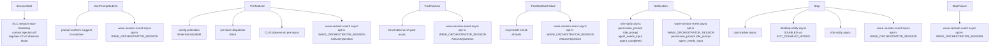

# Claude Code Harness

🌐 日本語: [claude-code.ja.md](claude-code.ja.md)

← [Docs index](../README.md)

This document covers the Claude Code harness configuration deployed by this dotfiles repo. The harness consists of `~/.claude/settings.json`, a thin ECC launcher, one chezmoi-managed hook script, a 3-line statusline, the CLV2 continuous-learning observer wiring, and a set of Japanese-language code-review subagents. A second account (`~/.claude-r06`) mirrors the config entirely through symlinks while keeping its runtime state isolated.

---

## Table of contents

- [Deployed paths](#deployed-paths)
- [settings.json — top-level knobs](#settingsjson--top-level-knobs)
- [Permissions allow/deny surface](#permissions-allowdeny-surface)
- [Hooks graph](#hooks-graph)
  - [SessionStart](#sessionstart)
  - [UserPromptSubmit](#userpromptsubmit)
  - [PreToolUse](#pretooluse)
  - [PostToolUse](#posttooluse)
  - [PostToolUseFailure](#posttoolusefailure)
  - [Notification](#notification)
  - [Stop](#stop)
  - [StopFailure](#stopfailure)
- [ECC launcher — ecc-hook.sh](#ecc-launcher--ecc-hooksh)
- [Hook scripts (hooks-fork/)](#hook-scripts-hooks-fork)
- [Statusline](#statusline)
- [CLV2 observer wiring](#clv2-observer-wiring)
- [Scheduled morning radar](#scheduled-morning-radar)
- [Review subagents](#review-subagents)
- [r06 work account](#r06-work-account)
- [Env vars reference](#env-vars-reference)

---

## Deployed paths

| Source path | Deploys to |
|---|---|
| `home/dot_claude/settings.json` | `~/.claude/settings.json` |
| `home/dot_claude/executable_ecc-hook.sh` | `~/.claude/ecc-hook.sh` (0755) |
| `home/dot_claude/executable_statusline.sh` | `~/.claude/statusline.sh` (0755) |
| `home/dot_claude/executable_morning-radar.sh` | `~/.claude/morning-radar.sh` (0755) |
| `home/dot_claude/executable_wave-session-event.sh` | `~/.claude/wave-session-event.sh` (0755) |
| `home/dot_claude/hooks-fork/prompt-conform-suggest.js` | `~/.claude/hooks-fork/prompt-conform-suggest.js` |
| `home/dot_claude/agents/*.md` | `~/.claude/agents/*.md` |
| `home/dot_claude/fable-orchestrator-prompt.md` | `~/.claude/fable-orchestrator-prompt.md` (appended by `cldf`/`cldf-r06` via `--append-system-prompt-file`) |
| `home/dot_claude/symlink_skills.tmpl` | `~/.claude/skills -> ~/.agents/skills` (symlink) |
| `home/dot_claude-r06/symlink_*.tmpl` | `~/.claude-r06/{settings.json,CLAUDE.md,statusline.sh,agents,commands,skills}` (symlinks) |

---

## settings.json — top-level knobs

`home/dot_claude/settings.json` deploys to `~/.claude/settings.json` and is the single entry point for the harness. Key scalar settings:

| Setting | Value | Notes |
|---|---|---|
| `model` | <!-- FACT:claude-model-pin -->claude-opus-5[1m]<!-- /FACT --> | Pinned model with 1 M context (kept in sync with `home/dot_claude/settings.json`) |
| `effortLevel` | `xhigh` | Persisted reasoning effort; `/effort` overrides it for one session |
| `language` | `Japanese` | All conversational output in Japanese |
| `alwaysThinkingEnabled` | `false` | Extended thinking opt-in is per-task |
| `cleanupPeriodDays` | `20` | Auto-prune sessions older than 20 days |
| `agentPushNotifEnabled` | `true` | Push notifications for subagent events |
| `CLAUDE_AUTOCOMPACT_PCT_OVERRIDE` | `95` | Trigger auto-compact at 95 % context used |
| `MAX_THINKING_TOKENS` | `127999` | Upper bound for extended thinking tokens |
| `permissions.defaultMode` | `auto` | Prompt only for unlisted operations |

The `statusLine` field points to `${CLAUDE_CONFIG_DIR:-$HOME/.claude}/statusline.sh` so the same settings file works for both accounts.

Two plugins are declared:

| Plugin | Provides |
|---|---|
| `codex@openai-codex` | Codex CLI (OpenAI) consultation from within Claude Code |
| `claude-code-setup@claude-plugins-official` | Anthropic-official read-only codebase analyzer that recommends hooks, skills, MCP servers, and subagents |

`enabledPlugins` names the plugins, and `extraKnownMarketplaces` names the non-official marketplaces
they come from (`openai-codex` → `openai/codex-plugin-cc`, pinned to tag `v1.0.6`). Neither key
installs anything by itself: the CLI treats `enabledPlugins` as a switch for plugins that are
*already* installed, and it does not register a marketplace merely because settings.json declares one
— see [anthropics/claude-code#23737](https://github.com/anthropics/claude-code/issues/23737) (closed
as duplicate) and [#45323](https://github.com/anthropics/claude-code/issues/45323) (closed as not
planned). Each account's plugin runtime lives in `$CLAUDE_CONFIG_DIR/plugins/`, which is
chezmoiignored and therefore empty on a new machine.

`run_onchange_after_17-setup-claude-plugins.sh.tmpl` closes that gap. It embeds the declaration as
JSON rendered out of settings.json — so the declaration keeps a single source of truth — then
registers the marketplaces and installs the plugins that are missing, once per account.

A marketplace is executable code that `chezmoi apply` installs unattended, so it must not track a
moving default branch. The pin has two sharp edges. A declared `ref` is **ignored** unless it is also
part of the CLI argument, so the script passes `<repo>#<ref>`; and the ref reaches `git clone
--branch`, so a **commit SHA cannot be used** — only a branch or a tag. `openai-codex` is therefore
pinned to a tag, which is weaker than the commit pins this repo uses for chezmoi externals: a tag can
be moved upstream. Bumping it is a manual edit today; wiring Renovate's `github-tags` datasource to
it is tracked separately.

**settings.json belongs to chezmoi, not to the CLI.** `claude plugin install`, `claude plugin
marketplace add`, and the interactive `/plugin` manager each rewrite the file with their own
serializer: top-level keys are reordered and every hook's `id` and `description` annotation is
dropped. Nothing breaks — hooks are identified by the argument inside their `command`, not by those
keys — but never `chezmoi add` the rewritten file. Run `chezmoi apply` to restore the annotated
version; script 17 does the same for itself by writing back a snapshot when it exits.

---

## Permissions allow/deny surface

The `permissions.allow` list pre-approves common read-only and safe-write operations so Claude Code does not prompt for them:

- **Reads**: `ls`, `find`, `tree`, `cat`, `head`, `tail`, `grep`, `rg`, `sort`, `diff`, `echo`, `sed`, `awk`, `jq`
- **Filesystem writes**: `mkdir`, `cp`, `mv`, `touch`, `chmod`
- **Package managers**: `npm`, `pnpm`, `yarn`, `npx`
- **Git**: `status`, `diff`, `log`, `add`, `commit`, `branch`, `checkout`, `switch`, `pull`, `push`, `stash`, `fetch`, `merge`, `tag`, `show`, `cherry-pick`, `remote -v`
- **Docker**: `docker`, `docker-compose`, `docker compose`
- **TypeScript**: `tsc`, `tsx`
- **Testing/linting**: `jest`, `vitest`, `playwright`, `eslint`, `prettier`, `biome`
- **Notifications**: `osascript -e 'display notification*`
- **GitHub**: `gh search:*`
- **MCP**: `mcp__claude_ai_Google_Calendar__list_events`, context7 tools

The `permissions.deny` list blocks:

- `sudo`, `rm -rf`, `git reset`, `git push --force` / `-f`
- Reads of credential files (`.env*`, private keys, PEM files, `*credentials*`, `*secret*`)
- Writes to `.env*` and `secrets/` paths
- `env` and `printenv` (prevent env-dump of secrets)
- Gmail MCP credential files
- `mcp__supabase__execute_sql`

---

## Hooks graph

The hooks are wired in `settings.json` and dispatched through either the ECC launcher or direct `node` invocations. The ECC dispatcher (`run-with-flags.js`) self-gates on `ECC_HOOK_PROFILE` (set to `strict`) and `ECC_DISABLED_HOOKS` (with any per-session `ECC_DISABLED_HOOKS_EXTRA` already merged in by the launcher, #281).

**Reduced in #496** (sub-issue of #473). The surface used to carry 37 entries and layered safety, quality automation, observation, auditing, notification and learning onto the same events. Nineteen entries were removed, leaving 18. What went: the per-edit and per-Stop quality advisories (they duplicate `$code-change-verification` and CI), the observation and auditing that fed no decision loop, the automatic session-summary persistence and SessionStart context injection, and the CLV2 SessionStart notifier. What stayed: the safety boundary (commit-verification bypass block, destructive-command fact-forcing, dev-server launch, `pre:config-protection`), the CLV2 per-tool-call observer, the MCP failure recovery, the ntfy notifications, and every wave-orchestrator session event.


```mermaid
flowchart TD
    SS[SessionStart] --> SS1[ECC session-start-bootstrap\ncontext injection off\nregisters CLV2 observer lease]

    UPS[UserPromptSubmit] --> UPS1[prompt-conform-suggest\nno matcher]
    UPS --> UPS2[wave-session-event async\nopt-in WAVE_ORCHESTRATOR_SESSION]

    PTU[PreToolUse] --> PTU1[config-protection\nWrite Edit MultiEdit]
    PTU --> PTU2[pre-bash-dispatcher\nBash]
    PTU --> PTU3[CLV2 observe.sh pre async]
    PTU --> PTU4[wave-session-event async\nopt-in WAVE_ORCHESTRATOR_SESSION\nAskUserQuestion]

    PoTU[PostToolUse] --> PoTU1[CLV2 observe.sh post async]
    PoTU --> PoTU2[wave-session-event async\nopt-in WAVE_ORCHESTRATOR_SESSION\nAskUserQuestion]

    PTUF[PostToolUseFailure] --> PTUF1[mcp-health-check\nall tools]
    PTUF --> PTUF2[wave-session-event async\nopt-in WAVE_ORCHESTRATOR_SESSION\nAskUserQuestion]

    NTF[Notification] --> NTF1[ntfy-notify async\npermission_prompt idle_prompt\nagent_needs_input agent_completed]
    NTF --> NTF2[wave-session-event async\nopt-in WAVE_ORCHESTRATOR_SESSION\npermission_prompt idle_prompt\nagent_needs_input]

    STP[Stop] --> STP1[cost-tracker async]
    STP --> STP2[desktop-notify async\nDISABLED via ECC_DISABLED_HOOKS]
    STP --> STP3[ntfy-notify async]
    STP --> STP4[wave-session-event async\nopt-in WAVE_ORCHESTRATOR_SESSION]

    STPF[StopFailure] --> STPF1[wave-session-event async\nopt-in WAVE_ORCHESTRATOR_SESSION]
```

### SessionStart

| Hook ID | Command | Notes |
|---|---|---|
| `session:start` | `ecc-hook.sh scripts/hooks/session-start-bootstrap.js` | Lifecycle only. `ECC_SESSION_START_CONTEXT=off` suppresses every injected block — previous session summary, active instincts, learned skills, project type (#496, #473 AC-025). The entry stays wired because `session-start.js` registers the CLV2 observer's session lease *before* it evaluates that gate; deleting the entry would silently stop the learning-engine observation this change must preserve |

### UserPromptSubmit

| Hook ID | Matcher | Command | Notes |
|---|---|---|---|
| `user-prompt-submit:prompt-conform-suggest` | none | `node hooks-fork/prompt-conform-suggest.js` (timeout 5 s) | Detects long, task-shaped prompts and injects `additionalContext` suggesting `$prompt-conform` (task #367). Not an ECC fork — a standalone script, documented separately from [Hook scripts](#hook-scripts-hooks-fork) below. `UserPromptSubmit` does not support `matcher` per the [official Hooks reference](https://code.claude.com/docs/en/hooks) (silently ignored), so the entry omits it. Fail-open: a malformed payload, an invalid env-tuned regex, or any other exception all degrade to no output and exit 0. See [Env vars reference](#env-vars-reference) for the tuning knobs. |
| `userpromptsubmit:wave-session-event` | none | `wave-session-event.sh` (async, timeout 10 s) | Appends the hook payload to a per-session file so wave-orchestrator's parent session can tell a stopped child apart without scraping the TUI (#437). Wired into every session but **opt-in**: it records nothing unless `WAVE_ORCHESTRATOR_SESSION` is set in the environment (the orchestrator exports it only for the child sessions it launches) — ordinary sessions record nothing. Writes to `${XDG_STATE_HOME:-$HOME/.local/state}/wave-orchestrator/events/<session_id>.jsonl` (dir 700, file 600). Fail-open: no-op without `jq`, a writable state dir, or a `session_id` that parses as a UUID. |

### PreToolUse

| Hook ID | Matcher | Description |
|---|---|---|
| `pre:config-protection` | `Write\|Edit\|MultiEdit` | Blocks edits to linter/formatter config files |
| `pre:bash:dispatcher` | `Bash` | Runs `block-no-verify`, `auto-tmux-dev` and the gateguard in sequence. The advisory sub-hooks (`tmux-reminder`, `git-push-reminder`, `commit-quality`) are switched off via `ECC_DISABLED_HOOKS` (#496, #473 AC-010). The gateguard keeps its **destructive-command** fact-forcing; `GATEGUARD_BASH_ROUTINE_DISABLED=1` turns off only the routine gate on the session's first non-read-only Bash (#473 AC-009) |
| `pre:observe:continuous-learning` | `*` | CLV2 `observe.sh pre` (async); writes `tool_start` to `observations.jsonl` |
| `pretooluse:wave-session-event` | `AskUserQuestion` | Records the same wave-orchestrator payload as [UserPromptSubmit](#userpromptsubmit) above (async, timeout 10 s; opt-in via `WAVE_ORCHESTRATOR_SESSION`, #437). Marks a question as opened; paired with the `PostToolUse`/`PostToolUseFailure` rows below via `tool_use_id` to detect whether it was later decided. |

The `GATEGUARD_BASH_EXTRA_DESTRUCTIVE` regex (set in `env`) extends the built-in destructive command set that the `pre:bash:dispatcher` enforces. It covers:

- `chezmoi destroy/forget/purge`
- `terraform destroy`, `state rm`, `workspace delete`, `force-unlock`, `apply --auto-approve`
- `kubectl delete`, `helm uninstall/delete`
- `docker system prune`, volume/image/container/network prune, `docker rm/rmi --force`
- `brew uninstall/autoremove/untap`, `mas uninstall`, `mise uninstall/implode/prune`
- `gh repo/release/secret/cache/run delete`
- `aws s3 rb/rm`, `aws ec2 terminate-instances`, `aws iam delete-*`, `aws dynamodb delete-table`, `aws rds delete-*`
- `gcloud … delete`
- `supabase db reset`, `supabase projects delete`
- `npm unpublish/publish`, `pnpm purge/store prune`, `yarn unpublish/publish`
- `defaults delete`
- `git filter-repo/branch`

This regex is the SSOT shared with the Codex gateguard (see [codex.md](codex.md#gateguard)).

### PostToolUse

| Hook ID | Matcher | Async | Description |
|---|---|---|---|
| `post:observe:continuous-learning` | `*` | Yes | CLV2 `observe.sh post`; captures `tool_complete` to `observations.jsonl` |
| `posttooluse:wave-session-event` | `AskUserQuestion` | Yes | Same wave-orchestrator recorder as [UserPromptSubmit](#userpromptsubmit) above (opt-in via `WAVE_ORCHESTRATOR_SESSION`, #437). Fires when `AskUserQuestion` is answered. Because `tool_response` carries the answer text, only correlation fields (`session_id`, `prompt_id`, `hook_event_name`, `tool_name`, `tool_use_id`) are projected and recorded — the answer body never lands on disk. |

### PostToolUseFailure

| Hook ID | Description |
|---|---|
| `post:mcp-health-check` | Tracks failed MCP tool calls, marks unhealthy servers, attempts reconnect. `CLAUDE_HOOK_EVENT_NAME=PostToolUseFailure` is set explicitly because Claude Code does not export it and `mcp-health-check.js` selects its handler from that env var. |
| `posttoolusefailure:wave-session-event` | Same wave-orchestrator recorder as [UserPromptSubmit](#userpromptsubmit) above (opt-in via `WAVE_ORCHESTRATOR_SESSION`, #437; matcher `AskUserQuestion`). Fires on an ordinary tool failure; paired with `PostToolUse` above via `tool_use_id` to detect that a question was decided (#448). Like `PostToolUse`, only correlation fields are projected — the answer body never lands on disk. |

### Notification

| Hook ID | Matcher | Async | Description |
|---|---|---|---|
| `notification:ntfy-notify` | `permission_prompt\|idle_prompt\|agent_needs_input\|agent_completed` | Yes | Publishes attention/completion notifications to the self-hosted ntfy server over Tailscale with repo/branch/account/session attribution (#337; see [Notifications](../architecture/notifications.md)). Fail-open: silent no-op without `~/.config/ntfy/notify-env` |
| `notification:wave-session-event` | `permission_prompt\|idle_prompt\|agent_needs_input` | Yes | Same wave-orchestrator recorder as [UserPromptSubmit](#userpromptsubmit) above (opt-in via `WAVE_ORCHESTRATOR_SESSION`, #437). Narrower matcher than `notification:ntfy-notify` above — excludes `agent_completed`. |

### Stop

| Hook ID | Async | Description |
|---|---|---|
| `stop:cost-tracker` | Yes | Tracks token and cost metrics per session |
| `stop:desktop-notify` | Yes | **Disabled** via `env.ECC_DISABLED_HOOKS` — replaced by `stop:ntfy-notify` (#337). Wiring kept for the documented one-step rollback (re-enable here + remove the ntfy entries together) |
| `stop:ntfy-notify` | Yes | Publishes a session-stop notification (truncated + client-identifier-scrubbed summary) to the self-hosted ntfy server (#337) |
| `stop:wave-session-event` | Yes | Same wave-orchestrator recorder as [UserPromptSubmit](#userpromptsubmit) above (opt-in via `WAVE_ORCHESTRATOR_SESSION`, #437). Marks the turn as idle/complete. |

### StopFailure

| Hook ID | Async | Description |
|---|---|---|
| `stopfailure:wave-session-event` | Yes | Same wave-orchestrator recorder as [UserPromptSubmit](#userpromptsubmit) above (opt-in via `WAVE_ORCHESTRATOR_SESSION`, #437). Fires when a turn ends via an API error without a `Stop` event, so the orchestrator can still detect idle instead of treating the child as stuck (#447-related). |

---

## ECC launcher — ecc-hook.sh

`~/.claude/ecc-hook.sh` is a small bash launcher that replaces ECC's ~1.5 KB per-hook minified `node -e` blobs in `settings.json`.

**Why it exists.** ECC normally ships each hook command as an inline blob whose bulk is plugin-root fallback resolution — scanning `~/.claude/plugins/…` for an installed ECC. Because this dotfiles repo manages ECC as a chezmoi external (not a Claude plugin), the plugin root is fixed at `~/.agents/skills/ecc`. The fallback scan is dead weight and made `settings.json` unreadable. The launcher sets `CLAUDE_PLUGIN_ROOT` once and hands the hook spec to ECC's own `plugin-hook-bootstrap.js`, which resolves and dispatches the target script.

**Fail-open behavior.** If `plugin-hook-bootstrap.js` is absent (fresh machine before `chezmoi apply` has fetched the external), the launcher passes stdin straight through and exits 0 — a silent no-op, matching ECC's own missing-runtime convention.

**Per-session opt-out — `ECC_DISABLED_HOOKS_EXTRA`.** `settings.json`'s `env` block overrides any shell-exported `ECC_DISABLED_HOOKS`, which made prefix invocations like `ECC_DISABLED_HOOKS=… cld-r06` silently ineffective (#281). The launcher therefore merges a shell-exported `ECC_DISABLED_HOOKS_EXTRA` — a variable `settings.json` does not define, so it reaches the hook process untouched — into `ECC_DISABLED_HOOKS` before dispatching. This is the channel the `claude-config` alias uses. The same precedence pins `ECC_HOOK_PROFILE` to the `settings.json` value (`strict`); there is no shell-side profile override. Note that the channel is not scoped: any hook ID routed through the launcher — including the Bash destructive gates — can be disabled this way, and anything that can set shell env for the session (e.g. an allowed direnv `.envrc`) can reach it.

**Usage pattern in settings.json:**

```
# Simple hook:
$HOME/.claude/ecc-hook.sh scripts/hooks/session-start-bootstrap.js

# Hook with profile gating:
$HOME/.claude/ecc-hook.sh scripts/hooks/run-with-flags.js <hook-id> <script-path> standard,strict
```

The `run-with-flags.js` wrapper self-gates: it reads `ECC_HOOK_PROFILE` and `ECC_DISABLED_HOOKS` and skips the target script if the current profile is not in the declared set, or if the hook ID appears in `ECC_DISABLED_HOOKS`.

---

## Hook scripts (hooks-fork/)

`home/dot_claude/hooks-fork/` holds hook scripts that are invoked directly as `node <file>` rather than through `ecc-hook.sh`, because `run-with-flags.js` rejects scripts outside the plugin root (path-traversal guard).

Only `prompt-conform-suggest.js` (the [UserPromptSubmit](#userpromptsubmit) hook above) is left. It is **not** an ECC fork: it has no ECC upstream, `require()`s nothing from the ECC runtime, and is stateless — prompt text never reaches disk or a database. Its tuning knobs are in the [Env vars reference](#env-vars-reference).

**The three ECC forks that used to live here were removed in #496** (sub-issue of #473):

| Removed fork | What it did | Why it went |
|---|---|---|
| `governance-capture.js` | Persisted ECC's governance events (secrets, approval-required commands, sensitive paths) to a per-account `state.db` via `node:sqlite` | #473 AC-015: the capture fed no decision loop, and it was the only writer widening raw commands, paths and governance payloads into stored context |
| `post-bash-command-log.js` | Appended every executed Bash command to a per-account, 0600, secret-redacted `bash-commands.log` | #473 AC-010 / AC-015: a raw command audit nothing read |
| `ecc-state-reader.js` | Read-only CLI behind the `ecc-status` / `ecc-sessions` / `ecc-work-items` zsh functions | #473 AC-015: the read side of the same `state.db`; removed with its writer and its three shell functions |

`home/.chezmoiremove` reclaims the already-deployed copies — deleting a file from the chezmoi source tree does not delete the copy on disk. The data they wrote (`state.db`, `bash-commands.log`) is deliberately **left in place**: #473 scopes this change to stopping new writes, and deleting the accumulated history is a separate explicit decision.

---

## Statusline

`~/.claude/statusline.sh` renders a 3-line statusline. The `statusLine` key in `settings.json` points to it:

```json
"statusLine": {
  "type": "command",
  "command": "${CLAUDE_CONFIG_DIR:-$HOME/.claude}/statusline.sh"
}
```

### Layout

```
L1  <host>  <dir>  <branch> [*dirty] [⇡N⇣N]  [worktree]
L2  <model>  [effort]  [🧬N]  <ctx○>  [5h%]  [7d%]  <billable-cost>
L3  [battery%]  <network-RTT>  <claude-service-status>
```

- **L1**: host icon, project-relative directory, git branch with dirty/ahead/behind indicators, worktree name when in a worktree
- **L2**: model display name, effort level, CLV2 instinct-cluster count (🧬N), context remaining circle (●◕◑◔○), 5-hour and 7-day rate-limit percentages with reset times, and the billable cost — either a dim `incl.` marker or session/daily amounts in JPY (falls back to USD when no exchange rate is cached). See [Billable-delta cost](#billable-delta-cost) for what the amounts mean
- **L3**: battery level (macOS laptop only, via `pmset`), network RTT tier (ping to 1.1.1.1), Claude service status (from Claude status API)

### Implementation constraints

**bash 3.2 compatibility.** macOS ships `/bin/bash` at version 3.2, which does not support `\u` escape sequences. All Nerd Font glyphs are encoded as raw UTF-8 bytes inside `$'...'` literals (e.g., `$'\xef\x84\x88'` for the desktop icon). This ensures glyphs survive editor and font accidents and remain readable by bash 3.2.

**Non-blocking I/O.** All external and network operations (ping, curl, `ccusage`, `pmset`) run in background subshells and write to a cache directory (`$XDG_CACHE_HOME/claude-statusline`, mode 700). The renderer reads from cache; cache entries refresh in the background at their respective TTLs (network: 15 s, battery: 60 s, daily cost: 5 min, exchange rate: 24 h). Rendering is always instant.

**JPY cost conversion.** Exchange rates are fetched from `api.frankfurter.dev` (ECB daily rates) with a 24-hour cache. When a rate is available, costs are displayed as `¥N,NNN`; otherwise as `$N.NN`.

### Billable-delta cost

Under a subscription, spend inside the 5h/7d quota is already paid for; only spend past an exhausted window is invoiced against usage credits. Showing the raw session/daily totals therefore parked money that will never be billed next to money that will, behind the same glyph. Line 2 shows what is actually owed instead:

| stdin state | Rendered | Why |
| --- | --- | --- |
| No `rate_limits` at all | `¥N (session)` `¥N (daily)` — the raw totals | API-key (pay-as-you-go) auth, or a subscription session before its first API response. There is no quota being consumed, so the totals *are* the bill |
| `rate_limits` present, both windows under 100% | `incl.` (dim) | Nothing is billable. The marker keeps the slot occupied so a missing segment reads as "this costs nothing", not "the cost lookup broke" |
| Either window at 100% | `¥N (session)` `¥N (daily)` — increments since the window ran out | Only the spend above the baseline is invoiced |

**Baseline lifecycle.** The spend at the moment a window is exhausted becomes the baseline, kept in `$XDG_CACHE_HOME/claude-statusline/session_<session_id>.json` (0600) under a `billing` key. It is *session*-scoped rather than profile-scoped: concurrent sessions under one profile would otherwise clobber each other's baseline, the failure #449 established for `effort` in the profile-keyed rate-limits snapshot.

The same file also carries a `context` sibling key (#499): `context_window.remaining_percentage`, persisted on every render regardless of quota state, independently of whether `billing` is present. Unlike the baseline, `context` has no lifecycle to speak of — it is simply overwritten each render — so the file can carry `context` alone (no active overage), `billing` alone (an overage render where the harness omitted or malformed `context_window`), or both. When a quota window closes and the baseline is dropped, the file is rewritten with `billing` removed rather than deleted outright, as long as there is a `context` value to keep it alive; only when neither key would be present is the file removed.

`context` has to stay live during an overage too, not just outside one: the "billed" write is forced whenever *either* this render's context body or the value already stored in the file is non-empty — not only the current one — so a harness that stops sending `context_window` mid-overage has its stale percentage actively dropped rather than left on disk. Once neither side has a value the forced write stops firing, so the file does not churn forever on that account alone.

The baseline is anchored on the exhausted window that resets **last**, since that is the one keeping the overage alive. It stays valid only while that window is the same instance (`resets_at` unchanged) and still exhausted — `used_percentage` is monotonic within one instance, so that pair proves the overage never lapsed, with no wall-clock comparison and so no sensitivity to clock skew. While both windows are exhausted the anchor hands over to the longer-lived one, so the baseline survives the shorter window rolling over mid-overage. When neither window is exhausted the baseline is deleted and the display returns to `incl.`.

**Daily carry.** `ccusage` resets its total at midnight, so the previous day's billable remainder is banked into a carry before re-basing on the new day; the daily amount is `carry + (today's total − today's baseline)`. Both deltas are clamped at 0, so a `ccusage` correction or a resumed session never renders a negative charge. The daily half of the baseline is taken lazily: `ccusage` refreshes in the background, and anchoring it at 0 on a cold cache would bill the whole day.

**Cost of the common path.** The statusline re-renders on every turn, so the window checks, the session-id resolution, and the "is there any baseline on disk" probe are shell builtins. During an overage, the *billing* half's own value still drives its old write-skip optimization (skip when nothing moved and the file already exists) — but #499 adds two more triggers that force the write regardless: a valid `context` body on this render, or a stale one left over from a previous render that now needs dropping (see above). Outside an overage the `context` sibling key is written on every render whenever `context_window.remaining_percentage` is present — the same cost `write_harness_cost` and `write_rate_limits_snapshot` already pay on every render, extended to this file. A render that is inside quota (or has no `rate_limits` at all) therefore now does one small atomic write per turn to keep `context` live, where it previously did none. The population of state files widens with it: `session_<session_id>.json` used to exist only for sessions that actually exceeded a quota window, and now exists for every session the harness reports a context percentage for. Two consequences follow. On disk the file count scales with sessions started rather than with overages, bounded by the 7-day sweep below. On the render path, `billing_state_prune`'s leading glob now always finds a file, so the daily-stamp check behind it (a `date` and a `stat`) runs every render instead of never — the "no extra fork" property of a machine that never exceeds its quota is gone, traded for the context signal. Files left behind by ended sessions are swept once a day by a backgrounded `find`; the sweep runs whatever this session's quota state is, since a machine sitting in a long overage would otherwise never collect them. (`find -mtime +N` compares whole 24-hour periods with a strict `>`, so effective retention is up to N+1 days.)

**Known limit: sessions that start mid-overage.** When the baseline is first taken there is no way to tell "this session was already running when the window ran out" from "this session started after it ran out". The baseline is the spend at that render, which is right for the first case and loses the first turn's charge in the second. The alternative — anchoring at 0 — would bill a whole session's pre-overage spend in the common case, so the under-report is the deliberate trade.

**R06 account badge.** When `CLAUDE_CONFIG_DIR` points to `~/.claude-r06`, the statusline renders a reverse-video `R06` badge to make the active account visually distinct.

**CLV2 🧬N segment.** The `clv2_cluster_count()` function reads the integer cached at `<homunculus>/.review-ready-clusters`. Its writer (`clv2-session-notify.sh`) was removed in #496 (see [CLV2 observer wiring](#clv2-observer-wiring)), so the segment now shows the last value that cache received and never changes; removing the renderer belongs with the statusline. The precedence below is kept verbatim so the two halves cannot drift if a writer is ever restored:

1. `$CLV2_HOMUNCULUS_DIR` if set and absolute
2. `$XDG_DATA_HOME/ecc-homunculus` if `XDG_DATA_HOME` is absolute
3. `$HOME/.local/share/ecc-homunculus` (fallback)

A non-absolute `XDG_DATA_HOME` is ignored (not used verbatim). Producer and consumer must agree on this precedence; a mismatch would cause the segment to read stale or zero data.

---

## CLV2 observer wiring

CLV2 (continuous-learning v2) is an ECC skill that observes tool calls, clusters recurring patterns into "instincts", and proposes skills via `/evolve`.

### SessionStart lifecycle

`clv2-session-notify.sh` used to run once per session to recompute the review-ready instinct-cluster count and fire a 7-day-throttled desktop notification. It was removed in #496 (#473 AC-027): a session-start notification is not an action request, and the Python `evolve` pass ran on every session for a number almost nobody acted on that session.

What remains at `SessionStart` is `session:start`, which registers the observer's session lease. Its context injection is off (`ECC_SESSION_START_CONTEXT=off`, #473 AC-025), but the entry must stay wired — `session-start.js` writes the lease *before* it evaluates the injection gate, so removing the entry would stop the observation the loop depends on.

The statusline still renders a 🧬N segment from `<homunculus>/.review-ready-clusters`, and that cache no longer has a writer. Its last value is therefore frozen until the renderer is removed; that removal belongs with the statusline, not here.

### Per-tool-call observer

The CLV2 `observe.sh` script is wired into both `PreToolUse` and `PostToolUse` as async hooks:

- `pre:observe:continuous-learning` — captures `tool_start` events to `observations.jsonl`
- `post:observe:continuous-learning` — captures `tool_complete` events; signals the Haiku observer process

The script is invoked directly (not via the ECC `observe-runner.js`) because the ECC plugin root has no `skills/` tree, so the runner cannot locate `observe.sh`. The script resolves its own `SKILL_ROOT` from `$0`. Both hooks are async so they never add per-tool latency.

**Enabling the observer.** The observer must be enabled in each account's runtime `<homunculus>/config.json`. This is done by `run_onchange_after_14-enable-clv2-observer.sh.tmpl`, which writes `observer.enabled=true` via a `jq` merge after each `chezmoi apply` that changes the lifecycle script's content hash. Editing the CLV2 skill's own `config.json` would be clobbered by the chezmoi external's 168-hour refresh.

---

## Scheduled morning radar

Issue kryota-dev/dotfiles#257: a launchd LaunchAgent runs `/morning-brief` headless on weekday mornings and hands the result off as a macOS notification. Detection + notify only — downstream skills (issue-fleet / renovate-sweep / review-fleet) are never auto-dispatched.

| Piece | Path | Role |
|---|---|---|
| LaunchAgent plist | `home/Library/LaunchAgents/dev.kryota.morning-radar.plist.tmpl` → `~/Library/LaunchAgents/` | Fires Mon–Fri 09:00 local time (this Mac is assumed to be on JST) |
| Wrapper | `~/.claude/morning-radar.sh` | Runs `claude -p "/morning-brief …"` on the personal account, saves the brief, notifies |
| Registration | `run_onchange_after_30-register-launchd-agents.sh.tmpl` | `launchctl bootout → bootstrap` whenever the plist changes; skipped in CI ([lifecycle scripts](../architecture/lifecycle-scripts.md)) |

- **Schedule semantics.** launchd coalesces fires missed while asleep into one run on wake; days the Mac is powered off are skipped. A date marker under `~/.local/state/morning-radar/` caps execution at one billed run per day; `~/.claude/morning-radar.sh --force` bypasses it for manual reruns.
- **Degraded mode.** The claude.ai Gmail/Calendar connectors cannot complete OAuth headless, so the brief degrades to GitHub + local context with an explicit fetch-failure note — the behavior documented in morning-brief SKILL.md.
- **Permissions & cost.** The wrapper passes an explicit `--allowedTools` allowlist (read-only `gh`/`git` and file reads; `Write` scoped to the brief output dir) and never uses `--dangerously-skip-permissions`. The model is pinned to `sonnet`, turns are capped with `--max-turns`, and a 600 s watchdog is the billing backstop. The weekday 5-runs/week spend was pre-approved on #257.
- **Output contract.** The brief lands in `~/dotfiles/.kryota-dev/morning-brief/<YYYY-MM-DD>.md`; the final response is a single `HEADLINE:` line the wrapper puts in an ntfy notification whose click opens the rendered brief page served on the tailnet (tailnet-only, #361 — see [notifications](../architecture/notifications.md#morning-brief-delivery-361)).

---

## Review subagents

<!-- FACT:claude-agent-count -->13<!-- /FACT --> subagent definition files live in `home/dot_claude/agents/` and deploy to `~/.claude/agents/`. All system prompts are written in Japanese to steer Japanese-language review output.

Every agent pins both `model` and `effort` in its frontmatter — nothing inherits the caller's session model, so a standalone invocation runs at the pinned tier too. The frontmatter is the single source of truth for these values; the table below is descriptive.

| Agent | Focus | Tier |
|---|---|---|
| `cc-code-review.md` | General code review ([MUST]/[SHOULD]/[NITS]/[GOOD] format) | sonnet / xhigh |
| `cc-security-review.md` | OWASP-focused security review | sonnet / xhigh |
| `adversarial-verifier.md` | Refutes review findings from an independent angle (large-tier adversarial round) | sonnet / xhigh |
| `architecture-reviewer.md` | Aggregate repo/architecture view — duplication and design drift a single diff cannot show | sonnet / high |
| `typescript-reviewer.md` | TypeScript-specific review | sonnet / high |
| `python-reviewer.md` | Python-specific review | sonnet / high |
| `react-reviewer.md` | React/frontend review | sonnet / high |
| `database-reviewer.md` | Database schema and query review | sonnet / high |
| `performance-reviewer.md` | Performance review (N+1, hot paths, memory, caching) | sonnet / high |
| `test-reviewer.md` | Test coverage, isolation, and reliability review | sonnet / high |
| `ux-reviewer.md` | UI/UX and accessibility review | sonnet / high |
| `renovate-analyzer.md` | Renovate dependency-update analysis | sonnet / high |
| `fact-check-worker.md` | Verifies one finding against primary sources (read-only, no write/exec) | sonnet / high |

The `multi-review` skill dynamically spawns the language/domain reviewers based on detected file types, plus the cross-cutting `performance`/`test`/`ux` reviewers based on change characteristics. `architecture-reviewer` is gated behind `--arch` or the pr-workflow large tier; `adversarial-verifier` and `fact-check-worker` are spawned per finding rather than per PR.

---

## r06 work account

`home/dot_claude-r06/` deploys six symlinks to `~/.claude-r06/`:

| Symlink target | Points to |
|---|---|
| `settings.json` | `~/.claude/settings.json` |
| `CLAUDE.md` | `~/.claude/CLAUDE.md` |
| `statusline.sh` | `~/.claude/statusline.sh` |
| `agents/` | `~/.claude/agents/` |
| `commands/` | `~/.claude/commands/` |
| `skills` | `~/.claude/skills` (→ `~/.agents/skills`) |

Config is one SSOT; runtime state is isolated by the environment variables the `claude` wrapper (`~/.local/launchers/claude`, reached as `claude`/`cld`/`cld-r06`) sets:

| Env var | `claude` / `cld` value | `cld-r06` value |
|---|---|---|
| `CLAUDE_CONFIG_DIR` | `~/.claude` | `~/.claude-r06` |
| `ECC_AGENT_DATA_HOME` | `~/.claude` | `~/.claude-r06` |
| `CLV2_HOMUNCULUS_DIR` | `~/.local/share/ecc-homunculus-default` | `~/.local/share/ecc-homunculus-r06` |
| `GATEGUARD_STATE_DIR` | `~/.claude/.gateguard` | `~/.claude-r06/.gateguard` |

Sessions, the governance `state.db`, instincts, bash-command logs, and caches are naturally isolated because each piece of runtime code resolves its paths from these environment variables.

`CLV2_HOMUNCULUS_DIR` is the one entry that deliberately sits *outside* the config dir, encoding the account as a path suffix instead. Claude Code classifies every path under the config dir as a sensitive file and asks for interactive approval before a write, while the CLV2 analysis pass runs headless (`claude --model haiku --print`) with nobody to approve it — so no instinct write ever succeeded while this pointed at `<account>/ecc-homunculus`. The observer spent its turn budget negotiating permission, died at "Reached max turns", and produced exactly zero instincts (#336). The other three variables stay under the config dir because the code that writes them (node hooks, shell scripts) writes directly rather than through Claude Code's Write tool, so the sensitive-file gate never applies to them.

Because `claude` resolves to the same wrapper script as `cld` (`~/.local/launchers/claude` is kept ahead of mise's shims on PATH — see [account isolation](account-isolation.md#bare-invocations-are-no-longer-a-gap)), a bare `claude` invocation now goes through the identical per-account env injection as `cld`/`cld-r06`, not a different fallback. The wrapper's fill-gaps rule (`CLAUDE_CONFIG_DIR="${CLAUDE_CONFIG_DIR:-$HOME/.claude}"`) means `claude` and `cld` behave identically: both keep an already-set `CLAUDE_CONFIG_DIR` (so a hook-spawned child stays on its parent session's account) and otherwise default to the personal account. Only `cld-r06` differs — it forces `CLAUDE_CONFIG_DIR=$HOME/.claude-r06` unconditionally.

---

## Env vars reference

| Variable | Set in | Effect |
|---|---|---|
| `ECC_HOOK_PROFILE` | `settings.json env` | `strict` = run all hooks gated on strict profile. Pinned: settings.json env overrides shell exports, so there is no per-session profile switch (#281) |
| `ECC_DISABLED_HOOKS` | `settings.json env` | Comma-separated hook IDs to skip. Since #496 it names only sub-hooks that live inside the ECC runtime and therefore cannot be unwired from `settings.json`: `pre:bash:tmux-reminder`, `pre:bash:git-push-reminder`, `pre:bash:commit-quality` (#473 AC-010), plus `stop:desktop-notify` (#337 rollback wiring). Hook IDs that no longer have an entry were dropped — naming one reads like an active safety decision while gating nothing |
| `ECC_DISABLED_HOOKS_EXTRA` | shell (`claude-config` alias, prefix invocation) | Per-session additive opt-out: `ecc-hook.sh` comma-joins it into `ECC_DISABLED_HOOKS`, since settings.json env overrides the base variable (#281) |
| `ECC_SESSION_START_CONTEXT` | `settings.json env` | `off` = inject no SessionStart context (previous session summary, active instincts, learned skills, project type). #473 AC-025; `--continue`/`--resume` and `$session-summary` cover the need on demand |
| `GATEGUARD_BASH_ROUTINE_DISABLED` | `settings.json env` | `1` = skip the gateguard's routine gate on the session's first non-read-only Bash. The destructive-command fact-forcing is a separate code path and stays on (#473 AC-008 / AC-009) |
| `GATEGUARD_BASH_EXTRA_DESTRUCTIVE` | `settings.json env` | Regex of additional destructive command patterns; SSOT shared with Codex gate |
| `PROMPT_CONFORM_SUGGEST_MIN_LENGTH` | unset by default (operator-tunable) | Overrides the character-length floor (default 150) that `prompt-conform-suggest.js` requires before it inspects a prompt further. Must be a non-negative integer; other values fall back to the default |
| `PROMPT_CONFORM_SUGGEST_TASK_REGEX` | unset by default (operator-tunable) | Overrides the imperative task-verb regex `prompt-conform-suggest.js` uses (default covers JP/EN task phrasing). An invalid pattern falls back to the built-in default |
| `PROMPT_CONFORM_SUGGEST_KEYWORD_REGEX` | unset by default (operator-tunable) | Overrides the skill/prompt-authoring keyword regex `prompt-conform-suggest.js` uses. An invalid pattern falls back to the built-in default |
| `CLAUDE_PLUGIN_ROOT` | `ecc-hook.sh` | Fixed to `~/.agents/skills/ecc`; skips ECC's plugin fallback scan |
| `CLAUDE_CONFIG_DIR` | the claude wrapper | Selects which `~/.claude*` directory Claude Code uses |
| `ECC_AGENT_DATA_HOME` | the claude wrapper | Governs where ECC (and the hook forks) write state |
| `CLV2_HOMUNCULUS_DIR` | the claude wrapper | Homunculus data directory for CLV2 instincts/clusters. Sits at `~/.local/share/ecc-homunculus-<account-slug>`, outside the config dir, so a headless instinct write is not blocked by the sensitive-file gate (#336) |
| `ECC_OBSERVER_TIMEOUT_SECONDS` | the claude wrapper | Default 300; raises the CLV2 observer watchdog so the Haiku analysis pass can finish instead of dying at 120s (#256). The `:-` form keeps an explicit override winning |
| `OBSERVER_ACTIVE_HOURS_START` / `OBSERVER_ACTIVE_HOURS_END` | the claude wrapper | Both default to `0`, which disables the CLV2 session-guardian clock gate (upstream default 800-2300). Sessions here routinely run past midnight, so that gate skipped analysis cycles wholesale; the guardian's cooldown and idle gates still throttle them (#336) |
| `ECC_OBSERVER_MAX_TURNS` | the claude wrapper | Default 100 (the upstream cap) rather than the auto-scaled floor of 20, which cut the Read → dedup-check → Write pass off mid-write. The watchdog above, not the turn ceiling, is what bounds a cycle (#336) |

---

## See also

- [Account isolation](account-isolation.md) — how the two-account model works end to end
- [Skills provenance](skills-provenance.md) — ECC/Anthropic external skill fetching and the provenance taxonomy
- [Codex harness](codex.md) — the Codex CLI counterpart
- [Architecture overview](../architecture/overview.md) — repo-wide structure
