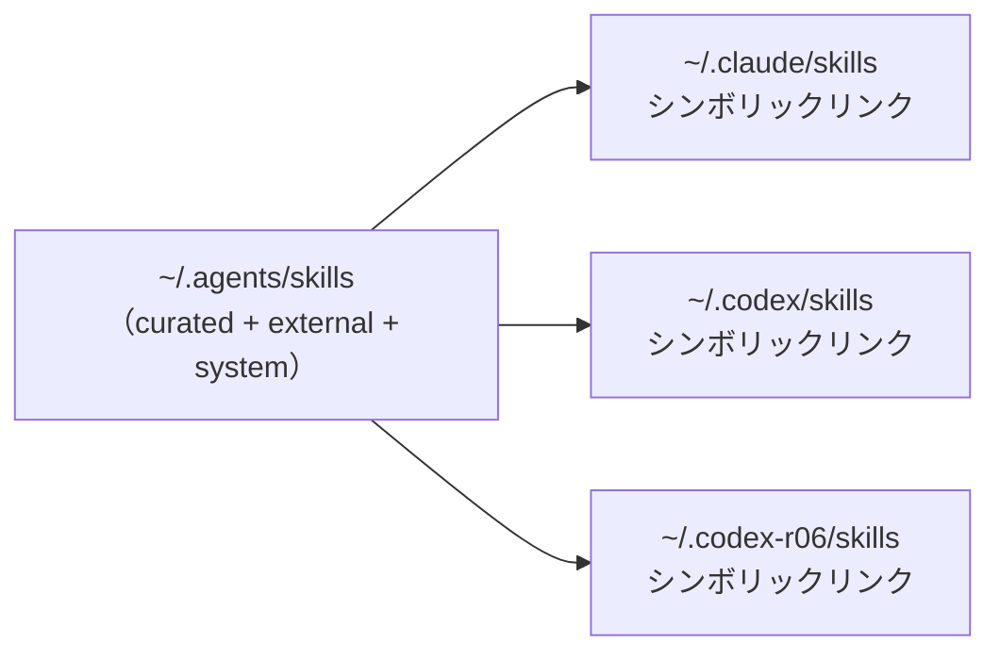

# Codex CLI ハーネス

🌐 English (canonical): [codex.md](codex.md)

← [ドキュメント目次](../README.ja.md)

このドキュメントは、本 dotfiles リポジトリがデプロイする OpenAI Codex CLI ハーネスの設定を説明します。ハーネスは 2 つの分離された `CODEX_HOME` アカウント（`~/.codex` と `~/.codex-r06`）をプロビジョニングし、chezmoi テンプレートでフックと shared プロファイル設定の同期を保ち、エイリアスと PATH シムで SSOT プロファイルを適用し、Claude Code と共有するクロスハーネスゲートガードで破壊的 Bash コマンドをゲーティングします。

---

## 目次

- [デプロイ先パス](#デプロイ先パス)
- [2 アカウントモデル](#2-アカウントモデル)
- [hooks.json — PreToolUse ゲートガード](#hooksjson--pretooluse-ゲートガード)
- [shared.config.toml — shared プロファイル](#sharedconfigtoml--shared-プロファイル)
- [テンプレート SSOT — アカウントドリフト防止](#テンプレート-ssot--アカウントドリフト防止)
- [--profile shared の仕組み](#--profile-shared-の仕組み)
  - [cdx / cdx-r06 エイリアス](#cdx--cdx-r06-エイリアス)
  - [dmux PATH シム](#dmux-path-シム)
  - [素の codex は SSOT 設定をスキップする](#素の-codex-は-ssot-設定をスキップする)
- [ゲートガード](#ゲートガード)
- [共有ルールとスキルレイヤー](#共有ルールとスキルレイヤー)
- [関連ドキュメント](#関連ドキュメント)

---

## デプロイ先パス

各 `CODEX_HOME` は同一のファイルセットを受け取ります。どちらも同じ chezmoi テンプレートからレンダリングされます。

| ソースパス | デプロイ先（個人） | デプロイ先（ワーク） |
|---|---|---|
| `home/dot_codex/hooks.json.tmpl` | `~/.codex/hooks.json` | `~/.codex-r06/hooks.json` |
| `home/dot_codex/private_shared.config.toml.tmpl` | `~/.codex/shared.config.toml` (0600) | `~/.codex-r06/shared.config.toml` (0600) |
| `home/dot_codex/symlink_AGENTS.md.tmpl` | `~/.codex/AGENTS.md -> ~/AGENTS.md` | `~/.codex-r06/AGENTS.md -> ~/AGENTS.md` |
| `home/dot_codex/symlink_skills.tmpl` | `~/.codex/skills -> ~/.agents/skills` | `~/.codex-r06/skills -> ~/.agents/skills` |

`home/dot_codex-r06/` には同じ 4 つのファイルが含まれています；テンプレート本体は同じ `home/.chezmoitemplates/` ソースを指す同一の 1 行です。

---

## 2 アカウントモデル

個人アカウントは Codex のデフォルト `CODEX_HOME=~/.codex` をそのまま使用し、ワークアカウントは `cdx-r06` エイリアスが明示的に設定する `CODEX_HOME=~/.codex-r06` を使用します。`cdx`/`cdx-r06` zsh エイリアスはアクティブアカウントを選択します：

```
cdx      → codex --profile shared "$@"                              (個人 — CODEX_HOME 未設定、Codex は ~/.codex をデフォルト使用)
cdx-r06  → CODEX_HOME=~/.codex-r06 codex --profile shared "$@"    (ワーク / r06)
```

両方のホームは共有テンプレートからレンダリングされた `hooks.json` と `shared.config.toml` のコピーをそれぞれ受け取るため、各アカウントは同一のフックと設定ロジックを実行しながら、認証トークンと会話状態を別々のディレクトリに分離します。

---

## hooks.json — PreToolUse ゲートガード

`home/.chezmoitemplates/codex-hooks.json` が実際のフック本体で、`dot_codex/hooks.json.tmpl` と `dot_codex-r06/hooks.json.tmpl` の両方から `{{ includeTemplate "codex-hooks.json" . }}` でインクルードされます。

レンダリングされた `hooks.json` は 1 つのフックを登録します：

```json
{
  "hooks": {
    "PreToolUse": [
      {
        "matcher": "^Bash$",
        "hooks": [
          {
            "type": "command",
            "command": "node \"<homeDir>/.config/gateguard/codex-bash-gate.js\"",
            "statusMessage": "Checking Bash command against cross-harness gateguard",
            "timeout": 10
          }
        ]
      }
    ]
  }
}
```

ホームディレクトリは apply 時に `{{ .chezmoi.homeDir }}` から補間されます。ゲートガードスクリプトについては以下の[ゲートガード](#ゲートガード)セクションを参照してください。

---

## shared.config.toml — shared プロファイル

`home/.chezmoitemplates/codex-shared-config.toml` が実際の設定本体で、`dot_codex/private_shared.config.toml.tmpl` と `dot_codex-r06/private_shared.config.toml.tmpl` の両方からインクルードされます。

レンダリングされた `shared.config.toml` の内容：

```toml
personality = "pragmatic"
model = "gpt-5.5"
model_reasoning_effort = "xhigh"

[features]
multi_agent = true
```

このファイルは `$CODEX_HOME/shared.config.toml` としてデプロイされます（mode 0600、chezmoi の `private_` プレフィックスによる）。`--profile shared` でロードされる named `shared` プロファイルです。

---

## テンプレート SSOT — アカウントドリフト防止

`dot_codex/` と `dot_codex-r06/` にはそれぞれ薄い 1 行テンプレートファイルが含まれています：

```
# dot_codex/hooks.json.tmpl (および dot_codex-r06/hooks.json.tmpl)
{{ includeTemplate "codex-hooks.json" . }}

# dot_codex/private_shared.config.toml.tmpl (および dot_codex-r06/private_shared.config.toml.tmpl)
{{ includeTemplate "codex-shared-config.toml" . }}
```

実際の本体は `home/.chezmoitemplates/` にのみ存在します。両方のアカウントディレクトリが同じテンプレートを参照するため、ドリフトは構造的に不可能です — テンプレートを編集すると次の `chezmoi apply` で両アカウントがアトミックに更新されます。

実際の設定が `dot_codex/` と `dot_codex-r06/` に重複していた場合、一方のアカウントのフックまたはプロファイルへの変更が両方のファイルの更新を必要とし、ドリフトが避けられません。

---

## --profile shared の仕組み

`shared.config.toml` は named Codex CLI プロファイルです。Codex が `--profile shared` で呼び出された場合にのみ、Codex の動的に書き込まれる `config.toml` の上にレイヤーとして適用されます。このフラグなしでは SSOT 設定はサイレントに無視されます。

`--profile shared` を自動的に注入するメカニズムが 2 つあります：

### cdx / cdx-r06 エイリアス

`cdx` と `cdx-r06` zsh エイリアス（`home/dot_config/zsh/codex.zsh` で定義）は標準のユーザー向けエントリポイントです。どちらも `--profile shared` を注入しますが、`CODEX_HOME` を設定するのは `cdx-r06` のみです。`cdx` は `CODEX_HOME` を未設定のままにし、Codex はデフォルトの `~/.codex` を使用します：

```zsh
# 実際の形（codex.zsh より）
cdx      → codex --profile shared "$@"                              # CODEX_HOME 未設定 → Codex は ~/.codex をデフォルト使用
cdx-r06  → CODEX_HOME=$HOME/.codex-r06 codex --profile shared "$@"
```

`hcdx` と `hcdx-r06` は phone-control コンテキスト用のバリアントです（happy ラッパー経由）。
ただし `happy codex` は `codex app-server` 経由で Codex を **headless** 起動し、ローカル端末は
read-only ビューア（"Codex Agent Messages / Waiting for messages…"）で対話プロンプトを持ちません。
セッション操作は Happy モバイル/Web アプリ側から行います。ローカルで対話的に Codex を使う場合は
`cdx` / `cdx-r06` を使用してください（フル TUI をローカル起動する `happy claude` とは非対称です）。

### dmux PATH シム

dmux は素の `codex` 呼び出しで Codex ペインをスポーンし、`--profile shared` を自身では渡せません。これを処理するため、`home/dot_config/dmux/bin/executable_codex`（POSIX sh スクリプト、mode 0755）を PATH シムとしてインストールします：

1. zsh dmux ラッパーが `~/.config/dmux/bin` を `PATH` の先頭に追加します。
2. dmux 自身の PATH サニタイザーは `node_modules/.bin` のみを除去するため、シムディレクトリは Codex ペインまで生き残ります。
3. dmux ペインで素の `codex` が実行されると、シムがインターセプトします。
4. シムは自身のディレクトリをスキップしながら `PATH` を走査し、実際の `codex` バイナリを見つけ、`--profile shared` を注入して再呼び出しします — 再帰は構造的に不可能です。

このシムなしでは、dmux ペインは SSOT `shared.config.toml` なしでサイレントに実行されます。

#### オプトインの happy-claude シム（`DMUX_HAPPY`）

同じシムディレクトリには `executable_claude` も同梱されます。これは Claude ペインを happy
ラッパー経由（スマホ操作）で起動するための**オプトイン**コンパニオンです。デフォルトでは
透過パススルー（`PATH` 上の最初の実 `claude` を exec）なので、dmux の既定挙動は変わりません。
`DMUX_HAPPY=1 dmux` で `happy claude` に切り替わります。exec 前に `DMUX_HAPPY` を `unset` する
ため、happy が spawn する入れ子の `claude` はパススルー側に入り、再帰は構造的に不可能です
（codex シムと同じ原理）。

Codex はこの方式で**ラップしません**。`happy codex` は `codex app-server` 経由で Codex を
headless 起動し、ローカル端末は入力欄のない read-only ビューアになる（上の
`cdx / cdx-r06 aliases` 節を参照）ため、対話的な dmux ペインを駆動できません。スマホ操作の
Codex は `hcdx` を単体起動し、dmux 内では `cdx` / `cdx-r06` を使ってください。

### 素の codex は SSOT 設定をスキップする

エイリアスや dmux シムなしの直接 `codex` 呼び出しは `shared.config.toml` を**ロードしません**。`--profile shared` フラグが適用する唯一のメカニズムです。これは意図的なもの（Codex ではプロファイルはオプトイン）ですが、`codex` を直接呼び出すスクリプト、CI、またはエディタ統合では気づきにくい落とし穴です。

---

## ゲートガード

`home/dot_config/gateguard/executable_codex-bash-gate.js`（`~/.config/gateguard/codex-bash-gate.js` にデプロイ、mode 0755）は `^Bash$` マッチャーの Codex `PreToolUse` フックとして登録された Node.js スクリプトです。

### 動作内容

stdin からツール呼び出し JSON を読み取り、Bash コマンドを検査し、破壊的パターンに一致する場合は実行を拒否します。拒否には Codex のドキュメント記載の wire スキーマを使用します：

```json
{
  "hookSpecificOutput": {
    "permissionDecision": "deny",
    "permissionDecisionReason": "<説明>"
  }
}
```

それ以外の結果はデシジョンを未設定のままにし、Codex は通常のサンドボックスと承認フローにフォールバックします。

### クロスハーネス SSOT

ゲートガードは破壊的コマンドの独自リストを持ちません。代わりに、ランタイムで `~/.claude/settings.json` から `GATEGUARD_BASH_EXTRA_DESTRUCTIVE` を読み取ります：

```
Claude settings.json  ──────────────────────────────┐
  env.GATEGUARD_BASH_EXTRA_DESTRUCTIVE (正規表現)    │  SSOT
                                                     │
ECC ゲートガードフック (Claude PreToolUse)  ◄────────┤
codex-bash-gate.js   (Codex PreToolUse)   ◄────────┘
```

スクリプトはまず `~/.claude/settings.json` を読み取り、次に `~/.claude-r06/settings.json` をフォールバックとして読み取り、値を大文字小文字を区別しない `RegExp` としてコンパイルします。ファイルが読み取れないか正規表現が無効な場合、ゲートはフェイルオープン（組み込みパターンのみ、クラッシュなし）します。

組み込みパターンセットはオペレーター設定に依存しない一般的な破壊的操作をカバーします：

- `rm -rf`（再帰的強制削除）
- `DROP TABLE`、`DELETE FROM`、`TRUNCATE`（破壊的 SQL、`psql -c "..."` 内でも検出）
- `settings.json` からの完全な `GATEGUARD_BASH_EXTRA_DESTRUCTIVE` セット（読み取り可能な場合）

### 回避防止ハードニング

スクリプトはパターンマッチング前に先頭のラッパーコマンドを除去し、LLM が用いる一般的な回避ベクターを処理します：

- 先頭ラッパー：`env`、`command`、`exec`、`nohup`、`sudo`、`time`、`builtin`、`setsid`、`stdbuf`、`nice`、`ionice`
- シェルディスパッチ：`sh -c "..."`、`bash -c "..."`、`zsh -c "..."` (`-c` 本体を検査)
- ダブルクォート内のコマンド置換
- サブシェル `(...)`、ブレース `{...}`、プロセス置換グループ

既知のベストエフォート上限（Codex のサンドボックスと承認フローに委任）：ランタイムでデコードされる base64/hex エンコードペイロード；深くネストされたラッパーオプション解析（例：`sudo -u user … cmd`）。

### 補完的、一次的ではない

Codex ゲートはベストエフォートの補完的レイヤーです。Codex には独自のサンドボックスと操作ごとの承認フローがあり、それが一次的な安全機構です。ゲートは一般的なケースを強化し、破壊的コマンドセットを Claude Code と Codex 間で一貫させます。

---

## 共有ルールとスキルレイヤー

両方の Codex アカウントは、シンボリックリンクを通じて Claude Code ハーネスと同じルールとスキルの入力を受け取ります：

### AGENTS.md

`home/dot_codex/symlink_AGENTS.md.tmpl` は `~/AGENTS.md` へのシンボリックリンクにレンダリングされます。これは `home/AGENTS.md.tmpl` からデプロイされるハーネス非依存の運用ルールファイルで、スキルプロベナンスポリシー、コーディング標準（`includeTemplate "coding-standards.md"` 経由）、および運用規約をカバーします。Codex は `CODEX_HOME` ディレクトリから自動的に読み取ります。

`~/.codex/AGENTS.md` と `~/.codex-r06/AGENTS.md` の両方が同じ `~/AGENTS.md` を指すため、`AGENTS.md.tmpl` への更新は両アカウントと両ハーネスに同時に反映されます。

### スキル

`home/dot_codex/symlink_skills.tmpl` は `~/.agents/skills` へのシンボリックリンクにレンダリングされます。これは共有スキルツリーで、`home/dot_claude/symlink_skills.tmpl` がシンボリックリンクするのと同じディレクトリです。両ハーネスはこのパスから curated、external、system スキルの 1 つのインベントリを共有します。Evolved スキルは `$CLV2_HOMUNCULUS_DIR/evolved/skills/` 配下に別途管理されており（CLV2 専用）、共有 discovery ツリーには含まれません。



プロベナンス分類（curated / external / system / evolved / unmanaged）とスキルの追加方法については、[スキルプロベナンス](skills-provenance.ja.md) を参照してください。

---

## 関連ドキュメント

- [Claude Code ハーネス](claude-code.ja.md) — Claude Code の対応ドキュメント
- [アカウント分離](account-isolation.ja.md) — アカウントごとの env 分離の仕組み
- [スキルプロベナンス](skills-provenance.ja.md) — スキル分類と external フェッチ
- [アーキテクチャ概要](../architecture/overview.ja.md) — リポジトリ全体の構造
- [開発ツール構成](../architecture/dev-tooling.ja.md) — ゲートガードソースと dmux PATH シム
