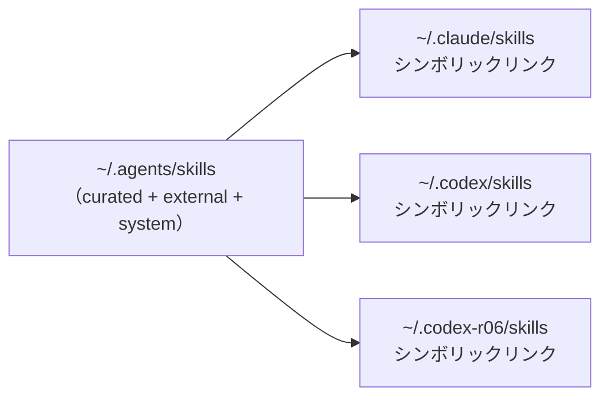

# Codex CLI ハーネス

🌐 English (canonical): [codex.md](codex.md)

← [ドキュメント目次](../README.ja.md)

このドキュメントは、本 dotfiles リポジトリがデプロイする OpenAI Codex CLI ハーネスの設定を説明します。ハーネスは 2 つの分離された `CODEX_HOME` アカウント（`~/.codex` と `~/.codex-r06`）をプロビジョニングし、chezmoi テンプレートでフックと shared プロファイル設定の同期を保ち、エイリアスと PATH シムで SSOT プロファイルを適用し、Claude Code と共有するクロスハーネスゲートガードで破壊的 Bash コマンドをゲーティングします。

---

## 目次

- [デプロイ先パス](#デプロイ先パス)
- [2 アカウントモデル](#2-アカウントモデル)
- [hooks.json — PreToolUse ゲートガード](#hooksjson--pretooluse-ゲートガード)
- [shared.config.toml — shared プロファイル](#sharedconfigtoml--shared-プロファイル)
- [agent.config.toml — agent プロファイル](#agentconfigtoml--agent-プロファイル)
- [テンプレート SSOT — アカウントドリフト防止](#テンプレート-ssot--アカウントドリフト防止)
- [--profile shared の仕組み](#--profile-shared-の仕組み)
  - [cdx / cdx-r06 エイリアス](#cdx--cdx-r06-エイリアス)
  - [素の codex は SSOT 設定をスキップする](#素の-codex-は-ssot-設定をスキップする)
- [管理外ベース設定とプロジェクト trust](#管理外ベース設定とプロジェクト-trust)
- [ゲートガード](#ゲートガード)
- [共有ルールとスキルレイヤー](#共有ルールとスキルレイヤー)
- [Claude Code codex プラグイン — pin と収束](#claude-code-codex-プラグイン--pin-と収束)
- [関連ドキュメント](#関連ドキュメント)

---

## デプロイ先パス

各 `CODEX_HOME` は同一のファイルセットを受け取ります。どちらも同じ chezmoi テンプレートからレンダリングされます。

| ソースパス | デプロイ先（個人） | デプロイ先（ワーク） |
|---|---|---|
| `home/dot_codex/hooks.json.tmpl` | `~/.codex/hooks.json` | `~/.codex-r06/hooks.json` |
| `home/dot_codex/private_shared.config.toml.tmpl` | `~/.codex/shared.config.toml` (0600) | `~/.codex-r06/shared.config.toml` (0600) |
| `home/dot_codex/symlink_AGENTS.md.tmpl` | `~/.codex/AGENTS.md -> ~/AGENTS.md` | `~/.codex-r06/AGENTS.md -> ~/AGENTS.md` |
| `home/dot_codex/symlink_skills.tmpl` | `~/.codex/skills -> ~/.agents/skills` | `~/.codex-r06/skills -> ~/.agents/skills` |

加えて `home/dot_codex/private_agent.config.toml.tmpl` → `~/.codex/agent.config.toml`（0600）があり、これはスキルが使う非対話 workspace-write プロファイルです（[agent.config.toml — agent プロファイル](#agentconfigtoml--agent-プロファイル) を参照）。`home/dot_codex-r06/` には同じファイル群が含まれています；テンプレート本体は同じ `home/.chezmoitemplates/` ソースを指す同一の 1 行です。

---

## 2 アカウントモデル

個人アカウントは Codex のデフォルト `CODEX_HOME=~/.codex` をそのまま使用し、ワークアカウントは `cdx-r06` エイリアスが明示的に設定する `CODEX_HOME=~/.codex-r06` を使用します。`cdx`/`cdx-r06` zsh エイリアスはアクティブアカウントを選択します：

```
cdx      → codex --profile shared "$@"                              (個人 — CODEX_HOME 未設定、Codex は ~/.codex をデフォルト使用)
cdx-r06  → CODEX_HOME=~/.codex-r06 codex --profile shared "$@"    (ワーク / r06)
```

両方のホームは共有テンプレートからレンダリングされた `hooks.json` と `shared.config.toml` のコピーをそれぞれ受け取るため、各アカウントは同一のフックと設定ロジックを実行しながら、認証トークンと会話状態を別々のディレクトリに分離します。

---

## hooks.json — PreToolUse ゲートガード

`home/.chezmoitemplates/codex-hooks.json` が実際のフック本体で、`dot_codex/hooks.json.tmpl` と `dot_codex-r06/hooks.json.tmpl` の両方から `{{ includeTemplate "codex-hooks.json" . }}` でインクルードされます。

レンダリングされた `hooks.json` は 1 つのフックを登録します：

```json
{
  "hooks": {
    "PreToolUse": [
      {
        "matcher": "^Bash$",
        "hooks": [
          {
            "type": "command",
            "command": "node \"<homeDir>/.config/gateguard/codex-bash-gate.js\"",
            "statusMessage": "Checking Bash command against cross-harness gateguard",
            "timeout": 10
          }
        ]
      }
    ]
  }
}
```

ホームディレクトリは apply 時に `{{ .chezmoi.homeDir }}` から補間されます。ゲートガードスクリプトについては以下の[ゲートガード](#ゲートガード)セクションを参照してください。

---

## shared.config.toml — shared プロファイル

`home/.chezmoitemplates/codex-shared-config.toml` が実際の設定本体で、`dot_codex/private_shared.config.toml.tmpl` と `dot_codex-r06/private_shared.config.toml.tmpl` の両方からインクルードされます。

model／effort のスカラーは共有フラグメント `home/.chezmoitemplates/codex-model-pin.toml`（single source of truth）にあり、`shared` と `agent` の両プロファイルからインクルードされます。レンダリングされた `shared.config.toml` の内容（model 値は pin に追従。`codex-model-pin.toml` を参照）：

```toml
personality = "pragmatic"
model = "gpt-5.6-terra"
model_reasoning_effort = "xhigh"

[features]
multi_agent = true
```

このファイルは `$CODEX_HOME/shared.config.toml` としてデプロイされます（mode 0600、chezmoi の `private_` プレフィックスによる）。`--profile shared` でロードされる named `shared` プロファイルです。

---

## agent.config.toml — agent プロファイル

`home/.chezmoitemplates/codex-agent-config.toml` が設定本体で、`dot_codex/private_agent.config.toml.tmpl` と `dot_codex-r06/private_agent.config.toml.tmpl` の両方からインクルードされ、両アカウントに `$CODEX_HOME/agent.config.toml`（mode 0600）としてデプロイされます。`--profile agent` で選択される named `agent` プロファイルであり、Codex が実装ワーカーや CI 修正ワーカーとして動くときにスキルが使う非対話ポスチャです。

`shared` と同様に `codex-model-pin.toml` から model pin をインクルードします（値は pin 側にあり、ここでは再掲しません）。2 つのプロファイルを分けるのは permission キーです：

```toml
sandbox_mode = "workspace-write"
approval_policy = "never"
web_search = "cached"

[features]
multi_agent = true

[sandbox_workspace_write]
network_access = false
```

- `sandbox_mode = "workspace-write"` — Codex はワークスペース内のファイルを編集できます。保護パス（`.git`、`.agents`、`.codex`）は再帰的に read-only のままです（この保護はプロファイルの宣言ではなく Codex CLI 自体が提供します）。そのため Codex は git 状態への stage・commit などの書き込みはできません。親の Claude セッションが diff をレビューしてコミットします。
- `approval_policy = "never"` — 承認プロンプトに応答できる人間がいない非対話 `codex exec` 実行に必要です。
- `web_search = "cached"` と `network_access = false` — デフォルトではライブネットワークなし。本当にネットワークアクセスが必要な呼び出し側だけが、呼び出しごとにオプトインします（`-c sandbox_workspace_write.network_access=true`）。このオプトイン境界はポリシー統制であり技術統制ではありません — `-c` オーバーライドはプロファイル値より優先されます。この区別は `codex` skill が所有します。

このプロファイルは自己完結です：その permission ポスチャは、管理外のベース `~/.codex/config.toml` のどのキーにも依存しません。

使い分け：実装と CI 修正タスクは `--profile agent` で実行し、レビュータスクは `--profile shared --sandbox read-only`（推奨は `codex exec review` 経由）に留めます。完全な呼び出し契約 — fail-closed なワークツリーガード、禁止フラグ、diff レビューをホスト側検証より先に行う順序 — は `codex` skill（`home/dot_agents/skills/codex/SKILL.md`）が所有しており、このページでは意図的に再掲しません。

---

## テンプレート SSOT — アカウントドリフト防止

`dot_codex/` と `dot_codex-r06/` にはそれぞれ薄い 1 行テンプレートファイルが含まれています：

```
# dot_codex/hooks.json.tmpl (および dot_codex-r06/hooks.json.tmpl)
{{ includeTemplate "codex-hooks.json" . }}

# dot_codex/private_shared.config.toml.tmpl (および dot_codex-r06/private_shared.config.toml.tmpl)
{{ includeTemplate "codex-shared-config.toml" . }}

# dot_codex/private_agent.config.toml.tmpl (および dot_codex-r06/private_agent.config.toml.tmpl)
{{ includeTemplate "codex-agent-config.toml" . }}
```

実際の本体は `home/.chezmoitemplates/` にのみ存在します。両方のアカウントディレクトリが同じテンプレートを参照するため、ドリフトは構造的に不可能です — テンプレートを編集すると次の `chezmoi apply` で両アカウントがアトミックに更新されます。

実際の設定が `dot_codex/` と `dot_codex-r06/` に重複していた場合、一方のアカウントのフックまたはプロファイルへの変更が両方のファイルの更新を必要とし、ドリフトが避けられません。

---

## --profile shared の仕組み

`shared.config.toml` は named Codex CLI プロファイルです。Codex が `--profile shared` で呼び出された場合にのみ、Codex の動的に書き込まれる `config.toml` の上にレイヤーとして適用されます。このフラグなしでは SSOT 設定はサイレントに無視されます。

`--profile shared` を自動的に注入するメカニズムは 1 つだけです：

### cdx / cdx-r06 エイリアス

`cdx` と `cdx-r06` zsh エイリアス（`home/dot_config/zsh/codex.zsh` で定義）は標準のユーザー向けエントリポイントです。どちらも `--profile shared` を注入しますが、`CODEX_HOME` を設定するのは `cdx-r06` のみです。`cdx` は `CODEX_HOME` を未設定のままにし、Codex はデフォルトの `~/.codex` を使用します：

```zsh
# 実際の形（codex.zsh より）
cdx      → codex --profile shared "$@"                              # CODEX_HOME 未設定 → Codex は ~/.codex をデフォルト使用
cdx-r06  → CODEX_HOME=$HOME/.codex-r06 codex --profile shared "$@"
```

### 素の codex は SSOT 設定をスキップする

エイリアスなしの直接 `codex` 呼び出しは `shared.config.toml` を**ロードしません**。`--profile shared` フラグが適用する唯一のメカニズムです。これは意図的なもの（Codex ではプロファイルはオプトイン）ですが、`codex` を直接呼び出すスクリプト、CI、またはエディタ統合では気づきにくい落とし穴です。

---

## 管理外ベース設定とプロジェクト trust

### ~/.codex/config.toml は意図的に管理外

ベースの `$CODEX_HOME/config.toml` は Codex CLI 自身が書き込むファイルであり、意図的に — かつ恒久的に — chezmoi 管理**外**です。理由は 3 つ：

- CLI がランタイムでこのファイルを書き換える（プロジェクト trust 決定、モデル移行通知）ため、chezmoi 管理下では `apply` のたびに衝突します。
- `chezmoi apply` がユーザー承認済みの `[projects.*] trust_level` エントリを戻してしまいます。
- コミットすると無関係なプロジェクトの絶対パスが public リポジトリに漏れます。

コストは、既知の許容されたドリフト源が残ることです：ベース設定は SSOT pin とは独立に古くなる model 設定の独自コピーを持ちます。プロファイルベースの呼び出し（`--profile shared` / `--profile agent`）はその上にレイヤーされるため影響を受けません。素の `codex` 実行は管理外ベース設定だけで解決されます（[素の codex は SSOT 設定をスキップする](#素の-codex-は-ssot-設定をスキップする) を参照）。

### プロジェクト trust ポリシー

本リポジトリは、どの Codex 設定においても `trust_level = "trusted"` で `[projects.*]` に決して追加しません。untrusted-by-default の状態は load-bearing です：Codex は untrusted プロジェクトの project-local `.codex/` 設定レイヤーを読み込まないため、これが、悪意ある PR ブランチが自身の権限を広げる `.codex/` 設定を持ち込むことへの防御になります。

---

## ゲートガード

`home/dot_config/gateguard/executable_codex-bash-gate.js`（`~/.config/gateguard/codex-bash-gate.js` にデプロイ、mode 0755）は `^Bash$` マッチャーの Codex `PreToolUse` フックとして登録された Node.js スクリプトです。

### 動作内容

stdin からツール呼び出し JSON を読み取り、Bash コマンドを検査し、破壊的パターンに一致する場合は実行を拒否します。拒否には Codex のドキュメント記載の wire スキーマを使用します：

```json
{
  "hookSpecificOutput": {
    "permissionDecision": "deny",
    "permissionDecisionReason": "<説明>"
  }
}
```

それ以外の結果はデシジョンを未設定のままにし、Codex は通常のサンドボックスと承認フローにフォールバックします。

### クロスハーネス SSOT

ゲートガードは破壊的コマンドの独自リストを持ちません。代わりに、ランタイムで `~/.claude/settings.json` から `GATEGUARD_BASH_EXTRA_DESTRUCTIVE` を読み取ります：

```
Claude settings.json  ──────────────────────────────┐
  env.GATEGUARD_BASH_EXTRA_DESTRUCTIVE (正規表現)    │  SSOT
                                                     │
ECC ゲートガードフック (Claude PreToolUse)  ◄────────┤
codex-bash-gate.js   (Codex PreToolUse)   ◄────────┘
```

スクリプトはまず `~/.claude/settings.json` を読み取り、次に `~/.claude-r06/settings.json` をフォールバックとして読み取り、値を大文字小文字を区別しない `RegExp` としてコンパイルします。ファイルが読み取れないか正規表現が無効な場合、ゲートはフェイルオープン（組み込みパターンのみ、クラッシュなし）します。

組み込みパターンセットはオペレーター設定に依存しない一般的な破壊的操作をカバーします：

- `rm -rf`（再帰的強制削除）
- `DROP TABLE`、`DELETE FROM`、`TRUNCATE`（破壊的 SQL、`psql -c "..."` 内でも検出）
- `settings.json` からの完全な `GATEGUARD_BASH_EXTRA_DESTRUCTIVE` セット（読み取り可能な場合）

### 回避防止ハードニング

スクリプトはパターンマッチング前に先頭のラッパーコマンドを除去し、LLM が用いる一般的な回避ベクターを処理します：

- 先頭ラッパー：`env`、`command`、`exec`、`nohup`、`sudo`、`time`、`builtin`、`setsid`、`stdbuf`、`nice`、`ionice`
- シェルディスパッチ：`sh -c "..."`、`bash -c "..."`、`zsh -c "..."` (`-c` 本体を検査)
- ダブルクォート内のコマンド置換
- サブシェル `(...)`、ブレース `{...}`、プロセス置換グループ

既知のベストエフォート上限（Codex のサンドボックスと承認フローに委任）：ランタイムでデコードされる base64/hex エンコードペイロード；深くネストされたラッパーオプション解析（例：`sudo -u user … cmd`）。

### 補完的、一次的ではない

Codex ゲートはベストエフォートの補完的レイヤーです。Codex には独自のサンドボックスと操作ごとの承認フローがあり、それが一次的な安全機構です。ゲートは一般的なケースを強化し、破壊的コマンドセットを Claude Code と Codex 間で一貫させます。

---

## 共有ルールとスキルレイヤー

両方の Codex アカウントは、シンボリックリンクを通じて Claude Code ハーネスと同じルールとスキルの入力を受け取ります：

### AGENTS.md

`home/dot_codex/symlink_AGENTS.md.tmpl` は `~/AGENTS.md` へのシンボリックリンクにレンダリングされます。これは `home/AGENTS.md.tmpl` からデプロイされるハーネス非依存の運用ルールファイルで、スキルプロベナンスポリシー、コーディング標準（`includeTemplate "coding-standards.md"` 経由）、および運用規約をカバーします。Codex は `CODEX_HOME` ディレクトリから自動的に読み取ります。

`~/.codex/AGENTS.md` と `~/.codex-r06/AGENTS.md` の両方が同じ `~/AGENTS.md` を指すため、`AGENTS.md.tmpl` への更新は両アカウントと両ハーネスに同時に反映されます。

### スキル

`home/dot_codex/symlink_skills.tmpl` は `~/.agents/skills` へのシンボリックリンクにレンダリングされます。これは共有スキルツリーで、`home/dot_claude/symlink_skills.tmpl` がシンボリックリンクするのと同じディレクトリです。両ハーネスはこのパスから curated、external、system スキルの 1 つのインベントリを共有します。Evolved スキルは `$CLV2_HOMUNCULUS_DIR/evolved/skills/` 配下に別途管理されており（CLV2 専用）、共有 discovery ツリーには含まれません。


```mermaid
graph LR
    A["~/.agents/skills\n（curated + external + system）"] --> B[~/.claude/skills\nシンボリックリンク]
    A --> C[~/.codex/skills\nシンボリックリンク]
    A --> D[~/.codex-r06/skills\nシンボリックリンク]
```

プロベナンス分類（curated / external / system / evolved / unmanaged）とスキルの追加方法については、[スキルプロベナンス](skills-provenance.ja.md) を参照してください。

---

## Claude Code codex プラグイン — pin と収束

Claude Code 側は `openai-codex` marketplace の `codex` プラグインを通じて Codex に到達します。バージョン pin は `home/dot_claude/settings.json` の `extraKnownMarketplaces.openai-codex.source.ref` にあります — このキーが SSOT であり、このページではバージョン文字列を意図的に再掲しません。

### インストール済みバージョンの収束

プラグインセットアップスクリプト（`home/run_onchange_after_17-setup-claude-plugins.sh.tmpl`）は、pin が変わったときにインストール済みプラグインを pin された `ref` へ収束させます。pin はスクリプトの `run_onchange` キーの一部（レンダリングされた `extraKnownMarketplaces` 経由）なので、**`ref` を編集すると次の `chezmoi apply` でスクリプトが再実行され、両アカウント（`~/.claude` と `~/.claude-r06`）が自動的に収束します** — 手動のプラグインコマンドは不要です（宣言が変わらない apply では再実行されません）。

収束は、pin された `ref` とランタイムが `known_marketplaces.json` に記録した ref を比較して行います。両者が異なる場合、marketplace を新しい ref で再登録し（`marketplace update` だけでは stale な登録 ref を pull し直してしまうため `marketplace rm` + `add`）、続いて `plugin update` を実行します。この収束は意図的に fail-safe です：

- **silent success ではなく post-verification** — 収束後に登録済み ref を再読込し、依然として遅れている場合（CLI が一部の経路で ref を無視することが観測されています）は、成功として報告せず明示的な `WARNING` を出力します。
- **収束の失敗は warning であり、apply を fail させません** — `chezmoi apply` は green のまま（`exit 0`）で、CLI が拒否した ref は毎回 retry されるのではなく一度だけ surface されます。fatal を維持するのは *fresh* install（プラグインが存在せずインストールもできない）のみで、その場合は chezmoi が retry します。
- **再起動 notice** — プラグインを更新した際は、反映に Claude Code の再起動が必要である旨を出力します（`claude plugin update` 自身が "restart required to apply" と報告します）。

**手動フォールバック** — 自動化パスが収束できなかったと warning を出した場合にのみ必要です。アカウント（`CLAUDE_CONFIG_DIR`）ごとに 1 回、`<ref>` を pin されたタグに置き換えて実行します：

```bash
# デフォルトアカウント (~/.claude)
claude plugin marketplace rm openai-codex
claude plugin marketplace add openai/codex-plugin-cc#<ref>
claude plugin update codex@openai-codex

# ワークアカウント (~/.claude-r06)
CLAUDE_CONFIG_DIR=~/.claude-r06 claude plugin marketplace rm openai-codex
CLAUDE_CONFIG_DIR=~/.claude-r06 claude plugin marketplace add openai/codex-plugin-cc#<ref>
CLAUDE_CONFIG_DIR=~/.claude-r06 claude plugin update codex@openai-codex
```

`marketplace update` ではなく `rm` + `add` を使うのは、marketplace 登録がソース ref の独自コピーを `known_marketplaces.json` に保持し、`marketplace update` がその保存済み（stale な）登録から pull するためです。反映には、その後 Claude Code の再起動が必要です。

### codex:codex-rescue — 手動レスキュー専用

プラグインの `codex:codex-rescue` サブエージェントは、skill orchestration（`pr-workflow` / `sdd` / `multi-review`）からは決して呼び出されません。人間が直接ループに入る ad-hoc な手動レスキュー用途にのみ残されています。これは第二の、統制外の permission path であり、既知のギャップがあります：

- `--profile` を渡さないため、SSOT プロファイルではなく管理外ベース設定に対して解決されます。
- `CODEX_HOME` を伝播しないため、`cld-r06` セッションから呼び出しても個人の `~/.codex` アカウントに作用します — アカウント分離のリークです。
- デフォルトで write 可能な実行になり、`approval_policy: "never"` が付きます。

---

## 関連ドキュメント

- [Claude Code ハーネス](claude-code.ja.md) — Claude Code の対応ドキュメント
- [アカウント分離](account-isolation.ja.md) — アカウントごとの env 分離の仕組み
- [スキルプロベナンス](skills-provenance.ja.md) — スキル分類と external フェッチ
- [アーキテクチャ概要](../architecture/overview.ja.md) — リポジトリ全体の構造
- [開発ツール構成](../architecture/dev-tooling.ja.md) — ゲートガードソース
