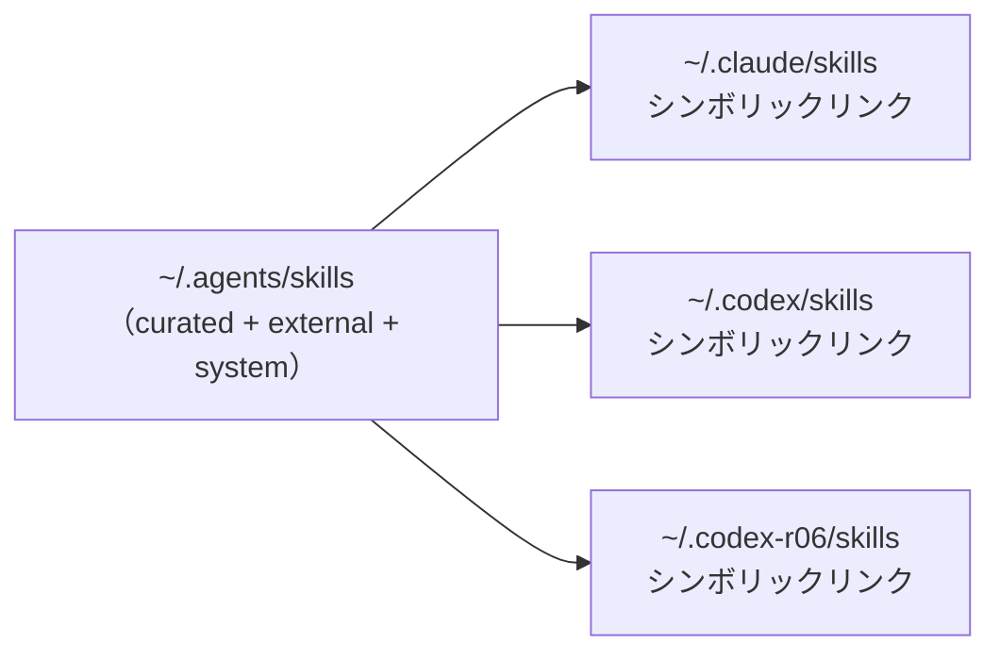

# Codex CLI ハーネス

🌐 English (canonical): [codex.md](codex.md)

← [ドキュメント目次](../README.ja.md)

このドキュメントは、本 dotfiles リポジトリがデプロイする OpenAI Codex CLI ハーネスの設定を説明します。ハーネスは 2 つの分離された `CODEX_HOME` アカウント（`~/.codex` と `~/.codex-r06`）をプロビジョニングし、chezmoi テンプレートでフックと shared プロファイル設定の同期を保ち、エイリアスと PATH シムで SSOT プロファイルを適用し、Claude Code と共有するクロスハーネスゲートガードで破壊的 Bash コマンドをゲーティングします。

---

## 目次

- [デプロイ先パス](#デプロイ先パス)
- [2 アカウントモデル](#2-アカウントモデル)
- [hooks.json — PreToolUse ゲートガード](#hooksjson--pretooluse-ゲートガード)
- [shared.config.toml — shared プロファイル](#sharedconfigtoml--shared-プロファイル)
- [agent.config.toml — agent プロファイル](#agentconfigtoml--agent-プロファイル)
- [管理外のベース設定](#管理外のベース設定)
- [プロジェクト trust と project-local .codex/](#プロジェクト-trust-と-project-local-codex)
- [codex-rescue は orchestration の入口ではない](#codex-rescue-は-orchestration-の入口ではない)
- [テンプレート SSOT — アカウントドリフト防止](#テンプレート-ssot--アカウントドリフト防止)
- [--profile shared の仕組み](#--profile-shared-の仕組み)
  - [cdx / cdx-r06 エイリアス](#cdx--cdx-r06-エイリアス)
  - [素の codex は SSOT 設定をスキップする](#素の-codex-は-ssot-設定をスキップする)
- [ゲートガード](#ゲートガード)
- [共有ルールとスキルレイヤー](#共有ルールとスキルレイヤー)
- [関連ドキュメント](#関連ドキュメント)

---

## デプロイ先パス

各 `CODEX_HOME` は同一のファイルセットを受け取ります。どちらも同じ chezmoi テンプレートからレンダリングされます。

| ソースパス | デプロイ先（個人） | デプロイ先（ワーク） |
|---|---|---|
| `home/dot_codex/hooks.json.tmpl` | `~/.codex/hooks.json` | `~/.codex-r06/hooks.json` |
| `home/dot_codex/private_shared.config.toml.tmpl` | `~/.codex/shared.config.toml` (0600) | `~/.codex-r06/shared.config.toml` (0600) |
| `home/dot_codex/symlink_AGENTS.md.tmpl` | `~/.codex/AGENTS.md -> ~/AGENTS.md` | `~/.codex-r06/AGENTS.md -> ~/AGENTS.md` |
| `home/dot_codex/symlink_skills.tmpl` | `~/.codex/skills -> ~/.agents/skills` | `~/.codex-r06/skills -> ~/.agents/skills` |

加えて `home/dot_codex/private_agent.config.toml.tmpl` → `~/.codex/agent.config.toml`（0600）があり、これはスキルが使う非対話 workspace-write プロファイルです（後述の `agent` プロファイルの注記を参照）。`home/dot_codex-r06/` には同じファイル群が含まれています；テンプレート本体は同じ `home/.chezmoitemplates/` ソースを指す同一の 1 行です。

---

## 2 アカウントモデル

個人アカウントは Codex のデフォルト `CODEX_HOME=~/.codex` をそのまま使用し、ワークアカウントは `cdx-r06` エイリアスが明示的に設定する `CODEX_HOME=~/.codex-r06` を使用します。`cdx`/`cdx-r06` zsh エイリアスはアクティブアカウントを選択します：

```
cdx      → codex --profile shared "$@"                              (個人 — CODEX_HOME 未設定、Codex は ~/.codex をデフォルト使用)
cdx-r06  → CODEX_HOME=~/.codex-r06 codex --profile shared "$@"    (ワーク / r06)
```

両方のホームは共有テンプレートからレンダリングされた `hooks.json` と `shared.config.toml` のコピーをそれぞれ受け取るため、各アカウントは同一のフックと設定ロジックを実行しながら、認証トークンと会話状態を別々のディレクトリに分離します。

---

## hooks.json — PreToolUse ゲートガード

`home/.chezmoitemplates/codex-hooks.json` が実際のフック本体で、`dot_codex/hooks.json.tmpl` と `dot_codex-r06/hooks.json.tmpl` の両方から `{{ includeTemplate "codex-hooks.json" . }}` でインクルードされます。

レンダリングされた `hooks.json` は 1 つのフックを登録します：

```json
{
  "hooks": {
    "PreToolUse": [
      {
        "matcher": "^Bash$",
        "hooks": [
          {
            "type": "command",
            "command": "node \"<homeDir>/.config/gateguard/codex-bash-gate.js\"",
            "statusMessage": "Checking Bash command against cross-harness gateguard",
            "timeout": 10
          }
        ]
      }
    ]
  }
}
```

ホームディレクトリは apply 時に `{{ .chezmoi.homeDir }}` から補間されます。ゲートガードスクリプトについては以下の[ゲートガード](#ゲートガード)セクションを参照してください。

---

## shared.config.toml — shared プロファイル

`home/.chezmoitemplates/codex-shared-config.toml` が実際の設定本体で、`dot_codex/private_shared.config.toml.tmpl` と `dot_codex-r06/private_shared.config.toml.tmpl` の両方からインクルードされます。

model／effort のスカラーは共有フラグメント `home/.chezmoitemplates/codex-model-pin.toml`（single source of truth）にあり、`shared` と `agent` の両プロファイルからインクルードされます。レンダリングされた `shared.config.toml` の内容（model 値は pin に追従。`codex-model-pin.toml` を参照）：

```toml
personality = "pragmatic"
model = "gpt-5.6-terra"
model_reasoning_effort = "xhigh"

[features]
multi_agent = true
```

このファイルは `$CODEX_HOME/shared.config.toml` としてデプロイされます（mode 0600、chezmoi の `private_` プレフィックスによる）。`--profile shared` でロードされる named `shared` プロファイルです。

---

## agent.config.toml — agent プロファイル

`shared` は sandbox / approval のキーを持たないため、呼び出し側が渡した姿勢をそのまま継承します。実質的に read-only のレビュー用プロファイルです。ワークスペースへの**書き込み**を伴う委任には、代わりに 2 つ目のプロファイル `agent` を使います。実体は `home/.chezmoitemplates/codex-agent-config.toml` で、`shared` と同じ 1 行テンプレート対を通じて `$CODEX_HOME/agent.config.toml`（0600）にデプロイされます。

```toml
personality = "pragmatic"          # codex-model-pin.toml 由来（shared プロファイルと共有）
model = "gpt-5.6-terra"
model_reasoning_effort = "xhigh"

sandbox_mode = "workspace-write"
approval_policy = "never"
web_search = "cached"

[features]
multi_agent = true

[sandbox_workspace_write]
network_access = false
```

2 つのプロファイルは model/effort フラグメントを共有するため、pin の変更は両方に同時に効きます。異なるのは permission 姿勢です。`agent` は非対話の姿勢（`approval_policy = "never"`）と、作業が成立する範囲で最も狭い書き込みスコープを組み合わせ、network を持ちません。

`workspace-write` の内側でも `<writable_root>/.git` / `.agents` / `.codex` は再帰的に read-only のままです。これは意図した設計で、Codex は commit / push / skill 定義の変更ができず、それらは親が担って gitleaks hook と commit signing を通り続けます。**linked worktree で実機確認済み**（`.git` がディレクトリではなく gitdir ポインタの*ファイル*になる、挙動が変わりうるケース）: `.git/probe-marker` / `.agents/probe-marker` / `.codex/probe-marker` への書き込みはいずれも BLOCKED となり、同じディレクトリ内の通常パスへの書き込みは成功しました。

このプロファイルを*どう呼び出すか*の SSOT は `home/dot_agents/skills/codex/SKILL.md` です（`CODEX_HOME` prelude、fail-closed の worktree ガード、親の実行順序契約（commit の前ではなく**ホストコマンドを走らせる前**に diff をレビューする）、委任範囲の制約）。呼び出し側は再掲せずそれを参照します。

---

## 管理外のベース設定

`$CODEX_HOME/config.toml` は chezmoi の**管理下にありません**。model 移行通知・TUI の状態・プロジェクト trust エントリなどを Codex 自身が書き込むため、このリポジトリは CLI と所有権を争わず意図的に放置しています。

知っておくべき帰結: このファイルは独自の `model` キーを持ち、そして drift します。執筆時点で `~/.codex/config.toml` は `model = "gpt-5.5"` を保持する一方、管理下の pin は `gpt-5.6-terra` です。プロファイルはベース設定の*上に*重なるため、両者は同時に成立します。

| 呼び出し | 実効 model |
|---|---|
| `cdx` / `cdx-r06` / `--profile shared\|agent` を伴う全経路 | 管理下の pin |
| プロファイル無しの素の `codex` | ベース設定の値（現在は `gpt-5.5`） |

つまり pin はこのリポジトリが制御する全経路で有効であり、drift はプロファイルを迂回する呼び出しからのみ表面化します。これは [素の codex は SSOT 設定をスキップする](#素の-codex-は-ssot-設定をスキップする) と同じ失敗モードで、エイリアスが存在する理由がもう 1 つ増えたことになります。

---

## プロジェクト trust と project-local .codex/

Codex は各プロジェクトを trusted / untrusted に分類し、管理外ベース設定の `[projects."<path>"] trust_level = "trusted"` に記録します。untrusted なプロジェクトは project-local の `.codex/` レイヤーをスキップするため、trust はセキュリティ上の意味を持ちます。**リポジトリの内側に置かれた設定**が実行に影響できるかどうかの境界だからです。

当初の意図は、このリポジトリを恒久的に untrusted に保ち、敵対的な `.codex/config.toml` を積んだブランチが効力を持たないようにすることでした。**実測の結果、`agent` プロファイルを使う限りこの目標は達成不能であることが判明しました。** 直接検証した 3 つの発見:

1. **`agent` プロファイルが trust を書き戻す。** `codex exec --profile agent` を 1 回実行するだけで、`$CODEX_HOME/config.toml` に当該プロジェクトの `trust_level = "trusted"` が追加されます。エントリを削除しても次の実行までしか保ちません。`--profile shared --sandbox read-only` では**発生しない**ため、レビュー専用の leg は trust に触れません。`-c approval_policy=never` の override はトリガーではなく、プロファイル単体で十分です。
2. **trust は `--cd` ではなく main worktree に解決される。** `--cd <linked worktree>` で実行したところ、追加されたのは*main* worktree のパス（`git rev-parse --git-common-dir` の親）でした。使い捨てブランチの worktree で作業しても、**リポジトリ全体**（他の全 worktree を含む）が trusted になります。
3. **trusted なプロジェクトの project-local `.codex/config.toml` は管理下プロファイルを上書きする。** `.codex/config.toml` を仕込んだ状態で、`model` の上書き（`gpt-5.6-terra` → `gpt-5.5`）と `sandbox_mode` の上書き（`workspace-write` → `read-only`）が成立しました。同じテストで `approval_policy` は上書き**できず**、プロファイル側の値が勝ちました。

`sandbox_mode` の上書きは**安全な方向（sandbox を狭める側）でのみ**検証しています。昇格方向が possible かは意図的に未検証です。上書き機構が `sandbox_mode` に届くこと自体が発見であり、仕込んだ config に実際の昇格を許すテストは走らせる価値がありません。昇格は「否定された」のではなく「未証明だが蓋然性はある」として扱ってください。

**実務上の意味。** 「never trusted」はここでは不変条件になりえないため、不変条件として主張しません。実際に成立している防御は、trust に依存しないものです。

- fail-closed の worktree ガード（main worktree への書き込みを構造的に防ぐ）
- sandbox 内で `.git` / `.agents` / `.codex` が read-only のままであること（上記で検証済み）
- 親がホストコマンドを走らせる前に diff 全体をレビューすること
- **委譲前に想定外の `.codex/` ディレクトリが無いか確認すること** —— このリポジトリは `.codex/` を一切同梱しないため、作業ツリーに存在すればブランチが持ち込んだことを意味し、それは委譲ではなく停止のシグナルです

このリポジトリは trust エントリを追加しませんし、手動で追加すべきでもありません。現れるエントリは CLI 自身の記録です。

---

## codex-rescue は orchestration の入口ではない

`codex@openai-codex` プラグインは `codex-rescue` エージェントを同梱しています。skill はこれを起動しません。`pr-workflow` / `sdd` / `multi-review` からの Codex 呼び出しは、すべて Bash 経由の `codex exec --profile shared|agent` を通ります。理由は codex skill の「禁止事項」に 1 箇所だけ記録されています。

- `--profile` を通さないため、管理下の model/effort pin と permission 姿勢が適用されない
- `CODEX_HOME` を伝播しないため、業務アカウントのセッションが個人アカウントに対して動く —— このハーネスが維持しようとしているアカウント分離そのものが破れる
- 既定が write + `approval_policy: never` で、上記の sandbox 契約の外に出る

ad-hoc な手動 rescue には引き続き利用できます。それは十分な文脈のもとで user が下す判断であり、自動化された判断ではありません。

---

## テンプレート SSOT — アカウントドリフト防止

`dot_codex/` と `dot_codex-r06/` にはそれぞれ薄い 1 行テンプレートファイルが含まれています：

```
# dot_codex/hooks.json.tmpl (および dot_codex-r06/hooks.json.tmpl)
{{ includeTemplate "codex-hooks.json" . }}

# dot_codex/private_shared.config.toml.tmpl (および dot_codex-r06/private_shared.config.toml.tmpl)
{{ includeTemplate "codex-shared-config.toml" . }}
```

実際の本体は `home/.chezmoitemplates/` にのみ存在します。両方のアカウントディレクトリが同じテンプレートを参照するため、ドリフトは構造的に不可能です — テンプレートを編集すると次の `chezmoi apply` で両アカウントがアトミックに更新されます。

実際の設定が `dot_codex/` と `dot_codex-r06/` に重複していた場合、一方のアカウントのフックまたはプロファイルへの変更が両方のファイルの更新を必要とし、ドリフトが避けられません。

---

## --profile shared の仕組み

`shared.config.toml` は named Codex CLI プロファイルです。Codex が `--profile shared` で呼び出された場合にのみ、Codex の動的に書き込まれる `config.toml` の上にレイヤーとして適用されます。このフラグなしでは SSOT 設定はサイレントに無視されます。

`--profile shared` を自動的に注入するメカニズムは 1 つだけです：

### cdx / cdx-r06 エイリアス

`cdx` と `cdx-r06` zsh エイリアス（`home/dot_config/zsh/codex.zsh` で定義）は標準のユーザー向けエントリポイントです。どちらも `--profile shared` を注入しますが、`CODEX_HOME` を設定するのは `cdx-r06` のみです。`cdx` は `CODEX_HOME` を未設定のままにし、Codex はデフォルトの `~/.codex` を使用します：

```zsh
# 実際の形（codex.zsh より）
cdx      → codex --profile shared "$@"                              # CODEX_HOME 未設定 → Codex は ~/.codex をデフォルト使用
cdx-r06  → CODEX_HOME=$HOME/.codex-r06 codex --profile shared "$@"
```

### 素の codex は SSOT 設定をスキップする

エイリアスなしの直接 `codex` 呼び出しは `shared.config.toml` を**ロードしません**。`--profile shared` フラグが適用する唯一のメカニズムです。これは意図的なもの（Codex ではプロファイルはオプトイン）ですが、`codex` を直接呼び出すスクリプト、CI、またはエディタ統合では気づきにくい落とし穴です。

---

## ゲートガード

`home/dot_config/gateguard/executable_codex-bash-gate.js`（`~/.config/gateguard/codex-bash-gate.js` にデプロイ、mode 0755）は `^Bash$` マッチャーの Codex `PreToolUse` フックとして登録された Node.js スクリプトです。

### 動作内容

stdin からツール呼び出し JSON を読み取り、Bash コマンドを検査し、破壊的パターンに一致する場合は実行を拒否します。拒否には Codex のドキュメント記載の wire スキーマを使用します：

```json
{
  "hookSpecificOutput": {
    "permissionDecision": "deny",
    "permissionDecisionReason": "<説明>"
  }
}
```

それ以外の結果はデシジョンを未設定のままにし、Codex は通常のサンドボックスと承認フローにフォールバックします。

### クロスハーネス SSOT

ゲートガードは破壊的コマンドの独自リストを持ちません。代わりに、ランタイムで `~/.claude/settings.json` から `GATEGUARD_BASH_EXTRA_DESTRUCTIVE` を読み取ります：

```
Claude settings.json  ──────────────────────────────┐
  env.GATEGUARD_BASH_EXTRA_DESTRUCTIVE (正規表現)    │  SSOT
                                                     │
ECC ゲートガードフック (Claude PreToolUse)  ◄────────┤
codex-bash-gate.js   (Codex PreToolUse)   ◄────────┘
```

スクリプトはまず `~/.claude/settings.json` を読み取り、次に `~/.claude-r06/settings.json` をフォールバックとして読み取り、値を大文字小文字を区別しない `RegExp` としてコンパイルします。ファイルが読み取れないか正規表現が無効な場合、ゲートはフェイルオープン（組み込みパターンのみ、クラッシュなし）します。

組み込みパターンセットはオペレーター設定に依存しない一般的な破壊的操作をカバーします：

- `rm -rf`（再帰的強制削除）
- `DROP TABLE`、`DELETE FROM`、`TRUNCATE`（破壊的 SQL、`psql -c "..."` 内でも検出）
- `settings.json` からの完全な `GATEGUARD_BASH_EXTRA_DESTRUCTIVE` セット（読み取り可能な場合）

### 回避防止ハードニング

スクリプトはパターンマッチング前に先頭のラッパーコマンドを除去し、LLM が用いる一般的な回避ベクターを処理します：

- 先頭ラッパー：`env`、`command`、`exec`、`nohup`、`sudo`、`time`、`builtin`、`setsid`、`stdbuf`、`nice`、`ionice`
- シェルディスパッチ：`sh -c "..."`、`bash -c "..."`、`zsh -c "..."` (`-c` 本体を検査)
- ダブルクォート内のコマンド置換
- サブシェル `(...)`、ブレース `{...}`、プロセス置換グループ

既知のベストエフォート上限（Codex のサンドボックスと承認フローに委任）：ランタイムでデコードされる base64/hex エンコードペイロード；深くネストされたラッパーオプション解析（例：`sudo -u user … cmd`）。

### 補完的、一次的ではない

Codex ゲートはベストエフォートの補完的レイヤーです。Codex には独自のサンドボックスと操作ごとの承認フローがあり、それが一次的な安全機構です。ゲートは一般的なケースを強化し、破壊的コマンドセットを Claude Code と Codex 間で一貫させます。

---

## 共有ルールとスキルレイヤー

両方の Codex アカウントは、シンボリックリンクを通じて Claude Code ハーネスと同じルールとスキルの入力を受け取ります：

### AGENTS.md

`home/dot_codex/symlink_AGENTS.md.tmpl` は `~/AGENTS.md` へのシンボリックリンクにレンダリングされます。これは `home/AGENTS.md.tmpl` からデプロイされるハーネス非依存の運用ルールファイルで、スキルプロベナンスポリシー、コーディング標準（`includeTemplate "coding-standards.md"` 経由）、および運用規約をカバーします。Codex は `CODEX_HOME` ディレクトリから自動的に読み取ります。

`~/.codex/AGENTS.md` と `~/.codex-r06/AGENTS.md` の両方が同じ `~/AGENTS.md` を指すため、`AGENTS.md.tmpl` への更新は両アカウントと両ハーネスに同時に反映されます。

### スキル

`home/dot_codex/symlink_skills.tmpl` は `~/.agents/skills` へのシンボリックリンクにレンダリングされます。これは共有スキルツリーで、`home/dot_claude/symlink_skills.tmpl` がシンボリックリンクするのと同じディレクトリです。両ハーネスはこのパスから curated、external、system スキルの 1 つのインベントリを共有します。Evolved スキルは `$CLV2_HOMUNCULUS_DIR/evolved/skills/` 配下に別途管理されており（CLV2 専用）、共有 discovery ツリーには含まれません。


```mermaid
graph LR
    A["~/.agents/skills\n（curated + external + system）"] --> B[~/.claude/skills\nシンボリックリンク]
    A --> C[~/.codex/skills\nシンボリックリンク]
    A --> D[~/.codex-r06/skills\nシンボリックリンク]
```

プロベナンス分類（curated / external / system / evolved / unmanaged）とスキルの追加方法については、[スキルプロベナンス](skills-provenance.ja.md) を参照してください。

---

## 関連ドキュメント

- [Claude Code ハーネス](claude-code.ja.md) — Claude Code の対応ドキュメント
- [アカウント分離](account-isolation.ja.md) — アカウントごとの env 分離の仕組み
- [スキルプロベナンス](skills-provenance.ja.md) — スキル分類と external フェッチ
- [アーキテクチャ概要](../architecture/overview.ja.md) — リポジトリ全体の構造
- [開発ツール構成](../architecture/dev-tooling.ja.md) — ゲートガードソース
