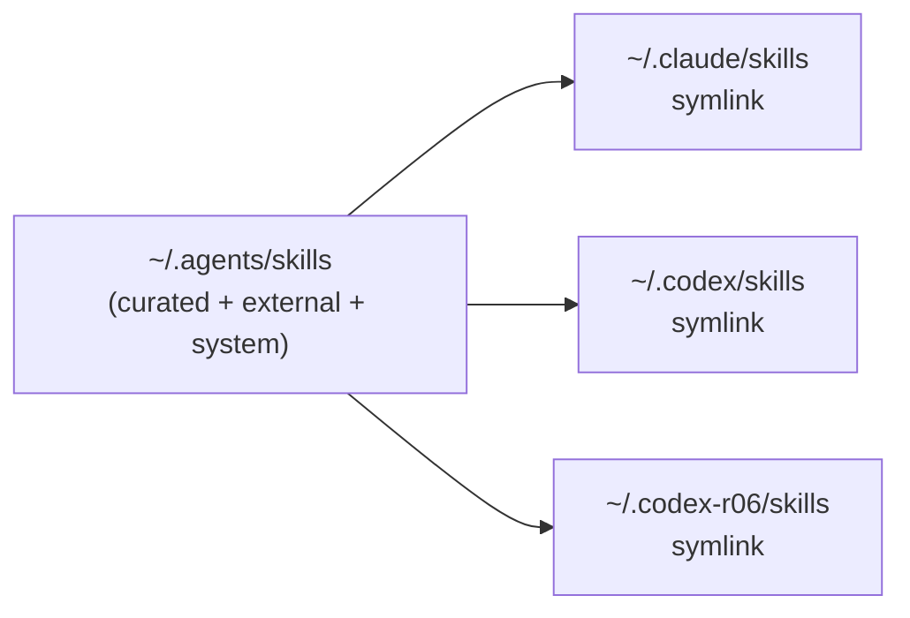

# Codex CLI Harness

🌐 日本語: [codex.ja.md](codex.ja.md)

← [Docs index](../README.md)

This document covers the OpenAI Codex CLI harness configuration deployed by this dotfiles repo. The harness provisions two isolated `CODEX_HOME` accounts (`~/.codex` and `~/.codex-r06`), keeps their hooks and shared profile config in sync via chezmoi templates, applies a shared SSOT profile through aliases and a PATH shim, and gates destructive Bash commands through a cross-harness gateguard shared with Claude Code.

---

## Table of contents

- [Deployed paths](#deployed-paths)
- [Two-account model](#two-account-model)
- [hooks.json — PreToolUse gateguard](#hooksjson--pretooluse-gateguard)
- [shared.config.toml — the shared profile](#sharedconfigtoml--the-shared-profile)
- [Template SSOT — preventing account drift](#template-ssot--preventing-account-drift)
- [--profile shared mechanism](#--profile-shared-mechanism)
  - [cdx / cdx-r06 aliases](#cdx--cdx-r06-aliases)
  - [dmux PATH shim](#dmux-path-shim)
  - [Bare codex skips the SSOT config](#bare-codex-skips-the-ssot-config)
- [Gateguard](#gateguard)
- [Shared rule and skill layers](#shared-rule-and-skill-layers)
- [See also](#see-also)

---

## Deployed paths

Each `CODEX_HOME` receives an identical file set. Both are rendered from the same chezmoi templates.

| Source path | Deploys to (personal) | Deploys to (work) |
|---|---|---|
| `home/dot_codex/hooks.json.tmpl` | `~/.codex/hooks.json` | `~/.codex-r06/hooks.json` |
| `home/dot_codex/private_shared.config.toml.tmpl` | `~/.codex/shared.config.toml` (0600) | `~/.codex-r06/shared.config.toml` (0600) |
| `home/dot_codex/symlink_AGENTS.md.tmpl` | `~/.codex/AGENTS.md -> ~/AGENTS.md` | `~/.codex-r06/AGENTS.md -> ~/AGENTS.md` |
| `home/dot_codex/symlink_skills.tmpl` | `~/.codex/skills -> ~/.agents/skills` | `~/.codex-r06/skills -> ~/.agents/skills` |

`home/dot_codex-r06/` contains the same four files; their template bodies are identical one-liners pointing to the same `home/.chezmoitemplates/` sources.

---

## Two-account model

The personal account uses the default `CODEX_HOME=~/.codex` (Codex's built-in default); the work account uses `CODEX_HOME=~/.codex-r06`, set explicitly by the `cdx-r06` alias. The `cdx`/`cdx-r06` zsh aliases select the active account:

```
cdx      → codex --profile shared "$@"            (personal — CODEX_HOME unset, Codex defaults to ~/.codex)
cdx-r06  → CODEX_HOME=~/.codex-r06 codex --profile shared "$@"   (work / r06)
```

Because both homes receive their own copy of `hooks.json` and `shared.config.toml` — rendered from shared templates — each account runs the identical hook and config logic while keeping auth tokens and conversation state isolated in separate directories.

---

## hooks.json — PreToolUse gateguard

`home/.chezmoitemplates/codex-hooks.json` is the actual hook body, included by both `dot_codex/hooks.json.tmpl` and `dot_codex-r06/hooks.json.tmpl` via `{{ includeTemplate "codex-hooks.json" . }}`.

The rendered `hooks.json` registers one hook:

```json
{
  "hooks": {
    "PreToolUse": [
      {
        "matcher": "^Bash$",
        "hooks": [
          {
            "type": "command",
            "command": "node \"<homeDir>/.config/gateguard/codex-bash-gate.js\"",
            "statusMessage": "Checking Bash command against cross-harness gateguard",
            "timeout": 10
          }
        ]
      }
    ]
  }
}
```

The home directory is interpolated from `{{ .chezmoi.homeDir }}` at apply time. The gateguard script is covered in the [Gateguard](#gateguard) section below.

---

## shared.config.toml — the shared profile

`home/.chezmoitemplates/codex-shared-config.toml` is the actual config body, included by both `dot_codex/private_shared.config.toml.tmpl` and `dot_codex-r06/private_shared.config.toml.tmpl`.

The rendered `shared.config.toml` contains:

```toml
personality = "pragmatic"
model = "gpt-5.5"
model_reasoning_effort = "xhigh"

[features]
multi_agent = true
```

This file is deployed as `$CODEX_HOME/shared.config.toml` (mode 0600, via chezmoi's `private_` prefix). It is the named `shared` profile loaded by `--profile shared`.

---

## Template SSOT — preventing account drift

`dot_codex/` and `dot_codex-r06/` each contain thin one-liner template files:

```
# dot_codex/hooks.json.tmpl (and dot_codex-r06/hooks.json.tmpl)
{{ includeTemplate "codex-hooks.json" . }}

# dot_codex/private_shared.config.toml.tmpl (and dot_codex-r06/private_shared.config.toml.tmpl)
{{ includeTemplate "codex-shared-config.toml" . }}
```

The real bodies live exclusively in `home/.chezmoitemplates/`. Because both account directories reference the same template, they cannot diverge — editing the template changes both accounts atomically on the next `chezmoi apply`.

If the actual config were duplicated in `dot_codex/` and `dot_codex-r06/`, a change to one account's hooks or profile would require updating both files, making drift an inevitability.

---

## --profile shared mechanism

`shared.config.toml` is a named Codex CLI profile. It is layered on top of Codex's dynamically-written `config.toml` only when Codex is invoked with `--profile shared`. Without that flag, the SSOT config is silently ignored.

There are two mechanisms that inject `--profile shared` automatically:

### cdx / cdx-r06 aliases

The `cdx` and `cdx-r06` zsh aliases (defined in `home/dot_config/zsh/codex.zsh`) are the standard user-facing entry points. Both inject `--profile shared`. Only `cdx-r06` also sets `CODEX_HOME`; `cdx` leaves `CODEX_HOME` unset so Codex uses its default `~/.codex`:

```zsh
# Actual shape (from codex.zsh)
cdx      → codex --profile shared "$@"                            # CODEX_HOME unset → Codex defaults to ~/.codex
cdx-r06  → CODEX_HOME=$HOME/.codex-r06 codex --profile shared "$@"
```

Variants `hcdx` and `hcdx-r06` exist for phone-control contexts (via the happy wrapper).
Note that `happy codex` runs Codex **headless** via `codex app-server`: the local terminal
is a read-only viewer ("Codex Agent Messages / Waiting for messages…") with no interactive
prompt, so the session is driven from the Happy mobile/web app. For a local interactive
Codex terminal, use `cdx` / `cdx-r06` instead. (This is asymmetric with `happy claude`,
which spawns a full local TUI.)

### dmux PATH shim

dmux spawns Codex panes with a bare `codex` invocation and cannot pass `--profile shared` itself. To handle this, `home/dot_config/dmux/bin/executable_codex` (a POSIX sh script, mode 0755) is installed as a PATH shim:

1. The zsh dmux wrappers prepend `~/.config/dmux/bin` to `PATH`.
2. dmux's own PATH sanitizer strips only `node_modules/.bin`, so the shim directory survives into Codex panes.
3. When bare `codex` is executed in a dmux pane, the shim intercepts it.
4. The shim walks `PATH` skipping its own directory, finds the real `codex` binary, and re-invokes it with `--profile shared` injected — making recursion structurally impossible.

Without this shim, dmux panes would silently run without the SSOT `shared.config.toml`.

#### Opt-in happy-claude shim (`DMUX_HAPPY`)

The same shim directory also ships `executable_claude`, an **opt-in** companion for running
Claude panes through the happy wrapper (phone control). By default it is a transparent
passthrough — it execs the first real `claude` on `PATH`, so default dmux behavior is
unchanged. Running `DMUX_HAPPY=1 dmux` flips it to `happy claude`; it `unset`s `DMUX_HAPPY`
before exec so the nested `claude` happy spawns passes through (recursion is structurally
impossible, same as the codex shim).

Codex is deliberately **not** wrapped this way: `happy codex` runs Codex headless via
`codex app-server` and the local terminal is a read-only viewer with no input (see the
`cdx / cdx-r06 aliases` section above), so it cannot drive an interactive dmux pane. Use
`hcdx` standalone for phone-controlled Codex, and keep `cdx` / `cdx-r06` inside dmux.

### Bare codex skips the SSOT config

A direct `codex` invocation — without the aliases or the dmux shim in `PATH` — does **not** load `shared.config.toml`. The `--profile shared` flag is the only mechanism that applies it. This is intentional (profiles are opt-in in Codex), but easy to trip over in scripts, CI, or editor integrations that invoke `codex` directly.

---

## Gateguard

`home/dot_config/gateguard/executable_codex-bash-gate.js` (deploys to `~/.config/gateguard/codex-bash-gate.js`, mode 0755) is a Node.js script registered as the Codex `PreToolUse` hook for `^Bash$` matcher.

### What it does

It reads the tool-call JSON from stdin, inspects the Bash command, and denies execution when the command matches a destructive pattern. Denial uses Codex's documented wire schema:

```json
{
  "hookSpecificOutput": {
    "permissionDecision": "deny",
    "permissionDecisionReason": "<explanation>"
  }
}
```

Any other outcome leaves the decision unset, so Codex falls back to its normal sandbox and approval flow.

### Cross-harness SSOT

The gateguard does not maintain its own list of destructive commands. Instead, it reads `GATEGUARD_BASH_EXTRA_DESTRUCTIVE` from `~/.claude/settings.json` at runtime:

```
Claude settings.json  ──────────────────────────────┐
  env.GATEGUARD_BASH_EXTRA_DESTRUCTIVE (regex)       │  SSOT
                                                     │
ECC gateguard hook (Claude PreToolUse)  ◄────────────┤
codex-bash-gate.js   (Codex PreToolUse) ◄────────────┘
```

The script reads `~/.claude/settings.json` first, then `~/.claude-r06/settings.json` as a fallback, and compiles the value as a case-insensitive `RegExp`. If the file is unreadable or the regex is invalid, the gate fails open (built-in patterns only, no crash).

The built-in pattern set covers common destructive operations independent of any operator configuration:

- `rm -rf` (recursive force removal)
- `DROP TABLE`, `DELETE FROM`, `TRUNCATE` (destructive SQL, even inside `psql -c "..."`)
- The full `GATEGUARD_BASH_EXTRA_DESTRUCTIVE` set from `settings.json` (when readable)

### Evasion hardening

The script strips leading wrapper commands before pattern matching, handling common LLM evasion vectors:

- Leading wrappers: `env`, `command`, `exec`, `nohup`, `sudo`, `time`, `builtin`, `setsid`, `stdbuf`, `nice`, `ionice`
- Shell dispatch: `sh -c "..."`, `bash -c "..."`, `zsh -c "..."` (inspects the `-c` body)
- Command substitution inside double-quoted strings
- Subshell `(...)`, brace `{...}`, and process-substitution groups

Known best-effort limits (deferred to Codex's sandbox and approval flow): base64/hex-encoded payloads decoded at runtime; deeply nested wrapper option parsing (e.g. `sudo -u user … cmd`).

### Complementary, not primary

The Codex gate is a best-effort complementary layer. Codex also has its own sandbox and per-operation approval flow, which remain the primary safety mechanism. The gate hardens the common cases and makes the destructive command set consistent between Claude Code and Codex.

---

## Shared rule and skill layers

Both Codex accounts receive the same rule and skill inputs as the Claude Code harness, via symlinks:

### AGENTS.md

`home/dot_codex/symlink_AGENTS.md.tmpl` renders to a symlink target of `~/AGENTS.md`. This is the harness-independent operational rules file deployed from `home/AGENTS.md.tmpl` — covering skill provenance policy, coding standards (via `includeTemplate "coding-standards.md"`), and operational conventions. Codex reads it automatically from the `CODEX_HOME` directory.

Both `~/.codex/AGENTS.md` and `~/.codex-r06/AGENTS.md` point to the same `~/AGENTS.md`, so any update to `AGENTS.md.tmpl` takes effect for both accounts and both harnesses simultaneously.

### Skills

`home/dot_codex/symlink_skills.tmpl` renders to a symlink target of `~/.agents/skills`. This is the shared skill tree — the same directory symlinked by `home/dot_claude/symlink_skills.tmpl`. Both harnesses consume one inventory of curated, external, and system skills from this path. Evolved skills live separately under `$CLV2_HOMUNCULUS_DIR/evolved/skills/` (CLV2-only; not part of the shared discovery tree).



For the provenance taxonomy (curated / external / system / evolved / unmanaged) and how skills are added, see [Skills provenance](skills-provenance.md).

---

## See also

- [Claude Code harness](claude-code.md) — the Claude Code counterpart
- [Account isolation](account-isolation.md) — how per-account env isolation works
- [Skills provenance](skills-provenance.md) — skill taxonomy and external fetching
- [Architecture overview](../architecture/overview.md) — repo-wide structure
- [Dev tooling](../architecture/dev-tooling.md) — gateguard source and the dmux PATH shim
