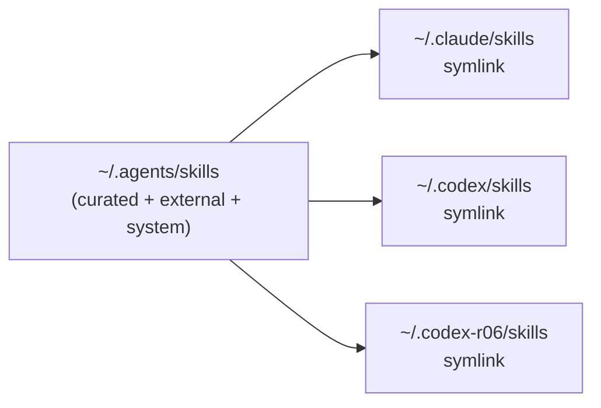

# Codex CLI Harness

🌐 日本語: [codex.ja.md](codex.ja.md)

← [Docs index](../README.md)

This document covers the OpenAI Codex CLI harness configuration deployed by this dotfiles repo. The harness provisions two isolated `CODEX_HOME` accounts (`~/.codex` and `~/.codex-r06`), keeps their hooks and shared profile config in sync via chezmoi templates, applies a shared SSOT profile through aliases and a PATH shim, and gates destructive Bash commands through a cross-harness gateguard shared with Claude Code.

---

## Table of contents

- [Deployed paths](#deployed-paths)
- [Two-account model](#two-account-model)
- [hooks.json — PreToolUse gateguard](#hooksjson--pretooluse-gateguard)
- [shared.config.toml — the shared profile](#sharedconfigtoml--the-shared-profile)
- [agent.config.toml — the agent profile](#agentconfigtoml--the-agent-profile)
- [The unmanaged base config](#the-unmanaged-base-config)
- [Project trust and project-local .codex/](#project-trust-and-project-local-codex)
- [codex-rescue is not an orchestration entry point](#codex-rescue-is-not-an-orchestration-entry-point)
- [Template SSOT — preventing account drift](#template-ssot--preventing-account-drift)
- [--profile shared mechanism](#--profile-shared-mechanism)
  - [cdx / cdx-r06 aliases](#cdx--cdx-r06-aliases)
  - [Bare codex skips the SSOT config](#bare-codex-skips-the-ssot-config)
- [Gateguard](#gateguard)
- [Shared rule and skill layers](#shared-rule-and-skill-layers)
- [See also](#see-also)

---

## Deployed paths

Each `CODEX_HOME` receives an identical file set. Both are rendered from the same chezmoi templates.

| Source path | Deploys to (personal) | Deploys to (work) |
|---|---|---|
| `home/dot_codex/hooks.json.tmpl` | `~/.codex/hooks.json` | `~/.codex-r06/hooks.json` |
| `home/dot_codex/private_shared.config.toml.tmpl` | `~/.codex/shared.config.toml` (0600) | `~/.codex-r06/shared.config.toml` (0600) |
| `home/dot_codex/symlink_AGENTS.md.tmpl` | `~/.codex/AGENTS.md -> ~/AGENTS.md` | `~/.codex-r06/AGENTS.md -> ~/AGENTS.md` |
| `home/dot_codex/symlink_skills.tmpl` | `~/.codex/skills -> ~/.agents/skills` | `~/.codex-r06/skills -> ~/.agents/skills` |

There is also `home/dot_codex/private_agent.config.toml.tmpl` → `~/.codex/agent.config.toml` (0600), the non-interactive workspace-write profile used by skills (see the `agent` profile note below). `home/dot_codex-r06/` contains the same files; their template bodies are identical one-liners pointing to the same `home/.chezmoitemplates/` sources.

---

## Two-account model

The personal account uses the default `CODEX_HOME=~/.codex` (Codex's built-in default); the work account uses `CODEX_HOME=~/.codex-r06`, set explicitly by the `cdx-r06` alias. The `cdx`/`cdx-r06` zsh aliases select the active account:

```
cdx      → codex --profile shared "$@"            (personal — CODEX_HOME unset, Codex defaults to ~/.codex)
cdx-r06  → CODEX_HOME=~/.codex-r06 codex --profile shared "$@"   (work / r06)
```

Because both homes receive their own copy of `hooks.json` and `shared.config.toml` — rendered from shared templates — each account runs the identical hook and config logic while keeping auth tokens and conversation state isolated in separate directories.

---

## hooks.json — PreToolUse gateguard

`home/.chezmoitemplates/codex-hooks.json` is the actual hook body, included by both `dot_codex/hooks.json.tmpl` and `dot_codex-r06/hooks.json.tmpl` via `{{ includeTemplate "codex-hooks.json" . }}`.

The rendered `hooks.json` registers one hook:

```json
{
  "hooks": {
    "PreToolUse": [
      {
        "matcher": "^Bash$",
        "hooks": [
          {
            "type": "command",
            "command": "node \"<homeDir>/.config/gateguard/codex-bash-gate.js\"",
            "statusMessage": "Checking Bash command against cross-harness gateguard",
            "timeout": 10
          }
        ]
      }
    ]
  }
}
```

The home directory is interpolated from `{{ .chezmoi.homeDir }}` at apply time. The gateguard script is covered in the [Gateguard](#gateguard) section below.

---

## shared.config.toml — the shared profile

`home/.chezmoitemplates/codex-shared-config.toml` is the actual config body, included by both `dot_codex/private_shared.config.toml.tmpl` and `dot_codex-r06/private_shared.config.toml.tmpl`.

The model/effort scalars live in a shared fragment `home/.chezmoitemplates/codex-model-pin.toml` (the single source of truth), included by both `shared` and the `agent` profile. The rendered `shared.config.toml` contains (model value tracks the pin; see `codex-model-pin.toml`):

```toml
personality = "pragmatic"
model = "gpt-5.6-terra"
model_reasoning_effort = "xhigh"

[features]
multi_agent = true
```

This file is deployed as `$CODEX_HOME/shared.config.toml` (mode 0600, via chezmoi's `private_` prefix). It is the named `shared` profile loaded by `--profile shared`.

---

## agent.config.toml — the agent profile

`shared` carries no sandbox or approval keys, so it inherits whatever the invocation supplies — which makes it a read-only review profile in practice. Delegations that need to **write** into a workspace use a second profile instead: `agent`, from `home/.chezmoitemplates/codex-agent-config.toml`, deployed to `$CODEX_HOME/agent.config.toml` (0600) by the same one-liner template pair as `shared`.

```toml
personality = "pragmatic"          # from codex-model-pin.toml (shared with the shared profile)
model = "gpt-5.6-terra"
model_reasoning_effort = "xhigh"

sandbox_mode = "workspace-write"
approval_policy = "never"
web_search = "cached"

[features]
multi_agent = true

[sandbox_workspace_write]
network_access = false
```

The two profiles share the model/effort fragment, so a pin change moves both at once. What differs is the permission posture: `agent` declares a non-interactive stance (`approval_policy = "never"`) paired with the narrowest write scope that still lets work happen, and no network.

Inside `workspace-write`, `<writable_root>/.git`, `.agents`, and `.codex` stay recursively read-only. That is deliberate: Codex cannot commit, push, or edit skill definitions, so the parent keeps those steps and they continue to pass through the gitleaks hook and commit signing. **Verified empirically in a linked worktree** (where `.git` is a gitdir pointer *file*, not a directory — the case that could plausibly behave differently): writes to `.git/probe-marker`, `.agents/probe-marker`, and `.codex/probe-marker` were all BLOCKED while a write to a normal path in the same directory succeeded.

`home/dot_agents/skills/codex/SKILL.md` is the SSOT for *how* to invoke this profile — the `CODEX_HOME` prelude, the fail-closed worktree guard, the parent's ordering contract (review the diff before running any host command, not merely before committing), and the delegation-scope limits. Callers reference it rather than restating it.

---

## The unmanaged base config

`$CODEX_HOME/config.toml` is **not** managed by chezmoi. Codex writes it itself — model-migration notices, TUI state, and project trust entries all land there — so this repo deliberately leaves it alone rather than fighting the CLI for ownership.

The consequence worth knowing: it carries its own `model` key, and it drifts. At the time of writing, `~/.codex/config.toml` holds `model = "gpt-5.5"` while the managed pin is <!-- FACT:codex-model-pin -->gpt-5.6-terra<!-- /FACT -->. Both are true at once because profiles layer *on top of* the base config:

| Invocation | Effective model |
|---|---|
| `cdx` / `cdx-r06` / any `--profile shared\|agent` | the managed pin |
| bare `codex` with no profile | whatever the base config says (currently `gpt-5.5`) |

So the pin holds for every path this repo controls, and the drift only surfaces through invocations that skip the profile. That is the same failure mode as [Bare codex skips the SSOT config](#bare-codex-skips-the-ssot-config) — one more reason the aliases exist.

---

## Project trust and project-local .codex/

Codex classifies each project as trusted or untrusted, recorded as `[projects."<path>"] trust_level = "trusted"` in the unmanaged base config. Untrusted projects skip project-local `.codex/` layers, which is what makes trust security-relevant: it is the boundary that decides whether config carried *inside a repository* gets to influence a run.

The original intent for this repo was to stay untrusted permanently, so that a branch carrying a hostile `.codex/config.toml` could never take effect. **Measurement showed that goal is not reachable while the `agent` profile is in use.** Three findings, each verified directly:

1. **The `agent` profile writes trust back.** A single `codex exec --profile agent` run adds `trust_level = "trusted"` for the project to `$CODEX_HOME/config.toml`. Deleting the entry only lasts until the next run. `--profile shared --sandbox read-only` does **not** do this, so review-only legs leave trust untouched. The `-c approval_policy=never` override is not the trigger — the profile alone is enough.
2. **Trust resolves to the main worktree, not to `--cd`.** Running with `--cd <linked worktree>` added the path of the *main* worktree (the parent of `git rev-parse --git-common-dir`). Working in a throwaway branch worktree therefore trusts the entire repository, every other worktree included.
3. **A trusted project's local `.codex/config.toml` overrides the managed profile.** With one planted **in the `--cd` directory** (the linked worktree), `model` was overridden (<!-- FACT:codex-model-pin -->gpt-5.6-terra<!-- /FACT --> → `gpt-5.5`) and `sandbox_mode` was overridden (`workspace-write` → `read-only`). `approval_policy` was *not* overridable in the same test — the profile's value won.
4. **Config resolves to `--cd`, unlike trust.** The same file planted in the *main* worktree, with `--cd` still pointing at the linked one, had no effect — the pin held. So the two resolve differently: trust to the main worktree (finding 2), project-local config to `--cd`. That asymmetry is why the pre-delegation check only needs to look at the `--cd` directory.

The `sandbox_mode` override was exercised only in the safe direction (narrowing the sandbox). Whether it also escalates was deliberately not tested: demonstrating that the override mechanism reaches `sandbox_mode` is the finding, and granting a planted config real escalation is not a test worth running. Treat escalation as unproven but plausible rather than as ruled out.

**What this means in practice.** "Never trusted" cannot be an invariant here, so it is not claimed as one. The defenses that do hold are the ones that do not depend on trust:

- the fail-closed worktree guard, which keeps writes out of the main worktree;
- `.git` / `.agents` / `.codex` staying read-only inside the sandbox (verified above);
- the parent reviewing the full diff before running any host command;
- **checking for an unexpected `.codex/` directory before delegating** — this repo ships none, so its presence in a working tree means a branch introduced it, and that is the signal to stop rather than delegate.

Nothing in this repository adds a trust entry, and none should be added by hand. The entries that appear are the CLI's own bookkeeping.

---

## codex-rescue is not an orchestration entry point

The `codex@openai-codex` plugin ships a `codex-rescue` agent. Skills never invoke it; every Codex call from `pr-workflow`, `sdd`, and `multi-review` goes through `codex exec --profile shared|agent` in Bash instead. Summarized here; the authoritative list lives in the codex skill's forbidden-actions section:

- it does not pass `--profile`, so the managed model/effort pin and permission posture do not apply;
- it does not propagate `CODEX_HOME`, so a work-account session would run against the personal account — the account isolation this harness exists to maintain;
- it defaults to write access with `approval_policy: never`, outside the sandbox contract above.

It remains available for ad-hoc manual rescue, which is a user decision made with full context, not an automated one.

---

## Template SSOT — preventing account drift

`dot_codex/` and `dot_codex-r06/` each contain thin one-liner template files:

```
# dot_codex/hooks.json.tmpl (and dot_codex-r06/hooks.json.tmpl)
{{ includeTemplate "codex-hooks.json" . }}

# dot_codex/private_shared.config.toml.tmpl (and dot_codex-r06/private_shared.config.toml.tmpl)
{{ includeTemplate "codex-shared-config.toml" . }}
```

The real bodies live exclusively in `home/.chezmoitemplates/`. Because both account directories reference the same template, they cannot diverge — editing the template changes both accounts atomically on the next `chezmoi apply`.

If the actual config were duplicated in `dot_codex/` and `dot_codex-r06/`, a change to one account's hooks or profile would require updating both files, making drift an inevitability.

---

## --profile shared mechanism

`shared.config.toml` is a named Codex CLI profile. It is layered on top of Codex's dynamically-written `config.toml` only when Codex is invoked with `--profile shared`. Without that flag, the SSOT config is silently ignored.

Only one mechanism injects `--profile shared` automatically:

### cdx / cdx-r06 aliases

The `cdx` and `cdx-r06` zsh aliases (defined in `home/dot_config/zsh/codex.zsh`) are the standard user-facing entry points. Both inject `--profile shared`. Only `cdx-r06` also sets `CODEX_HOME`; `cdx` leaves `CODEX_HOME` unset so Codex uses its default `~/.codex`:

```zsh
# Actual shape (from codex.zsh)
cdx      → codex --profile shared "$@"                            # CODEX_HOME unset → Codex defaults to ~/.codex
cdx-r06  → CODEX_HOME=$HOME/.codex-r06 codex --profile shared "$@"
```

### Bare codex skips the SSOT config

A direct `codex` invocation — without the aliases — does **not** load `shared.config.toml`. The `--profile shared` flag is the only mechanism that applies it. This is intentional (profiles are opt-in in Codex), but easy to trip over in scripts, CI, or editor integrations that invoke `codex` directly.

---

## Gateguard

`home/dot_config/gateguard/executable_codex-bash-gate.js` (deploys to `~/.config/gateguard/codex-bash-gate.js`, mode 0755) is a Node.js script registered as the Codex `PreToolUse` hook for `^Bash$` matcher.

### What it does

It reads the tool-call JSON from stdin, inspects the Bash command, and denies execution when the command matches a destructive pattern. Denial uses Codex's documented wire schema:

```json
{
  "hookSpecificOutput": {
    "permissionDecision": "deny",
    "permissionDecisionReason": "<explanation>"
  }
}
```

Any other outcome leaves the decision unset, so Codex falls back to its normal sandbox and approval flow.

### Cross-harness SSOT

The gateguard does not maintain its own list of destructive commands. Instead, it reads `GATEGUARD_BASH_EXTRA_DESTRUCTIVE` from `~/.claude/settings.json` at runtime:

```
Claude settings.json  ──────────────────────────────┐
  env.GATEGUARD_BASH_EXTRA_DESTRUCTIVE (regex)       │  SSOT
                                                     │
ECC gateguard hook (Claude PreToolUse)  ◄────────────┤
codex-bash-gate.js   (Codex PreToolUse) ◄────────────┘
```

The script reads `~/.claude/settings.json` first, then `~/.claude-r06/settings.json` as a fallback, and compiles the value as a case-insensitive `RegExp`. If the file is unreadable or the regex is invalid, the gate fails open (built-in patterns only, no crash).

The built-in pattern set covers common destructive operations independent of any operator configuration:

- `rm -rf` (recursive force removal)
- `DROP TABLE`, `DELETE FROM`, `TRUNCATE` (destructive SQL, even inside `psql -c "..."`)
- The full `GATEGUARD_BASH_EXTRA_DESTRUCTIVE` set from `settings.json` (when readable)

### Evasion hardening

The script strips leading wrapper commands before pattern matching, handling common LLM evasion vectors:

- Leading wrappers: `env`, `command`, `exec`, `nohup`, `sudo`, `time`, `builtin`, `setsid`, `stdbuf`, `nice`, `ionice`
- Shell dispatch: `sh -c "..."`, `bash -c "..."`, `zsh -c "..."` (inspects the `-c` body)
- Command substitution inside double-quoted strings
- Subshell `(...)`, brace `{...}`, and process-substitution groups

Known best-effort limits (deferred to Codex's sandbox and approval flow): base64/hex-encoded payloads decoded at runtime; deeply nested wrapper option parsing (e.g. `sudo -u user … cmd`).

### Complementary, not primary

The Codex gate is a best-effort complementary layer. Codex also has its own sandbox and per-operation approval flow, which remain the primary safety mechanism. The gate hardens the common cases and makes the destructive command set consistent between Claude Code and Codex.

---

## Shared rule and skill layers

Both Codex accounts receive the same rule and skill inputs as the Claude Code harness, via symlinks:

### AGENTS.md

`home/dot_codex/symlink_AGENTS.md.tmpl` renders to a symlink target of `~/AGENTS.md`. This is the harness-independent operational rules file deployed from `home/AGENTS.md.tmpl` — covering skill provenance policy, coding standards (via `includeTemplate "coding-standards.md"`), and operational conventions. Codex reads it automatically from the `CODEX_HOME` directory.

Both `~/.codex/AGENTS.md` and `~/.codex-r06/AGENTS.md` point to the same `~/AGENTS.md`, so any update to `AGENTS.md.tmpl` takes effect for both accounts and both harnesses simultaneously.

### Skills

`home/dot_codex/symlink_skills.tmpl` renders to a symlink target of `~/.agents/skills`. This is the shared skill tree — the same directory symlinked by `home/dot_claude/symlink_skills.tmpl`. Both harnesses consume one inventory of curated, external, and system skills from this path. Evolved skills live separately under `$CLV2_HOMUNCULUS_DIR/evolved/skills/` (CLV2-only; not part of the shared discovery tree).


```mermaid
graph LR
    A["~/.agents/skills\n(curated + external + system)"] --> B[~/.claude/skills\nsymlink]
    A --> C[~/.codex/skills\nsymlink]
    A --> D[~/.codex-r06/skills\nsymlink]
```

For the provenance taxonomy (curated / external / system / evolved / unmanaged) and how skills are added, see [Skills provenance](skills-provenance.md).

---

## See also

- [Claude Code harness](claude-code.md) — the Claude Code counterpart
- [Account isolation](account-isolation.md) — how per-account env isolation works
- [Skills provenance](skills-provenance.md) — skill taxonomy and external fetching
- [Architecture overview](../architecture/overview.md) — repo-wide structure
- [Dev tooling](../architecture/dev-tooling.md) — gateguard source
