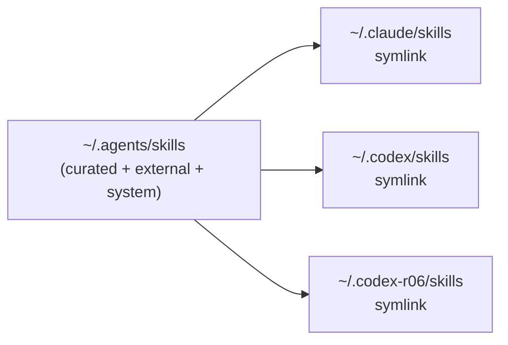

# Codex CLI Harness

🌐 日本語: [codex.ja.md](codex.ja.md)

← [Docs index](../README.md)

This document covers the OpenAI Codex CLI harness configuration deployed by this dotfiles repo. The harness provisions two isolated `CODEX_HOME` accounts (`~/.codex` and `~/.codex-r06`), keeps their hooks and shared profile config in sync via chezmoi templates, applies a shared SSOT profile through a PATH-resolvable launcher wrapper, and gates destructive Bash commands through a cross-harness gateguard shared with Claude Code.

---

## Table of contents

- [Deployed paths](#deployed-paths)
- [Two-account model](#two-account-model)
- [hooks.json — PreToolUse gateguard](#hooksjson--pretooluse-gateguard)
- [shared.config.toml — the shared profile](#sharedconfigtoml--the-shared-profile)
- [agent.config.toml — the agent profile](#agentconfigtoml--the-agent-profile)
- [Template SSOT — preventing account drift](#template-ssot--preventing-account-drift)
- [--profile shared mechanism](#--profile-shared-mechanism)
  - [codex / cdx / cdx-r06 — the wrapper](#codex--cdx--cdx-r06--the-wrapper)
  - [Bare codex now loads the SSOT config too](#bare-codex-now-loads-the-ssot-config-too)
- [The unmanaged base config and project trust](#the-unmanaged-base-config-and-project-trust)
- [Gateguard](#gateguard)
- [Shared rule and skill layers](#shared-rule-and-skill-layers)
- [Claude Code codex plugin — pin and convergence](#claude-code-codex-plugin--pin-and-convergence)
- [See also](#see-also)

---

## Deployed paths

Each `CODEX_HOME` receives an identical file set. Both are rendered from the same chezmoi templates.

| Source path | Deploys to (personal) | Deploys to (work) |
|---|---|---|
| `home/dot_codex/hooks.json.tmpl` | `~/.codex/hooks.json` | `~/.codex-r06/hooks.json` |
| `home/dot_codex/private_shared.config.toml.tmpl` | `~/.codex/shared.config.toml` (0600) | `~/.codex-r06/shared.config.toml` (0600) |
| `home/dot_codex/symlink_AGENTS.md.tmpl` | `~/.codex/AGENTS.md -> ~/AGENTS.md` | `~/.codex-r06/AGENTS.md -> ~/AGENTS.md` |
| `home/dot_codex/symlink_skills.tmpl` | `~/.codex/skills -> ~/.agents/skills` | `~/.codex-r06/skills -> ~/.agents/skills` |

There is also `home/dot_codex/private_agent.config.toml.tmpl` → `~/.codex/agent.config.toml` (0600), the non-interactive workspace-write profile used by skills (see [agent.config.toml — the agent profile](#agentconfigtoml--the-agent-profile)). `home/dot_codex-r06/` contains the same files; their template bodies are identical one-liners pointing to the same `home/.chezmoitemplates/` sources.

---

## Two-account model

The personal account uses the default `CODEX_HOME=~/.codex` (Codex's built-in default); the work account uses `CODEX_HOME=~/.codex-r06`. Account selection now lives in a wrapper *script*, `~/.local/launchers/codex` (source: `home/dot_local/launchers/executable_codex`), reached as `codex` / `cdx` / `cdx-r06` — the latter two are symlinks to it, and it dispatches on `$0`:

```
codex / cdx  → CODEX_HOME follows CLAUDE_CONFIG_DIR when set (else defaults to ~/.codex), then --profile shared "$@"
cdx-r06      → CODEX_HOME=~/.codex-r06 (unconditional override), then --profile shared "$@"
```

Being a real file on PATH rather than an interactive-zsh-only alias, the wrapper works identically from any shell — interactive, a hook, or Claude Code's own Bash tool — so `codex` and `cdx` are literally the same behavior for the personal-account case; see [codex / cdx / cdx-r06 — the wrapper](#codex--cdx--cdx-r06--the-wrapper) below for the full dispatch logic, including how `CLAUDE_CONFIG_DIR` propagates the account from an enclosing Claude Code session.

Because both homes receive their own copy of `hooks.json` and `shared.config.toml` — rendered from shared templates — each account runs the identical hook and config logic while keeping auth tokens and conversation state isolated in separate directories.

---

## hooks.json — PreToolUse gateguard

`home/.chezmoitemplates/codex-hooks.json` is the actual hook body, included by both `dot_codex/hooks.json.tmpl` and `dot_codex-r06/hooks.json.tmpl` via `{{ includeTemplate "codex-hooks.json" . }}`.

The rendered `hooks.json` registers one hook:

```json
{
  "hooks": {
    "PreToolUse": [
      {
        "matcher": "^Bash$",
        "hooks": [
          {
            "type": "command",
            "command": "node \"<homeDir>/.config/gateguard/codex-bash-gate.js\"",
            "statusMessage": "Checking Bash command against cross-harness gateguard",
            "timeout": 10
          }
        ]
      }
    ]
  }
}
```

The home directory is interpolated from `{{ .chezmoi.homeDir }}` at apply time. The gateguard script is covered in the [Gateguard](#gateguard) section below.

---

## shared.config.toml — the shared profile

`home/.chezmoitemplates/codex-shared-config.toml` is the actual config body, included by both `dot_codex/private_shared.config.toml.tmpl` and `dot_codex-r06/private_shared.config.toml.tmpl`.

The model/effort scalars live in a shared fragment `home/.chezmoitemplates/codex-model-pin.toml` (the single source of truth), included by both `shared` and the `agent` profile. The rendered `shared.config.toml` contains (model value tracks the pin; see `codex-model-pin.toml`):

```toml
personality = "pragmatic"
model = "gpt-5.6-terra"
model_reasoning_effort = "xhigh"

[features]
multi_agent = true
```

This file is deployed as `$CODEX_HOME/shared.config.toml` (mode 0600, via chezmoi's `private_` prefix). It is the named `shared` profile loaded by `--profile shared`.

---

## agent.config.toml — the agent profile

`home/.chezmoitemplates/codex-agent-config.toml` is the config body, included by both `dot_codex/private_agent.config.toml.tmpl` and `dot_codex-r06/private_agent.config.toml.tmpl` and deployed as `$CODEX_HOME/agent.config.toml` (mode 0600) to both accounts. It is the named `agent` profile selected with `--profile agent` — the non-interactive posture skills use when Codex acts as an implementation or CI-fix worker.

Like `shared`, it includes the model pin from `codex-model-pin.toml` (values live there and are not restated here); the permission keys are what set the two profiles apart:

```toml
sandbox_mode = "workspace-write"
approval_policy = "never"
web_search = "cached"

[features]
multi_agent = true

[sandbox_workspace_write]
network_access = false
```

- `sandbox_mode = "workspace-write"` — Codex may edit files inside the workspace. Protected paths stay read-only recursively (`.git`, `.agents`, `.codex`) — an enforcement the Codex CLI itself provides, not something this profile declares — so Codex cannot stage, commit, or otherwise write git state: the parent Claude session reviews the diff and commits.
- `approval_policy = "never"` — required for non-interactive `codex exec` runs, which have no human available to answer approval prompts.
- `web_search = "cached"` and `network_access = false` — no live network by default. A call site that genuinely needs network access opts in per invocation (`-c sandbox_workspace_write.network_access=true`). The opt-in boundary is a policy control, not a technical one — `-c` overrides take precedence over profile values; the `codex` skill owns that distinction.

The profile is self-contained: its permission posture does not depend on any key in the unmanaged base `~/.codex/config.toml`.

Division of use: implementation and CI-fix tasks run `--profile agent`; review tasks stay on `--profile shared --sandbox read-only` (preferably via `codex exec review`). The full invocation contract — the fail-closed worktree guard, the prohibited flags, and the diff-review-before-host-verification ordering — is owned by the `codex` skill (`home/dot_agents/skills/codex/SKILL.md`); this page deliberately does not restate it.

---

## Template SSOT — preventing account drift

`dot_codex/` and `dot_codex-r06/` each contain thin one-liner template files:

```
# dot_codex/hooks.json.tmpl (and dot_codex-r06/hooks.json.tmpl)
{{ includeTemplate "codex-hooks.json" . }}

# dot_codex/private_shared.config.toml.tmpl (and dot_codex-r06/private_shared.config.toml.tmpl)
{{ includeTemplate "codex-shared-config.toml" . }}

# dot_codex/private_agent.config.toml.tmpl (and dot_codex-r06/private_agent.config.toml.tmpl)
{{ includeTemplate "codex-agent-config.toml" . }}
```

The real bodies live exclusively in `home/.chezmoitemplates/`. Because both account directories reference the same template, they cannot diverge — editing the template changes both accounts atomically on the next `chezmoi apply`.

If the actual config were duplicated in `dot_codex/` and `dot_codex-r06/`, a change to one account's hooks or profile would require updating both files, making drift an inevitability.

---

## --profile shared mechanism

`shared.config.toml` is a named Codex CLI profile. It is layered on top of Codex's dynamically-written `config.toml` only when Codex is invoked with `--profile shared`. Without that flag, the underlying `codex` binary silently ignores the SSOT config — but since #345 the wrapper injects that flag on essentially every invocation, so in practice this only matters for the rare call that bypasses the wrapper entirely (see below).

The wrapper script is the only mechanism that injects `--profile shared` automatically:

### codex / cdx / cdx-r06 — the wrapper

`~/.local/launchers/codex` (source: `home/dot_local/launchers/executable_codex`) is the actual per-account launcher; `cdx` and `cdx-r06` are symlinks to it, and it dispatches on `$0` (the name it was invoked as). Being a real file on PATH — not a zsh alias — it works identically from any shell: interactive zsh, a hook, launchd, or Claude Code's own Bash tool.

Two things happen on every invocation:

1. **Account selection.** `cdx-r06` forces `CODEX_HOME=$HOME/.codex-r06` unconditionally (override). `codex` / `cdx` follow `CLAUDE_CONFIG_DIR` when it is set — `~/.codex-r06` when `CLAUDE_CONFIG_DIR` ends in `.claude-r06`, else `~/.codex` — and only fall back to an already-set `CODEX_HOME` (or `~/.codex`) when `CLAUDE_CONFIG_DIR` is unset:

   ```bash
   case "${0##*/}" in
     cdx-r06) CODEX_HOME="$HOME/.codex-r06" ;;
     *)
       if [ -n "${CLAUDE_CONFIG_DIR:-}" ]; then
         case "$CLAUDE_CONFIG_DIR" in
           *.claude-r06) CODEX_HOME="$HOME/.codex-r06" ;;
           *) CODEX_HOME="$HOME/.codex" ;;
         esac
       else
         CODEX_HOME="${CODEX_HOME:-$HOME/.codex}"
       fi
       ;;
   esac
   ```

   `CLAUDE_CONFIG_DIR` being authoritative means a `codex` call made from inside a `cld-r06` Claude Code session (e.g. via the `codex` skill's Bash tool, or a hook) lands on the r06 Codex account even if some stray inherited `CODEX_HOME` says otherwise — closing a cross-account leak that existed before #345. An explicit `CODEX_HOME` is only honored when no Claude Code session is in scope (`CLAUDE_CONFIG_DIR` unset).
2. **`--profile shared` injection.** The wrapper scans argv token by token (`--profile`, `--profile=…`, `-p`, `-p<value>`, stopping at a literal `--`) and injects `--profile shared` only when no profile flag is already present. `codex --profile agent …` therefore still resolves to the `agent` profile untouched, and the injected flag lands ahead of any subcommand (`exec`, `exec review`) so it parses in every invocation shape.

`real="${CODEX_LAUNCHER_BIN:-/opt/homebrew/bin/codex}"` resolves the brew-managed binary directly — unlike the `claude` wrapper, Codex stays brew-managed rather than mise-managed. `CODEX_LAUNCHER_BIN` overrides this for tests. If the real binary cannot be resolved, the wrapper fails loudly rather than silently doing nothing.

### Bare codex now loads the SSOT config too

Before #345, a direct `codex` invocation — without the `cdx`/`cdx-r06` aliases — did **not** load `shared.config.toml`; only the aliases injected `--profile shared`, and that was easy to trip over in scripts, CI, or editor integrations that invoked `codex` directly. That gap is closed: because `codex` on PATH now resolves to the same wrapper as `cdx` (the launcher directory is kept ahead of Homebrew's `bin` both by a static PATH prepend in `dot_zshrc.tmpl` and a `precmd` hook that re-asserts it after `mise activate`, plus a hard-coded prepend in launchd's morning-radar script), any bare `codex` call gets `--profile shared` injected exactly like `cdx` does, unless the caller already passed an explicit `--profile`. The only way to reach the true bare binary, un-wrapped, is to invoke it by its absolute path (`/opt/homebrew/bin/codex`) — something most callers never do.

---

## The unmanaged base config and project trust

### ~/.codex/config.toml is intentionally unmanaged

The base `$CODEX_HOME/config.toml` is written by the Codex CLI itself and is deliberately — and permanently — **not** chezmoi-managed. Three reasons:

- The CLI rewrites the file at runtime (project trust decisions, model-migration notices), so chezmoi would fight it on every `apply`.
- `chezmoi apply` would revert user-approved `[projects.*] trust_level` entries.
- Committing it would leak absolute paths of unrelated projects into a public repository.

The cost is a known, accepted drift source: the base config carries its own copy of model settings that ages independently of the SSOT pin. Profile-based invocations (`--profile shared` / `--profile agent`) layer over it and are unaffected; since #345 that includes bare `codex` calls too, because the wrapper injects `--profile shared` by default (see [Bare codex now loads the SSOT config too](#bare-codex-now-loads-the-ssot-config-too)). Only an invocation that bypasses the wrapper entirely (the brew binary's absolute path) resolves against the unmanaged base config alone.

### Project trust policy

This repository is never added to `[projects.*]` with `trust_level = "trusted"` in any Codex config. The untrusted-by-default status is load-bearing: Codex skips project-local `.codex/` config layers for untrusted projects, which is the defense against a malicious PR branch carrying a `.codex/` config that would otherwise widen its own permissions.

---

## Gateguard

`home/dot_config/gateguard/executable_codex-bash-gate.js` (deploys to `~/.config/gateguard/codex-bash-gate.js`, mode 0755) is a Node.js script registered as the Codex `PreToolUse` hook for `^Bash$` matcher.

### What it does

It reads the tool-call JSON from stdin, inspects the Bash command, and denies execution when the command matches a destructive pattern. Denial uses Codex's documented wire schema:

```json
{
  "hookSpecificOutput": {
    "permissionDecision": "deny",
    "permissionDecisionReason": "<explanation>"
  }
}
```

Any other outcome leaves the decision unset, so Codex falls back to its normal sandbox and approval flow.

### Cross-harness SSOT

The gateguard does not maintain its own list of destructive commands. Instead, it reads `GATEGUARD_BASH_EXTRA_DESTRUCTIVE` from `~/.claude/settings.json` at runtime:

```
Claude settings.json  ──────────────────────────────┐
  env.GATEGUARD_BASH_EXTRA_DESTRUCTIVE (regex)       │  SSOT
                                                     │
ECC gateguard hook (Claude PreToolUse)  ◄────────────┤
codex-bash-gate.js   (Codex PreToolUse) ◄────────────┘
```

The script reads `~/.claude/settings.json` first, then `~/.claude-r06/settings.json` as a fallback, and compiles the value as a case-insensitive `RegExp`. If the file is unreadable or the regex is invalid, the gate fails open (built-in patterns only, no crash).

The built-in pattern set covers common destructive operations independent of any operator configuration:

- `rm -rf` (recursive force removal)
- `DROP TABLE`, `DELETE FROM`, `TRUNCATE` (destructive SQL, even inside `psql -c "..."`)
- The full `GATEGUARD_BASH_EXTRA_DESTRUCTIVE` set from `settings.json` (when readable)

### Evasion hardening

The script strips leading wrapper commands before pattern matching, handling common LLM evasion vectors:

- Leading wrappers: `env`, `command`, `exec`, `nohup`, `sudo`, `time`, `builtin`, `setsid`, `stdbuf`, `nice`, `ionice`
- Shell dispatch: `sh -c "..."`, `bash -c "..."`, `zsh -c "..."` (inspects the `-c` body)
- Command substitution inside double-quoted strings
- Subshell `(...)`, brace `{...}`, and process-substitution groups

Known best-effort limits (deferred to Codex's sandbox and approval flow): base64/hex-encoded payloads decoded at runtime; deeply nested wrapper option parsing (e.g. `sudo -u user … cmd`).

### Complementary, not primary

The Codex gate is a best-effort complementary layer. Codex also has its own sandbox and per-operation approval flow, which remain the primary safety mechanism. The gate hardens the common cases and makes the destructive command set consistent between Claude Code and Codex.

---

## Shared rule and skill layers

Both Codex accounts receive the same rule and skill inputs as the Claude Code harness, via symlinks:

### AGENTS.md

`home/dot_codex/symlink_AGENTS.md.tmpl` renders to a symlink target of `~/AGENTS.md`. This is the harness-independent operational rules file deployed from `home/AGENTS.md.tmpl` — covering skill provenance policy, coding standards (via `includeTemplate "coding-standards.md"`), and operational conventions. Codex reads it automatically from the `CODEX_HOME` directory.

Both `~/.codex/AGENTS.md` and `~/.codex-r06/AGENTS.md` point to the same `~/AGENTS.md`, so any update to `AGENTS.md.tmpl` takes effect for both accounts and both harnesses simultaneously.

### Skills

`home/dot_codex/symlink_skills.tmpl` renders to a symlink target of `~/.agents/skills`. This is the shared skill tree — the same directory symlinked by `home/dot_claude/symlink_skills.tmpl`. Both harnesses consume one inventory of curated, external, and system skills from this path. Evolved skills live separately under `$CLV2_HOMUNCULUS_DIR/evolved/skills/` (CLV2-only; not part of the shared discovery tree).


```mermaid
graph LR
    A["~/.agents/skills\n(curated + external + system)"] --> B[~/.claude/skills\nsymlink]
    A --> C[~/.codex/skills\nsymlink]
    A --> D[~/.codex-r06/skills\nsymlink]
```

For the provenance taxonomy (curated / external / system / evolved / unmanaged) and how skills are added, see [Skills provenance](skills-provenance.md).

---

## Claude Code codex plugin — pin and convergence

The Claude Code side reaches Codex through the `codex` plugin from the `openai-codex` marketplace. Its version pin lives in `home/dot_claude/settings.json` under `extraKnownMarketplaces.openai-codex.source.ref` — that key is the SSOT; this page intentionally does not restate the version string.

### Converging the installed version

The plugin setup script (`home/run_onchange_after_17-setup-claude-plugins.sh.tmpl`) converges the installed plugin to the pinned `ref` whenever the pin changes. The pin is part of the script's `run_onchange` key (via the rendered `extraKnownMarketplaces`), so **editing the `ref` re-runs the script on the next `chezmoi apply`, which reconciles both accounts (`~/.claude` and `~/.claude-r06`) automatically** — no manual plugin commands. (An apply that leaves the declaration unchanged does not re-run it.)

It compares the pinned `ref` against the one the runtime recorded in `known_marketplaces.json`. When they differ it re-registers the marketplace at the new ref with a plain `marketplace add`, which overwrites the registration in place (`marketplace update` alone would re-pull the stale registered ref, and `marketplace rm` would cascade-uninstall the plugin), and then runs `plugin update`. The reconcile is deliberately fail-safe:

- **Post-verification, not silent success** — after converging it re-reads the registered ref; if it still lags (the CLI has been observed to ignore a ref on some paths) the script prints an explicit `WARNING` rather than reporting success.
- **A convergence failure warns, it does not fail the apply** — `chezmoi apply` stays green so a ref the CLI refuses is surfaced once instead of retried on every apply. Only a *fresh* install (a plugin that is absent and cannot be installed) stays fatal, so chezmoi retries it.
- **Restart notice** — when it updates a plugin the script reports that a Claude Code restart is required to apply (`claude plugin update` itself reports "restart required to apply").

**Manual fallback** — only needed if the automated path warns it could not converge. Run once per account (`CLAUDE_CONFIG_DIR`), substituting the pinned tag for `<ref>`:

```bash
# default account (~/.claude)
claude plugin marketplace add openai/codex-plugin-cc#<ref>
claude plugin update codex@openai-codex

# work account (~/.claude-r06)
CLAUDE_CONFIG_DIR=~/.claude-r06 claude plugin marketplace add openai/codex-plugin-cc#<ref>
CLAUDE_CONFIG_DIR=~/.claude-r06 claude plugin update codex@openai-codex
```

Use `marketplace add` (it overwrites an already-registered marketplace in place) rather than `marketplace update`: the registration keeps its own copy of the source ref in `known_marketplaces.json`, and `marketplace update` pulls from that stored (stale) registration. Do not `marketplace rm` first — that uninstalls the marketplace's plugins. A Claude Code restart is required afterwards for the updated plugin to take effect.

### codex:codex-rescue — manual rescue only

The plugin's `codex:codex-rescue` subagent is never invoked by skill orchestration (`pr-workflow` / `sdd` / `multi-review`); it stays available for ad-hoc manual rescue, where a human is directly in the loop. It is a second, ungoverned permission path with known gaps:

- It does not pass `--profile`, so it resolves against the unmanaged base config rather than the SSOT profiles.
- It does not propagate `CODEX_HOME`, so invoked from a `cld-r06` session it acts on the personal `~/.codex` account — an account-isolation leak.
- It defaults to write-capable runs with `approval_policy: "never"`.

---

## See also

- [Claude Code harness](claude-code.md) — the Claude Code counterpart
- [Account isolation](account-isolation.md) — how per-account env isolation works
- [Skills provenance](skills-provenance.md) — skill taxonomy and external fetching
- [Architecture overview](../architecture/overview.md) — repo-wide structure
- [Dev tooling](../architecture/dev-tooling.md) — gateguard source
