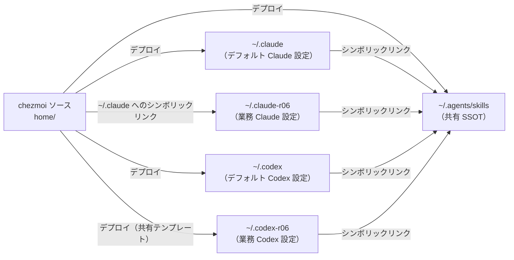

# エージェントハーネス — 概要

🌐 English (canonical): [overview.md](overview.md)

← [ドキュメント目次](../README.ja.md)

このリポジトリは **Claude Code** と **OpenAI Codex CLI** の 2 つの AI エージェントハーネスを、それぞれ個人（デフォルト）アカウントと業務アカウント（サフィックス **r06**）の 2 アカウント向けにプロビジョニングします。
結果として「ハーネス × アカウント」の 2 × 2 マトリクスが生まれ、すべて chezmoi の単一の Source of Truth から管理されます。

---

## デュアルハーネス × デュアルアカウントマトリクス

| | 個人（デフォルト） | 業務（r06） |
|---|---|---|
| **Claude Code** | `~/.claude` — エイリアス `cld` | `~/.claude-r06` — エイリアス `cld-r06` |
| **Codex CLI** | `~/.codex` — エイリアス `cdx` | `~/.codex-r06` — エイリアス `cdx-r06` |
| **dmux** | `dmux`（デフォルト tmux サーバー） | `dmux-r06`（専用ソケット `~/.dmux-r06`） |

各セルは完全に隔離されたランタイム環境を表します。セッション履歴、ガバナンスデータベース、継続学習のインスティンクト、bash コマンド監査ログ、MCP 状態がそれぞれ独立しています。一方、設定ファイルは共有されており、各ハーネス内の両アカウントはシンボリックリンク経由で同じデプロイ済み設定ファイルを参照します。



---

## ハーネス非依存の共有ルールレイヤー

すべてのハーネス・すべてのアカウントに適用されるルールを定義するソースファイルが 2 つあります。

| ソースファイル | デプロイ先 | 役割 |
|---|---|---|
| `home/AGENTS.md.tmpl` | `~/AGENTS.md` | 運用ルール：スキルプロベナンスポリシー、git/コミット規約、ツール使用ガイド |
| `home/.chezmoitemplates/coding-standards.md` | （テンプレートのみ） | ハウスコーディング標準：設計原則、堅牢性、セキュリティデフォルト、テスト方針 |

`AGENTS.md.tmpl` の末尾には次の記述があります。

```
{{ includeTemplate "coding-standards.md" . }}
```

これにより `chezmoi apply` 時にコーディング標準のテキストがインライン展開され、`~/AGENTS.md` が完全な統合ルールセットを含む単一のレンダリング済みファイルとなります。

各ハーネスはこのレイヤーを異なる方法で使用します。

- **Codex CLI**: `home/dot_codex/symlink_AGENTS.md.tmpl` が `~/.codex/AGENTS.md → ~/AGENTS.md` のシンボリックリンクを作成します（`~/.codex-r06/AGENTS.md` も同様）。
- **Claude Code**: `home/dot_claude/CLAUDE.md` がセッション開始時に `@~/AGENTS.md` でデプロイ済みファイルを取り込みます。

コーディング標準テンプレートは `AGENTS.md.tmpl` に `includeTemplate` で埋め込まれているため、すべてのハーネスに到達するコーディング標準テキストは厳密に 1 つです。`home/.chezmoitemplates/coding-standards.md` を編集すれば、次回の `chezmoi apply` で全ハーネスに伝播します。

---

## 単一 SSOT スキルライブラリ

curated・external・system スキルは、一つの標準パス `~/.agents/skills/` を通じてアクセスされます。Evolved スキルは CLV2 専用のロケーション（`$CLV2_HOMUNCULUS_DIR/evolved/skills/`）に別途管理されており、この共有 discovery ツリーには含まれません。

chezmoi ソースは `home/dot_agents/skills/` 経由でキュレーテッドスキルを `~/.agents/skills/<name>/` に直接デプロイします。外部スキル（ECC、Anthropic システムスキル）は `home/.chezmoiexternal.toml` によって同じディレクトリツリーにフェッチされます。

その後、両ハーネスはシンボリックリンク経由でこのツリーを参照します。

| シンボリックリンクのソース | ターゲット |
|---|---|
| `home/dot_claude/symlink_skills.tmpl` → `~/.claude/skills` | `~/.agents/skills` |
| `home/dot_codex/symlink_skills.tmpl` → `~/.codex/skills` | `~/.agents/skills` |
| （r06 のミラー） | 同じターゲット |

`~/.agents/skills/` のスキルを追加・更新すると、追加設定なしに全ハーネス・全アカウントへ即座に反映されます。

---

## ランタイムにおけるアカウント分離

設定は共有されていますが、ランタイム状態は zsh エイリアスラッパーが注入する環境変数によってアカウントごとに分離されます。Claude Code 用の `_claude_with_home`、Codex 用の `cdx`/`cdx-r06` エイリアスといったラッパーが、プロセス単位の環境変数をセットして各ツールをそれぞれの状態ディレクトリへ向けます。（`cdx-r06` は `CODEX_HOME=$HOME/.codex-r06` を設定し、`cdx` は `CODEX_HOME` を未設定のままにして Codex が `~/.codex` をデフォルト使用します。）状態変数はシェルの一般的な環境にはエクスポートされません。

すべての環境変数とエイリアスの詳細は [account-isolation.ja.md](account-isolation.ja.md) を参照してください。

---

## 次に読むドキュメント

| トピック | ドキュメント |
|---|---|
| アカウントごとの環境変数テーブル、エイリアスマトリクス、dmux ソケット分離 | [account-isolation.ja.md](account-isolation.ja.md) |
| Claude Code ハーネス：フック、ECC、CLV2、ステータスライン | [claude-code.ja.md](claude-code.ja.md) |
| Codex CLI ハーネス：プロファイル設定、フック、アカウント設定 | [codex.ja.md](codex.ja.md) |
| スキルタクソノミー、キュレーテッドインベントリ、外部フェッチ、プロベナンス強制 | [skills-provenance.ja.md](skills-provenance.ja.md) |
