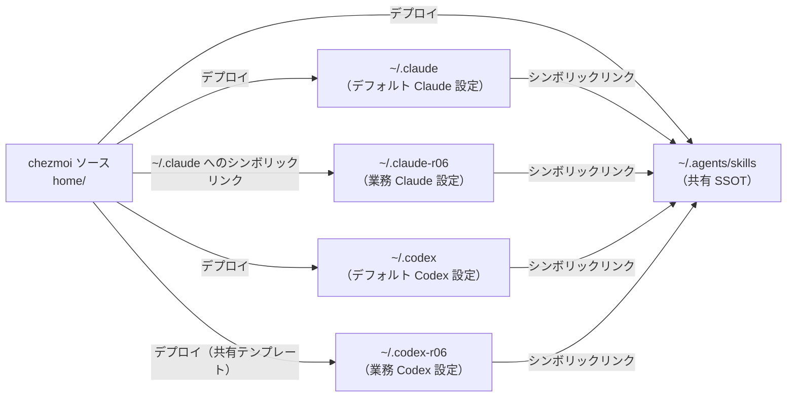

# エージェントハーネス — 概要

🌐 English (canonical): [overview.md](overview.md)

← [ドキュメント目次](../README.ja.md)

このリポジトリは **Claude Code** と **OpenAI Codex CLI** の 2 つの AI エージェントハーネスを、それぞれ個人（デフォルト）アカウントと業務アカウント（サフィックス **r06**）の 2 アカウント向けにプロビジョニングします。
結果として「ハーネス × アカウント」の 2 × 2 マトリクスが生まれ、すべて chezmoi の単一の Source of Truth から管理されます。

---

## デュアルハーネス × デュアルアカウントマトリクス

| | 個人（デフォルト） | 業務（r06） |
|---|---|---|
| **Claude Code** | `~/.claude` — ランチャー `cld` | `~/.claude-r06` — ランチャー `cld-r06` |
| **Codex CLI** | `~/.codex` — ランチャー `cdx` | `~/.codex-r06` — ランチャー `cdx-r06` |

各セルは完全に隔離されたランタイム環境を表します。セッション履歴、ガバナンスデータベース、継続学習のインスティンクト、bash コマンド監査ログ、MCP 状態がそれぞれ独立しています。一方、設定ファイルは共有されており、各ハーネス内の両アカウントはシンボリックリンク経由で同じデプロイ済み設定ファイルを参照します。


```mermaid
graph LR
    src["chezmoi ソース\nhome/"]

    src -->|"デプロイ"| cls["~/.claude\n（デフォルト Claude 設定）"]
    src -->|"~/.claude へのシンボリックリンク"| clr["~/.claude-r06\n（業務 Claude 設定）"]
    src -->|"デプロイ"| cdxs["~/.codex\n（デフォルト Codex 設定）"]
    src -->|"デプロイ（共有テンプレート）"| cdxr["~/.codex-r06\n（業務 Codex 設定）"]

    src -->|"デプロイ"| skills["~/.agents/skills\n（共有 SSOT）"]
    cls -->|"シンボリックリンク"| skills
    clr -->|"シンボリックリンク"| skills
    cdxs -->|"シンボリックリンク"| skills
    cdxr -->|"シンボリックリンク"| skills
```

---

## ハーネス非依存の共有ルールレイヤー

すべてのハーネス・すべてのアカウントに適用されるルールを定義するソースファイルが 2 つあります。

| ソースファイル | デプロイ先 | 役割 |
|---|---|---|
| `home/AGENTS.md.tmpl` | `~/AGENTS.md` | 運用ルール：スキルプロベナンスポリシー、git/コミット規約、ツール使用ガイド |
| `home/.chezmoitemplates/coding-standards.md` | （テンプレートのみ） | ハウスコーディング標準：設計原則、堅牢性、セキュリティデフォルト、テスト方針 |

`AGENTS.md.tmpl` の末尾には次の記述があります。

```
{{ includeTemplate "coding-standards.md" . }}
```

これにより `chezmoi apply` 時にコーディング標準のテキストがインライン展開され、`~/AGENTS.md` が完全な統合ルールセットを含む単一のレンダリング済みファイルとなります。

各ハーネスはこのレイヤーを異なる方法で使用します。

- **Codex CLI**: `home/dot_codex/symlink_AGENTS.md.tmpl` が `~/.codex/AGENTS.md → ~/AGENTS.md` のシンボリックリンクを作成します（`~/.codex-r06/AGENTS.md` も同様）。
- **Claude Code**: `home/dot_claude/CLAUDE.md` がセッション開始時に `@~/AGENTS.md` でデプロイ済みファイルを取り込みます。

コーディング標準テンプレートは `AGENTS.md.tmpl` に `includeTemplate` で埋め込まれているため、すべてのハーネスに到達するコーディング標準テキストは厳密に 1 つです。`home/.chezmoitemplates/coding-standards.md` を編集すれば、次回の `chezmoi apply` で全ハーネスに伝播します。

---

## 単一 SSOT スキルライブラリ

curated・external・system スキルは、一つの標準パス `~/.agents/skills/` を通じてアクセスされます。Evolved スキルは CLV2 専用のロケーション（`$CLV2_HOMUNCULUS_DIR/evolved/skills/`）に別途管理されており、この共有 discovery ツリーには含まれません。

chezmoi ソースは `home/dot_agents/skills/` 経由でキュレーテッドスキルを `~/.agents/skills/<name>/` に直接デプロイします。外部スキル（ECC、Anthropic システムスキル）は `home/.chezmoiexternal.toml` によって同じディレクトリツリーにフェッチされます。

その後、両ハーネスはシンボリックリンク経由でこのツリーを参照します。

| シンボリックリンクのソース | ターゲット |
|---|---|
| `home/dot_claude/symlink_skills.tmpl` → `~/.claude/skills` | `~/.agents/skills` |
| `home/dot_codex/symlink_skills.tmpl` → `~/.codex/skills` | `~/.agents/skills` |
| （r06 のミラー） | 同じターゲット |

`~/.agents/skills/` のスキルを追加・更新すると、追加設定なしに全ハーネス・全アカウントへ即座に反映されます。

---

## 実機操作: phone-harness

[phone-harness](https://github.com/ShawnPana/phone-harness) は、どちらのハーネスからでもこの Mac 経由で実機のスマートフォンを操作できるようにします。iPhone は iPhone ミラーリングウィンドウ越し（目は画面キャプチャ + Vision OCR、手は CGEvent）、Android は adb 経由です。transport はすべて Mac 側にあり、端末側には何もインストールしません。

構成要素は 1 つのまとまりとしてではなく、既存の 3 レイヤへ意図的に分割して管理します。部品ごとに寿命も対応プラットフォームも異なるためです。

| 部品 | レイヤ | 備考 |
|---|---|---|
| `phone-harness` CLI | `run_onchange_after_19-setup-phone-harness.sh.tmpl` → `uv tool install` | macOS 専用（pyobjc 依存）。`[phone_harness].version` で pin |
| `SKILL.md` | `.chezmoiexternal.toml` の `file` external | upstream からそのまま取得。`[phone_harness].commit` で pin |
| `adb` | Brewfile の `cask "android-platform-tools"` | Android 経路でのみ必要 |
| `agent_helpers.py` | **管理対象外** — `PH_AGENT_WORKSPACE` が chezmoi ツリー外を指す | エージェントがセッション中に書き込む。apply のたびに保持されなければならない |

### `chezmoi apply` がやらないこと

apply はツールを入れるだけです。権限付与も端末のペアリングも行いません。これらには実機とあなたの手が必要です。

- **iPhone** — iPhone ミラーリングアプリを一度開いてペアリングを完了し、System Settings → Privacy & Security でターミナルに **Accessibility**（タップとキー入力。即時反映）と **Screen Recording**（画面の取得。ターミナル再起動後に反映）を付与する。
- **Android** — 端末側でビルド番号を 7 回タップして開発者オプションを表示し、USB デバッグを有効にして接続時に Allow をタップするか、ワイヤレスデバッグを有効にして `phone-harness android pair <code>` を実行する。
- **共通** — `phone-harness config set platform ios|android` で既定を選び、`phone-harness --doctor` で全体を確認する。新しいマシンでは最初の操作時にさらに権限を求められることがあります。`--doctor` が通るのにタップやキャプチャが無反応な場合は、macOS のプロンプトを探してください。

どちらの pin も自動マージしません。markdown のみのスキルアーカイブとは異なり、これは実アカウントを保持したロック解除済み端末の画面をキャプチャし HID レベルの入力を合成する実行可能コードを配布するためです。詳細は [externals-and-pinning.ja.md](../architecture/externals-and-pinning.ja.md#1-つのツールに-2-つの-pin-phone-harness) を参照してください。

---

## ランタイムにおけるアカウント分離

設定は共有されていますが、ランタイム状態は `~/.local/launchers/{claude,codex}` にある 2 つのランチャーラッパースクリプトが注入する環境変数によってアカウントごとに分離されます。これらは `claude`/`cld`/`cld-r06` と `codex`/`cdx`/`cdx-r06` としてアクセスされます。各ラッパーは `$0` で分岐し、プロセス単位の環境変数をセットして各ツールを正しい状態ディレクトリへ向けます。（`cdx-r06` は `CODEX_HOME=$HOME/.codex-r06` を無条件に設定し、`codex`/`cdx` は設定済みの `CLAUDE_CONFIG_DIR` に追従し、なければ `~/.codex` にデフォルトします。）インタラクティブ zsh 専用のエイリアスではなく PATH 上の実ファイルであるため、ラッパーはどのシェルからでも同一に動作します。状態変数は、ラッパー自身の短命なプロセスを超えてシェルの一般的な環境にエクスポートされることはありません。

すべての環境変数とランチャーコマンドの詳細は [account-isolation.ja.md](account-isolation.ja.md) を参照してください。

---

## 次に読むドキュメント

| トピック | ドキュメント |
|---|---|
| アカウントごとの環境変数テーブル、ランチャーコマンドマトリクス | [account-isolation.ja.md](account-isolation.ja.md) |
| Claude Code ハーネス：フック、ECC、CLV2、ステータスライン | [claude-code.ja.md](claude-code.ja.md) |
| Codex CLI ハーネス：プロファイル設定、フック、アカウント設定 | [codex.ja.md](codex.ja.md) |
| スキルタクソノミー、キュレーテッドインベントリ、外部フェッチ、プロベナンス強制 | [skills-provenance.ja.md](skills-provenance.ja.md) |
