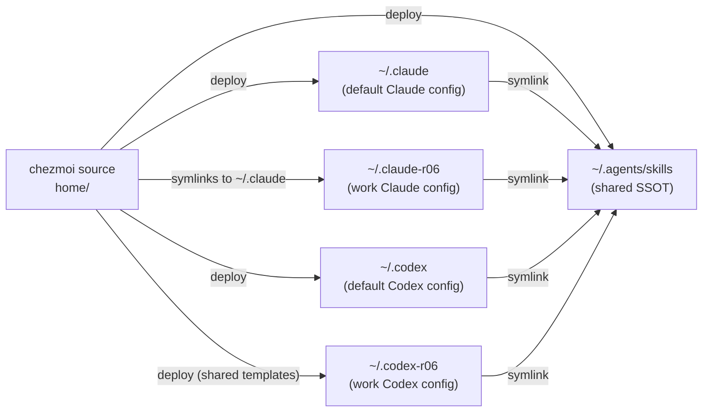

# Agent Harnesses — Overview

🌐 日本語: [overview.ja.md](overview.ja.md)

← [Docs index](../README.md)

This repository provisions two AI agent harnesses — **Claude Code** and **OpenAI Codex CLI** — for two isolated user accounts each: a personal (default) account and a work account identified by the suffix **r06**.
The result is a 2 × 2 matrix of harness × account combinations, all wired from a single chezmoi source of truth.

---

## The dual-harness × dual-account matrix

| | Personal (default) | Work (r06) |
|---|---|---|
| **Claude Code** | `~/.claude` — alias `cld` | `~/.claude-r06` — alias `cld-r06` |
| **Codex CLI** | `~/.codex` — alias `cdx` | `~/.codex-r06` — alias `cdx-r06` |

Each cell represents a fully isolated runtime environment: its own session history, governance database, continuous-learning instincts, bash-command audit log, and MCP state. The config, however, is shared — both accounts within a harness point at the same deployed config files via symlinks.



---

## Harness-independent shared-rule layer

Two source files define rules that apply to every harness and every account:

| Source file | Deployed to | Role |
|---|---|---|
| `home/AGENTS.md.tmpl` | `~/AGENTS.md` | Operational rules: skill provenance policy, git/commit conventions, tool-use guidance |
| `home/.chezmoitemplates/coding-standards.md` | (template only) | House coding standards: design principles, robustness, security-by-default, testing posture |

`AGENTS.md.tmpl` ends with:

```
{{ includeTemplate "coding-standards.md" . }}
```

This inlines the coding-standards text at `chezmoi apply` time, so `~/AGENTS.md` contains the complete combined rule set as a single rendered file.

Each harness consumes this layer differently:

- **Codex CLI**: `home/dot_codex/symlink_AGENTS.md.tmpl` creates `~/.codex/AGENTS.md → ~/AGENTS.md` (and the same for `~/.codex-r06/AGENTS.md`).
- **Claude Code**: `home/dot_claude/CLAUDE.md` uses `@~/AGENTS.md` to include the deployed file at session start.

Because the coding-standards template is `includeTemplate`-embedded in `AGENTS.md.tmpl`, there is exactly one copy of the coding-standards text that reaches every harness. Editing `home/.chezmoitemplates/coding-standards.md` propagates everywhere on the next `chezmoi apply`.

---

## Single SSOT skill library

Curated, external, and system skills are addressed through one canonical path: `~/.agents/skills/`. Evolved skills are a CLV2-only location (`$CLV2_HOMUNCULUS_DIR/evolved/skills/`) and are not part of this shared discovery tree.

The chezmoi source deploys curated skills directly to `~/.agents/skills/<name>/` via `home/dot_agents/skills/`. External skills (ECC, Anthropic system skills) are fetched by `home/.chezmoiexternal.toml` into the same directory tree.

Both harnesses then consume this tree via symlinks:

| Symlink source | Target |
|---|---|
| `home/dot_claude/symlink_skills.tmpl` → `~/.claude/skills` | `~/.agents/skills` |
| `home/dot_codex/symlink_skills.tmpl` → `~/.codex/skills` | `~/.agents/skills` |
| (r06 mirrors) | same target |

Adding or updating a skill in `~/.agents/skills/` is immediately visible to all harnesses and all accounts without any further configuration.

---

## Account isolation at runtime

Although config is shared, runtime state is isolated per account via environment variables injected by the zsh alias wrappers. The wrappers — `_claude_with_home` for Claude Code and the `cdx`/`cdx-r06` aliases for Codex — set per-process env vars that direct each tool to its own state directories. (`cdx-r06` sets `CODEX_HOME=$HOME/.codex-r06`; `cdx` leaves `CODEX_HOME` unset so Codex defaults to `~/.codex`.) No state variable is exported into the general shell environment.

Details of every env var and alias are in [account-isolation.md](account-isolation.md).

---

## Where to go next

| Topic | Doc |
|---|---|
| Per-account env var table, alias matrix | [account-isolation.md](account-isolation.md) |
| Claude Code harness: hooks, ECC, CLV2, statusline | [claude-code.md](claude-code.md) |
| Codex CLI harness: profile config, hooks, account setup | [codex.md](codex.md) |
| Skill taxonomy, curated inventory, external fetching, provenance enforcement | [skills-provenance.md](skills-provenance.md) |
