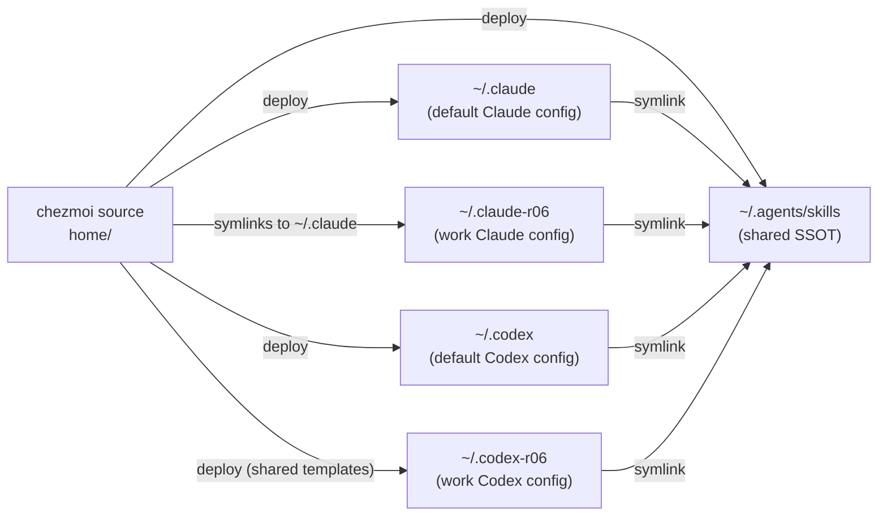

# Agent Harnesses — Overview

🌐 日本語: [overview.ja.md](overview.ja.md)

← [Docs index](../README.md)

This repository provisions two AI agent harnesses — **Claude Code** and **OpenAI Codex CLI** — for two isolated user accounts each: a personal (default) account and a work account identified by the suffix **r06**.
The result is a 2 × 2 matrix of harness × account combinations, all wired from a single chezmoi source of truth.

---

## The dual-harness × dual-account matrix

| | Personal (default) | Work (r06) |
|---|---|---|
| **Claude Code** | `~/.claude` — launcher `cld` | `~/.claude-r06` — launcher `cld-r06` |
| **Codex CLI** | `~/.codex` — launcher `cdx` | `~/.codex-r06` — launcher `cdx-r06` |

Each cell represents a fully isolated runtime environment: its own session history, governance database, continuous-learning instincts, bash-command audit log, and MCP state. The config, however, is shared — both accounts within a harness point at the same deployed config files via symlinks.


```mermaid
graph LR
    src["chezmoi source\nhome/"]

    src -->|"deploy"| cls["~/.claude\n(default Claude config)"]
    src -->|"symlinks to ~/.claude"| clr["~/.claude-r06\n(work Claude config)"]
    src -->|"deploy"| cdxs["~/.codex\n(default Codex config)"]
    src -->|"deploy (shared templates)"| cdxr["~/.codex-r06\n(work Codex config)"]

    src -->|"deploy"| skills["~/.agents/skills\n(shared SSOT)"]
    cls -->|"symlink"| skills
    clr -->|"symlink"| skills
    cdxs -->|"symlink"| skills
    cdxr -->|"symlink"| skills
```

---

## Harness-independent shared-rule layer

Two source files define rules that apply to every harness and every account:

| Source file | Deployed to | Role |
|---|---|---|
| `home/AGENTS.md.tmpl` | `~/AGENTS.md` | Operational rules: skill provenance policy, git/commit conventions, tool-use guidance |
| `home/.chezmoitemplates/coding-standards.md` | (template only) | House coding standards: design principles, robustness, security-by-default, testing posture |

`AGENTS.md.tmpl` ends with:

```
{{ includeTemplate "coding-standards.md" . }}
```

This inlines the coding-standards text at `chezmoi apply` time, so `~/AGENTS.md` contains the complete combined rule set as a single rendered file.

Each harness consumes this layer differently:

- **Codex CLI**: `home/dot_codex/symlink_AGENTS.md.tmpl` creates `~/.codex/AGENTS.md → ~/AGENTS.md` (and the same for `~/.codex-r06/AGENTS.md`).
- **Claude Code**: `home/dot_claude/CLAUDE.md` uses `@~/AGENTS.md` to include the deployed file at session start.

Because the coding-standards template is `includeTemplate`-embedded in `AGENTS.md.tmpl`, there is exactly one copy of the coding-standards text that reaches every harness. Editing `home/.chezmoitemplates/coding-standards.md` propagates everywhere on the next `chezmoi apply`.

---

## Single SSOT skill library

Curated, external, and system skills are addressed through one canonical path: `~/.agents/skills/`. Evolved skills are a CLV2-only location (`$CLV2_HOMUNCULUS_DIR/evolved/skills/`) and are not part of this shared discovery tree.

The chezmoi source deploys curated skills directly to `~/.agents/skills/<name>/` via `home/dot_agents/skills/`. External skills (ECC, Anthropic system skills) are fetched by `home/.chezmoiexternal.toml` into the same directory tree.

Both harnesses then consume this tree via symlinks:

| Symlink source | Target |
|---|---|
| `home/dot_claude/symlink_skills.tmpl` → `~/.claude/skills` | `~/.agents/skills` |
| `home/dot_codex/symlink_skills.tmpl` → `~/.codex/skills` | `~/.agents/skills` |
| (r06 mirrors) | same target |

Adding or updating a skill in `~/.agents/skills/` is immediately visible to all harnesses and all accounts without any further configuration.

---

## Device control: phone-harness

[phone-harness](https://github.com/ShawnPana/phone-harness) lets either harness drive a real phone from this Mac — an iPhone through the iPhone Mirroring window (screen capture + Vision OCR for eyes, CGEvents for hands), or an Android over adb. The Mac is the whole transport: nothing is installed on the phone.

It is deliberately split across three existing layers rather than managed as one unit, because its parts have different lifetimes and different platforms:

| Part | Layer | Notes |
|---|---|---|
| `phone-harness` CLI | `run_onchange_after_19-setup-phone-harness.sh.tmpl` → `uv tool install` | macOS only (depends on pyobjc); pinned by `[phone_harness].version` |
| `SKILL.md` | `file` external in `.chezmoiexternal.toml` | Fetched verbatim from upstream; pinned by `[phone_harness].commit` |
| `adb` | `cask "android-platform-tools"` in the Brewfile | Only needed for the Android path |
| `agent_helpers.py` | **not managed** — `PH_AGENT_WORKSPACE` points outside the chezmoi tree | Written by the agent mid-session; must survive every apply |

### What `chezmoi apply` does not do

Apply installs the tooling. It grants no permissions and pairs no devices — those need your hands and a physical phone:

- **iPhone** — open the iPhone Mirroring app once and complete its pairing prompts, then grant your terminal **Accessibility** (taps and keystrokes; effective immediately) and **Screen Recording** (seeing the phone; effective only after the terminal restarts) in System Settings → Privacy & Security.
- **Android** — on the phone, tap Build number 7× to reveal Developer options, then either enable USB debugging and tap Allow when plugged in, or enable Wireless debugging and run `phone-harness android pair <code>`.
- **Both** — pick the default with `phone-harness config set platform ios|android`, then confirm the whole chain with `phone-harness --doctor`. A fresh machine may prompt for further permissions the first time an action runs: if `--doctor` passes but taps or captures silently do nothing, look for a macOS prompt.

Neither pin is ever auto-merged. Unlike the markdown-only skill archives, this ships executable code that captures the screen and synthesises HID-level input on an unlocked phone holding real accounts — see [externals-and-pinning.md](../architecture/externals-and-pinning.md#two-pins-for-one-tool-phone-harness).

---

## Account isolation at runtime

Although config is shared, runtime state is isolated per account via environment variables injected by two launcher wrapper scripts at `~/.local/launchers/{claude,codex}`, reached as `claude`/`cld`/`cld-r06` and `codex`/`cdx`/`cdx-r06`. Each wrapper dispatches on `$0` and sets per-process env vars that direct its tool to the right state directories. (`cdx-r06` sets `CODEX_HOME=$HOME/.codex-r06` unconditionally; `codex`/`cdx` follow `CLAUDE_CONFIG_DIR` when it is set, else default to `~/.codex`.) Being real files on PATH rather than interactive-zsh-only aliases, the wrappers work identically from any shell. No state variable is exported into the general shell environment beyond the wrapper's own short-lived process.

Details of every env var and launcher command are in [account-isolation.md](account-isolation.md).

---

## Where to go next

| Topic | Doc |
|---|---|
| Per-account env var table, launcher command matrix | [account-isolation.md](account-isolation.md) |
| Claude Code harness: hooks, ECC, CLV2, statusline | [claude-code.md](claude-code.md) |
| Codex CLI harness: profile config, hooks, account setup | [codex.md](codex.md) |
| Multi-frontier router, evidence, onboarding, and rollout | [frontier-harness.md](frontier-harness.md) |
| Skill taxonomy, curated inventory, external fetching, provenance enforcement | [skills-provenance.md](skills-provenance.md) |
