# ライフサイクルスクリプト: 実行順序とトリガーモデル

🌐 English (canonical): [lifecycle-scripts.md](lifecycle-scripts.md)

← [ドキュメント目次](../README.ja.md)

chezmoi は `chezmoi apply` の実行中、管理ファイルの展開と並行してシェルスクリプトを実行します。これらの**ライフサイクルスクリプト**は、管理対象ファイルとして表現できない命令的・副作用的なプロビジョニングを担います。具体的には Homebrew インストール、`brew bundle` 実行、1Password 検証、mise ツールチェーンインストール、MCP サーバー登録などです。

---

## 2フェーズ実行モデル

chezmoi はスクリプト実行を、管理ファイルの書き込みを基準に2つのフェーズに分けます。

- **`before_` フェーズ** — `$HOME` への対象ファイル書き込みが行われる**前**に実行
- **`after_` フェーズ** — 管理ファイルがすべて配置された**後**に実行

各フェーズ内では、スクリプトは**ファイル名のアルファベット順**（実質的に数値順）で実行されます。すべてのスクリプト名に2桁の数値プレフィックス（`00-`, `10-`, `11-`, …）が付いているため、実行順序は決定的で推論しやすくなっています。

### apply の完全なタイムライン

```mermaid
flowchart TD
    A([chezmoi apply 開始]) --> B

    subgraph BEFORE ["BEFORE フェーズ (ファイル未書き込み)"]
        B["00 install-prerequisites\nrun_once\n(macOS: Xcode CLI + Homebrew + Rosetta 2)\n(Linux: apt build-deps + Linuxbrew)"]
        B --> C["10 brew-bundle\nrun_onchange\n(brew bundle --no-upgrade)\n(Linux: .brewfile-linux-exclude でフィルタ)"]
    end

    C --> FILES[chezmoi が管理ファイルを HOME へ書き込む]

    FILES --> D

    subgraph AFTER ["AFTER フェーズ (ファイル書き込み済み)"]
        D["11 validate-1password\nrun_once · macOS のみ\n(ハードゲート: アイテム欠損で exit 1)"]
        D --> E["12 setup-mise\nrun_onchange\n(mise install, 3回リトライ)"]
        E --> F["13 setup-mcp\nrun_onchange\n(mise exec -- claude 経由で\n4つの user-scope MCP サーバーを登録)"]
        F --> G["14 enable-clv2-observer\nrun_onchange\n(per-account homunculus config.json に\nobserver.enabled=true を書き込む)"]
        G --> H["16 migrate-claude-binary\nrun_once\n(~/.local/bin/claude を\nmise installs/claude/latest へ symlink)"]
        H --> H2["17 setup-claude-plugins\nrun_onchange\n(dot_claude/settings.json が宣言する\nmarketplace 登録 + plugin インストール)"]
        H2 --> I["18 setup-agent-browser\nrun_onchange\n(mise exec 経由で agent-browser install)"]
        I --> J["20 macos-defaults\nrun_onchange · macOS のみ\n(defaults write + killall Dock/Finder)"]
        J --> J2["30 register-launchd-agents\nrun_onchange · macOS のみ\n(repo 管理 LaunchAgent の launchctl bootstrap\nCI ではスキップ)"]
        J2 --> K["40 setup-sheldon\nrun_onchange\n(sheldon lock)"]
        K --> L["50 set-login-shell\nrun_once · Linux のみ\n(chsh -s zsh, sudo 失敗時は graceful)"]
        L --> M["90 other-apps\nrun_once · macOS のみ\n(Logi Options+ / Google IME ダウンロードプロンプト)\n(非 TTY は即時スキップ)"]
    end

    M --> N([apply 完了])
```



---

## `run_once` vs `run_onchange`

どちらのスクリプトも apply 時に Go テンプレート (`.tmpl`) としてレンダリングされます。違いは chezmoi が再実行を判断する仕組みです。

| 属性 | `run_once_` | `run_onchange_` |
|------|-------------|-----------------|
| **トリガー** | レンダリング済みコンテンツが同じなら1回のみ実行 | レンダリング済みコンテンツが変化するたびに再実行 |
| **状態キー** | **レンダリング後**スクリプト本文の sha256 | **レンダリング後**スクリプト本文の sha256 |
| **典型的な用途** | コストが高い・不可逆な前提条件（Homebrew インストール、ログインシェル変更、バイナリランチャー作成） | 常時最新を保つべき冪等な同期ステップ（brew bundle、mise install、MCP 登録） |

### 埋め込みハッシュトリック

`run_onchange_` スクリプトは**スクリプト本文**を追跡します。スクリプト自体ではなく**外部ファイル**の変化で再トリガーするには、そのファイルの sha256 をファイル冒頭のコメントに埋め込みます。

```bash
# Brewfile hash: {{ include "dot_Brewfile" | sha256sum }}
```

`dot_Brewfile` が変わると、レンダリングされたコメント行が変わり、スクリプト本文のハッシュが変わり、chezmoi がスクリプトを再実行します。このパターンを使用するスクリプト:

| スクリプト | 追跡対象の外部ファイル |
|-----------|----------------------|
| `10-brew-bundle` | `dot_Brewfile` |
| `12-setup-mise` | `dot_config/mise/config.toml` |
| `17-setup-claude-plugins` | `dot_claude/settings.json` |
| `18-setup-agent-browser` | `dot_config/mise/config.toml` |
| `30-register-launchd-agents` | `Library/LaunchAgents/dev.kryota.morning-radar.plist.tmpl` |
| `40-setup-sheldon` | `dot_config/sheldon/plugins.toml` |
| `20-macos-defaults` | 自分自身のソースファイル（任意の編集で再トリガー） |

`20-macos-defaults` は `joinPath` による自己ハッシュを使用しており、スクリプト自体を編集するだけで全 `defaults write` が再適用されます。

`17-setup-claude-plugins` はハッシュを使わずに同じ結果を得ています。`include | fromJson` で
`dot_claude/settings.json` を読み、`enabledPlugins` と `extraKnownMarketplaces` だけを JSON として
quoted heredoc の中に埋め込みます。これにより単一ソースを保ちつつ、宣言が変わったときにだけ再実行されます
（settings.json の無関係な箇所を編集しても、レンダリング後の本文は変わりません）。quoted heredoc であることが
重要で、値を bash の配列リテラルとしてレンダリングすると、クォートや `$(...)` を含む値がレンダリング時に
スクリプト本文として評価されてしまいます。

---

## OS ガード

スクリプトは chezmoi テンプレートガードを使用して OS ごとの挙動を選択します。

| スクリプト | OS スコープ | ガード機構 |
|-----------|------------|-----------|
| `00-install-prerequisites` | 両対応 | `{{ if darwin }}` / `{{ else if linux }}` 2ブロック。それぞれ shebang を持つ |
| `10-brew-bundle` | 両対応 | shebang は1つ。`{{ if linux }}` でフィルタ済み Brewfile パスへ切り替え |
| `11-validate-1password` | **macOS のみ** | 2行目で非 darwin は exit 0 (`set -euo pipefail` より前) |
| `12-setup-mise` | 両対応 | `{{ if linux }}` で `MISE_NODE_VERIFY=false` を追加 |
| `13-setup-mcp` | 両対応 | OS ガードなし。両アカウントを処理 |
| `14-enable-clv2-observer` | 両対応 | OS ガードなし |
| `16-migrate-claude-binary` | 両対応 | OS ガードなし。バイナリ存在をランタイムで確認 |
| `17-setup-claude-plugins` | 両対応 | OS ガードなし。両アカウントを処理 |
| `18-setup-agent-browser` | 両対応 | `{{ if linux }}` で `--with-deps` を追加 |
| `20-macos-defaults` | **macOS のみ** | 本文全体が `{{ if darwin }}` 内。Linux ではほぼ空にレンダリング |
| `30-register-launchd-agents` | **macOS のみ** | 本文全体が `{{ if darwin }}` 内。Linux ではほぼ空にレンダリング |
| `40-setup-sheldon` | 両対応 | OS ガードなし |
| `50-set-login-shell` | **Linux のみ** | 本文全体が `{{ if linux }}` 内。macOS ではほぼ空にレンダリング |
| `90-other-apps` | **macOS のみ** | 本文全体が `{{ if darwin }}` 内。Linux ではほぼ空にレンダリング |

---

## スクリプト別リファレンス

### 00 — install-prerequisites (`run_once`、before)

Xcode CLI ツール（macOS、`xcode-select -p` が成功するまでポーリング）と Homebrew（arch 対応 shellenv: arm64 → `/opt/homebrew`、intel → `/usr/local`）をインストールします。Apple Silicon では Rosetta 2 も（冪等な `arch -x86_64` ガード付きで）インストールし、`sony-ps-remote-play` のような Intel 専用 cask が `brew bundle` 中に正しくインストールされるようにします。Linux では `apt-get` で `build-essential curl file git` をインストールした後 Linuxbrew をインストールします。レンダリング済みコンテンツが同じなら1回のみ実行されるため、`chezmoi apply` を再実行しても Homebrew インストールは繰り返されません。

### 10 — brew-bundle (`run_onchange`、before)

`dot_Brewfile` に対して `brew bundle --no-upgrade` を実行します。Linux では Brewfile を `.brewfile-linux-exclude`（リポジトリルートの `grep -E` パターンリスト）でフィルタし、一時ファイルに書き出してから `tap`/`brew` 行のみを `brew bundle` に渡します。変化キーとして Brewfile の sha256 を最初のコメント行に埋め込んでいます。

### 11 — validate-1password (`run_once`、after、macOS のみ)

ハードゲートです。`op` がインストール済みかつ認証済みであることを確認し、<!-- FACT:onepassword-vault-item-count -->4<!-- /FACT --> つの必須 vault 参照に対して `op read` を呼び出します。

- `op://kryota.dev/Dotfiles - AWS Config/notesPlain`
- `op://kryota.dev/Dotfiles - Exa API/credential`
- `op://kryota.dev/Dotfiles - Firecrawl API/credential`
- `op://kryota.dev/Dotfiles - Redact Patterns/pattern`

`Dotfiles - Redact Patterns` アイテムについては単純な存在確認にとどまらず、パターンが非空であること、`private_gitleaks-own.toml.tmpl` の TOML 生文字列リテラルを破壊する `'''` を含まないこと、有効な正規表現としてコンパイルできることも検証します。破損したパターンは自社名前空間リポジトリのすべてのコミットでクライアント識別子ルールをサイレントに無効化してしまいます。

いずれかが失敗すると非 0 で終了し、after フェーズを中断します。このアイテムリストは `claude-secrets.zsh`、AWS config テンプレート、および `private_gitleaks-own.toml.tmpl` が実際に使用するものと常に同期させる必要があります。

### 12 — setup-mise (`run_onchange`、after)

`mise install --yes` を最大3回リトライ（バックオフ: 10秒、20秒）で実行します。レート制限回避のため `gh auth token` から `GITHUB_TOKEN` を取得します（ベストエフォート: 初回 apply では gh 自体がまだ未インストールの可能性があります）。Linux では GPG キーリングエラーを回避するため `MISE_NODE_VERIFY=false` を設定します。

### 13 — setup-mcp (`run_onchange`、after)

`claude mcp add-json --scope user` を通じて、4つの user-scope Claude Code MCP サーバー（`context7`、`deepwiki`、`exa`、`firecrawl`）を `~/.claude` と `~/.claude-r06` の両方に登録します。PATH ではなく `mise exec -- claude` 経由で呼び出します。初回 apply では `~/.local/bin/claude` ランチャーシンリンクがまだ存在しないためです（スクリプト 16 で作成）。登録エラーが1つでもあると非 0 で終了し、chezmoi が次回の apply でリトライします。

**シークレットモデル**: exa と firecrawl の JSON 設定はリテラル文字列 `${EXA_API_KEY}` / `${FIRECRAWL_API_KEY}` を保持します（シェルが展開しないようシングルクォートで記述）。Claude Code は MCP サーバー起動時にプロセス環境からこれらのプレースホルダーを展開します。実際のキーは 1Password からレンダリングされた 0600 ファイル `~/.config/zsh/claude-secrets.zsh` にのみ存在し、`_claude_with_home` がアカウントごとに注入します。`.claude.json` にキーが残ることはありません。

### 14 — enable-clv2-observer (`run_onchange`、after)

各アカウントの `ecc-homunculus/config.json` に `observer.enabled = true` を `jq` のアトミックマージ（一時ファイルへ書き込み後 `mv`）で設定します。chezmoi 管理の CLV2 スキルディレクトリではなく、per-account のランタイム状態ディレクトリに書き込むことで、external の 168時間リフレッシュサイクルをまたいでフラグが保持されます。PATH の `jq` を優先し、`mise exec -- jq` にフォールバックし、どちらも利用できない場合は非 0 で終了（chezmoi がリトライ）します。

### 16 — migrate-claude-binary (`run_once`、after)

`~/.local/bin/claude` を `~/.local/share/mise/installs/claude/latest/claude` へのシンリンクとして作成します。`settings.json` の `DISABLE_INSTALLATION_CHECKS=1` と組み合わせることで、mise がバイナリバージョンを管理しつつ Claude Code のネイティブインストール自己チェックを満たします。既存の `~/.local/share/claude` ネイティブインストールは意図的にそのままにします。その `ClaudeCode.app` バンドルが、素の mise バイナリには存在しない macOS アプリ ID（マイク、Apple Events）を提供するためです。mise バイナリが機能していない場合は警告を出して exit 0 します。

### 18 — setup-agent-browser (`run_onchange`、after)

`mise exec -- agent-browser install`（Linux では `--with-deps` 付き）を実行します。mise 設定のハッシュで再トリガーされるため、バージョンバンプによって対応するブラウザバイナリが再インストールされます。インストールコマンドが失敗した場合は graceful に exit 0 + 警告を出します。

### 20 — macos-defaults (`run_onchange`、after、macOS のみ)

キーボード、Finder、Dock、DesktopServices、時計、スクロール設定に対して `defaults write` を適用し、`killall Dock Finder SystemUIServer` で即時反映します。`joinPath .chezmoi.sourceDir` を使った自己ハッシュにより、スクリプト本文の任意の編集で再トリガーされます。

### 30 — register-launchd-agents (`run_onchange`、after、macOS のみ)

repo 管理の launchd LaunchAgent（現在は平日朝ブリーフを発火する `dev.kryota.morning-radar` の 1 つ、kryota-dev/dotfiles#257。Claude Code ハーネスドキュメントの [朝次レーダーのスケジュール実行](../agents/claude-code.ja.md) 参照）を登録します。`launchctl bootout || true` → `launchctl bootstrap gui/$UID` の順で実行するため、plist の変更は冪等に再読み込みされます。再トリガーのキーは plist テンプレートの埋め込みハッシュです（wrapper script の編集は再登録不要 — launchd は発火のたびに現行ファイルを exec します）。`$CI` 設定時は登録をスキップします。headless runner には gui launchd domain が存在せず、in-script ガードならワークフローでファイルを除外する方式と異なり、レンダリング / apply パスが CI 検証対象に残ります。CI 外では bootstrap 失敗をハードフェイルとし、次回 apply で chezmoi がリトライします（規約 #6）。

### 40 — setup-sheldon (`run_onchange`、after)

`.zshrc` が利用する zsh プラグインロックファイルを `sheldon lock` で再生成します。`plugins.toml` のハッシュで再トリガーされます。`sheldon` が未インストールの場合は警告を出して exit 0 します。

### 50 — set-login-shell (`run_once`、after、Linux のみ)

zsh を `/etc/shells` に追加（sudo が必要; パスワードが必要な場合は手動実行の案内を表示して exit 0）し、`chsh -s zsh` を呼び出します。失敗パスはすべて exit 0 で手順を案内します。

### 90 — other-apps (`run_once`、after、macOS のみ)

Logi Options+ と Google 日本語入力のインタラクティブなダウンロードプロンプトを表示します。`stdin` が TTY でない場合（`[[ ! -t 0 ]]`）は即時 exit 0 します。各プロンプトは `read -t 30` で30秒タイムアウトします。CI では実行されません。

---

## 依存チェーン

```
brew (00) → Homebrew パッケージ（mise, sheldon を含む）(10)
         → mise ツールチェーン: claude, jq, sheldon, agent-browser, gh … (12)
                         → mise exec -- claude 経由の MCP 登録 (13)
                         → jq 経由の CLV2 オブザーバー有効化 (14)
                         → claude ランチャーシンリンク (16)
                         → agent-browser ブラウザ (18)
                         → sheldon lock (40)
1Password ゲート (11) → 後続ステップでシークレットが利用可能
```

スクリプト 13 と 14 は、スクリプト 16（`~/.local/bin/claude` ランチャーを作成する）がまだ実行されていないため、`mise exec --` 経由でツールを呼び出します。スクリプト 18 も `mise exec --` を使いますが、理由が異なります。18 は 16 の後に実行されるためランチャーは既に存在しますが、`mise exec --` を使うことで、PATH 上に残る古いバージョンではなく mise でピン固定された `agent-browser` バイナリを確実に呼び出すためです。

---

## スクリプト追加時の規約

1. 順序付きタイムラインに自然に収まるプレフィックスを選ぶ。現在の空きスロット: `…15…17…19…31-39…`（40 より前）、`…41-49…`（sheldon とログインシェルの間）。
2. 高コスト・不可逆な操作には `run_once_`、冪等な同期ステップには `run_onchange_` を使用する。
3. 外部ファイルへの変化で `run_onchange_` を再トリガーするには、先頭コメントに `{{ include "<path>" | sha256sum }}` を埋め込む。
4. すべてのスクリプトを `#!/bin/bash` と `set -euo pipefail` で始める。ただし、スクリプト全体が OS 固有の場合は shebang を OS テンプレートガードの内側に置く。
5. mise でインストールされるツールで、スクリプト 16 より前に実行される可能性があるものは `mise exec -- <tool>` 経由で呼び出す。
6. サイレントスキップが `run_onchange` を「完了済み」としてマークし将来のリトライを妨げる場合は、ハードフェイル（`exit 1`）する。ツールが現在のマシン状態で genuinely オプションな場合は警告 + exit 0 が適切。

---

## 関連ドキュメント

- [chezmoi エンジン: データ、テンプレート、名前デコード](chezmoi-engine.ja.md) — テンプレート構文と変数一覧
- [開発ツールチェーン: mise、Brewfile、git](dev-tooling.ja.md) — これらのスクリプトがインストールするツール
- [zsh スタートアップ、プロンプト、シェルモジュール](shell-environment.ja.md) — スクリプト 40 がロックし、スクリプト 50 が前提とするもの
- [1Password シークレットのオンボーディング](../getting-started/secrets-1password.ja.md) — スクリプト 11 が検証する4つの vault アイテム
- [CI アーキテクチャとテストスイート](../contributing/ci-and-tests.ja.md) — `setup-validation.yml` が Brewfile フィルタを再実装する方法
