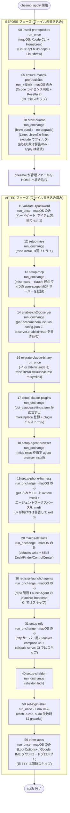

# ライフサイクルスクリプト: 実行順序とトリガーモデル

🌐 English (canonical): [lifecycle-scripts.md](lifecycle-scripts.md)

← [ドキュメント目次](../README.ja.md)

chezmoi は `chezmoi apply` の実行中、管理ファイルの展開と並行してシェルスクリプトを実行します。これらの**ライフサイクルスクリプト**は、管理対象ファイルとして表現できない命令的・副作用的なプロビジョニングを担います。具体的には Homebrew インストール、`brew bundle` 実行、1Password 検証、mise ツールチェーンインストール、MCP サーバー登録などです。

---

## 2フェーズ実行モデル

chezmoi はスクリプト実行を、管理ファイルの書き込みを基準に2つのフェーズに分けます。

- **`before_` フェーズ** — `$HOME` への対象ファイル書き込みが行われる**前**に実行
- **`after_` フェーズ** — 管理ファイルがすべて配置された**後**に実行

各フェーズ内では、スクリプトは**ターゲット名のアルファベット順**（実質的に数値順）で実行されます。ターゲット名とは、ソースのファイル名から `run_` / `once_` / `onchange_` / `before_` / `after_` の各属性を取り除いたものです。すべてのスクリプト名に2桁の数値プレフィックス（`00-`, `05-`, `10-`, `11-`, …）が付いているため、実行順序は決定的で推論しやすくなっています。

ターゲット名とソースのファイル名の区別は、あるスクリプトが隣接スクリプトと異なる属性の組み合わせを持つ場合に効いてきます。`run_before_05-…` は生のファイル名としては `run_once_before_00-…` より**前**に並びますが、chezmoi は `05-…` と `00-…` を比較するため、実行は**後**になります。

### apply の完全なタイムライン


```mermaid
flowchart TD
    A([chezmoi apply 開始]) --> B

    subgraph BEFORE ["BEFORE フェーズ (ファイル未書き込み)"]
        B["00 install-prerequisites\nrun_once\n(macOS: Xcode CLI + Homebrew)\n(Linux: apt build-deps + Linuxbrew)"]
        B --> B2["05 ensure-macos-prerequisites\nrun_ (毎回) · macOS のみ\n(Xcode ライセンス同意 + Rosetta 2)\n(CI ではスキップ)"]
        B2 --> C["10 brew-bundle\nrun_onchange\n(brew bundle --no-upgrade)\n(Linux: .brewfile-linux-exclude でフィルタ)\n(部分失敗は警告のみ・apply は継続)"]
    end

    C --> FILES[chezmoi が管理ファイルを HOME へ書き込む]

    FILES --> D

    subgraph AFTER ["AFTER フェーズ (ファイル書き込み済み)"]
        D["11 validate-1password\nrun_once · macOS のみ\n(ハードゲート: アイテム欠損で exit 1)"]
        D --> E["12 setup-mise\nrun_onchange\n(mise install, 3回リトライ)"]
        E --> F["13 setup-mcp\nrun_onchange\n(mise exec -- claude 経由で\n4つの user-scope MCP サーバーを登録)"]
        F --> G["14 enable-clv2-observer\nrun_onchange\n(per-account homunculus config.json に\nobserver.enabled=true を書き込む)"]
        G --> H["16 migrate-claude-binary\nrun_once\n(~/.local/bin/claude を\nmise installs/claude/latest へ symlink)"]
        H --> H2["17 setup-claude-plugins\nrun_onchange\n(dot_claude/settings.json が宣言する\nmarketplace 登録 + plugin インストール)"]
        H2 --> I["18 setup-agent-browser\nrun_onchange\n(mise exec 経由で agent-browser install)"]
        I --> I2["19 setup-phone-harness\nrun_onchange · macOS のみ\n(pin された CLI を uv tool install +\nエージェントワークスペースを mkdir\nuv が無ければ警告して exit 0)"]
        I2 --> J["20 macos-defaults\nrun_onchange · macOS のみ\n(defaults write + killall Dock/Finder/ControlCenter)"]
        J --> J2["30 register-launchd-agents\nrun_onchange · macOS のみ\n(repo 管理 LaunchAgent の launchctl bootstrap\nCI ではスキップ)"]
        J2 --> J3["31 setup-ntfy\nrun_onchange · macOS のみ\n(ntfy サーバー用の docker compose up +\ntailscale serve; CI ではスキップ)"]
        J3 --> K["40 setup-sheldon\nrun_onchange\n(sheldon lock)"]
        K --> L["50 set-login-shell\nrun_once · Linux のみ\n(chsh -s zsh, sudo 失敗時は graceful)"]
        L --> M["90 other-apps\nrun_once · macOS のみ\n(Logi Options+ / Google IME ダウンロードプロンプト)\n(非 TTY は即時スキップ)"]
    end

    M --> N([apply 完了])
```

---

## `run_once` vs `run_onchange`

どちらのスクリプトも apply 時に Go テンプレート (`.tmpl`) としてレンダリングされます。違いは chezmoi が再実行を判断する仕組みです。

| 属性 | `run_once_` | `run_onchange_` |
|------|-------------|-----------------|
| **トリガー** | レンダリング済みコンテンツが同じなら1回のみ実行 | レンダリング済みコンテンツが変化するたびに再実行 |
| **状態キー** | **レンダリング後**スクリプト本文の sha256 | **レンダリング後**スクリプト本文の sha256 |
| **典型的な用途** | コストが高い・不可逆な前提条件（Homebrew インストール、ログインシェル変更、バイナリランチャー作成） | 常時最新を保つべき冪等な同期ステップ（brew bundle、mise install、MCP 登録） |

### 埋め込みハッシュトリック

`run_onchange_` スクリプトは**スクリプト本文**を追跡します。スクリプト自体ではなく**外部ファイル**の変化で再トリガーするには、そのファイルの sha256 をファイル冒頭のコメントに埋め込みます。

```bash
# Brewfile hash: {{ include "dot_Brewfile" | sha256sum }}
```

`dot_Brewfile` が変わると、レンダリングされたコメント行が変わり、スクリプト本文のハッシュが変わり、chezmoi がスクリプトを再実行します。このパターンを使用するスクリプト:

| スクリプト | 追跡対象の外部ファイル |
|-----------|----------------------|
| `10-brew-bundle` | `dot_Brewfile` |
| `12-setup-mise` | `dot_config/mise/config.toml` |
| `17-setup-claude-plugins` | `dot_claude/settings.json` |
| `18-setup-agent-browser` | `dot_config/mise/config.toml` |
| `30-register-launchd-agents` | `Library/LaunchAgents/dev.kryota.morning-radar.plist.tmpl` + `Library/LaunchAgents/dev.kryota.knowledge-distill.plist.tmpl` + `Library/LaunchAgents/dev.kryota.macos-defaults-drift.plist.tmpl` |
| `31-setup-ntfy` | `dot_config/ntfy/compose.yaml.tmpl` + `dot_config/ntfy/private_server.yml.tmpl` + `dot_config/ntfy/lib.sh.tmpl` |
| `40-setup-sheldon` | `dot_config/sheldon/plugins.toml` |
| `20-macos-defaults` | 自分自身のソースファイル（任意の編集で再トリガー） |

`20-macos-defaults` は `joinPath` による自己ハッシュを使用しており、スクリプト自体を編集するだけで全 `defaults write` が再適用されます。

`19-setup-phone-harness` は同じ発想の変種ですが、ハッシュを一切使いません。ファイルのダイジェストではなく、追跡したい**値そのもの**を埋め込みます。

```bash
# phone-harness version: {{ .phone_harness.version }}
```

`.chezmoidata.toml` の `[phone_harness].version` を動かすとレンダリング結果が変わるため、スクリプトが再実行され `uv tool install` が新しいリリースへ入れ替えます。`.chezmoidata.toml` の他の箇所を編集してもこのスクリプトの本文は変わりません。ファイル単位の `include | sha256sum` にしていたら、同ファイル内の無関係な pin バンプのたびに再実行されていました。

`17-setup-claude-plugins` はハッシュを使わずに同じ結果を得ています。`include | fromJson` で
`dot_claude/settings.json` を読み、`enabledPlugins` と `extraKnownMarketplaces` だけを JSON として
quoted heredoc の中に埋め込みます。これにより単一ソースを保ちつつ、宣言が変わったときにだけ再実行されます
（settings.json の無関係な箇所を編集しても、レンダリング後の本文は変わりません）。quoted heredoc であることが
重要で、値を bash の配列リテラルとしてレンダリングすると、クォートや `$(...)` を含む値がレンダリング時に
スクリプト本文として評価されてしまいます。

---

## OS ガード

スクリプトは chezmoi テンプレートガードを使用して OS ごとの挙動を選択します。

| スクリプト | OS スコープ | ガード機構 |
|-----------|------------|-----------|
| `00-install-prerequisites` | 両対応 | `{{ if darwin }}` / `{{ else if linux }}` 2ブロック。それぞれ shebang を持つ |
| `05-ensure-macos-prerequisites` | **macOS のみ** | 本文全体が `{{ if darwin }}` 内。Linux では 0 バイトにレンダリング。Rosetta ブロックはさらに `{{ if arm64 }}` の入れ子ガード内 |
| `10-brew-bundle` | 両対応 | shebang は1つ。`{{ if linux }}` でフィルタ済み Brewfile パスへ切り替え |
| `11-validate-1password` | **macOS のみ** | 2行目で非 darwin は exit 0 (`set -euo pipefail` より前) |
| `12-setup-mise` | 両対応 | `{{ if linux }}` で `MISE_NODE_VERIFY=false` を追加 |
| `13-setup-mcp` | 両対応 | OS ガードなし。両アカウントを処理 |
| `14-enable-clv2-observer` | 両対応 | OS ガードなし |
| `16-migrate-claude-binary` | 両対応 | OS ガードなし。バイナリ存在をランタイムで確認 |
| `17-setup-claude-plugins` | 両対応 | OS ガードなし。両アカウントを処理 |
| `18-setup-agent-browser` | 両対応 | `{{ if linux }}` で `--with-deps` を追加 |
| `19-setup-phone-harness` | **macOS のみ** | 本文全体が `{{ if darwin }}` 内。Linux では 0 バイトにレンダリング（CLI が pyobjc を必要とするため） |
| `20-macos-defaults` | **macOS のみ** | 本文全体が `{{ if darwin }}` 内。Linux ではほぼ空にレンダリング |
| `30-register-launchd-agents` | **macOS のみ** | 本文全体が `{{ if darwin }}` 内。Linux ではほぼ空にレンダリング |
| `31-setup-ntfy` | **macOS のみ** | 本文全体が `{{ if darwin }}` 内。Linux ではほぼ空にレンダリング |
| `40-setup-sheldon` | 両対応 | OS ガードなし |
| `50-set-login-shell` | **Linux のみ** | 本文全体が `{{ if linux }}` 内。macOS ではほぼ空にレンダリング |
| `90-other-apps` | **macOS のみ** | 本文全体が `{{ if darwin }}` 内。Linux ではほぼ空にレンダリング |

---

## スクリプト別リファレンス

### 00 — install-prerequisites (`run_once`、before)

Xcode CLI ツール（macOS、`xcode-select -p` が成功するまでポーリング）と Homebrew（arch 対応 shellenv: arm64 → `/opt/homebrew`、intel → `/usr/local`）をインストールします。Linux では `apt-get` で `build-essential curl file git` をインストールした後 Linuxbrew をインストールします。レンダリング済みコンテンツが同じなら1回のみ実行されるため、`chezmoi apply` を再実行しても Homebrew インストールは繰り返されません。

このスクリプトは「本当にマシンごとに1回でよい重量級のインストール」だけを意図的に担います。Rosetta 2 は以前ここにありましたが、下記の理由で 05 へ移設しました。

### 05 — ensure-macos-prerequisites (`run_`、before、macOS のみ)

`brew bundle` が依存しており、かつ構築済みのマシンから静かに失われうる 2 つの macOS 前提条件を再確立します。

- **Xcode ライセンス**。developer directory が選択されていてライセンスが未同意の場合、Homebrew は `You have not agreed to the Xcode license` で**一切動作しません**。つまり未同意のライセンスは、10 が何かをインストールする前にそれを落とします。判定は Homebrew 自身の検査（`Library/Homebrew/brew.sh`）をそのまま流用しています。すなわち「`xcode-select -p` が非空」を前提に「`xcrun --find clang` が非ゼロ」かつ「その出力が license に言及している」ことです。brew と同一のテストを使うことで、brew が実際に拒否するときだけ同意処理が走り、それ以外のマシン（Command Line Tools のみの環境を含む）では `sudo` を一切要求しません。真っ新な Mac では本質的に 2 フェーズになります。Xcode.app 自体が 10 の `mas "Xcode"` で入るため、ライセンスの関門は**次回**の apply でしか現れないからです。
- **Rosetta 2**（Apple Silicon のみ、`{{ if arm64 }}` ガード内）。Brewfile 内の Intel 専用ペイロード（`sony-ps-remote-play` cask と `PicGIF Lite` App Store アプリ）は x86_64 インストーラを同梱しており、Rosetta なしでは実行を拒否されます。ガードは冪等です。`arch -x86_64` はユニバーサルバイナリの x86_64 スライスを Rosetta が存在するときにのみ実行でき、`/usr/bin/true` はユニバーサルバイナリだからです。

**なぜ `run_once_` / `run_onchange_` ではなく素の `run_` なのか**。このスクリプトが修復する状態はソースツリーではなく**マシン**の側にあります。`run_once_` は自身のレンダリング済み内容の SHA256 を chezmoi の永続 state に記録して判定するため、一度実行したマシンでは二度と走りません。00 が「すでにインストール済み」であるにもかかわらず、macOS アップグレードで失われた Rosetta 2 が戻らなかったのはまさにこれです。`run_onchange_` も同様で、再実行されるのは**スクリプト**が変わったときですが、変わったのはスクリプトではありません。毎回実行されるスクリプトだけが毎回再検査できます。どちらの検査も健全なマシンでは安価な no-op なので、コストは apply あたり数回の `exec` です。

どちらの修復も apply を失敗させません（警告して継続します）。`before_` スクリプトの非ゼロ終了は以降のすべてを中断させますが、それはこのスクリプトが防ぐために存在する失敗モードそのものであり、作り出してよいものではありません。CI は `[ -n "${CI:-}" ]` で即スキップし、ランナーが `sudo` を求められないようにしています。これは 30 や 31 と同じ in-script 方式で、workflow からスクリプトを削除する方法と違って render/apply 経路が CI で検証され続けます。

### 10 — brew-bundle (`run_onchange`、before)

`dot_Brewfile` に対して `brew bundle --no-upgrade` を実行します。Linux では Brewfile を `.brewfile-linux-exclude`（リポジトリルートの `grep -E` パターンリスト）でフィルタし、一時ファイルに書き出してから `tap`/`brew` 行のみを `brew bundle` に渡します。変化キーとして Brewfile の sha256 を最初のコメント行に埋め込んでいます。

**失敗ポリシー**。`brew bundle` は**いずれか 1 件**でも失敗すると非ゼロで終了します。これは `before_` スクリプトなので、その status をそのまま伝播させると dotfiles が 1 つも書かれないまま apply 全体が中断します。引退した App Store アプリや Intel 専用 cask のせいでシェル設定を失うのは割に合わないため、部分失敗ではスキップされた対象を列挙した囲み警告を出したうえで exit 0 します。成功行 `Brew bundle complete.` はクリーンな実行時のみ出力されます。exit code だけでは「そもそも実行できなかった」と区別できない（Brewfile が無い場合も exit 1）ため、致命的な 2 条件（`brew` が `PATH` に無い / Brewfile が読めない）は明示的に事前検査し、従来どおり `exit 1` します。この挙動は macOS と Linux で同一です。CI は影響を受けません。`setup-validation.yml` はこのスクリプトを退避したうえで、フィルタ済み Brewfile に対して独自の厳格な `brew bundle` を実行するため、Brewfile の破損はそちらで検出され続けます。

### 11 — validate-1password (`run_once`、after、macOS のみ)

ハードゲートです。`op` がインストール済みかつ認証済みであることを確認し、<!-- FACT:onepassword-vault-item-count -->4<!-- /FACT --> つの必須 vault 参照に対して `op read` を呼び出します。

- `op://kryota.dev/Dotfiles - AWS Config/notesPlain`
- `op://kryota.dev/Dotfiles - Exa API/credential`
- `op://kryota.dev/Dotfiles - Firecrawl API/credential`
- `op://kryota.dev/Dotfiles - Redact Patterns/pattern`

（`Dotfiles - ntfy` アイテムはこのリストに意図的に含まれません: 1 フィールドだけでなくアイテム全体が
検証ゲートの対象外だからです。保持するのは read-only の `subscriber-username`/`subscriber-password`
デバイスログイン用クレデンシャルのみで、`chezmoi apply` の後、Tailscale/Docker が起動した後に
このスクリプトではなく `ntfy-setup` が自動作成・充填します。もう `base-url` フィールドはありません:
tailnet の MagicDNS 名は保存されず、必要な都度その場で導出されます。write-only の publisher
トークンも 1Password には一切触れません——スクリプト 31 がこれを `~/.config/ntfy/notify-env` へ
ランタイム状態として直接書き出します。）

`Dotfiles - Redact Patterns` アイテムについては単純な存在確認にとどまらず、パターンが非空であること、`private_gitleaks-own.toml.tmpl` の TOML 生文字列リテラルを破壊する `'''` を含まないこと、有効な正規表現としてコンパイルできることも検証します。破損したパターンは自社名前空間リポジトリのすべてのコミットでクライアント識別子ルールをサイレントに無効化してしまいます。

いずれかが失敗すると非 0 で終了し、after フェーズを中断します。このアイテムリストは `claude-secrets.zsh`、AWS config テンプレート、および `private_gitleaks-own.toml.tmpl` が実際に使用するものと常に同期させる必要があります。

### 12 — setup-mise (`run_onchange`、after)

`mise install --yes` を最大3回リトライ（バックオフ: 10秒、20秒）で実行します。レート制限回避のため `gh auth token` から `GITHUB_TOKEN` を取得します（ベストエフォート: 初回 apply では gh 自体がまだ未インストールの可能性があります）。Linux では GPG キーリングエラーを回避するため `MISE_NODE_VERIFY=false` を設定します。

### 13 — setup-mcp (`run_onchange`、after)

`claude mcp add-json --scope user` を通じて、4つの user-scope Claude Code MCP サーバー（`context7`、`deepwiki`、`exa`、`firecrawl`）を `~/.claude` と `~/.claude-r06` の両方に登録します。PATH ではなく `mise exec -- claude` 経由で呼び出します。初回 apply では `~/.local/bin/claude` ランチャーシンリンクがまだ存在しないためです（スクリプト 16 で作成）。登録エラーが1つでもあると非 0 で終了し、chezmoi が次回の apply でリトライします。

**シークレットモデル**: exa と firecrawl の JSON 設定はリテラル文字列 `${EXA_API_KEY}` / `${FIRECRAWL_API_KEY}` を保持します（シェルが展開しないようシングルクォートで記述）。Claude Code は MCP サーバー起動時にプロセス環境からこれらのプレースホルダーを展開します。実際のキーは 1Password からレンダリングされた 0600 ファイル `~/.config/zsh/claude-secrets.zsh` にのみ存在し、`claude` ランチャーラッパー（`~/.local/launchers/claude`）がアカウントごとに注入します。`.claude.json` にキーが残ることはありません。

### 14 — enable-clv2-observer (`run_onchange`、after)

各アカウントの `~/.local/share/ecc-homunculus-<slug>/config.json`（`<slug>` は `~/.claude` なら `default`、それ以外は `.claude-` 以降のサフィックス）に `observer.enabled = true` を `jq` のアトミックマージ（一時ファイルへ書き込み後 `mv`）で設定します。chezmoi 管理の CLV2 スキルディレクトリではなく、per-account のランタイム状態ディレクトリに書き込むことで、external の 168時間リフレッシュサイクルをまたいでフラグが保持されます。PATH の `jq` を優先し、`mise exec -- jq` にフォールバックし、どちらも利用できない場合は非 0 で終了（chezmoi がリトライ）します。

### 16 — migrate-claude-binary (`run_once`、after)

`~/.local/bin/claude` を `~/.local/share/mise/installs/claude/latest/claude` へのシンリンクとして作成します。`settings.json` の `DISABLE_INSTALLATION_CHECKS=1` と組み合わせることで、mise がバイナリバージョンを管理しつつ Claude Code のネイティブインストール自己チェックを満たします。既存の `~/.local/share/claude` ネイティブインストールは意図的にそのままにします。その `ClaudeCode.app` バンドルが、素の mise バイナリには存在しない macOS アプリ ID（マイク、Apple Events）を提供するためです。mise バイナリが機能していない場合は警告を出して exit 0 します。

### 18 — setup-agent-browser (`run_onchange`、after)

`mise exec -- agent-browser install`（Linux では `--with-deps` 付き）を実行します。mise 設定のハッシュで再トリガーされるため、バージョンバンプによって対応するブラウザバイナリが再インストールされます。インストールコマンドが失敗した場合は graceful に exit 0 + 警告を出します。

### 20 — macos-defaults (`run_onchange`、after、macOS のみ)

以下の管理対象ドメインに `defaults write` を適用し、`killall Dock Finder SystemUIServer
ControlCenter` で即時反映します。`joinPath .chezmoi.sourceDir` を使った自己ハッシュにより、
スクリプト本文の任意の編集で再トリガーされます。

**管理対象ドメイン**: `com.apple.HIToolbox`（Fn キーの用途）、`NSGlobalDomain`
（キーボード/Full Keyboard Access、スクロールバー、スプリングローディング、
トラックパッドのフォースクリックと追跡速度、音量変更時のサウンドフィードバック）、
`com.apple.desktopservices`（ネットワーク/USB ボリュームでの
`.DS_Store` 抑制）、`com.apple.dock`（自動非表示、アイコンサイズ、Spaces の並び替え、
最近使ったアプリの表示）、`com.apple.finder`（隠しファイル、デスクトップのドライブ
アイコン、ステータス/パスバー、既定の表示スタイル）、`com.apple.menuextra.clock`
（メニューバー時計の表示形式。Big Sur 以降の個別キー方式 — 下記参照）、
`com.apple.terminal`（文字エンコーディング）。

**修正済みの既知の死んだキー**: `AppleKeyboardUIMode` は `3`（「古い macOS バージョンで
有効」）だったが、Sonoma 以降 Full Keyboard Access を有効化しなくなったため、
現在は `2`（「Sonoma 以降で有効」）を書き込む。キーがドメイン移動したわけではなく、
値の意味が変わっただけ（nix-darwin/nix-darwin#1378, #1501）。
`com.apple.menuextra.clock DateFormat`（単一のフォーマット文字列）は、Big Sur 以降の
Control Center 刷新で個別キー（`IsAnalog`、`Show24Hour`、`ShowAMPM`、`ShowDate`、
`ShowDayOfWeek`、`ShowSeconds`）に置き換わり効果を失った。リロード対象も
`SystemUIServer` から `ControlCenter` に変わっている（tech-otaku/menu-bar-clock）。
`ApplePressAndHoldEnabled` は検討したうえで**追加していない**: Sonoma/Sequoia では
動作が不安定で、確実な `defaults` ベースの代替手段が確認できなかった
（geerlingguy/mac-dev-playbook#210）。

**既知の制限事項**: TCC/プライバシー設定（フルディスクアクセス、カメラ/マイク許可等）や、
非 plist・サンドボックス化されたアプリ設定（Safari、Mail 等）は `defaults write` では
管理できず、本スクリプトのスコープ外です。Dock のアイコン配置
（`persistent-apps`/`persistent-others`）、ホットコーナー、カスタム Terminal
プロファイルテーマは意図的に除外しています — 既存機の状態を破壊するリスクがあるか、
`defaults write` 一行を超えて別ファイルの配布が必要になるためです。

本スクリプトは `chezmoi apply` 実行時にのみ設定を適用します — その後、管理対象の設定が
（例えばシステム設定 UI の操作で）乖離しても気づきません。`dev.kryota.macos-defaults-drift`
LaunchAgent（kryota-dev/dotfiles#365、下記の `30-register-launchd-agents` が登録）が
このギャップを埋めます。週次で本スクリプトの `defaults write` 行を一時 plist に再生して
各管理対象キーの期待値を導出し、実際の値と比較して、乖離があれば ntfy（`topic_attention`）
で通知します — 検出・通知のみで、本スクリプトへの書き戻しや git 操作は一切行いません。

### 30 — register-launchd-agents (`run_onchange`、after、macOS のみ)

repo 管理の launchd LaunchAgent を `labels=(...)` 配列と共通ループで登録します: 平日朝
ブリーフを発火する `dev.kryota.morning-radar`（kryota-dev/dotfiles#257。Claude Code
ハーネスドキュメントの [朝次レーダーのスケジュール実行](../agents/claude-code.ja.md) 参照）、
週次 knowledge-distill レーダーを発火する `dev.kryota.knowledge-distill`
（kryota-dev/dotfiles#368）、上記の週次 `20-macos-defaults` ドリフトチェックを発火する
`dev.kryota.macos-defaults-drift`（kryota-dev/dotfiles#365）の3つです。ループは各 label に
ついて `launchctl bootout || true` → `launchctl bootstrap gui/$UID` の順で実行するため、
plist の変更は冪等に再読み込みされます。再トリガーのキーは各 plist テンプレートの埋め込み
ハッシュです（wrapper script の編集は再登録不要 — launchd は発火のたびに現行ファイルを
exec します）。ある label の bootstrap が失敗しても、ループ全体を中断せず非ゼロの終了ステータス
を記録しつつ残りの label の登録を継続します（`continue`）。`$CI` 設定時は登録をスキップします。
headless runner には gui launchd domain が存在せず、in-script ガードならワークフローでファイルを
除外する方式と異なり、レンダリング / apply パスが CI 検証対象に残ります。CI 外では bootstrap
失敗をハードフェイルとし、次回 apply で chezmoi がリトライします（規約 #6）。

### 31 — setup-ntfy (`run_onchange`、after、macOS のみ)

自己ホスト ntfy 通知サーバー（kryota-dev/dotfiles#337; [Notifications](notifications.ja.md) 参照）を、共有ライブラリ `~/.config/ntfy/lib.sh`（同じく chezmoi がデプロイ）を source して起動します——このライブラリが ntfy ライフサイクル全体の単一情報源であるため、この apply 時パスとオンデマンドの `ntfy-setup` コマンドは決して乖離しません。ライブラリはランタイム状態ディレクトリ（`~/Library/Application Support/ntfy`、0700、chezmoi のターゲットツリー外）を作成し、`~/.config/ntfy/compose.yaml` に対して `docker compose up -d --remove-orphans` を実行し、`tailscale serve --bg` のマッピングを検証してサーバーが tailnet 全体から HTTPS で到達可能な状態を保ちます。続いて認証を冪等に自動プロビジョニングします: publisher/subscriber ユーザーとトピック別 ACL を作成し、write-only の publisher トークンを `~/.config/ntfy/notify-env`（0600 のランタイム状態。1Password を経由せず、再 apply も不要）へ直接書き出し、`op` CLI が存在する場合は read-only の `subscriber` ユーザーを生成パスワードで作成（または修復）し `Dotfiles - ntfy` 1Password アイテム（不在なら自動作成）に保存します。もう `base-url` はありません。tailnet の MagicDNS 名は保存されません。クリーンインストールは notify-env が存在しないため書き直されて自己修復しますが、既存マシンでは exit 0 が記録されるため `chezmoi apply` だけではコンテナのダウンからの復旧もクレデンシャルのローテーションも起きません——復旧は `ntfy-setup`（Notifications のリカバリ節参照）。compose テンプレート・サーバー設定・ライブラリ自体の埋め込みハッシュで再トリガーされます。CI ではスキップします(サービスもネットワークもないため)。**規約 #6 からの意図的な逸脱**: Docker Desktop が起動していない(または tailscale CLI が存在しない)場合、ハードフェイルせず警告を出して exit 0 します——通知はセットアップクリティカルではなく、`chezmoi apply` をブロックしてはならないためです。各スキップパスはリカバリコマンドとして `ntfy-setup` を出力します。

### 40 — setup-sheldon (`run_onchange`、after)

`.zshrc` が利用する zsh プラグインロックファイルを `sheldon lock` で再生成します。`plugins.toml` のハッシュで再トリガーされます。`sheldon` が未インストールの場合は警告を出して exit 0 します。

### 50 — set-login-shell (`run_once`、after、Linux のみ)

zsh を `/etc/shells` に追加（sudo が必要; パスワードが必要な場合は手動実行の案内を表示して exit 0）し、`chsh -s zsh` を呼び出します。失敗パスはすべて exit 0 で手順を案内します。

### 90 — other-apps (`run_once`、after、macOS のみ)

Logi Options+ と Google 日本語入力のインタラクティブなダウンロードプロンプトを表示します。`stdin` が TTY でない場合（`[[ ! -t 0 ]]`）は即時 exit 0 します。各プロンプトは `read -t 30` で30秒タイムアウトします。CI では実行されません。

---

## 依存チェーン

```
brew (00) → Homebrew パッケージ（mise, sheldon を含む）(10)
         → mise ツールチェーン: claude, jq, sheldon, agent-browser, gh … (12)
                         → mise exec -- claude 経由の MCP 登録 (13)
                         → jq 経由の CLV2 オブザーバー有効化 (14)
                         → claude ランチャーシンリンク (16)
                         → agent-browser ブラウザ (18)
                         → sheldon lock (40)
1Password ゲート (11) → 後続ステップでシークレットが利用可能
```

スクリプト 13 と 14 は、スクリプト 16（`~/.local/bin/claude` ランチャーを作成する）がまだ実行されていないため、`mise exec --` 経由でツールを呼び出します。スクリプト 18 も `mise exec --` を使いますが、理由が異なります。18 は 16 の後に実行されるためランチャーは既に存在しますが、`mise exec --` を使うことで、PATH 上に残る古いバージョンではなく mise でピン固定された `agent-browser` バイナリを確実に呼び出すためです。

---

## スクリプト追加時の規約

1. 順序付きタイムラインに自然に収まるプレフィックスを選ぶ。現在の空きスロット: `…01-04…06-09…`（before フェーズ）、`…15…17…19…32-39…`（40 より前）、`…41-49…`（sheldon とログインシェルの間）。
2. 高コスト・不可逆な操作には `run_once_`、冪等な同期ステップには `run_onchange_` を使用する。ソースツリーの外で退行しうる**マシン側**の状態を毎回検査し直す必要がある場合は、素の `run_`（`once_` / `onchange_` なし）を使う。他の 2 つの属性ではその変化を検知できないため（05 を参照）。
3. 外部ファイルへの変化で `run_onchange_` を再トリガーするには、先頭コメントに `{{ include "<path>" | sha256sum }}` を埋め込む。
4. すべてのスクリプトを `#!/bin/bash` と `set -euo pipefail` で始める。ただし、スクリプト全体が OS 固有の場合は shebang を OS テンプレートガードの内側に置く。
5. mise でインストールされるツールで、スクリプト 16 より前に実行される可能性があるものは `mise exec -- <tool>` 経由で呼び出す。
6. サイレントスキップが `run_onchange` を「完了済み」としてマークし将来のリトライを妨げる場合は、ハードフェイル（`exit 1`）する。ツールが現在のマシン状態で genuinely オプションな場合は警告 + exit 0 が適切。`before_` フェーズではこの判断をより厳しく行うこと。非ゼロ終了は管理ファイルが 1 つも書かれる前に、そしてすべての after スクリプトより前に apply を中断させるため、「以降の apply が無意味になる条件」に限定する（10 の事前検査と、個々の Brewfile エントリの失敗を許容する挙動の対比を参照）。

---

## 関連ドキュメント

- [chezmoi エンジン: データ、テンプレート、名前デコード](chezmoi-engine.ja.md) — テンプレート構文と変数一覧
- [開発ツールチェーン: mise、Brewfile、git](dev-tooling.ja.md) — これらのスクリプトがインストールするツール
- [zsh スタートアップ、プロンプト、シェルモジュール](shell-environment.ja.md) — スクリプト 40 がロックし、スクリプト 50 が前提とするもの
- [1Password シークレットのオンボーディング](../getting-started/secrets-1password.ja.md) — スクリプト 11 が検証する4つの vault アイテム
- [CI アーキテクチャとテストスイート](../contributing/ci-and-tests.ja.md) — `setup-validation.yml` が Brewfile フィルタを再実装する方法
