# Lifecycle scripts: ordering & trigger model

🌐 日本語: [lifecycle-scripts.ja.md](lifecycle-scripts.ja.md)

← [Docs index](../README.md)

chezmoi runs shell scripts alongside managed files during `chezmoi apply`. These **lifecycle scripts** handle the imperative, side-effectful provisioning that cannot be expressed as managed target files: installing Homebrew, running `brew bundle`, validating 1Password, installing mise toolchains, registering MCP servers, and more.

---

## Two-phase execution model

chezmoi separates script execution into two phases relative to writing managed files:

- **`before_` phase** — scripts run _before_ any target file is written to `$HOME`.
- **`after_` phase** — scripts run _after_ all managed files are in place.

Within each phase, scripts execute in **alphabetical order by filename**. Because every script name uses a two-digit numeric prefix (`00-`, `10-`, `11-`, …), the execution order is deterministic and easy to reason about.

### Full apply timeline

```mermaid
flowchart TD
    A([chezmoi apply starts]) --> B

    subgraph BEFORE ["BEFORE phase (files not yet written)"]
        B["00 install-prerequisites\nrun_once\n(macOS: Xcode CLI + Homebrew + Rosetta 2)\n(Linux: apt build-deps + Linuxbrew)"]
        B --> C["10 brew-bundle\nrun_onchange\n(brew bundle --no-upgrade)\n(Linux: filters .brewfile-linux-exclude)"]
    end

    C --> FILES[chezmoi writes managed files to HOME]

    FILES --> D

    subgraph AFTER ["AFTER phase (files already written)"]
        D["11 validate-1password\nrun_once · macOS only\n(hard gate: exits 1 if items missing)"]
        D --> E["12 setup-mise\nrun_onchange\n(mise install, 3 retries)"]
        E --> F["13 setup-mcp\nrun_onchange\n(registers 4 user-scope MCP servers\nvia mise exec -- claude)"]
        F --> G["14 enable-clv2-observer\nrun_onchange\n(sets observer.enabled=true\nin per-account homunculus config.json)"]
        G --> H["16 migrate-claude-binary\nrun_once\n(symlink ~/.local/bin/claude\n-> mise installs/claude/latest)"]
        H --> I["18 setup-agent-browser\nrun_onchange\n(agent-browser install via mise exec)"]
        I --> J["20 macos-defaults\nrun_onchange · macOS only\n(defaults write + killall Dock/Finder)"]
        J --> K["40 setup-sheldon\nrun_onchange\n(sheldon lock)"]
        K --> L["50 set-login-shell\nrun_once · Linux only\n(chsh -s zsh, graceful on sudo fail)"]
        L --> M["90 other-apps\nrun_once · macOS only\n(Logi Options+ / Google IME download prompts)\n(non-TTY short-circuits immediately)"]
    end

    M --> N([apply complete])
```



---

## `run_once` vs `run_onchange`

Both script types are Go templates (`.tmpl`) rendered at apply time. The difference is in how chezmoi decides whether to re-run them.

| Attribute | `run_once_` | `run_onchange_` |
|-----------|-------------|-----------------|
| **Trigger** | Runs exactly once per unique rendered content | Re-runs whenever the rendered content changes |
| **State key** | sha256 of the **rendered** script body | sha256 of the **rendered** script body |
| **Typical use** | Prerequisites that are expensive or irreversible (Homebrew install, login shell change, binary launcher creation) | Idempotent sync steps that must stay current (brew bundle, mise install, MCP registration) |

### The embedded-hash trick

`run_onchange_` scripts track the _script body_. To make a script re-trigger when an **external file** changes (not the script itself), embed that file's sha256 in a leading comment:

```bash
# Brewfile hash: {{ include "dot_Brewfile" | sha256sum }}
```

When `dot_Brewfile` changes, the rendered comment line changes, the script body hash changes, and chezmoi re-runs the script. Scripts that use this pattern:

| Script | Tracked external |
|--------|-----------------|
| `10-brew-bundle` | `dot_Brewfile` |
| `12-setup-mise` | `dot_config/mise/config.toml` |
| `18-setup-agent-browser` | `dot_config/mise/config.toml` |
| `40-setup-sheldon` | `dot_config/sheldon/plugins.toml` |
| `20-macos-defaults` | its own source file (any edit re-triggers) |

`20-macos-defaults` uses a `joinPath` self-hash — editing the script itself is enough to re-apply all macOS `defaults write` calls.

---

## OS guards

Scripts use chezmoi template guards to select the appropriate behavior per OS.

| Script | OS scope | Guard mechanism |
|--------|----------|-----------------|
| `00-install-prerequisites` | dual | Two full `{{ if darwin }}` / `{{ else if linux }}` blocks; each has its own shebang |
| `10-brew-bundle` | dual | Single shebang; `{{ if linux }}` switches to filtered-Brewfile path |
| `11-validate-1password` | **macOS only** | Non-darwin exits 0 at line 2 before `set -euo pipefail` |
| `12-setup-mise` | dual | `{{ if linux }}` adds `MISE_NODE_VERIFY=false` |
| `13-setup-mcp` | both | No OS guard; both accounts processed |
| `14-enable-clv2-observer` | both | No OS guard |
| `16-migrate-claude-binary` | both | No OS guard; guards on binary existance at runtime |
| `18-setup-agent-browser` | dual | `{{ if linux }}` adds `--with-deps` |
| `20-macos-defaults` | **macOS only** | Entire body inside `{{ if darwin }}`; renders near-empty on Linux |
| `40-setup-sheldon` | both | No OS guard |
| `50-set-login-shell` | **Linux only** | Entire body inside `{{ if linux }}`; renders near-empty on macOS |
| `90-other-apps` | **macOS only** | Entire body inside `{{ if darwin }}`; renders near-empty on Linux |

---

## Script-by-script reference

### 00 — install-prerequisites (`run_once`, before)

Installs Xcode CLI tools (macOS, polling until `xcode-select -p` succeeds) and Homebrew (arch-aware shellenv: `/opt/homebrew` on arm64, `/usr/local` on intel). On Apple Silicon it also installs Rosetta 2 (idempotent `arch -x86_64` guard) so Intel-only casks like `sony-ps-remote-play` install cleanly during `brew bundle`. On Linux installs `build-essential curl file git` via `apt-get` then Linuxbrew. Runs once per rendered content so a re-run of `chezmoi apply` never repeats the Homebrew install.

### 10 — brew-bundle (`run_onchange`, before)

Runs `brew bundle --no-upgrade` against `dot_Brewfile`. On Linux, filters the Brewfile through `.brewfile-linux-exclude` (a `grep -E` pattern list at the repo root) via a temp file, then passes only `tap`/`brew` lines that survive the filter. The Brewfile sha256 is embedded in the first comment line as the change key.

### 11 — validate-1password (`run_once`, after, macOS only)

Hard gate. Verifies `op` is installed and authenticated, then calls `op read` on each of the three required vault references:

- `op://kryota.dev/Dotfiles - AWS Config/notesPlain`
- `op://kryota.dev/Dotfiles - Exa API/credential`
- `op://kryota.dev/Dotfiles - Firecrawl API/credential`

Any failure exits non-zero, which aborts the after-phase. The item list here must stay in sync with what `claude-secrets.zsh` and the AWS config template actually consume.

### 12 — setup-mise (`run_onchange`, after)

Runs `mise install --yes` with up to 3 retry attempts (backoff: 10 s, 20 s). Sources `GITHUB_TOKEN` from `gh auth token` as a best-effort rate-limit bypass (gh may itself not be installed yet on the very first apply). Sets `MISE_NODE_VERIFY=false` on Linux to avoid GPG keyring errors during Node installation.

### 13 — setup-mcp (`run_onchange`, after)

Registers four user-scope Claude Code MCP servers (`context7`, `deepwiki`, `exa`, `firecrawl`) in both `~/.claude` and `~/.claude-r06` via `claude mcp add-json --scope user`. Invokes `claude` through `mise exec -- claude` rather than relying on PATH — on a fresh apply the `~/.local/bin/claude` launcher symlink does not yet exist (that is created by script 16). Fails non-zero on any registration error so chezmoi marks the run incomplete and retries on the next apply.

**Secret model**: the exa and firecrawl JSON configs store the literal string `${EXA_API_KEY}` / `${FIRECRAWL_API_KEY}` (single-quoted in the shell so the script never expands them). Claude Code expands these placeholders at MCP server spawn from the process environment. The actual keys sit only in the 0600 `~/.config/zsh/claude-secrets.zsh` rendered from 1Password, and are injected per-account by `_claude_with_home`. Keys never appear in `.claude.json` at rest.

### 14 — enable-clv2-observer (`run_onchange`, after)

Sets `observer.enabled = true` in each per-account `ecc-homunculus/config.json` via an atomic `jq` merge (write to a temp file, `mv` into place). Writes to the per-account runtime state directory rather than the chezmoi-managed CLV2 skill directory so the flag survives the external's 168-hour refresh cycle. Prefers a PATH `jq`; falls back to `mise exec -- jq`; exits non-zero if neither is available (so chezmoi retries).

### 16 — migrate-claude-binary (`run_once`, after)

Creates `~/.local/bin/claude` as a symlink pointing to `~/.local/share/mise/installs/claude/latest/claude`. Combined with `DISABLE_INSTALLATION_CHECKS=1` in `settings.json`, this lets mise own the binary version while Claude Code's native-install self-check remains satisfied. The native `~/.local/share/claude` installation (if present) is deliberately left in place: its `ClaudeCode.app` bundle provides a macOS app identity (microphone, Apple Events) that the bare mise binary lacks. Guards on the mise binary being functional before acting; exits 0 with a warning otherwise.

### 18 — setup-agent-browser (`run_onchange`, after)

Runs `mise exec -- agent-browser install` (with `--with-deps` on Linux to pull system libraries). Re-triggered by the mise config hash so a version bump re-installs matching browser binaries. Fails gracefully (exit 0 + warning) when the install command fails.

### 20 — macos-defaults (`run_onchange`, after, macOS only)

Applies `defaults write` for keyboard, Finder, Dock, DesktopServices, clock, and scroll settings, then runs `killall Dock Finder SystemUIServer` to apply them immediately. Self-hashes using `joinPath .chezmoi.sourceDir` so any edit to the script body re-triggers it.

### 40 — setup-sheldon (`run_onchange`, after)

Runs `sheldon lock` to regenerate the zsh plugin lockfile consumed by `.zshrc`. Re-triggered by the `plugins.toml` hash. Exits 0 with a warning when `sheldon` is not yet installed.

### 50 — set-login-shell (`run_once`, after, Linux only)

Adds `zsh` to `/etc/shells` (requires sudo; degrades to a printed remediation hint if password is needed) and calls `chsh -s zsh`. Never hard-fails; all failure paths exit 0 with instructions for the user to run manually.

### 90 — other-apps (`run_once`, after, macOS only)

Offers interactive download prompts for Logi Options+ and Google Japanese Input. Immediately exits 0 when `stdin` is not a TTY (`[[ ! -t 0 ]]`). Each prompt uses `read -t 30` with a 30-second timeout. Never runs in CI.

---

## Dependency chain

```
brew (00) → Homebrew packages incl. mise, sheldon (10)
         → mise toolchain: claude, jq, sheldon, agent-browser, gh … (12)
                         → MCP registration via mise exec -- claude (13)
                         → CLV2 observer enable via jq (14)
                         → claude launcher symlink (16)
                         → agent-browser browsers (18)
                         → sheldon lock (40)
1Password gate (11) → secrets available to subsequent steps
```

Scripts 13 and 14 invoke tools through `mise exec --` rather than via PATH because script 16 (which creates the `~/.local/bin/claude` launcher) has not yet run at that point. Script 18 also uses `mise exec --`, but for a different reason: it runs after 16, so the launcher exists; however `mise exec --` ensures the mise-pinned `agent-browser` binary is invoked rather than a stale earlier-on-PATH version.

---

## Conventions for adding scripts

1. Choose a prefix that slots naturally into the ordered timeline. Current slots with gaps: `…15…17…19…30…` (before 40), `…41-49…` (between sheldon and login-shell).
2. Use `run_once_` for expensive/irreversible operations; `run_onchange_` for idempotent sync.
3. For `run_onchange_` scripts that must react to an external file, embed `{{ include "<path>" | sha256sum }}` in a leading comment.
4. Start every script with `#!/bin/bash` and `set -euo pipefail` — or place the shebang inside the OS template guard if the entire script is OS-specific.
5. Tools installed by mise that may not yet be on PATH must be invoked via `mise exec -- <tool>` on scripts that may run before 16.
6. Hard-fail (`exit 1`) when a silent skip would mark a `run_onchange` "done" and prevent future retries. Warn-and-exit-0 is appropriate when the tool is genuinely optional for the current machine state.

---

## Cross-references

- [chezmoi engine: data, templates & name decoding](chezmoi-engine.md) — template syntax and variable inventory
- [Developer toolchain: mise, Brewfile & git](dev-tooling.md) — the tools these scripts install
- [zsh startup, prompt & shell modules](shell-environment.md) — what script 40 locks and script 50 assumes
- [1Password secrets onboarding](../getting-started/secrets-1password.md) — the four vault items script 11 validates
- [CI architecture & test suite](../contributing/ci-and-tests.md) — how `setup-validation.yml` re-implements the Brewfile filter
