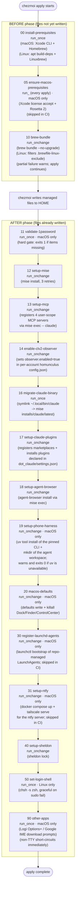

# Lifecycle scripts: ordering & trigger model

🌐 日本語: [lifecycle-scripts.ja.md](lifecycle-scripts.ja.md)

← [Docs index](../README.md)

chezmoi runs shell scripts alongside managed files during `chezmoi apply`. These **lifecycle scripts** handle the imperative, side-effectful provisioning that cannot be expressed as managed target files: installing Homebrew, running `brew bundle`, validating 1Password, installing mise toolchains, registering MCP servers, and more.

---

## Two-phase execution model

chezmoi separates script execution into two phases relative to writing managed files:

- **`before_` phase** — scripts run _before_ any target file is written to `$HOME`.
- **`after_` phase** — scripts run _after_ all managed files are in place.

Within each phase, scripts execute in **alphabetical order by target name** — the source filename with its `run_` / `once_` / `onchange_` / `before_` / `after_` attributes stripped. Because every script name uses a two-digit numeric prefix (`00-`, `05-`, `10-`, `11-`, …), the execution order is deterministic and easy to reason about.

The distinction between target name and source filename matters once a script carries a different set of attributes from its neighbours: `run_before_05-…` sorts *before* `run_once_before_00-…` as a raw filename, but runs *after* it, because chezmoi compares `05-…` against `00-…`.

### Full apply timeline


```mermaid
flowchart TD
    A([chezmoi apply starts]) --> B

    subgraph BEFORE ["BEFORE phase (files not yet written)"]
        B["00 install-prerequisites\nrun_once\n(macOS: Xcode CLI + Homebrew)\n(Linux: apt build-deps + Linuxbrew)"]
        B --> B2["05 ensure-macos-prerequisites\nrun_ (every apply) · macOS only\n(Xcode license accept + Rosetta 2)\n(skipped in CI)"]
        B2 --> C["10 brew-bundle\nrun_onchange\n(brew bundle --no-upgrade)\n(Linux: filters .brewfile-linux-exclude)\n(partial failure warns; apply continues)"]
    end

    C --> FILES[chezmoi writes managed files to HOME]

    FILES --> D

    subgraph AFTER ["AFTER phase (files already written)"]
        D["11 validate-1password\nrun_once · macOS only\n(hard gate: exits 1 if items missing)"]
        D --> E["12 setup-mise\nrun_onchange\n(mise install, 3 retries)"]
        E --> F["13 setup-mcp\nrun_onchange\n(registers 4 user-scope MCP servers\nvia mise exec -- claude)"]
        F --> G["14 enable-clv2-observer\nrun_onchange\n(sets observer.enabled=true\nin per-account homunculus config.json)"]
        G --> H["16 migrate-claude-binary\nrun_once\n(symlink ~/.local/bin/claude\n-> mise installs/claude/latest)"]
        H --> H2["17 setup-claude-plugins\nrun_onchange\n(registers marketplaces + installs plugins\ndeclared in dot_claude/settings.json)"]
        H2 --> I["18 setup-agent-browser\nrun_onchange\n(agent-browser install via mise exec)"]
        I --> I2["19 setup-phone-harness\nrun_onchange · macOS only\n(uv tool install of the pinned CLI +\nmkdir of the agent workspace;\nwarns and exits 0 if uv is unavailable)"]
        I2 --> J["20 macos-defaults\nrun_onchange · macOS only\n(defaults write + killall Dock/Finder/ControlCenter)"]
        J --> J2["30 register-launchd-agents\nrun_onchange · macOS only\n(launchctl bootstrap of repo-managed\nLaunchAgents; skipped in CI)"]
        J2 --> J3["31 setup-ntfy\nrun_onchange · macOS only\n(docker compose up + tailscale serve\nfor the ntfy server; skipped in CI)"]
        J3 --> K["40 setup-sheldon\nrun_onchange\n(sheldon lock)"]
        K --> L["50 set-login-shell\nrun_once · Linux only\n(chsh -s zsh, graceful on sudo fail)"]
        L --> M["90 other-apps\nrun_once · macOS only\n(Logi Options+ / Google IME download prompts)\n(non-TTY short-circuits immediately)"]
    end

    M --> N([apply complete])
```

---

## `run_once` vs `run_onchange`

Both script types are Go templates (`.tmpl`) rendered at apply time. The difference is in how chezmoi decides whether to re-run them.

| Attribute | `run_once_` | `run_onchange_` |
|-----------|-------------|-----------------|
| **Trigger** | Runs exactly once per unique rendered content | Re-runs whenever the rendered content changes |
| **State key** | sha256 of the **rendered** script body | sha256 of the **rendered** script body |
| **Typical use** | Prerequisites that are expensive or irreversible (Homebrew install, login shell change, binary launcher creation) | Idempotent sync steps that must stay current (brew bundle, mise install, MCP registration) |

### The embedded-hash trick

`run_onchange_` scripts track the _script body_. To make a script re-trigger when an **external file** changes (not the script itself), embed that file's sha256 in a leading comment:

```bash
# Brewfile hash: {{ include "dot_Brewfile" | sha256sum }}
```

When `dot_Brewfile` changes, the rendered comment line changes, the script body hash changes, and chezmoi re-runs the script. Scripts that use this pattern:

| Script | Tracked external |
|--------|-----------------|
| `10-brew-bundle` | `dot_Brewfile` |
| `12-setup-mise` | `dot_config/mise/config.toml` |
| `17-setup-claude-plugins` | `dot_claude/settings.json` |
| `18-setup-agent-browser` | `dot_config/mise/config.toml` |
| `30-register-launchd-agents` | `Library/LaunchAgents/dev.kryota.morning-radar.plist.tmpl` + `Library/LaunchAgents/dev.kryota.knowledge-distill.plist.tmpl` + `Library/LaunchAgents/dev.kryota.macos-defaults-drift.plist.tmpl` |
| `31-setup-ntfy` | `dot_config/ntfy/compose.yaml.tmpl` + `dot_config/ntfy/private_server.yml.tmpl` + `dot_config/ntfy/lib.sh.tmpl` |
| `40-setup-sheldon` | `dot_config/sheldon/plugins.toml` |
| `20-macos-defaults` | its own source file (any edit re-triggers) |

`20-macos-defaults` uses a `joinPath` self-hash — editing the script itself is enough to re-apply all macOS `defaults write` calls.

`19-setup-phone-harness` is a variant of the same idea with no hash at all: it interpolates the tracked **value** directly rather than a file digest.

```bash
# phone-harness version: {{ .phone_harness.version }}
```

Moving `[phone_harness].version` in `.chezmoidata.toml` changes the rendered body, so the script re-runs and `uv tool install` swaps to the new release. Any other edit to `.chezmoidata.toml` leaves this script's body untouched — a file-level `include | sha256sum` would have re-run it on every unrelated pin bump in that file.

`17-setup-claude-plugins` reaches the same result without a hash: it reads
`dot_claude/settings.json` with `include | fromJson` and embeds just the `enabledPlugins` and
`extraKnownMarketplaces` objects into the script body as JSON, inside a quoted heredoc. That keeps
one source of truth *and* re-triggers the script precisely when the declaration changes — an
unrelated edit elsewhere in settings.json leaves the rendered body untouched. The quoted heredoc
matters: rendering the values into bash array literals would let a value containing a quote or
`$(...)` execute as script source at render time.

---

## OS guards

Scripts use chezmoi template guards to select the appropriate behavior per OS.

| Script | OS scope | Guard mechanism |
|--------|----------|-----------------|
| `00-install-prerequisites` | dual | Two full `{{ if darwin }}` / `{{ else if linux }}` blocks; each has its own shebang |
| `05-ensure-macos-prerequisites` | **macOS only** | Entire body inside `{{ if darwin }}`; renders to zero bytes on Linux. The Rosetta block sits inside a nested `{{ if arm64 }}` |
| `10-brew-bundle` | dual | Single shebang; `{{ if linux }}` switches to filtered-Brewfile path |
| `11-validate-1password` | **macOS only** | Non-darwin exits 0 at line 2 before `set -euo pipefail` |
| `12-setup-mise` | dual | `{{ if linux }}` adds `MISE_NODE_VERIFY=false` |
| `13-setup-mcp` | both | No OS guard; both accounts processed |
| `14-enable-clv2-observer` | both | No OS guard |
| `16-migrate-claude-binary` | both | No OS guard; guards on binary existance at runtime |
| `17-setup-claude-plugins` | both | No OS guard; both accounts processed |
| `18-setup-agent-browser` | dual | `{{ if linux }}` adds `--with-deps` |
| `19-setup-phone-harness` | **macOS only** | Entire body inside `{{ if darwin }}`; renders to zero bytes on Linux (the CLI needs pyobjc) |
| `20-macos-defaults` | **macOS only** | Entire body inside `{{ if darwin }}`; renders near-empty on Linux |
| `30-register-launchd-agents` | **macOS only** | Entire body inside `{{ if darwin }}`; renders near-empty on Linux |
| `31-setup-ntfy` | **macOS only** | Entire body inside `{{ if darwin }}`; renders near-empty on Linux |
| `40-setup-sheldon` | both | No OS guard |
| `50-set-login-shell` | **Linux only** | Entire body inside `{{ if linux }}`; renders near-empty on macOS |
| `90-other-apps` | **macOS only** | Entire body inside `{{ if darwin }}`; renders near-empty on Linux |

---

## Script-by-script reference

### 00 — install-prerequisites (`run_once`, before)

Installs Xcode CLI tools (macOS, polling until `xcode-select -p` succeeds) and Homebrew (arch-aware shellenv: `/opt/homebrew` on arm64, `/usr/local` on intel). On Linux installs `build-essential curl file git` via `apt-get` then Linuxbrew. Runs once per rendered content so a re-run of `chezmoi apply` never repeats the Homebrew install.

This script deliberately holds only the genuinely once-per-machine, heavyweight installs. Rosetta 2 used to live here and moved to 05 for the reason described below.

### 05 — ensure-macos-prerequisites (`run_`, before, macOS only)

Re-establishes two macOS prerequisites that `brew bundle` depends on and that can silently disappear from an already-provisioned machine:

- **Xcode license.** Homebrew refuses to run at all — `You have not agreed to the Xcode license` — when a developer directory is selected and the license has not been accepted, so an unaccepted license takes 10 down before it installs anything. The probe is copied from Homebrew's own check in `Library/Homebrew/brew.sh`: a non-zero `xcrun --find clang` whose output mentions the license, gated on a non-empty `xcode-select -p`. Reusing brew's exact test means the script accepts precisely when brew would otherwise abort and never prompts for `sudo` on any other machine, including Command Line Tools-only installs. On a brand-new Mac this is inherently two-phase: Xcode.app itself arrives via `mas "Xcode"` during 10, so the license gate can only appear on the *next* apply.
- **Rosetta 2** (Apple Silicon only, inside a `{{ if arm64 }}` guard). Intel-only payloads in the Brewfile — the `sony-ps-remote-play` cask and the `PicGIF Lite` App Store app — ship x86_64 installers that refuse to run without it. The guard is idempotent: `arch -x86_64` can only execute the x86_64 slice of a universal binary once Rosetta is present, and `/usr/bin/true` is universal.

**Why a bare `run_` rather than `run_once_` or `run_onchange_`.** The state this script repairs lives on the machine, not in the source tree. `run_once_` keys on the SHA256 of its own rendered content recorded in chezmoi's persistent state, so once it has run on a machine it never runs there again — which is exactly how a Rosetta 2 install lost to a macOS upgrade stayed lost even though 00 "had already installed it". `run_onchange_` is no better: it re-runs when the *script* changes, and the script is not what changed. Only an always-run script re-probes every time. Both probes are cheap no-ops on a healthy machine, so the cost is a few `exec`s per apply.

Neither repair is allowed to fail the apply: each warns and continues. A non-zero exit from a `before_` script aborts everything downstream, which is the failure mode this script exists to prevent, not create. CI is skipped outright via `[ -n "${CI:-}" ]` so runners are never prompted for `sudo` — the same in-script approach 30 and 31 use, which keeps the render/apply path CI-validated rather than deleting the script from the workflow.

### 10 — brew-bundle (`run_onchange`, before)

Runs `brew bundle --no-upgrade` against `dot_Brewfile`. On Linux, filters the Brewfile through `.brewfile-linux-exclude` (a `grep -E` pattern list at the repo root) via a temp file, then passes only `tap`/`brew` lines that survive the filter. The Brewfile sha256 is embedded in the first comment line as the change key.

**Failure policy.** `brew bundle` exits non-zero when *any* entry fails, and this is a `before_` script, so propagating that status aborts the whole apply before a single dotfile is written. A retired App Store app or an Intel-only cask must not cost the user their shell config, so a partial failure prints a boxed warning listing what was skipped and the script exits 0; the success line `Brew bundle complete.` is printed only on a clean run. The exit code alone cannot distinguish this from "could not run at all" — a missing Brewfile also exits 1 — so the two fatal conditions (`brew` not on `PATH`, Brewfile unreadable) are preflighted explicitly and still `exit 1`. This applies identically on macOS and Linux. CI is unaffected: `setup-validation.yml` moves this script aside and runs its own strict `brew bundle` against a filtered Brewfile, so Brewfile breakage is still caught there.

### 11 — validate-1password (`run_once`, after, macOS only)

Hard gate. Verifies `op` is installed and authenticated, then calls `op read` on each of the <!-- FACT:onepassword-vault-item-count -->4<!-- /FACT --> required vault references:

- `op://kryota.dev/Dotfiles - AWS Config/notesPlain`
- `op://kryota.dev/Dotfiles - Exa API/credential`
- `op://kryota.dev/Dotfiles - Firecrawl API/credential`
- `op://kryota.dev/Dotfiles - Redact Patterns/pattern`

(The `Dotfiles - ntfy` item is intentionally absent from this list: it is outside the validation gate entirely, not just one field of it. It holds only the read-only `subscriber-username`/`subscriber-password` device-login credential, and `ntfy-setup` — not this script — auto-creates and fills it after `chezmoi apply`, once Tailscale/Docker are up. There is no `base-url` field any more: the tailnet MagicDNS name is never stored, only derived on demand. The write-only publisher token also never touches 1Password — script 31 writes it straight into `~/.config/ntfy/notify-env` as runtime state.)

For the `Dotfiles - Redact Patterns` item the script goes further than a simple existence check: it also verifies the pattern is non-empty, contains no `'''` (which would break the TOML raw-string literal in `private_gitleaks-own.toml.tmpl`), and compiles as a valid regex. A broken pattern would otherwise allow `chezmoi apply` to succeed while silently disabling the client-identifier gitleaks rule on every commit in own-namespace repos.

Any failure exits non-zero, which aborts the after-phase. The item list here must stay in sync with what `claude-secrets.zsh`, the AWS config template, and `private_gitleaks-own.toml.tmpl` actually consume.

### 12 — setup-mise (`run_onchange`, after)

Runs `mise install --yes` with up to 3 retry attempts (backoff: 10 s, 20 s). Sources `GITHUB_TOKEN` from `gh auth token` as a best-effort rate-limit bypass (gh may itself not be installed yet on the very first apply). Sets `MISE_NODE_VERIFY=false` on Linux to avoid GPG keyring errors during Node installation.

### 13 — setup-mcp (`run_onchange`, after)

Registers four user-scope Claude Code MCP servers (`context7`, `deepwiki`, `exa`, `firecrawl`) in both `~/.claude` and `~/.claude-r06` via `claude mcp add-json --scope user`. Invokes `claude` through `mise exec -- claude` rather than relying on PATH — on a fresh apply the `~/.local/bin/claude` launcher symlink does not yet exist (that is created by script 16). Fails non-zero on any registration error so chezmoi marks the run incomplete and retries on the next apply.

**Secret model**: the exa and firecrawl JSON configs store the literal string `${EXA_API_KEY}` / `${FIRECRAWL_API_KEY}` (single-quoted in the shell so the script never expands them). Claude Code expands these placeholders at MCP server spawn from the process environment. The actual keys sit only in the 0600 `~/.config/zsh/claude-secrets.zsh` rendered from 1Password, and are injected per-account by the `claude` launcher wrapper (`~/.local/launchers/claude`). Keys never appear in `.claude.json` at rest.

### 14 — enable-clv2-observer (`run_onchange`, after)

Sets `observer.enabled = true` in each per-account `~/.local/share/ecc-homunculus-<slug>/config.json` (`<slug>` is `default` for `~/.claude`, the `.claude-` suffix otherwise) via an atomic `jq` merge (write to a temp file, `mv` into place). Writes to the per-account runtime state directory rather than the chezmoi-managed CLV2 skill directory so the flag survives the external's 168-hour refresh cycle. Prefers a PATH `jq`; falls back to `mise exec -- jq`; exits non-zero if neither is available (so chezmoi retries).

### 16 — migrate-claude-binary (`run_once`, after)

Creates `~/.local/bin/claude` as a symlink pointing to `~/.local/share/mise/installs/claude/latest/claude`. Combined with `DISABLE_INSTALLATION_CHECKS=1` in `settings.json`, this lets mise own the binary version while Claude Code's native-install self-check remains satisfied. The native `~/.local/share/claude` installation (if present) is deliberately left in place: its `ClaudeCode.app` bundle provides a macOS app identity (microphone, Apple Events) that the bare mise binary lacks. Guards on the mise binary being functional before acting; exits 0 with a warning otherwise.

### 18 — setup-agent-browser (`run_onchange`, after)

Runs `mise exec -- agent-browser install` (with `--with-deps` on Linux to pull system libraries). Re-triggered by the mise config hash so a version bump re-installs matching browser binaries. Fails gracefully (exit 0 + warning) when the install command fails.

### 20 — macos-defaults (`run_onchange`, after, macOS only)

Applies `defaults write` across the managed domains below, then runs `killall Dock Finder
SystemUIServer ControlCenter` to apply them immediately. Self-hashes using `joinPath
.chezmoi.sourceDir` so any edit to the script body re-triggers it.

**Managed domains**: `com.apple.HIToolbox` (Fn key usage), `NSGlobalDomain` (keyboard/Full
Keyboard Access, scroll bars, spring loading, trackpad force-click and tracking speed,
volume-change sound feedback), `com.apple.desktopservices` (suppress `.DS_Store` on
network/USB volumes),
`com.apple.dock` (auto-hide, icon size, Spaces reordering, recent-apps display),
`com.apple.finder` (hidden files, desktop drive icons, status/path bar, default view
style), `com.apple.menuextra.clock` (menu bar clock display format via the discrete
Big Sur+ keys — see below), and `com.apple.terminal` (string encoding).

**Known-dead keys already fixed**: `AppleKeyboardUIMode` was `3` ("Enabled on older macOS
versions"), which stopped enabling Full Keyboard Access starting with Sonoma — the script
now writes `2` ("Enabled on Sonoma or later"); the value moved, the key did not
(nix-darwin/nix-darwin#1378, #1501). `com.apple.menuextra.clock DateFormat` (a single
format string) stopped being honored once the Big Sur+ Control Center redesign replaced
it with discrete keys (`IsAnalog`, `Show24Hour`, `ShowAMPM`, `ShowDate`, `ShowDayOfWeek`,
`ShowSeconds`); the reload target also moved from `SystemUIServer` to `ControlCenter`
(tech-otaku/menu-bar-clock). `ApplePressAndHoldEnabled` was evaluated and intentionally
**not** added: it is unreliable on Sonoma/Sequoia with no confirmed `defaults`-based
replacement (geerlingguy/mac-dev-playbook#210).

**Known limitations**: TCC/privacy settings (Full Disk Access, camera/microphone
permissions, etc.) and non-plist or sandboxed app settings (Safari, Mail, and similar)
cannot be managed via `defaults write` and are out of scope for this script. Dock icon
layout (`persistent-apps`/`persistent-others`), hot corners, and custom Terminal profile
themes are deliberately excluded — they are either destructive to an existing machine's
state or require shipping additional files beyond a `defaults write` line.

This script only applies settings at `chezmoi apply` time — it never notices when a
managed setting drifts afterward (e.g. changed via System Settings UI). The
`dev.kryota.macos-defaults-drift` LaunchAgent (kryota-dev/dotfiles#365, registered by
`30-register-launchd-agents` below) closes that gap: weekly, it replays this script's
`defaults write` lines against a scratch plist to derive the expected value for each
managed key, compares that against the live value, and notifies via ntfy
(`topic_attention`) when they differ — detect-and-notify only, it never writes back to
this script or touches git.

### 30 — register-launchd-agents (`run_onchange`, after, macOS only)

Registers the repo-managed launchd LaunchAgents via a `labels=(...)` array and a shared
loop: `dev.kryota.morning-radar` (weekday-morning brief, kryota-dev/dotfiles#257; see
[Scheduled morning radar](../agents/claude-code.md) in the Claude Code harness doc),
`dev.kryota.knowledge-distill` (weekly knowledge-distill radar, kryota-dev/dotfiles#368),
and `dev.kryota.macos-defaults-drift` (weekly `20-macos-defaults` drift check described
above, kryota-dev/dotfiles#365). For each label the loop performs `launchctl bootout ||
true` then `launchctl bootstrap gui/$UID`, so a changed plist is reloaded idempotently;
each plist template's embedded hash is the re-trigger key (wrapper-script edits need no
re-registration — launchd execs the current file on every fire). A bootstrap failure for
one label sets a non-zero exit status but continues registering the remaining labels
(`continue` in the loop), rather than aborting the whole script on the first failure.
Skips registration when `$CI` is set: headless runners have no gui launchd domain, and
the in-script guard keeps the render/apply path CI-validated (unlike excluding the file
in the workflow). Outside CI a bootstrap failure hard-fails so chezmoi retries on the
next apply (convention #6).

### 31 — setup-ntfy (`run_onchange`, after, macOS only)

Starts the self-hosted ntfy notification server (kryota-dev/dotfiles#337; see
[Notifications](notifications.md)) by sourcing the shared library
`~/.config/ntfy/lib.sh` (also deployed by chezmoi) — the single source of truth for
the whole ntfy lifecycle, so this apply-time path and the on-demand `ntfy-setup`
command can never drift. The library creates the runtime-state dir
(`~/Library/Application Support/ntfy`, 0700, outside the chezmoi target tree), runs
`docker compose up -d --remove-orphans` on `~/.config/ntfy/compose.yaml`, and asserts
the `tailscale serve --bg` mapping so the server stays reachable tailnet-wide over
HTTPS. It then auto-provisions auth idempotently: creates the publisher/subscriber
users and per-topic ACLs, writes the write-only publisher token straight into
`~/.config/ntfy/notify-env` (0600 runtime state, no 1Password round-trip and no
second apply), and — when the `op` CLI is present — creates (or repairs) the
read-only `subscriber` user with a generated password and stores it in the
`Dotfiles - ntfy` 1Password item (auto-created if absent). There is no `base-url`
any more; the tailnet MagicDNS name is never stored. A clean install self-heals
because notify-env is absent and gets rewritten; on an existing machine the exit-0
run means `chezmoi apply` alone will not re-fire it, restart a downed container, or
rotate a credential — recover with `ntfy-setup` (see the Notifications recovery
section). Re-triggered by the embedded hashes of the compose template, the server
config, and the library itself. Skips in CI (no services, no network).
**Intentional deviation from convention #6**: when Docker Desktop is not running (or
the tailscale CLI is missing) it warns and exits 0 instead of hard-failing —
notifications are not setup-critical and must never block `chezmoi apply`; each skip
path prints `ntfy-setup` as the recovery command.

### 40 — setup-sheldon (`run_onchange`, after)

Runs `sheldon lock` to regenerate the zsh plugin lockfile consumed by `.zshrc`. Re-triggered by the `plugins.toml` hash. Exits 0 with a warning when `sheldon` is not yet installed.

### 50 — set-login-shell (`run_once`, after, Linux only)

Adds `zsh` to `/etc/shells` (requires sudo; degrades to a printed remediation hint if password is needed) and calls `chsh -s zsh`. Never hard-fails; all failure paths exit 0 with instructions for the user to run manually.

### 90 — other-apps (`run_once`, after, macOS only)

Offers interactive download prompts for Logi Options+ and Google Japanese Input. Immediately exits 0 when `stdin` is not a TTY (`[[ ! -t 0 ]]`). Each prompt uses `read -t 30` with a 30-second timeout. Never runs in CI.

---

## Dependency chain

```
brew (00) → Homebrew packages incl. mise, sheldon (10)
         → mise toolchain: claude, jq, sheldon, agent-browser, gh … (12)
                         → MCP registration via mise exec -- claude (13)
                         → CLV2 observer enable via jq (14)
                         → claude launcher symlink (16)
                         → agent-browser browsers (18)
                         → sheldon lock (40)
1Password gate (11) → secrets available to subsequent steps
```

Scripts 13 and 14 invoke tools through `mise exec --` rather than via PATH because script 16 (which creates the `~/.local/bin/claude` launcher) has not yet run at that point. Script 18 also uses `mise exec --`, but for a different reason: it runs after 16, so the launcher exists; however `mise exec --` ensures the mise-pinned `agent-browser` binary is invoked rather than a stale earlier-on-PATH version.

---

## Conventions for adding scripts

1. Choose a prefix that slots naturally into the ordered timeline. Current slots with gaps: `…01-04…06-09…` (before phase), `…15…17…19…32-39…` (before 40), `…41-49…` (between sheldon and login-shell).
2. Use `run_once_` for expensive/irreversible operations; `run_onchange_` for idempotent sync; a bare `run_` (no `once_`/`onchange_`) when the script must re-probe **machine** state that can regress outside the source tree, since neither of the other two attributes can notice that — see 05.
3. For `run_onchange_` scripts that must react to an external file, embed `{{ include "<path>" | sha256sum }}` in a leading comment.
4. Start every script with `#!/bin/bash` and `set -euo pipefail` — or place the shebang inside the OS template guard if the entire script is OS-specific.
5. Tools installed by mise that may not yet be on PATH must be invoked via `mise exec -- <tool>` on scripts that may run before 16.
6. Hard-fail (`exit 1`) when a silent skip would mark a `run_onchange` "done" and prevent future retries. Warn-and-exit-0 is appropriate when the tool is genuinely optional for the current machine state. Weigh this harder in the `before_` phase: a non-zero exit there aborts the apply before any managed file is written and before every after-script, so reserve it for conditions that make the rest of the apply meaningless — see 10's preflight versus its tolerance of individual Brewfile entries failing.

---

## Cross-references

- [chezmoi engine: data, templates & name decoding](chezmoi-engine.md) — template syntax and variable inventory
- [Developer toolchain: mise, Brewfile & git](dev-tooling.md) — the tools these scripts install
- [zsh startup, prompt & shell modules](shell-environment.md) — what script 40 locks and script 50 assumes
- [1Password secrets onboarding](../getting-started/secrets-1password.md) — the four vault items script 11 validates
- [CI architecture & test suite](../contributing/ci-and-tests.md) — how `setup-validation.yml` re-implements the Brewfile filter
