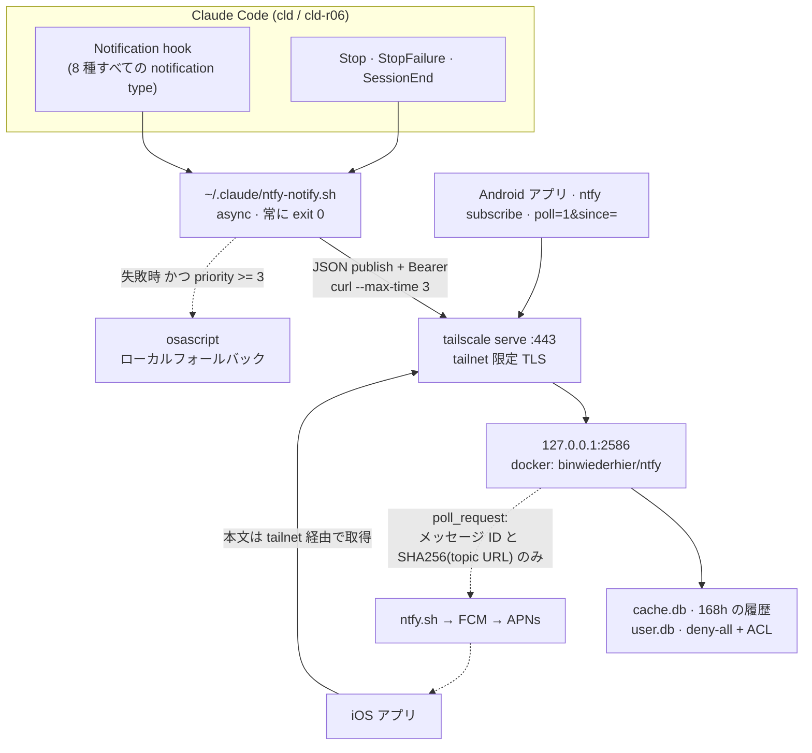

# 通知チャネル: Tailscale 越しのセルフホスト ntfy

> 🌐 English (canonical): [notifications.md](notifications.md)

Claude Code のセッションは、注意を要するイベントをこの Mac 上で動く セルフホスト
[ntfy](https://ntfy.sh) サーバへ publish し、tailnet 上の全デバイスから受け取れます。
これは ECC の `stop:desktop-notify` フックを置き換えたものです。旧フックは `Stop` でしか
発火せず、ローカル限定で、履歴を持たず、どのセッション・リポジトリ・アカウント由来かを
示せませんでした。

このチャネルは **無効の状態で配布** されます。chezmoi では実行できない 1 回限りの手動
ブートストラップが必要なためで、それまではフックはローカル通知にフォールバックします
（＝置き換え前のフックと同じ挙動）。

---

## トポロジ



### ピン留めされた値

以下はこのページの記述が依存している数値です。`tests/docs_facts.bats` が各値をソースと
照合するため、実装からドキュメントが乖離することはありません。

| 値 | SSOT | 現在値 |
|---|---|---|
| ループバックポート | `home/dot_config/ntfy/compose.yaml.tmpl` のポート公開 | <!-- FACT:ntfy-loopback-port -->2586<!-- /FACT --> |
| 履歴の保持期間（時間） | `home/dot_config/ntfy/private_server.yml.tmpl` の `cache-duration` | <!-- FACT:ntfy-cache-duration-hours -->168<!-- /FACT --> |
| 要約の長さ（コードポイント） | `home/dot_claude/executable_ntfy-notify.sh` の `SUMMARY_MAX_CHARS` | <!-- FACT:ntfy-summary-max-chars -->200<!-- /FACT --> |

コンテナイメージのタグは意図的にここへ固定していません。Renovate が bump する値であり、
本リポジトリの docs 規約では volatile な値はマーカーではなくソースへのポインタとして扱うためです。
実体は `home/.chezmoidata.toml` の `[ntfy].image` にあります。

### なぜネイティブバイナリではなく Docker なのか

上流の記述は明確です: *"Only the ntfy CLI is supported on macOS. ntfy server is currently
not supported."*。homebrew-core も macOS formula を `-tags noserver` でビルドしているため、
Brewfile の `ntfy` には `serve` サブコマンドが**そもそも存在せず**、publish と subscribe しか
できません。Docker Desktop（`docker-desktop` として Brewfile 管理済み）上の公式 Linux
イメージが、この環境でセルフホストする唯一のサポート経路です。

LaunchAgent は登録しません。`restart: unless-stopped` と Docker Desktop 自身のログイン時
起動が既にコンテナを監督しており、2 つ目のスーパーバイザは競合するだけです。

### なぜ直接 bind ではなく `tailscale serve` なのか

コンテナは `127.0.0.1:2586` にのみ publish します。`tailscale serve --bg --https=443` が
ノードの tailnet 証明書でその前段に立ちます。これ 1 つで、LAN への露出なし・証明書管理
なしの TLS・`100.x` リテラルではなく安定した MagicDNS 名、そして（そのホスト名を 1Password
に置くことで）**public リポジトリにマシンを特定する情報を書かずに済む**、が同時に得られます。
`behind-proxy: true` により、プロキシ越しでも ntfy が実クライアント IP を読めます。

---

## イベント・優先度・属性付け

`Notification` フックは **matcher なし** で配線しています。hooks リファレンス上、matcher を
省略すると全 notification type で発火するためです。下表のマッピングは `ntfy-notify.sh` 内の
単一の `case` ブロックに置き、matcher グループへ分割して乖離するのを避けています。

| Hook イベント | `notification_type` | 優先度 | 意味 |
|---|---|---|---|
| `Notification` | `permission_prompt`, `agent_needs_input`, `elicitation_dialog` | 4 | ブロック中。今すぐ人間が必要 |
| `Notification` | `idle_prompt` | 4 | 待たれている |
| `Notification` | `agent_completed` | 3 | エージェント完了 |
| `Notification` | `auth_success`, `elicitation_complete`, `elicitation_response` | 1 | 履歴のみ・無音 |
| `Stop` | — | 3 | あなたのターン |
| `StopFailure` | — | 5 | ターンが失敗した |
| `SessionEnd` | — | 1 | 履歴のみ・無音 |

topic は 1 つで全イベントを運びます。ntfy は優先度別の通知チャンネルを既に持っており端末側で
音・DND を制御でき、履歴 API は tag でフィルタできるため、イベント種別ごとに topic を分けても
購読 8 件と ACL 8 件が増えるだけで利得がありません。topic は設定値なので、後から分割する場合も
設計変更ではなく設定変更で済みます。

各メッセージが持つ情報:

| フィールド | 内容 |
|---|---|
| **title** | `<repo>/<branch> · <account>`（account は `CLAUDE_CONFIG_DIR` から解決した `cld` / `r06`） |
| **tags** | emoji タグ 1 つ、加えて `evt-…` / `repo-…` / `branch-…` / `acct-…` / `sid-…`（session id 先頭 8 文字） |
| **message** | 実質的な本文の 1 行目を 200 コードポイントで切り詰めたもの |

リポジトリ名は `--show-toplevel` ではなく git の **common dir** から取ります。この環境の
ワークツリーはブランチ名で命名されるため、toplevel の basename だとリポジトリ名が
`feat/337-x` になってしまうからです。tag の各要素は `[A-Za-z0-9_-]` に丸められるので、
スラッシュやカンマを含むブランチ名が tag リストを分断することはありません。

要約は、空行判定の前に行頭の Markdown 装飾を除去します。水平線・コードフェンス・空の箇条書きは
次の行へ読み飛ばされ、`## 完了` は `完了` として届きます。

---

## 失敗時の挙動

フックは `async`、curl のタイムアウトは 3 秒、そして **常に exit 0** します。このチャネルが
セッションをブロックしたり失敗させたりすることはありません。

| 失敗 | 挙動 |
|---|---|
| 未ブートストラップ（`~/.config/ntfy/notify-env` なし） | priority ≥ 3 ならローカル `osascript` 通知 |
| `jq` / `curl` が無い | 汎用のローカル通知 |
| Docker Desktop 停止・サーバ到達不可・非 2xx・タイムアウト | priority ≥ 3 ならローカル通知 |
| 不正または空の hook ペイロード | 空として扱い、汎用要約で publish は継続 |
| git 外の `cwd` / detached HEAD / `CLAUDE_CONFIG_DIR` 未設定 | 空フィールドではなくリテラルの代替値 |

priority ≥ 3 のしきい値は load-bearing です。最低優先度のライフサイクルイベントはサーバ側
履歴のために存在しており、これらまでデスクトップ通知にフォールバックすると、`Stop` のみの
ECC フックを廃止したことが**ローカル通知量の増加**になってしまいます。

**Docker Desktop が起動していない間、その期間の履歴は記録されません。** ローカル通知は
引き続き出ます。ライフサイクルスクリプトから Docker Desktop を強制起動する案は、侵襲的すぎる
として却下しました。

ローカルフォールバックは macOS では `osascript`、それ以外では `notify-send` を使います。
置き換え対象の ECC `stop:desktop-notify` は PowerShell BurntToast 経由で WSL もカバーして
いましたが、その経路は**引き継いでいません**。したがって WSL ではサーバ到達不可時に通知が
失われます。主経路である ntfy publish は WSL でも通常どおり動くため、影響はオフライン時のみです。

AppleScript フォールバックは、`display notification "…"` に埋め込む前にバックスラッシュを
除去し `"` を曲線引用符に置換します。AppleScript の文字列リテラルにはバックスラッシュ
エスケープ構文が無いため、アシスタントの応答に含まれる素の引用符がそのままだと生成される
スクリプト自体が壊れます。

---

## セキュリティ姿勢と残存リスク

チャネルは 3 層で守られています: tailnet 境界（`tailscale serve` が唯一のイングレス）、
ntfy 自身の `auth-default-access: deny-all` + topic 単位 ACL、そして 1Password から
レンダリングされる `0600` のトークン。**それでも覆えない範囲**を明示しておきます。

- **アシスタントの応答テキストはマシンの外へ出ます。** 上表でピン留めした長さまで
  （ターンの最初の散文行）が publish され、購読中の全デバイスに配信され、サーバの
  SQLite キャッシュに保持期間中残ります。このテキストに対する secret スキャンはありません。
  ターンの締めくくりに認証情報が出力されていた場合、その断片は tailnet 上を流れ、保持期間中
  残存します。tailnet の外へは出ません（上流中継は本文を運びません）が、**通知履歴は
  それを生んだセッションと同程度に機微**として扱ってください。自動 redaction は検討のうえ
  意図的に見送りました。部分的なパターン照合は、実際には保証できないものを保証したかのように
  見せてしまうためです。
- **ループバック束縛はローカル隔離ではありません。** `127.0.0.1:2586` が防ぐのは
  *ネットワーク越し*の到達だけで、この Mac 上の他プロセスが `tailscale serve` を迂回して
  直接接続することは防ぎません。`behind-proxy: true` により ntfy は `X-Forwarded-For` を
  信頼するため、そうしたローカル呼び出し元は visitor IP を偽装してレート制限を回避することも
  できます。**実際のアクセス制御は bind アドレスではなく ntfy の deny-all ACL です。**
- **web アプリは tailnet から到達できます。** これは意図的に有効のままです（デスクトップから
  履歴を閲覧する手段そのもの）。メッセージの閲覧には結局トークンが必要です。
- **publish トークンはフックの `curl` の argv に現れます。** 同一ユーザーで動く他プロセスが
  `ps` から読み取れます。これは修正ではなく受容としました。**argv を読めるプロセスは同一
  ユーザーで動いており、その時点で `0600` の env ファイルを直接読めるため、権限境界を
  跨がず、トークンを取得できる主体は増えません。**

## 有効化フラグ

`home/.chezmoidata.toml` に `[ntfy].enabled` があり、false の間は `home/.chezmoiignore` が
`.config/ntfy` ターゲット全体をスキップします。

これは見た目以上に重要です。**ターゲットを ignore するとテンプレートの評価自体も行われない**
ため、`Dotfiles - ntfy` アイテムを持たないマシン（および CI ランナー）で `onepasswordRead` に
到達しません。このフラグが無ければ、この機能をマージした時点で vault アイテムが作られるまで
`chezmoi apply` が全環境で壊れ、両 CI ジョブの「Exclude CI-incompatible files」にも追加が
必要になっていました。

`dot_claude/settings.json` のフック配線は意図的にゲートしていません。同ファイルは
テンプレートではなくプレーンファイルだからです。ブートストラップ前はフックが単に
フォールバック経路を通ります。

---

## 1 回限りのブートストラップ

1. **1Password アイテムを作成する。** `kryota.dev` vault に `Dotfiles - ntfy` を作り、
   3 つのフィールドを用意します（[1Password シークレット導入](../getting-started/secrets-1password.ja.md) 参照）。
   `token` はこの時点では空で構いません。
   - `base_url` — `https://<node>.<tailnet>.ts.net`（`tailscale status --json` で確認）
   - `topic` — `[A-Za-z0-9_-]` の 1〜64 文字。推測されにくいサフィックスを付ける
   - `token` — 手順 4 で記入
2. **チャネルを有効化する。** `home/.chezmoidata.toml` の `[ntfy]` で `enabled = true` に
   してから `chezmoi apply`。設定がレンダリングされ、コンテナが起動し、tailnet に公開されます。
3. **ユーザーと ACL を作成する**（コンテナ内で 1 回だけ）:
   ```bash
   docker exec -it ntfy ntfy user add <username>
   docker exec -it ntfy ntfy access <username> <topic> rw
   ```
4. **トークンを発行**して 1Password アイテムの `token` フィールドに保存し、`notify-env` に
   反映するため再度 `chezmoi apply`:
   ```bash
   docker exec -it ntfy ntfy token add <username>
   ```
5. **各デバイスから購読する。** ntfy アプリでサーバ URL（`base_url`）を追加し、トークンで
   サインインして topic を購読します。

`tailscale serve` が権限エラーを返す場合は、CLI に operator 権限を 1 回だけ付与します:

```bash
sudo tailscale set --operator=$USER
```

セットアップスクリプトはこの remedy をそのまま表示し、apply を失敗させずに exit 0 します。

---

## iOS の即時配信と、tailnet の外へ出る情報

`upstream-base-url: "https://ntfy.sh"` を設定しています。セルフホストサーバは APNs に到達
できないため、ntfy は *poll request* を上流へ転送し、ntfy.sh が Firebase 経由で APNs へ
中継、端末はその後 tailnet 越しに本サーバから実メッセージを取得します。

ntfy.sh が受け取るのは **メッセージ ID・topic URL の SHA256・発生タイミング** だけで、
タイトル・本文・タグ・属性情報は一切渡りません。その時点で端末が tailnet に到達できない
場合は、汎用の「New message」ポップアップが表示されます。

この設定が無い場合、上流ドキュメントは iOS への配信に最大で数時間かかるとしています。
Android は自前の接続を維持するため、どちらでも影響を受けません。

---

## 運用

```bash
# コンテナの状態とログ
docker compose --file ~/.config/ntfy/compose.yaml ps
docker compose --file ~/.config/ntfy/compose.yaml logs --tail 50

# 履歴をフィルタして読み返す（vault アイテムの base_url / topic / token が必要）
curl -H "Authorization: Bearer $TOKEN" \
  "$BASE_URL/$TOPIC/json?poll=1&since=24h&tags=evt-permission-prompt"

# tailnet に何が公開されているか
tailscale serve status
```

再構成は `run_onchange_after_31-setup-ntfy` が担当し、[ライフサイクルスクリプト](lifecycle-scripts.ja.md)
に記載しています。compose ファイルまたはサーバ設定が変わるたびに再実行され、Docker デーモンに
到達できないときは失敗せず警告し、CI では no-op です。

---

## 関連

- [ライフサイクルスクリプト](lifecycle-scripts.ja.md) — apply タイムライン上の script 31 の位置
- [Claude Code ハーネス設定](../agents/claude-code.ja.md) — `settings.json` の残りの部分
- [シークレットとアカウント分離の設計](../explanation/secrets-and-isolation.ja.md) — 本機能が従う `op://` → `0600` のレンダリングモデル
- [1Password シークレット導入](../getting-started/secrets-1password.ja.md) — vault アイテム

[docs/README.ja.md →](../README.ja.md)
