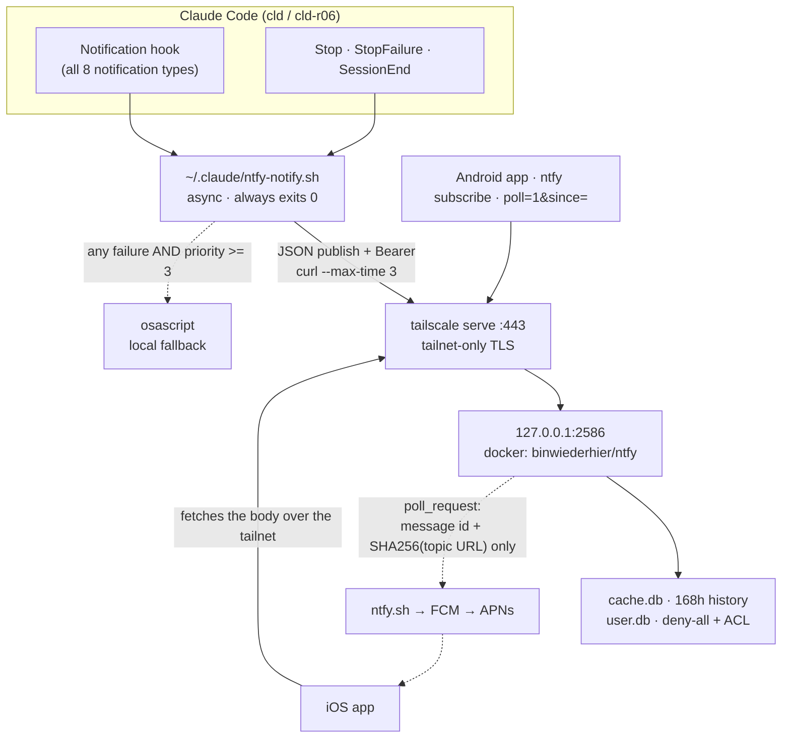

# Notification channel: self-hosted ntfy over Tailscale

> 🌐 日本語: [notifications.ja.md](notifications.ja.md)

Claude Code sessions publish their attention-worthy events to a self-hosted
[ntfy](https://ntfy.sh) server running on this Mac, reachable from every device on the
tailnet. This replaced the ECC `stop:desktop-notify` hook, which fired only on `Stop`,
only locally, kept no history, and could not say which session, repo or account a
notification came from.

The channel ships **disabled**. It needs a one-time manual bootstrap that chezmoi cannot
perform; until then the hooks fall back to a local desktop notification for turn-end
events only — matching what the Stop-only hook they replace covered. Falling back for
every attention-tier event in that state would have made removing a Stop-only hook a
severalfold *increase* in desktop popups on every machine, since disabled is the state
this lands in.

---

## Topology



### Pinned values

The numbers the rest of this page relies on. `tests/docs_facts.bats` checks each against
its source, so the prose here cannot drift away from the implementation.

| Value | Source of truth | Current |
|---|---|---|
| Loopback port | `home/dot_config/ntfy/compose.yaml.tmpl` port publish | <!-- FACT:ntfy-loopback-port -->2586<!-- /FACT --> |
| History retention (hours) | `home/dot_config/ntfy/private_server.yml.tmpl` `cache-duration` | <!-- FACT:ntfy-cache-duration-hours -->168<!-- /FACT --> |
| Summary length (codepoints) | `home/dot_claude/executable_ntfy-notify.sh` `SUMMARY_MAX_CHARS` | <!-- FACT:ntfy-summary-max-chars -->200<!-- /FACT --> |

The container image tag is deliberately **not** pinned here: it is Renovate-bumped, and the
repo's docs convention keeps volatile values as a source pointer rather than a marker. It
lives in `home/.chezmoidata.toml` under `[ntfy].image`.

### Why Docker and not a native binary

Upstream is explicit: *"Only the ntfy CLI is supported on macOS. ntfy server is currently
not supported."* homebrew-core builds the macOS formula with `-tags noserver`, so the
`ntfy` in the Brewfile has no `serve` subcommand at all — it can only publish and
subscribe. The official Linux image under Docker Desktop (already Brewfile-managed as
`docker-desktop`) is the supported way to self-host here.

No LaunchAgent is registered. `restart: unless-stopped` plus Docker Desktop's own
start-at-login already supervise the container, and a second supervisor would race it.

### Why `tailscale serve` and not a direct bind

The container publishes on `127.0.0.1:2586` only. `tailscale serve --bg --https=443`
fronts it with the node's tailnet certificate. In one move this gives no LAN exposure, TLS
with no certificate management, a stable MagicDNS name instead of a `100.x` literal, and —
because that hostname lives in 1Password — nothing machine-identifying in this public
repository. `behind-proxy: true` lets ntfy read the real client IP through the proxy.

---

## Events, priority and attribution

The `Notification` hook is wired **without a matcher**, which per the hooks reference runs
it for every notification type; the mapping below lives in a single `case` block inside
`ntfy-notify.sh` rather than being split across matcher groups that could drift apart.

| Hook event | `notification_type` | Priority | Meaning |
|---|---|---|---|
| `Notification` | `permission_prompt`, `agent_needs_input`, `elicitation_dialog` | 4 | Blocked — needs a human now |
| `Notification` | `idle_prompt` | 4 | Waiting on you |
| `Notification` | `agent_completed` | 3 | An agent finished |
| `Notification` | `auth_success`, `elicitation_complete`, `elicitation_response` | 1 | History only, silent |
| `Stop` | — | 3 | Your turn |
| `StopFailure` | — | 5 | The turn failed |
| `SessionEnd` | — | 1 | History only, silent |

One topic carries everything. ntfy's per-priority notification channels already give
per-device sound and Do-Not-Disturb control, and the retrieval API filters on tags, so a
topic-per-event-type would have meant eight subscriptions and eight ACL entries for no
gain. The topic is a configuration value, so splitting it later is a config change rather
than a redesign.

Every message carries:

| Field | Content |
|---|---|
| **title** | `<repo>/<branch> · <account>` — account is `cld` or `r06`, resolved from `CLAUDE_CONFIG_DIR` |
| **tags** | one emoji tag, plus `evt-…`, `repo-…`, `branch-…`, `acct-…`, `sid-…` (first 8 chars of the session id) |
| **message** | the first line of actual prose, truncated to 200 codepoints |

The repository name comes from git's **common dir**, not `--show-toplevel`: worktrees here
are named after their branch, so the toplevel basename would report `feat/337-x` as the
repository. Tag components are reduced to `[A-Za-z0-9_-]` so a branch name containing a
slash or comma cannot split the tag list. That reduction is byte-oriented, so two branches
whose names differ only in non-ASCII characters collapse to the same tag — filter history
by `repo-` and `evt-` rather than relying on `branch-` for such branches. The **title**
always carries the branch verbatim.

The summary reduction skips leading Markdown structure before testing for emptiness, so a
rule, a code fence or an empty bullet falls through to the next line and `## Done` arrives
as `Done`.

---

## Failure behaviour

The hook is `async` with a 3-second curl timeout and **always exits 0**. Nothing about
this channel can block or fail a session.

| Failure | Behaviour |
|---|---|
| Channel not bootstrapped (no `~/.config/ntfy/notify-env`) | Local notification for `Stop` / `StopFailure` only |
| `base_url` is not `https://` | Treated as unconfigured — the bearer token must not travel in plaintext. Same behaviour as above, with no diagnostic |
| `jq` unavailable | Every event is classified at the default priority, so all of them take the fallback |
| `curl` unavailable | Priorities are still correct, so min-priority events stay silent |
| Docker Desktop stopped, server unreachable, non-2xx (including 3xx), timeout | Local notification if priority ≥ 3 |
| Malformed or empty hook payload | Treated as empty; generic summary; still published |
| Non-git `cwd`, detached HEAD, unset `CLAUDE_CONFIG_DIR`, unset `HOME` | Literal placeholders, never an empty field or a crash |

The priority ≥ 3 threshold is load-bearing. Min-priority lifecycle events exist for the
server-side history; if they fell back to desktop popups, retiring the Stop-only ECC hook
would have *increased* local notification volume rather than reducing it.

**While Docker Desktop is not running, no history is recorded for that period.** Local
notifications still fire. Force-starting Docker Desktop from a lifecycle script was
rejected as too invasive.

The local fallback uses `osascript` on macOS and `notify-send` elsewhere. The hook ECC's
`stop:desktop-notify` replaced also covered WSL through PowerShell BurntToast; that path is
**not** carried over, so on WSL a notification is lost when the server is unreachable. The
primary ntfy path works there normally, so this only affects the offline case.

The fallback passes the message and title to `osascript` as **argv**, using the same
`on run argv` form `morning-radar.sh` already uses in this repo, so assistant text never
enters the AppleScript source. That removes the injection surface and, just as importantly,
removes the need to escape: AppleScript string literals have no backslash-escape syntax, so
an interpolating implementation has to delete backslashes and rewrite quotes, silently
mangling any path or code fragment in the notification.

**`chezmoi apply` does not retry the setup script.** chezmoi marks a `run_onchange` script
done once it exits 0 and re-runs it only when the rendered body changes — so after starting
Docker Desktop, another apply will not invoke it at all. The script prints the direct
commands instead; they are also in [Operations](#operations) below.

---

## Security posture and residual risks

Three layers guard the channel: the tailnet perimeter (`tailscale serve` is the only
ingress), ntfy's own `auth-default-access: deny-all` plus a per-topic ACL, and a `0600`
1Password-rendered token. What that does **not** cover is worth stating plainly.

- **Assistant text leaves the machine.** Up to the summary length pinned above — the first
  prose line of the turn — is published, delivered to every subscribed device, and kept in
  the server's SQLite cache for the retention window. There is no secret scanning on that
  text. If a turn echoed a credential into its closing line, that fragment travels the
  tailnet and persists for the retention period. Nothing leaves the tailnet (the upstream
  relay carries no body — see above), but treat the notification history as being as
  sensitive as the sessions that produced it. Automatic redaction was considered and left
  out on purpose: partial pattern matching would suggest a guarantee it cannot make.
- **Loopback binding is not local isolation.** `127.0.0.1:2586` stops the server being
  reachable *over the network*; it does not stop other processes on this Mac from
  connecting to it directly, bypassing `tailscale serve`. Because `behind-proxy: true`
  makes ntfy trust `X-Forwarded-For`, such a local caller could also spoof its visitor IP
  and sidestep rate limiting. The real access control is ntfy's deny-all ACL, not the bind
  address.
- **The web app is reachable from the tailnet.** It is left enabled deliberately — it is
  how history gets browsed from a desktop — and reading any message through it still
  requires the token.
- **The publish token appears in the hook's `curl` argv**, so another process running as
  this user could read it from `ps`. This is accepted rather than fixed: any process that
  can read our argv runs as the same user and can therefore read the `0600` env file
  directly, so no privilege boundary is crossed and no additional party gains access.
- **Notifications are a channel *into* your attention, not only out of it.** The body is
  model-generated text, so a prompt-injected reply can put phishing wording — or, on
  clients that auto-link, a URL — under a trusted `repo/branch · account` title. Only
  `message` is model-influenced: `click`, `actions`, `attach` and `icon` are fixed by the
  publisher, so a notification can say anything but cannot *do* anything.
- **The enable flag is one-way.** Setting `[ntfy].enabled` back to `false` stops chezmoi
  managing the channel; it does not stop the container, withdraw the tailnet publication,
  or delete anything already written — **including `~/.config/ntfy/notify-env`, which holds
  the publish token**. Tear down explicitly if that is what you want; the commands are in
  [Operations](#operations).
- **Changing the vault item does not restart the server.** The reconcile script re-runs on
  a change to the compose file, the server-config *template*, or the image pin — not on a
  change to a value inside 1Password, which alters the rendered file without altering the
  script. After editing `base_url` or `topic`, converge by hand (see Operations).

## The enable flag

`home/.chezmoidata.toml` carries `[ntfy].enabled`, and `home/.chezmoiignore` skips the
whole `.config/ntfy` target while it is false.

That matters more than it looks: **ignoring a target also stops chezmoi from evaluating
its template**, so `onepasswordRead` is never reached on a machine — or a CI runner — that
has no `Dotfiles - ntfy` item. Without the flag, merging this feature would have broken
`chezmoi apply` everywhere until the vault item existed, and both CI jobs would have needed
new entries in their "Exclude CI-incompatible files" step.

The hook wiring in `dot_claude/settings.json` is deliberately **not** gated: that file is a
plain file, not a template. Before bootstrap the hooks simply take the fallback path.

---

## One-time bootstrap

1. **Create the 1Password item.** In the `kryota.dev` vault, create `Dotfiles - ntfy` with
   three fields — see [1Password secrets onboarding](../getting-started/secrets-1password.md).
   Leave `token` empty for now.
   - `base_url` — `https://<node>.<tailnet>.ts.net` (from `tailscale status --json`)
   - `topic` — 1–64 chars of `[A-Za-z0-9_-]`; use an unguessable suffix
   - `token` — filled in at step 4
2. **Enable the channel.** Set `enabled = true` under `[ntfy]` in
   `home/.chezmoidata.toml`, then `chezmoi apply`. This renders the config, starts the
   container and publishes it to the tailnet.
3. **Create the user and ACL** (once, inside the container):
   ```bash
   docker exec -it ntfy ntfy user add <username>
   docker exec -it ntfy ntfy access <username> <topic> rw
   ```
4. **Mint a token** and store it in the `token` field of the 1Password item, then
   `chezmoi apply` again so `notify-env` picks it up:
   ```bash
   docker exec -it ntfy ntfy token add <username>
   ```
5. **Subscribe from each device.** In the ntfy app, add the server URL (`base_url`), sign
   in with the token, and subscribe to the topic.

If `tailscale serve` reports a permissions error, grant the CLI operator access once:

```bash
sudo tailscale set --operator=$USER
```

The setup script prints exactly this remedy and exits 0 rather than failing the apply.

---

## iOS instant delivery, and what leaves the tailnet

`upstream-base-url: "https://ntfy.sh"` is set. A self-hosted server cannot reach APNs, so
ntfy forwards a *poll request* upstream; ntfy.sh relays it through Firebase to APNs, and
the device then fetches the real message from this server over the tailnet.

What ntfy.sh receives is **the message ID, the SHA256 of the topic URL, and the timing** —
never the title, body, tags or any attribution. If the phone cannot reach the tailnet at
that moment it shows a generic "New message" popup instead.

Without this setting, upstream documents iOS delivery as taking up to hours. Android
maintains its own connection and is unaffected either way.

---

## Operations

```bash
# Converge by hand after Docker Desktop was closed during an apply — `chezmoi apply`
# will not re-run the setup script unless its content changed.
docker compose --file ~/.config/ntfy/compose.yaml up --detach
tailscale serve --bg --https=443 http://127.0.0.1:2586

# Container state and logs
docker compose --file ~/.config/ntfy/compose.yaml ps
docker compose --file ~/.config/ntfy/compose.yaml logs --tail 50

# Read the history back, filtered (needs base_url/topic/token from the vault item)
curl -H "Authorization: Bearer $TOKEN" \
  "$BASE_URL/$TOPIC/json?poll=1&since=24h&tags=evt-permission-prompt"

# What is published to the tailnet
tailscale serve status

# Tear down (the enable flag alone does none of this)
docker compose --file ~/.config/ntfy/compose.yaml down
tailscale serve --https=443 off
```

Reconciliation lives in `run_onchange_after_31-setup-ntfy`, described in
[lifecycle scripts](lifecycle-scripts.md). It re-runs whenever the compose file or the
server config changes, warns instead of failing when the Docker daemon is unreachable, and
is a no-op in CI.

---

## How this sits alongside the other notification paths

Five independent notification surfaces now exist on this machine. They are deliberately not
merged — each has a different trigger and audience — but knowing the full set matters before
adding a sixth.

| Surface | Trigger | Destination | Relationship to this channel |
|---|---|---|---|
| **ntfy channel** (this page) | Claude Code `Notification` / `Stop` / `StopFailure` / `SessionEnd` | Any tailnet device, plus a 7-day queryable history | The primary path; replaced ECC's `stop:desktop-notify` |
| `clv2-session-notify.sh` | `SessionStart`, throttled to once per 7 days | Local `osascript` | Orthogonal: nudges a `/evolve` pass, not session activity |
| `morning-radar.sh` | launchd, weekday mornings | Local `osascript` | Orthogonal: reports on the scheduled brief. Its argv-passing `osascript` form is the pattern this channel's fallback adopted |
| `agentPushNotifEnabled` (settings.json) | Claude Code internal | Claude mobile app | Overlapping trigger, but no attribution and no server-side history — see PRD alternative 15 |
| `notify` zsh alias | Manual, in a shell | Local chime only | Out of scope here |

## Related

- [Lifecycle scripts](lifecycle-scripts.md) — where script 31 sits in the apply timeline
- [Claude Code harness config](../agents/claude-code.md) — the rest of `settings.json`
- [Secrets & account-isolation design](../explanation/secrets-and-isolation.md) — the
  `op://` → `0600` rendering model this follows
- [1Password secrets onboarding](../getting-started/secrets-1password.md) — the vault item

[docs/README.md →](../README.md)
