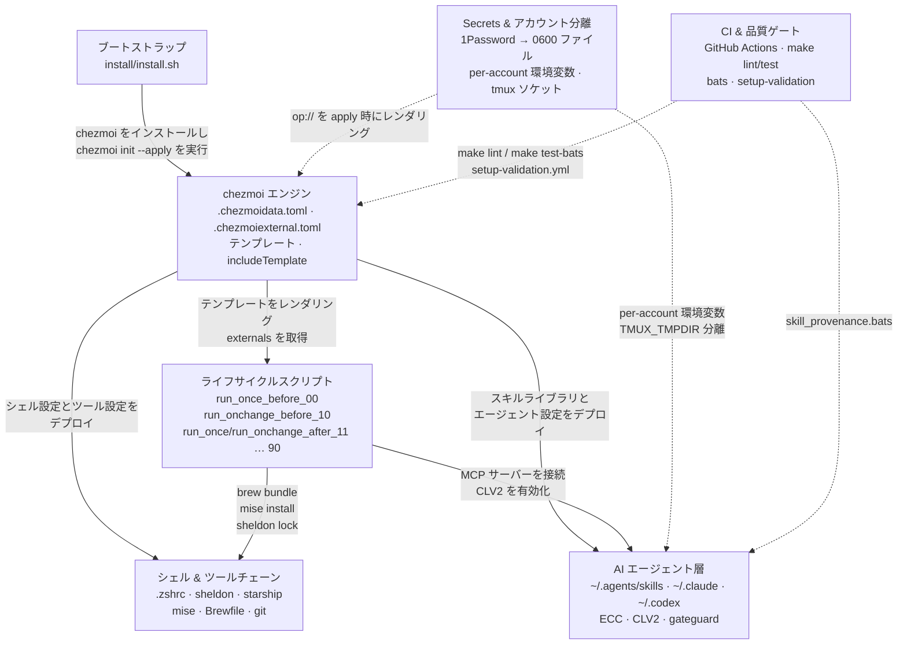

# アーキテクチャ概要

🌐 English (canonical): [overview.md](overview.md)

← [ドキュメント目次](../README.ja.md)

このドキュメントはアーキテクチャドキュメント群のナビゲーション軸となるものです。サブシステムのトポロジーを概説し、各詳細リファレンスへリンクします。まずここを読み、詳細はリンク先を参照してください。

---

## サブシステムのデータフロー

以下の図は、初回ブートストラップからランタイムの AI エージェント層までのデータとコントロールフローを示します。CI と Secrets はすべての層に横断するクロスカット関心事です。

---

## サブシステム参照テーブル

| サブシステム | コア関心事 | 詳細ドキュメント |
|-------------|-----------|----------------|
| chezmoi エンジン | 名前デコード、テンプレートデータ、`includeTemplate`、OS 分岐、`chezmoiignore`/`chezmoiremove` | [chezmoi-engine.ja.md](chezmoi-engine.ja.md) |
| Externals & ピン固定 | SHA ピン固定アーカイブ取得、シングルタール URL キャッシュ、`range .ecc.skills` ファンアウト、Renovate バンプモデル | [externals-and-pinning.ja.md](externals-and-pinning.ja.md) |
| ライフサイクルスクリプト | 2 フェーズ（before/after）順序（00→90）、`run_once` vs `run_onchange`、1Password ゲート | [lifecycle-scripts.ja.md](lifecycle-scripts.ja.md) |
| シェル環境 | `.zshrc` ロード順序、sheldon 遅延ロード、starship、per-account zsh エイリアス | [shell-environment.ja.md](shell-environment.ja.md) |
| 開発ツールチェーン | mise バージョンピン、`Brewfile` + `.brewfile-linux-exclude`、git 1Password 署名、gitleaks | [dev-tooling.ja.md](dev-tooling.ja.md) |
| AI エージェント層（概要） | デュアルハーネス × デュアルアカウントマトリクス、SSOT スキルライブラリ、共有ルール層 | [agents/overview.ja.md](../agents/overview.ja.md) |
| アカウント分離 | per-account 環境変数、`_claude_with_home`、Codex `CODEX_HOME`、dmux TMUX_TMPDIR | [agents/account-isolation.ja.md](../agents/account-isolation.ja.md) |
| Claude Code ハーネス | `settings.json`、ECC フック、CLV2 オブザーバー、statusline、レビューサブエージェント | [agents/claude-code.ja.md](../agents/claude-code.ja.md) |
| Codex CLI ハーネス | デュアル `CODEX_HOME`、`shared.config.toml`、`hooks.json`、gateguard | [agents/codex.ja.md](../agents/codex.ja.md) |
| スキルプロベナンス | 5 カテゴリ分類、curated vs ECC スキルの追加方法、`skill_provenance.bats` | [agents/skills-provenance.ja.md](../agents/skills-provenance.ja.md) |
| ローカル開発 | `make` コントラクト、lint パイプライン、`{{` 行除去の注意点 | [contributing/local-dev.ja.md](../contributing/local-dev.ja.md) |
| CI アーキテクチャ | `ci.yml` vs `setup-validation.yml`、bats スイート、Brewfile フィルター | [contributing/ci-and-tests.ja.md](../contributing/ci-and-tests.ja.md) |
| 設計の根拠 | SHA ピン（タグ不使用）の理由、シングルタールキャッシュ、config 共有/state 分離 | [explanation/design-rationale.ja.md](../explanation/design-rationale.ja.md) |
| Secrets 設計 | `op://` レンダリングパターン、`private_` → 0600、シークレットをコミットしない | [explanation/secrets-and-isolation.ja.md](../explanation/secrets-and-isolation.ja.md) |

---

## 各層の概要

### ブートストラップ（`install/install.sh`）

新規マシンのエントリポイントです。Xcode CLI ツール（macOS）、Homebrew、chezmoi をインストールし、`chezmoi init --apply kryota-dev/dotfiles` にハンドオフします。ハンドオフ後、`install.sh` は関与せず、chezmoi がすべてを管理します。

詳細は [getting-started/installation.ja.md](../getting-started/installation.ja.md) を参照してください。

### chezmoi エンジン

`home/` 配下すべてが chezmoi ソースツリーです（`.chezmoiroot` でピン固定）。`chezmoi apply` 時に、エンジンはソース名を `$HOME` パスにデコードし（`dot_/private_/executable_/symlink_/run_once_/run_onchange_/.tmpl` 規約）、`.chezmoidata.toml` のデータを使って Go テンプレートをレンダリングし、`.chezmoiexternal.toml` で宣言された外部アーカイブを取得し、`.chezmoiignore` / `.chezmoiremove` を適用します。

この層はすべての他層の依存元です。ライフサイクルスクリプトはテンプレートデータを消費し、スキルライブラリは externals によって構築され、zsh モジュールはレンダリング済みファイルとしてデプロイされます。

[chezmoi-engine.ja.md](chezmoi-engine.ja.md) および [externals-and-pinning.ja.md](externals-and-pinning.ja.md) を参照してください。

### ライフサイクルスクリプト

ライフサイクルスクリプトは 2 フェーズで 2 桁プレフィックス順に実行されます。

- **Before フェーズ**（`run_once_before_00`、`run_onchange_before_10`）: Homebrew の前提条件をインストール。
- **After フェーズ**（`run_once/run_onchange_after_11` … `90`）: 1Password の検証（11）、mise ツールのインストール（12）、MCP サーバーの登録（13）、CLV2 オブザーバーの有効化（14）、claude バイナリランチャーの作成（16）、agent-browser のインストール（18）、macOS デフォルト設定（20）、sheldon プラグインロック（40）、ログインシェルの設定（50）、other-apps プロンプト（90）。

`run_once_*` スクリプトはスクリプトコンテンツのハッシュをキーとして一度だけ実行されます。`run_onchange_*` はコンテンツまたは監視対象入力のハッシュが変化するたびに再実行されます。

[lifecycle-scripts.ja.md](lifecycle-scripts.ja.md) を参照してください。

### シェル環境

インタラクティブな zsh スタック: `.zprofile` が Homebrew を有効化し、`.zshrc` が mise、direnv、starship を同期的に初期化し、sheldon に遅延評価でプラグインロードを委譲します。per-account ランチャーエイリアス（`cld`/`cld-r06`、`cdx`/`cdx-r06`）は sheldon がロードする `~/.config/zsh/*.zsh` モジュール内で定義されています。

[shell-environment.ja.md](shell-environment.ja.md) を参照してください。

### AI エージェント層

最も複雑なサブシステムです。2 つのハーネス（Claude Code、Codex CLI）× 2 つのアカウント（default、r06）が、`~/.agents/skills` の単一 SSOT スキルライブラリと `~/AGENTS.md` の共有ルール層を共有します。設定は共有され、ランタイム状態は per-account の設定ディレクトリと環境変数によって厳密に分離されます。ECC フックスイート（gateguard、CLV2 オブザーバー）は各 Claude アカウントの専用ディレクトリツリー内で動作します。

[agents/overview.ja.md](../agents/overview.ja.md) および関連するハーネス固有ドキュメントを参照してください。

### CI & 品質ゲート

`make lint` と `make test-bats` が唯一の真実の源です。GitHub Actions はそれらを呼び出すだけです。`setup-validation.yml` ワークフローは macOS と Ubuntu で完全な `chezmoi apply` を実行し、デプロイ済みファイル、mise ツール、ghq 設定、クリーンな `zsh -i -c exit` を検証します。

[contributing/ci-and-tests.ja.md](../contributing/ci-and-tests.ja.md) を参照してください。

### Secrets & アカウント分離

シークレット値は 1Password vault にのみ存在します。chezmoi の `private_` プレフィックスにより、apply 時に 0600 ファイルとしてレンダリングされます。ソーステンプレートには `op://` 参照のみが含まれます。per-account 分離は実行時に環境変数（`CLAUDE_CONFIG_DIR`、`CODEX_HOME`、`ECC_AGENT_DATA_HOME`、`CLV2_HOMUNCULUS_DIR`、`GATEGUARD_STATE_DIR`）と、dmux の場合は専用の `TMUX_TMPDIR` ソケットによって強制されます。

[explanation/secrets-and-isolation.ja.md](../explanation/secrets-and-isolation.ja.md) および [agents/account-isolation.ja.md](../agents/account-isolation.ja.md) を参照してください。
