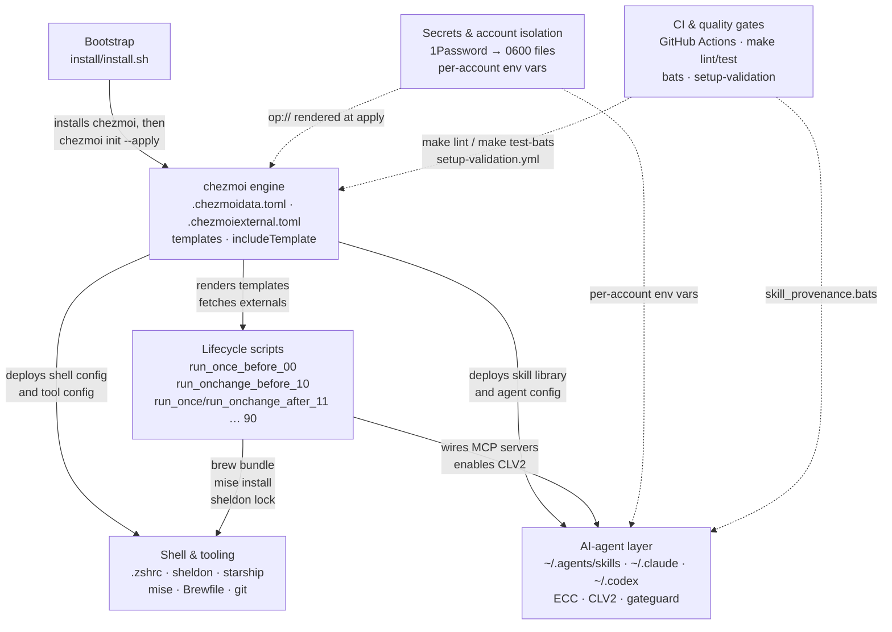

# Architecture overview

🌐 日本語: [overview.ja.md](overview.ja.md)

← [Docs index](../README.md)

This document is the navigation spine for the architecture docs. It sketches the subsystem topology and links every deep reference. Read it first; follow the links for mechanics.

---

## Subsystem data-flow

The diagram below traces data and control flow from the one-time bootstrap through to the runtime AI-agent layer. CI and secrets are cross-cutting concerns that touch every layer.

---

## Subsystem reference table

| Subsystem | Core concern | Deep doc |
|-----------|-------------|----------|
| chezmoi engine | Name decoding, template data, `includeTemplate`, OS branching, `chezmoiignore`/`chezmoiremove` | [chezmoi-engine.md](chezmoi-engine.md) |
| Externals & pinning | SHA-pinned archive and file fetches; single-tarball URL cache; `range .ecc.skills` fan-out; Renovate bump model | [externals-and-pinning.md](externals-and-pinning.md) |
| Lifecycle scripts | Two-phase (before/after) ordering (00→90); `run_once` vs `run_onchange`; 1Password gate | [lifecycle-scripts.md](lifecycle-scripts.md) |
| Shell environment | `.zshrc` load order; sheldon deferred loading; starship; per-account zsh aliases | [shell-environment.md](shell-environment.md) |
| Developer tooling | mise version pins; `Brewfile` + `.brewfile-linux-exclude`; git 1Password signing; gitleaks | [dev-tooling.md](dev-tooling.md) |
| AI-agent layer (overview) | Dual-harness × dual-account matrix; SSOT skill library; shared rule layer | [agents/overview.md](../agents/overview.md) |
| Account isolation | Per-account env vars; `_claude_with_home`; Codex `CODEX_HOME` | [agents/account-isolation.md](../agents/account-isolation.md) |
| Claude Code harness | `settings.json`; ECC hooks; CLV2 observer; statusline; review subagents | [agents/claude-code.md](../agents/claude-code.md) |
| Codex CLI harness | Dual `CODEX_HOME`; `shared.config.toml`; `hooks.json`; gateguard | [agents/codex.md](../agents/codex.md) |
| Skill provenance | 5-category taxonomy; adding curated vs ECC skills; `skill_provenance.bats` | [agents/skills-provenance.md](../agents/skills-provenance.md) |
| Local development | `make` contract; lint pipeline; `{{`-stripping gotcha | [contributing/local-dev.md](../contributing/local-dev.md) |
| CI architecture | `ci.yml` vs `setup-validation.yml`; bats suite; Brewfile filter | [contributing/ci-and-tests.md](../contributing/ci-and-tests.md) |
| Design rationale | Why SHA-pins not tags; single-tarball cache; config-shared/state-isolated | [explanation/design-rationale.md](../explanation/design-rationale.md) |
| Secrets design | `op://` render pattern; `private_` → 0600; secrets never committed | [explanation/secrets-and-isolation.md](../explanation/secrets-and-isolation.md) |

---

## Layer summaries

### Bootstrap (`install/install.sh`)

The entry point for a new machine. It installs Xcode CLI tools (macOS), Homebrew, and chezmoi, then hands off to `chezmoi init --apply kryota-dev/dotfiles`. After the handoff, `install.sh` plays no further role; chezmoi owns the rest.

See [getting-started/installation.md](../getting-started/installation.md) for the full bootstrap story.

### chezmoi engine

Everything under `home/` is the chezmoi source tree (pinned via `.chezmoiroot`). At `chezmoi apply`, the engine decodes source names to `$HOME` paths (the `dot_/private_/executable_/symlink_/run_once_/run_onchange_/.tmpl` convention), renders Go templates using data from `.chezmoidata.toml`, fetches external archives declared in `.chezmoiexternal.toml`, and enforces `.chezmoiignore` / `.chezmoiremove`.

This layer is the dependency of every other layer: lifecycle scripts consume template data, the skill library is populated by externals, and zsh modules are deployed as rendered files.

See [chezmoi-engine.md](chezmoi-engine.md) and [externals-and-pinning.md](externals-and-pinning.md).

### Lifecycle scripts

Lifecycle scripts run in two phases, ordered by two-digit prefix:

- **Before phase** (`run_once_before_00`, `run_onchange_before_10`): installs Homebrew prerequisites.
- **After phase** (`run_once/run_onchange_after_11` … `90`): validates 1Password (11), installs mise tools (12), registers MCP servers (13), enables CLV2 observer (14), creates the claude binary launcher (16), installs agent-browser (18), sets macOS defaults (20), locks sheldon plugins (40), sets the login shell (50), and runs other-apps prompts (90).

`run_once_*` scripts execute exactly once (keyed by script content hash); `run_onchange_*` re-execute whenever their content or a watched input hash changes.

See [lifecycle-scripts.md](lifecycle-scripts.md).

### Shell environment

The interactive zsh stack: `.zprofile` activates Homebrew, `.zshrc` initialises mise, direnv, and starship synchronously, then delegates plugin loading to sheldon with deferred evaluation. Per-account launcher aliases (`cld`/`cld-r06`, `cdx`/`cdx-r06`) are defined in `~/.config/zsh/*.zsh` modules loaded by sheldon.

See [shell-environment.md](shell-environment.md).

### AI-agent layer

The most complex subsystem. Two harnesses (Claude Code, Codex CLI) × two accounts (default, r06) share a single SSOT skill library at `~/.agents/skills` and a shared rule layer at `~/AGENTS.md`. Config is shared; runtime state is strictly isolated by per-account config dirs and environment variables. The ECC hook suite (gateguard, CLV2 observer) runs inside each Claude account's dedicated directory tree.

See [agents/overview.md](../agents/overview.md) and the linked harness-specific docs.

### CI & quality gates

`make lint` and `make test-bats` are the single source of truth; GitHub Actions simply calls them. The `setup-validation.yml` workflow runs a full `chezmoi apply` on macOS and Ubuntu, asserting deployed files, mise tools, ghq config, and a clean `zsh -i -c exit`.

See [contributing/ci-and-tests.md](../contributing/ci-and-tests.md).

### Secrets & account isolation

Secret values live exclusively in a 1Password vault. The `private_` chezmoi prefix renders them to 0600 files at apply time; source templates contain only `op://` references. Per-account isolation is enforced at runtime by environment variables (`CLAUDE_CONFIG_DIR`, `CODEX_HOME`, `ECC_AGENT_DATA_HOME`, `CLV2_HOMUNCULUS_DIR`, `GATEGUARD_STATE_DIR`).

See [explanation/secrets-and-isolation.md](../explanation/secrets-and-isolation.md) and [agents/account-isolation.md](../agents/account-isolation.md).
