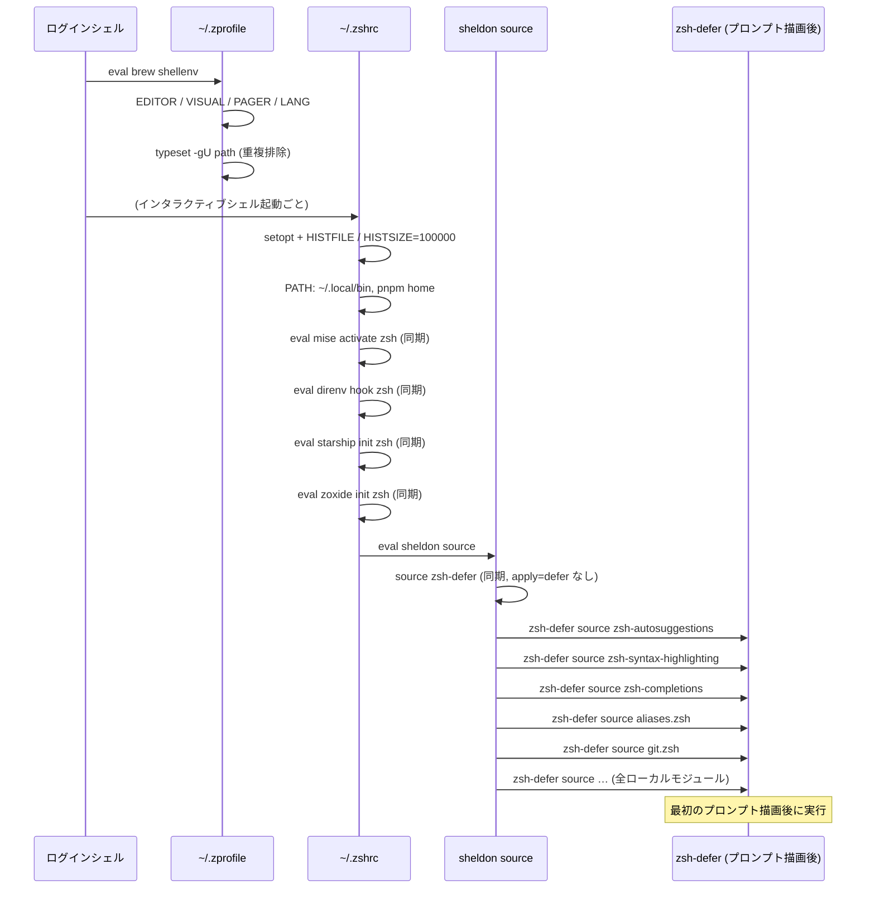

# zsh スタートアップ、プロンプト、シェルモジュール

🌐 English (canonical): [shell-environment.md](shell-environment.md)

← [ドキュメント目次](../README.ja.md)

このドキュメントはインタラクティブシェルスタックを扱います。zsh の2ファイル起動シーケンス、同期ロードと遅延ロードの分担、sheldon プラグインマニフェスト、ドメイン別 `.zsh` モジュール、および隣接するターミナル設定（tmux、readline、vim、starship）を説明します。

AI エージェントランチャーエイリアス（`cld`、`cld-r06`、`cdx`、`dmux` など）は [アカウント分離: エイリアス、env、tmux ソケット](../agents/account-isolation.ja.md) を参照してください。

---

## 起動シーケンス



### `~/.zprofile`（ログインシェルのみ）

`home/dot_zprofile.tmpl` からレンダリングされます。ログイン時に1回だけ実行され、インタラクティブシェルを新しく開くたびには実行されません。内容:

- **Homebrew** `eval "$(brew shellenv)"` — パスは OS/アーキテクチャに依存:
  - macOS arm64: `/opt/homebrew/bin/brew`
  - macOS intel: `/usr/local/bin/brew`
  - Linux: `/home/linuxbrew/.linuxbrew/bin/brew`
- `EDITOR=nvim`、`VISUAL=nvim`、`PAGER=less`、`LANG=ja_JP.UTF-8`
- `LESS='-R -M -i -W -z-4'`、`LESSCHARSET=utf-8`
- `typeset -gU path` — `$PATH` を自動で重複排除

### `~/.zshrc`（インタラクティブシェルごと）

`home/dot_zshrc.tmpl` からレンダリングされます。内容:

1. **ヒストリオプション**: `setopt auto_pushd pushd_ignore_dups hist_ignore_dups share_history inc_append_history`; `HISTFILE`、`HISTSIZE=100000`、`SAVEHIST=100000`
2. **PATH プリペンド**: `~/.local/bin`（mise シムと claude ランチャーはここに存在）、次いで pnpm home（OS 分岐テンプレート）
3. **同期ツール起動**（次のセクション参照）
4. **`eval "$(sheldon source)"`** — 全プラグインを deferred/同期それぞれでロード

---

## 同期ロード vs 遅延ロード

この分担は意図的なものです。PATH、プロンプト、または `chpwd` フックを形成するツールは最初のプロンプト描画前にアクティブである必要があります。それ以外はプロンプト描画後に遅延ロードされ、起動を高速に保ちます。

### 同期（`~/.zshrc` 内、sheldon より前）

| ツール | 同期の理由 |
|--------|-----------|
| `mise activate zsh` | mise シムを PATH に挿入。セッション内のあらゆる `command -v` より前に必要 |
| `direnv hook zsh` | `chpwd` / `precmd` フックを登録。最初のディレクトリから発火する必要がある |
| `starship init zsh` | `PS1` を置き換える。最初のプロンプト描画前に設定が必要 |
| `zoxide init zsh` | `chpwd` フック（`__zoxide_hook`）を登録。最初のディレクトリから発火する必要がある |

各起動は `command -v <tool>` でガードされており、ツールがまだインストールされていないマシンでも起動時にエラーになりません。

### sheldon の遅延ロードテンプレート

`home/dot_config/sheldon/plugins.toml` は `defer` という名前のカスタムテンプレートを定義しています。

```toml
[templates]
defer = "{{ hooks?.pre | nl }}zsh-defer source \"{{ file }}\"\n{{ hooks?.post | nl }}"
```

`apply = ["defer"]` が付いたプラグインまたはローカルモジュールは、各ソースファイルが `zsh-defer source "…"` 呼び出しでラップされます。`zsh-defer`（romkatv/zsh-defer）はこの source 呼び出しを最初のプロンプト描画後にスケジュールします。

### `zsh-defer` が同期ロードでなければならない理由

`zsh-defer`（`[plugins.zsh-defer]` エントリ）には **`apply` キーがありません**。そのため sheldon は通常通り同期でソースします。もし zsh-defer 自体が遅延ロードされると、sheldon が他の全プラグインに対して emit する `zsh-defer source "…"` 呼び出しが、`zsh-defer` 関数がまだ定義されていないために失敗します。zsh-defer は必ず最初にロードされるプラグインでなければなりません。

---

## プラグインマニフェスト

`plugins.toml`（`home/dot_config/sheldon/plugins.toml`）の完全なロード順:

| エントリ | ソース | 遅延? |
|---------|--------|------|
| `zsh-defer` | `romkatv/zsh-defer`（GitHub） | なし — 同期 |
| `zsh-autosuggestions` | `zsh-users/zsh-autosuggestions`（GitHub） | あり |
| `zsh-syntax-highlighting` | `zsh-users/zsh-syntax-highlighting`（GitHub） | あり |
| `zsh-completions` | `zsh-users/zsh-completions`（GitHub） | あり |
| `aliases` | `~/.config/zsh/aliases.zsh` | あり |
| `git-aliases` | `~/.config/zsh/git.zsh` | あり |
| `docker-aliases` | `~/.config/zsh/docker.zsh` | あり |
| `claude-helpers` | `~/.config/zsh/claude.zsh` | あり |
| `codex-helpers` | `~/.config/zsh/codex.zsh` | あり |
| `dmux-helpers` | `~/.config/zsh/dmux.zsh` | あり |
| `functions` | `~/.config/zsh/functions.zsh` | あり |
| `wtp` | `~/.config/zsh/wtp.zsh` | あり |
| `completions` | `~/.config/zsh/completions.zsh` | あり |
| `ghq` | `~/.config/zsh/ghq.zsh` | あり |

---

## 新しいシェルモジュールの追加方法

1. `home/dot_config/zsh/<name>.zsh`（テンプレートが必要な場合は `<name>.zsh.tmpl`）を作成する。
2. `home/dot_config/sheldon/plugins.toml` に `[plugins.<name>]` ブロックを追加する:

   ```toml
   [plugins.<name>]
   local = "~/.config/zsh"
   use = ["<name>.zsh"]
   apply = ["defer"]
   ```

3. `chezmoi apply` を実行する — `run_onchange_after_40-setup-sheldon.sh.tmpl` が `plugins.toml` のハッシュ変化を検出し、自動的に `sheldon lock` を実行します。

PATH を形成するコードやプロンプト初期化コードを遅延モジュールに置かないでください。それらは `~/.zshrc` の sheldon 行より上に配置する必要があります。

### テンプレート vs 通常の `.zsh`

モジュールが chezmoi テンプレートレンダリングを必要とする場合（OS 条件分岐や 1Password 読み込みなど）、ソースファイル名に `.tmpl` サフィックスを付けます: `home/dot_config/zsh/<name>.zsh.tmpl`。chezmoi は apply 時にこれを `~/.config/zsh/<name>.zsh` へレンダリングします。sheldon はレンダリング済みの `.zsh` のみを認識し、テンプレートを知りません。デプロイ済みの `~/.config/zsh/<name>.zsh` を直接編集しても、次回の `chezmoi apply` で上書きされます — 常にソースの `.tmpl` を編集してください。

---

## ローカルモジュールリファレンス

### `aliases.zsh`（`aliases.zsh.tmpl` から生成）

どこでも使える汎用エイリアス:

| エイリアス | 展開 |
|-----------|------|
| `ll` | `ls -lF` |
| `la` | `ls -lAF` |
| `..` / `...` / `....` | 1/2/3階層上へ cd |
| `vi`、`vim`、`view` | nvim、nvim、nvim -R |
| `pn` / `pni` / `pnx` | pnpm、pnpm install、pnpx |
| `relogin` | `exec $SHELL -l` |
| `rmnm` | `rm -rf ./node_modules` |

macOS のみの追加（`{{ if eq .chezmoi.os "darwin" }}` 内）:

| エイリアス | 目的 |
|-----------|------|
| `rmtrash` | `~/.Trash` を空にする |
| `rmdownloads` | Downloads をナンバリングバックアップ付きで Trash へ移動 |
| `delds` | `.DS_Store` ファイルを検索・削除 |
| `-g C` | グローバルエイリアス: `pbcopy` へパイプ |
| `notify` | 2つのアラート音を再生（Glass + Bamboo） |

### `git.zsh`

短縮 git エイリアス（`g`、`gb`、`gs`、`gca`、`gf`、`gpl`、`gps`、`gun`、`gsl`）と shell 関数: `gcl`（clone）、`gch`（ブランチチェックアウト）、`gcb`（新ブランチ作成）、`ga`（add）、`gc`（メッセージ付きコミット）、`gr`（rebase）、`gss`/`gsa`/`gsd`（スタッシュ push/apply/drop）。

### `ghq.zsh`

`Ctrl-G` にバインドされた zle ウィジェット `ghq-fzf-cd` を提供します。`ghq list --full-path` の結果を fzf に渡し、選択したパスへ `zle accept-line` 経由で `cd` します。cd コマンドがシェル履歴に記録され、Ctrl-R / atuin で探せるようになります。

### `wtp.zsh`

`wtp`（worktree-plus）CLI をラップします。`wtp cd` サブコマンドはパスを出力しますが、サブプロセスは親シェルの作業ディレクトリを変更できません。`wtp.zsh` は `wtp cd` をインターセプトし、現在のシェルで実際の `cd` を実行します。`#compdef` 補完も提供します。

### `functions.zsh`

`mduch <dir>/<file>` — 親ディレクトリを `mkdir -p` してからファイルを `touch` します。  
`y` — `yazi` を起動し、終了時に yazi が最後にいたディレクトリへシェルのディレクトリを変更します。

### `completions.zsh`

`~/.config/zsh/completions`（ベンダー補完、現在は `_ghq`）と `~/.docker/completions` を `$fpath` の先頭に追加し、`typeset -U` で `$fpath`/`$FPATH` を重複排除してから `autoload` と `compinit` を実行します。

ベンダー補完 `_ghq`（`home/dot_config/zsh/completions/_ghq`）は `make sync-ghq-completion` で mise ピン済みの `ghq` バージョンから再生成されます。手動編集しないでください。

---

## 隣接するターミナル設定

### starship（`~/.config/starship.toml`）

`home/dot_config/starship.toml`（テンプレートなしの通常ファイル）で設定されます。左セグメント: ディレクトリ、git ブランチ/ステータス、direnv インジケーター、Python 仮想環境、AWS プロファイル。右セグメント: コマンド実行時間とウォールクロック時刻（`$fill` で結合）。Catppuccin インスパイアのカラーパレット。

### tmux（`~/.tmux.conf`）

`home/dot_tmux.conf` で設定されます。要点:

- **プレフィックス**: `C-a`（Ctrl-A）、デフォルトの `C-b` を置き換え
- **ペイン分割**: `prefix + ^`（垂直）、`prefix + -`（水平）
- **マウス**: 有効（`set-option -g mouse on`）
- **カラー**: デフォルトターミナル `screen-256color`、`xterm:colors=256` オーバーライド
- **Shift+Enter バインディング**: `bind -n S-Enter send-keys Escape "[13;2u"` — Claude Code、Codex などの CLI がプロンプト内での改行として解釈する kitty キーボードプロトコルのエスケープシーケンスを送信します。このバインディングがないと、tmux 内での Shift+Enter は通常の Enter と区別できません。

### readline（`~/.inputrc`）

`home/dot_inputrc` で設定されます。主な設定: TAB は `menu-complete`、補完は大文字小文字を区別しない、UTF-8 処理のため meta-flag と output-meta が有効、カラー補完統計が有効。

### vim（`~/.vimrc`）

`home/dot_vimrc` で設定されます。デフォルト: UTF-8 エンコーディング、2スペース `expandtab`、インクリメンタル大文字小文字非区別検索、`number` + `cursorline`、sgr マウスモード。

---

## シークレットパターン

`chezmoi apply` 時に 1Password からレンダリングされる 0600 ファイルが2つあり、AI エージェントモジュールにソースされます。

- `~/.config/zsh/claude-secrets.zsh` — `EXA_API_KEY` と `FIRECRAWL_API_KEY`（Claude Code ハーネスの MCP サーバー用）
- `~/.config/zsh/dmux-secrets.zsh` — `OPENROUTER_API_KEY`（dmux AI 機能用）

どちらも `onepasswordRead` 出力に `squote` を適用しており、`$` やバックティックを含むキーが展開されません。ファイルは `claude.zsh` と `dmux.zsh` でソース（export ではなく）されており、キーは一般シェル環境から隔離されています。ランチャーヘルパーはエージェントサブプロセスへのインラインスコープでのみ再 export します。詳細は [アカウント分離: エイリアス、env、tmux ソケット](../agents/account-isolation.ja.md) と [1Password シークレットのオンボーディング](../getting-started/secrets-1password.ja.md) を参照してください。

---

## 関連ドキュメント

- [ライフサイクルスクリプト: 実行順序とトリガーモデル](lifecycle-scripts.ja.md) — スクリプト 40 が sheldon プラグインセットをロックし、スクリプト 50 がこれらの設定が前提とするログインシェルを設定
- [アカウント分離: エイリアス、env、tmux ソケット](../agents/account-isolation.ja.md) — `claude.zsh`、`codex.zsh`、`dmux.zsh` で定義される AI エージェントランチャーエイリアス
- [開発ツールチェーン: mise、Brewfile、git](dev-tooling.ja.md) — `.zshrc` が activate する mise/direnv/starship/zoxide を mise がインストール
- [1Password シークレットのオンボーディング](../getting-started/secrets-1password.ja.md) — 0600 シークレットファイルにレンダリングされる vault アイテム
