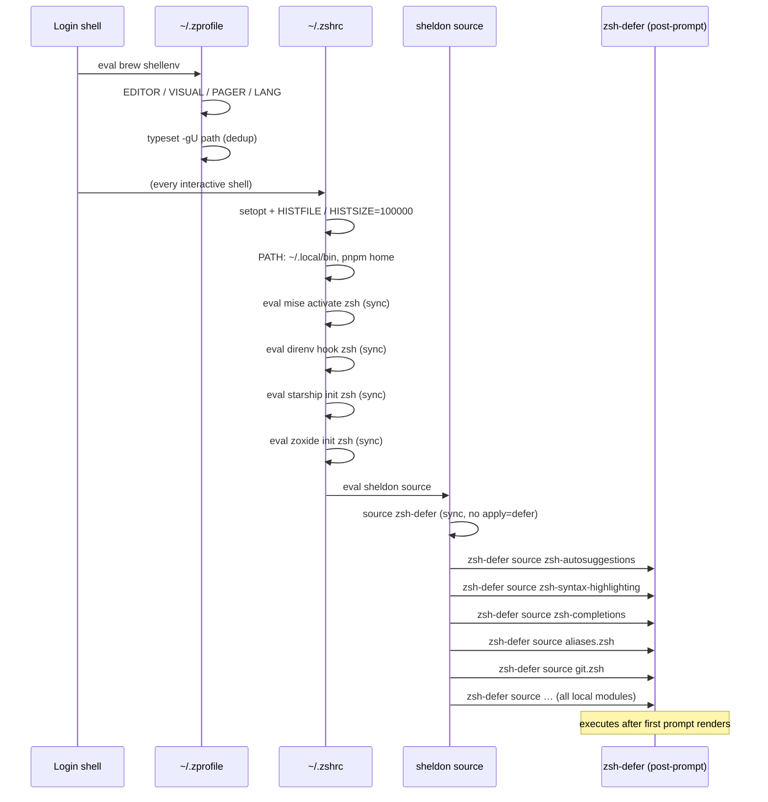

# zsh startup, prompt & shell modules

🌐 日本語: [shell-environment.ja.md](shell-environment.ja.md)

← [Docs index](../README.md)

This document covers the interactive shell stack: the two-file zsh startup sequence, the synchronous-versus-deferred split, the sheldon plugin manifest, per-domain `.zsh` modules, and adjacent terminal config (tmux, readline, vim, starship).

AI-agent launcher aliases (`cld`, `cld-r06`, `cdx`, `dmux`, …) are covered in [Account isolation: aliases, env & tmux sockets](../agents/account-isolation.md).

---

## Startup sequence



### `~/.zprofile` (login shell only)

Rendered from `home/dot_zprofile.tmpl`. Runs once at login, not for every new interactive shell. Contains:

- **Homebrew** `eval "$(brew shellenv)"` — path varies by OS/arch:
  - macOS arm64: `/opt/homebrew/bin/brew`
  - macOS intel: `/usr/local/bin/brew`
  - Linux: `/home/linuxbrew/.linuxbrew/bin/brew`
- `EDITOR=nvim`, `VISUAL=nvim`, `PAGER=less`, `LANG=ja_JP.UTF-8`
- `LESS='-R -M -i -W -z-4'`, `LESSCHARSET=utf-8`
- `typeset -gU path` — deduplicates `$PATH` automatically

### `~/.zshrc` (every interactive shell)

Rendered from `home/dot_zshrc.tmpl`. Contains:

1. **History options**: `setopt auto_pushd pushd_ignore_dups hist_ignore_dups share_history inc_append_history`; `HISTFILE`, `HISTSIZE=100000`, `SAVEHIST=100000`
2. **PATH prepends**: `~/.local/bin` (mise shims and the claude launcher live here), then pnpm home (OS-branched template)
3. **Synchronous tool activations** (see next section)
4. **`eval "$(sheldon source)"`** — loads all plugins, deferred and otherwise

---

## Synchronous vs deferred loading

The split is deliberate: tools that must shape PATH, the prompt, or `chpwd` hooks must be active before the first prompt draws. Everything else is deferred to after the prompt renders, keeping startup fast.

### Synchronous (in `~/.zshrc`, before sheldon)

| Tool | Why synchronous |
|------|----------------|
| `mise activate zsh` | Inserts mise shims into PATH; must precede any `command -v` in the session |
| `direnv hook zsh` | Registers `chpwd` / `precmd` hooks; must fire on the first directory |
| `starship init zsh` | Replaces `PS1`; must be set before the first prompt renders |
| `zoxide init zsh` | Registers `chpwd` hook (`__zoxide_hook`); must fire from the first directory |

Each activation is guarded by `command -v <tool>` so a machine where the tool is not yet installed does not error during startup.

### The sheldon deferred template

`home/dot_config/sheldon/plugins.toml` defines a custom template named `defer`:

```toml
[templates]
defer = "{{ hooks?.pre | nl }}zsh-defer source \"{{ file }}\"\n{{ hooks?.post | nl }}"
```

Any plugin or local module that carries `apply = ["defer"]` has each of its source files wrapped in a `zsh-defer source "…"` call. `zsh-defer` (romkatv/zsh-defer) schedules the source call to run after the first prompt is painted.

### Why `zsh-defer` must load synchronously

`zsh-defer` (the `[plugins.zsh-defer]` entry) has **no `apply` key**, so sheldon sources it normally and synchronously. If it were itself deferred, the `zsh-defer source "…"` calls that sheldon emits for every other plugin would fail because the `zsh-defer` function would not yet be defined. It must be the first loaded plugin.

---

## Plugin manifest

The full `plugins.toml` load order (`home/dot_config/sheldon/plugins.toml`):

| Entry | Source | Deferred? |
|-------|--------|-----------|
| `zsh-defer` | `romkatv/zsh-defer` (GitHub) | No — synchronous |
| `zsh-autosuggestions` | `zsh-users/zsh-autosuggestions` (GitHub) | Yes |
| `zsh-syntax-highlighting` | `zsh-users/zsh-syntax-highlighting` (GitHub) | Yes |
| `zsh-completions` | `zsh-users/zsh-completions` (GitHub) | Yes |
| `aliases` | `~/.config/zsh/aliases.zsh` | Yes |
| `git-aliases` | `~/.config/zsh/git.zsh` | Yes |
| `docker-aliases` | `~/.config/zsh/docker.zsh` | Yes |
| `claude-helpers` | `~/.config/zsh/claude.zsh` | Yes |
| `codex-helpers` | `~/.config/zsh/codex.zsh` | Yes |
| `dmux-helpers` | `~/.config/zsh/dmux.zsh` | Yes |
| `functions` | `~/.config/zsh/functions.zsh` | Yes |
| `wtp` | `~/.config/zsh/wtp.zsh` | Yes |
| `completions` | `~/.config/zsh/completions.zsh` | Yes |
| `ghq` | `~/.config/zsh/ghq.zsh` | Yes |

---

## Adding a new shell module

1. Create `home/dot_config/zsh/<name>.zsh` (or `<name>.zsh.tmpl` if it needs chezmoi template rendering).
2. Add a `[plugins.<name>]` block to `home/dot_config/sheldon/plugins.toml`:

   ```toml
   [plugins.<name>]
   local = "~/.config/zsh"
   use = ["<name>.zsh"]
   apply = ["defer"]
   ```

3. Run `chezmoi apply` — the `run_onchange_after_40-setup-sheldon.sh.tmpl` script detects the `plugins.toml` hash change and runs `sheldon lock` automatically.

Do not place PATH-shaping or prompt-initialization code in a deferred module; those belong in `~/.zshrc` above the sheldon line.

### Template vs plain `.zsh`

If a module requires chezmoi template rendering (e.g. OS-conditional blocks or 1Password reads), name the source file with a `.tmpl` suffix: `home/dot_config/zsh/<name>.zsh.tmpl`. chezmoi renders it to `~/.config/zsh/<name>.zsh` at apply time. sheldon only ever sees the rendered `.zsh`; it has no knowledge of templates. Editing the deployed `~/.config/zsh/<name>.zsh` directly is overwritten on the next `chezmoi apply` — always edit the source `.tmpl`.

---

## Local module reference

### `aliases.zsh` (from `aliases.zsh.tmpl`)

General-purpose aliases available everywhere:

| Alias | Expansion |
|-------|-----------|
| `ll` | `ls -lF` |
| `la` | `ls -lAF` |
| `..` / `...` / `....` | cd up 1/2/3 levels |
| `vi`, `vim`, `view` | nvim, nvim, nvim -R |
| `pn` / `pni` / `pnx` | pnpm, pnpm install, pnpx |
| `relogin` | `exec $SHELL -l` |
| `rmnm` | `rm -rf ./node_modules` |

macOS-only additions (inside `{{ if eq .chezmoi.os "darwin" }}`):

| Alias | Purpose |
|-------|---------|
| `rmtrash` | Empty `~/.Trash` |
| `rmdownloads` | Move Downloads to Trash (numbered backups) |
| `delds` | Find and delete `.DS_Store` files |
| `-g C` | Global alias: pipe to `pbcopy` |
| `notify` | Play two alert tones (Glass + Bamboo) |

### `git.zsh`

Short git aliases (`g`, `gb`, `gs`, `gca`, `gf`, `gpl`, `gps`, `gun`, `gsl`) plus shell functions: `gcl` (clone), `gch` (checkout branch), `gcb` (checkout new branch), `ga` (add), `gc` (commit with message), `gr` (rebase), `gss`/`gsa`/`gsd` (stash push/apply/drop).

### `ghq.zsh`

Provides `ghq-fzf-cd`, a zle widget bound to `Ctrl-G`. It calls `ghq list --full-path`, passes the list to `fzf`, and issues `cd` to the selected path via `zle accept-line` so the cd command appears in shell history and is discoverable via Ctrl-R / atuin.

### `wtp.zsh`

Wraps the `wtp` (worktree-plus) CLI. The `wtp cd` subcommand prints a path but cannot actually change the shell's working directory (a subprocess cannot affect the parent shell). `wtp.zsh` intercepts `wtp cd` and executes a real `cd` in the current shell. Also provides `#compdef` completion.

### `functions.zsh`

`mduch <dir>/<file>` — `mkdir -p` the parent directory then `touch` the file.  
`y` — launches `yazi` and, on exit, changes the shell directory to wherever yazi left off.

### `completions.zsh`

Prepends `~/.config/zsh/completions` (vendored completions, currently `_ghq`) and `~/.docker/completions` to `$fpath`, deduplicates `$fpath`/`$FPATH` with `typeset -U`, then autoloads and runs `compinit`.

The vendored `_ghq` completion (`home/dot_config/zsh/completions/_ghq`) is regenerated by `make sync-ghq-completion` from the mise-pinned `ghq` version. Do not hand-edit it.

---

## Adjacent terminal config

### starship (`~/.config/starship.toml`)

Configured at `home/dot_config/starship.toml` (plain file, not templated). Left segment: directory, git branch/status, direnv indicator, Python virtual environment, AWS profile. Right segment: command duration and wall-clock time, joined by `$fill`. Color palette is Catppuccin-inspired.

### tmux (`~/.tmux.conf`)

Configured at `home/dot_tmux.conf`. Key points:

- **Prefix**: `C-a` (Ctrl-A), replacing the default `C-b`
- **Pane splits**: `prefix + ^` (vertical), `prefix + -` (horizontal)
- **Mouse**: enabled (`set-option -g mouse on`)
- **Colors**: `screen-256color` default terminal, `xterm:colors=256` override
- **Shift+Enter binding**: `bind -n S-Enter send-keys Escape "[13;2u"` — sends the kitty keyboard protocol escape sequence that Claude Code, Codex, and similar CLIs interpret as a newline within a prompt. Without this binding, Shift+Enter inside tmux would be indistinguishable from plain Enter.

### readline (`~/.inputrc`)

Configured at `home/dot_inputrc`. Key settings: TAB uses `menu-complete`, completion is case-insensitive, meta-flag and output-meta are enabled for UTF-8 handling, colored completion statistics are on.

### vim (`~/.vimrc`)

Configured at `home/dot_vimrc`. Defaults: UTF-8 encoding, 2-space `expandtab`, incremental case-insensitive search, `number` + `cursorline`, sgr mouse mode.

---

## Secrets pattern

Two 0600 files are rendered from 1Password at `chezmoi apply` and sourced by the AI-agent modules:

- `~/.config/zsh/claude-secrets.zsh` — `EXA_API_KEY` and `FIRECRAWL_API_KEY` (MCP servers for the Claude Code harness)
- `~/.config/zsh/dmux-secrets.zsh` — `OPENROUTER_API_KEY` (dmux AI features)

Both use `squote` on the `onepasswordRead` output so keys containing `$` or backticks cannot expand. The files are sourced (not exported) in `claude.zsh` and `dmux.zsh`, keeping keys out of the general shell environment. The launcher helpers re-export them scoped inline to the agent subprocess only. Full details are in [Account isolation: aliases, env & tmux sockets](../agents/account-isolation.md) and [1Password secrets onboarding](../getting-started/secrets-1password.md).

---

## Cross-references

- [Lifecycle scripts: ordering & trigger model](lifecycle-scripts.md) — script 40 locks the sheldon plugin set; script 50 sets the login shell these configs assume
- [Account isolation: aliases, env & tmux sockets](../agents/account-isolation.md) — the AI-agent launcher aliases defined in `claude.zsh`, `codex.zsh`, `dmux.zsh`
- [Developer toolchain: mise, Brewfile & git](dev-tooling.md) — mise installs mise/direnv/starship/zoxide that `.zshrc` activates
- [1Password secrets onboarding](../getting-started/secrets-1password.md) — the vault items rendered into the 0600 secrets files
